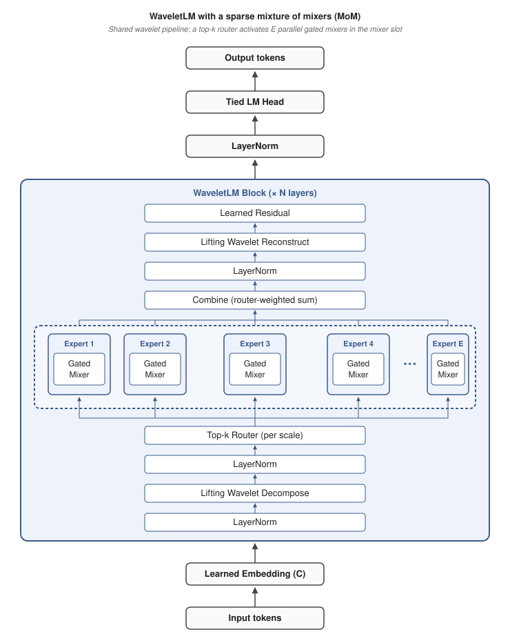

<p align="center">
  
</p>

<p align="center">
  
</p>

<br>

<p align="center">
  <a href="https://www.python.org/"></a>
  <a href="https://github.com/ramongougis/WaveletLM/actions/workflows/codeql.yml"></a>
  <a href="https://github.com/ramongougis/WaveletLM/actions/workflows/scorecard.yml"></a>
  <a href="https://github.com/ramongougis/WaveletLM/blob/main/LICENSE.txt"></a>
</p>

<br>

WaveletLM is a generative, attention-free, long-context language model inspired by Andrew Kiruluta's [Wavelet Logic Machines](https://arxiv.org/abs/2507.19514)[^1] and extended to causal language modeling. Where the original uses learnable wavelets in place of self-attention for classification over fixed, pretrained embeddings, WaveletLM adapts that approach to autoregressive next-token prediction with a learned embedding and several other differences detailed in the [Architecture](#architecture) section.

**Structure**

WaveletLM uses a learned embedding and mixes tokens using causal lifting wavelet decomposition, per-scale gated spectral mixer with SwiGLU activation, and wavelet reconstruction. This yields an architecture with no attention and O(n log n) scaling in sequence length.

The lifting's predict and update steps are small dense networks (Linear (C,C) → GELU → Linear(C,C)) which are shared across layers. While Haar-initialized, the lifting cascade becomes a learned, biorthogonal, invertible wavelet transform with MLP-style channel mixing inside it — making the lifting networks and the per-scale SwiGLU mixers the only MLP-containing components in the model (optional features, disabled by default, excepted).

A planned replacement of the current learned embedding with a fixed, human-readable semantic embedding would more than halve the trainable parameters behind our [benchmark results](#results), while extending the Wavelet Logic Machine's interpretability benefits to the generative setting. For details, see the [Future Plans](#future-plans) section.

**Results**

Current [results](#results) show near-benchmark performance on WikiText-103, with scaling laws derived and demonstrated in the [Scaling-Law Projections at Institutional Budgets](#scaling-law-projections-at-institutional-budgets) section. Such scaling laws show expected performance to increase past most benchmarks with either greater C or more training time, both requiring compute budgets outside of the presently allowable range.

NOTE: These headline results were achieved well before the most recent model work detailed in the [Future Plans](#future-plans) section below. Currently, the [best-performing test version](logs/wikitext-103_2026-06-18_19-18-42/log.txt) achieves a PPL of 21.0 versus the [Results headline](#results) of 23.8 on WikiText-103. This is expected to improve very soon with regularization and other standard refinements.

**Long Context**

WaveletLM is also capable of robust linear context length scaling with minimal performance degradation at a fixed rate of 0.8 MiB/token in VRAM cost, with rising per-token throughput during generation for increasing context lengths. Evaluations for contexts far beyond the trained block size of 256 tokens for the best-to-date configuration can be found in the [Block-Size Extension & Length Generalization](#block-size-extension--length-generalization) section below. 

So far, a prompt length of 65536 tokens, limited here only by personally-available memory budget, was achieved on the 256-token block size-trained model with a BPB of 0.9931 versus a baseline of 0.9748. This equates to a mere 1.9% BPB increase for a 25,500% increase in context. BPB gain additionally diminishes per doubling of context length: a context of 32768 achieves 0.9909 BPB, a 0.2215% increase for double the context at the high end, demonstrating continued effectiveness at increasingly longer contexts.

**Optional Associative Memory Bypass (Linear Attention)**
WaveletLM is attention-free and MLP-free by default. An optional linear attention addition is included with the associative-memory bypass (`associative_bypass_enabled:true` in the config): a low-rank (d≈64 test pending) state added as a parallel branch to each block, which supplies the content-addressable, in-context key-value retrieval the recall diagnostic (linked here later) showed is otherwise missing.

**Future Plans**

Several improvements have been made since the headline model in the [Results](#results) section was trained, and are awaiting completion before the release of an updated version. One such improvement is the context length scaling mentioned above. For more information, see the [Future Plans](#future-plans) section, which tracks all work currently completed, in progress, and planned.

<br>

<p align="center">
<a href="#installation">Installation</a><br>
<a href="#training">Training</a><br>
<a href="#inference">Inference</a><br>
<a href="#sample-generations">Sample Generations</a></br>
<a href="#architecture">Architecture</a><br>
<a href="#results">Results</a><br>
<a href="#future-plans">Future Plans</a><br>
<a href="#license">License</a><br>
<a href="#references">References</a>
</p>


## Installation

Requires Python 3.10+, PyTorch 2.11+, and CUDA.

```bash
git clone https://github.com/ramongougis/WaveletLM.git
cd WaveletLM
pip install "torch>=2.11" "datasets<3.0" tiktoken sentencepiece tqdm torchao numpy --extra-index-url https://download.pytorch.org/whl/cu128
```

## Training

Run:

```bash
python train.py
```

`config.json` replicates the current best [883M parameter WikiText-103 run](logs/wikitext-103_2026-04-22_01-36-47/log.txt), which requires 18,235 MiB to train.

Key config options:

| Option | Default | Description |
|--------|---------|-------------|
| `C` | 2048 | Mixer channel width (can be any integer; a power of 2 is NOT required, and is only padded if using the optional & suboptimal Fast Walsh-Hadamard Transform) |
| `layers` | 2 | Number of WaveletLM blocks |
| `levels` | 5 | Wavelet decomposition levels (~log2(block_size)) |
| `mlp_expansion` | 20 | Hidden layer width multiplier |
| `block_size` | 256 | Context length |
| `epochs` | 5 | Training epochs |
| `micro_batch_size` | 8 | Per-step batch size (scale to fit VRAM) |
| `grad_accum` | 1 | Gradient accumulation; effective batch = `micro_batch_size × grad_accum` |
| `lr` | 0.01 | Peak learning rate (Adagrad-tuned; reduce substantially if switching to AdamW) |
| `weight_decay` | 1e-6 | L2 weight decay (1e-6 mildly beneficial; 1e-3 stalls training) |
| `warmup_fraction` | 0.3 | Fraction of total steps spent in LR warmup |
| `dropout_lm_head` | 0.24 | LM-head dropout (other heads: `dropout_mlp` / `mixer` / `projection` / `embedding`) |
| `dataset` | wikitext-103 | HuggingFace dataset ID |
| `seed` | 1337 | RNG seed (e.g. for variance studies) |
| `compile` | True | Enable `torch.compile`; disable when debugging |

Training logs, checkpoints, and configs are saved to `logs/<dataset>_<timestamp>/`. Results from all runs are tracked in [`runs.md`](runs.md). The full default run takes ~14h on an RTX 5090; drop `epochs` to 1 for a quick smoke test.


## Inference

Obtain weights from [HuggingFace](https://huggingface.co/anarmorarm/WaveletLM/tree/main), then use `best_model_pg-19.pt`, `best_model_wikitext-103.pt`, or whichever weights file is desired as the checkpoint in the commands below.

The [current best PG-19 model](logs\pg19_2026-04-25_13-34-46\benchmark.txt) requires 5,266 MiB for inference and generates at 28.3 tokens/s on a 5090.

The [current best WikiText-103 model](logs/wikitext-103_2026-04-22_01-36-47/log.txt) requires 5,730 MiB for inference and generates at 28.8 tokens/s on a 5090.

Recommended commands:

```bash
# PG-19
python generate.py --checkpoint best_model_pg-19.pt --strategies /
    --prompt "Your prompt here"

# WikiText-103
python generate.py --checkpoint best_model_wikitext-103.pt --strategies /
    --prompt "Your prompt here"
```

Default generation:

```bash
python generate.py --checkpoint best_model_pg-19.pt
```

**Controlling generation context length:** Generation feeds the model up to `generation_max_context` tokens. Set it lower (512-1024) for best quality, or higher for very long prompts. Long context degradation is relatively minor, so the default for `generation_max_context` is deliberately large. The *setting* itself is just a ceiling and costs nothing until a prompt actually reaches it; what costs is the **actual context length processed** — which the model re-reads each step, so both VRAM (~0.8 MiB/token; see [this section](#block-size-extension--length-generalization)) and generation *speed* scale with the real context length used, not with the configured maximum.

```bash
# long prompt, ingested in full (memory-bound, not architecture-bound):
python generate.py --checkpoint best_model_wikitext-103.pt \
    --generation_max_context 16777216 --prompt "Your very long prompt here"

# best decode quality is 512-1024 tokens when trained on 256 token blocks:
python generate.py --checkpoint best_model_wikitext-103.pt \
    --generation_max_context 1024 --prompt "Your long prompt here"
```

Additional options:

```bash
python generate.py --checkpoint best_model_pg-19.pt /
    --prompt "Your prompt goes here." --num_tokens 1024 --seed 1337 /
    --n 1 --temperature 1.0 --strategies --ptq8 --num_tokens 9000
```

### Inference Strategies:

Can run all strategies together with `--strategies` or individual ones. Use `--help` for a complete list.

Use all inference strategies:

```bash
python generate.py --checkpoint best_model_pg-19.pt --strategies
```

Some strategies options:

```bash
python generate.py --checkpoint best_model_pg-19.pt --entropy_adaptive /
    --lookahead_k 3 --lookahead_depth 5 --best_of_n 5 --clean_spacing /
    --wavelet_coherence
```

The `--strategies` flag enables:

- Entropy-adaptive temperature (capped at 0.9)
- `top_p=0.85`
- `repetition_penalty=1.2`
- Metrics logging (`mean_log_prob`, `Distinct-n`, `Rep-4`)
- WikiText-103 spacing cleanup

### Post-Training Quantization (PTQ; optional)

Near-lossless uniform 8-bit PTQ:

```bash
python generate.py --checkpoint best_model_pg-19.pt --ptq8
```

PTQ effects:

- +0.0001 BPB hit (negligible performance impact)
- 10% less inference VRAM
- 50% less checkpoint file size
- 12% less tok/s currently. However, PTQ is expected to be 1.4-2.2x faster than the baseline 28.8 tok/s with bit-packed kernels. See [Future Plans → Bit-Packed PTQ Kernels](#bit-packed-ptq-kernels) and [`runs.md`](runs.md#post-release-bit-packed-ptq-kernels)).


## Sample Generations

### PG-19

Selections from the [PG-19 best run's generations log](https://github.com/ramongougis/WaveletLM/blob/main/logs/pg19_2026-04-25_13-34-46/generations.txt):


**Sample A** with prompt "The history of":

> The history of the world is a long and painful one. It has been so 
> much neglected, that it may be said to have become known through all 
> ages; but its influence is not confined solely to the individual or 
> class, nor even to those who are in any way connected with it. The 
> first thing which strikes us on entering into this subject is, that 
> there is no other mode by which we can bring ourselves to do justice 
> to our fellow-men; for what is more extraordinary than that they 
> should be able to find out the real character of those whom we are 
> about to see? If such were their intentions, as I have before stated, 
> then it would be very difficult indeed for them to keep themselves 
> alive at the present moment; because, if we take away from them 
> anything that makes life pleasant, or comfortable, or agreeable, they 
> must give up all thoughts of it.

<details>
<summary><h3 style="display:inline">More PG-19 samples</h3></summary>

**Sample B** with prompt "She turned to him and said":

> She turned to him and said, "I have been thinking a great deal about 
> you. I know that your father is a very good man; but he would not give 
> me his consent if I were to marry him. But it will be all the same with 
> me." He looked at her as though she had spoken to him out of a book 
> which was lying on the table. When he spoke again there came into her 
> face the expression of a most intense earnestness--a look of deep 
> emotion. It seemed to him that she felt for one moment as if she could 
> read his soul through this wonderful eyes: they were full of tenderness 
> and affection, and she knew that in them lay love's highest hope and 
> joy. Then she rose and walked slowly back to the house, leaving him 
> alone with the dead.
>
> CHAPTER XXXV. A CONFESSION OF ROMANCE.

**Sample C** with prompt "'Beware the High Elf mage,' exclaimed Antimour...":

> 'Beware the High Elf mage,' exclaimed Antimour. 'Although a novice, I 
> sense much arcane affinity within him.' Then he added: 'You have been 
> taught to read and write; but you are now in the seventh heaven of 
> bliss!' 'I am not so old as that, my lord,' replied the astrologer; 
> 'but there is no reason why I should be happy without you.' The 
> astrologer shook his head doubtfully. 'There is nothing for it, then,' 
> said he; 'for the present at least we will talk about the matter. 
> Meanwhile I must tell thee how thou didst come into this world. In what 
> way didst thou escape from thine enemies?' 'By means of some magic 
> wand which I possessed,' answered the magician.

Since PG-19 contains data from 1919 and earlier, this prompt is out of distribution. It uses post-Tolkien fantasy diction which the model routes to the closest pre-1919 register: Edwardian fairy-tale and Arabian Nights prose.

**Sample D** with prompt "The spaceship finally arrived in the Alpha Centauri system":

> The spaceship finally arrived in the Alpha Centauri system. It was 
> found that this would be very much like a double-acting motor, but it 
> was not to be compared with one of these machines which had been 
> invented by Professor Thomson and constructed for him by himself at 
> his own expense. In order to make use of such a machine he must have 
> an efficient engine capable of performing its work as soon as possible.
>
> [Illustration: FIGS. 1, 2, 3 and 4.--DIAGRAM OF ELECTRICAL DICTIONARY 
> INVENTION. A simple form of the principle shown is shown on the 
> accompanying diagram (Fig. 7), which represents a rectangular piece of 
> wire attached to the base of a cylinder.

A second out-of-distribution prompt. The model has no training data on spaceships or interstellar travel, so it routes these to the closest pre-1919 register: a Victorian mechanical-engineering treatise with a figure caption.

**Sample E** with prompt "The soldiers marched" and naive sampling (no `--strategies`, default `temp=1.0`, and `top_p=0.95`):

> The soldiers marched in uniform. Ten minutes later, Mr. Farrell 
> approached Mr. Talbot and the captain of police. He had been told that 
> he must start immediately for New York, and sent for his son, Mr. 
> Waters, to meet him there. With this he departed on his return, leaving 
> his wife in such distress at the selfish desertion of her husband and 
> son as to despair of recovering the stolen property. But both Frank and 
> Harry were deeply anxious about her. They knew that their father would 
> not thank them for killing the lady with whom they had arrived; and 
> when he told them how it was done she resolutely turned away her head. 
> And

One-shot naive sample (without `--strategies`). Naive samples retain more of the model's raw distribution and tend to mix domains more loosely.

**Sample F** with prompt "The history of" and naive sampling (no `--strategies`, default `temp=1.0`, and `top_p=0.95`):

> The history of her interest in the modern world during this quarter, 
> has been given to the journal in which she appeared during her stay; 
> and I could mention no names more memorable than those connected with 
> the several sessions at this distinguished lady's house. In 1856, Mr. 
> Ramsey began the voyage along one of the many channels by which Boston 
> had heretofore eluded him, with very valuable additions to his papers.
>
> On January 30, 1833, a small packet arrived at Charleston from Jamaica, 
> designed for the benefit of George (afterwards Lord) Wilmot, an officer 
> in the American army--a man well qualified to fulfill all the duties 
> of a seaman as before stated. He remained at Point Cotterand until 
> October, 1827, when he died in his lodgings, without either pecuniary 
> credit or pecuniary obligations. At the close of 1805 Mrs. Fry visited 
> us. She had previously known her husband, who held an appointment 
> within a few miles of Camden Town.

Randomly selected naive sample (without `--strategies`) out of 20.

</details>

### WikiText-103

Selections from the [WikiText-103 best run's generations log](https://github.com/ramongougis/WaveletLM/blob/main/logs/wikitext-103_2026-04-22_01-36-47/generations.txt):

**Sample A** with prompt "The history of":

> The history of the city is reflected in its architecture, which includes 
> the historic Old Town and New Castle County Courthouse Square Historic 
> District. The building was designed by John H. Stevens, who also 
> designed the Albany-Fulton Celebration in 1906 and built a steel-hulled 
> shipyard on the lake shore.
>
> In 1909, Fort Wayne became home to the first naval base for military 
> aviation in the United States. The Navy Yard at the former Naval Air 
> Station Pensacola (now known as the Georgia Tech Research Institute), 
> located on the campus' eastern boundary, was constructed in 1925–1926 
> near the site of the original schoolhouse.

<details>
<summary><h3 style="display:inline">More WikiText-103 samples</h3></summary>

**Sample B** with prompt "The album was released":

> The album was released on August 25, 2007 by Sony Music Entertainment 
> and features several songs from the record including "Never Say Die", 
> "The Show", "Don't Cry for Me Argentina" and a cover of "I Can Only 
> Imagine (But You Are Not Alone)".
>
> In 2009, Tyler performed at the Rock in Rio festival held in Lisbon, 
> Portugal; a performance which included performances of his own 
> compositions by Queen Latifah and Ali Zardari. On July 1, 2010 he sang 
> "O Holy Night" during the closing ceremony of the 2012 Summer Olympics 
> opening ceremony at London Olympic Stadium as part of the celebrations 
> of the 75th anniversary of the United States Declaration of Independence.

**Sample C** with prompt "The species was first described":

> The species was first described by Swedish zoologist Carl Linnaeus 
> in 1758 as Agaricus adustus. The genus name is derived from the Latin 
> words perma "to tie", and pous ("like") means "with a large head". In 
> 1821, French mycologists Jean-Baptiste de Lacaille placed it in section 
> Cricetae of the order Carnivora. He later renamed it Spongiforma 
> punctata after the Greek kribensis.
>
> P. nigriceps was originally classified under its current binomial name 
> Sirmuellera speciosa; however, this has been rejected on the grounds 
> that Lactarius deterrimus may not be closely related to Boletus edulis 
> or other similar fungi in general. 

**Sample D** with prompt "Born in":

> Born in the city, and the people who have been living there. The town's 
> only synagogue is located on a hill overlooking the street; it was 
> built by John D. Rockefeller, Jr.
>
> A museum dedicated to the history of Jewish culture in Israel opened 
> in 2008 at the former Beth Elohim building. It features an original 
> painting from the Al-Fakhri Mosque that hangs in the Temple. This is 
> one of four mosques in the district named after Abraham Lincoln.
>
> Hebron Church (Hebrew: בית לחברג 'ה) is believed to be the oldest part 
> of Jerusalem's Old City. The name means "holy place" or "place of 
> prayer" in Islamic law and Arabic texts dating back to prehistory as 
> early as the 6th century BCE.

**Sample E** with prompt "The soldiers marched" and naive sampling (no `--strategies`, default `temp=1.0`, and `top_p=0.95`):

> The soldiers marched through a number of hiding places and ambushes . 
> These were the first major engagements that took place during this 
> time — only one is known from sources , although most historians agree 
> the number differs in details . )
>
> The rebel army commenced its march from Livno on 29 October , followed 
> by their advance towards Palermo on 21 November . So – when there was 
> some initial resistance to that tactic – General Guy de Croix — 
> Enghien 's men started gathering at dawn on September 20 , but most 
> would not arrive until midday . Their combined forces divided into 
> two columns , with reinforcements arriving from all sides within 
> hours . The main

**Sample F** with prompt "The history of" and naive sampling (no `--strategies`, default `temp=1.0`, and `top_p=0.95`), but with the spacing post-processing fix now included in naive generations:

> The history of the tropical cyclone is unknown, but official records 
> suggest it formed on May 31. It developed into a tropical storm later 
> that day. After turning to the northeast, on September 20 Huron 
> strengthened into a hurricane while east-southeast of Bermuda. During 
> that time, Hurricane Humberto destroyed another ship in a prolonged 
> action. In late October, Ione crossed into the eastern Gulf of Mexico; 
> however, it reintensified slightly and later peaked with winds of 100 
> mph (160 km/h) as it drifted through western Cuba.

Note the typical failure mode with the naive generation: register-coherent meteorological prose, but the model freely interleaves the names of multiple unrelated real storms (Huron, Humberto, Ione) within a single passage. Without `--strategies`, the model does not employ a more conservative sampling regime.

</details>


## Architecture

<p align="center">
  
</p>

The high-level architectural premise, using learnable wavelets in place of self-attention as a sequence mixer, follows Kiruluta's Wavelet Logic Machines[^1]. WaveletLM extends this approach from sentiment classification to language modeling with several architectural additions and components, detailed below.

### Forward Pass

The complete embedding → logits equations for the headline model, exact to the code.

<details>
<summary><b>Expand</b></summary>

The equations below describe the headline configuration (C=1024, L=10 layers, `levels`=7 → 8 wavelet scales) with:
- all ablated features excluded: no MLP, no PKM/FwPKM, the Walsh–Hadamard transform off (`mixer_transform=identity`), no per-layer output projection (`skip_proj_out=true` — removed 2026-07-05 for a **−0.0079 BPB win**; see [Release Pipeline](#release-pipeline)), and no mixer recurrence or mixer depth
- all always-on pieces included (lifting wavelets, gated mixer, cross-scale gating, decompose-bypass, per-layer embedding, both per-scale LayerNorms, scale weights, wavelet crawl, and learned residual)
- tensors with shape $`(B, T, C)`$ unless noted; since $`C_p = \mathrm{next\_pow2}(C) = 1024 = C`$, the power-of-two padding is a no-op and everything is written in $`C`$
- the lifting predict/update networks $`P_k, U_k`$ ($`k=0,\dots,6`$) shared across all layers (`shared_lifting_weights`)
- the mixers, LayerNorms, and scalars are per-layer (superscript $`\ell`$).

**Embedding** (tied matrix $`W \in \mathbb{R}^{V\times C}`$, the same matrix used by the head):

<div align="center">

$`\displaystyle x^{(0)} = \mathrm{Dropout}(E), \qquad E_{b,t} = W_{\,\mathrm{idx}_{b,t}}, \qquad e := E .`$

</div>

**WaveletLM block**, repeated for $`\ell = 1,\dots,L`$, mapping $`x^{(\ell-1)} \mapsto x^{(\ell)}`$ (pre-norm):

Per-layer embedding injection, then the block LayerNorm:

<div align="center">

$`\displaystyle u = x^{(\ell-1)} + \gamma_e^{(\ell)}\, e, \qquad h = \mathrm{LN}_1^{(\ell)}(u).`$

</div>

Causal lifting decompose (undecimated / à-trous), with $`c_0 = h`$ and, for each level $`k = 0,\dots,6`$, a $`K{=}33`$ "crawl" — a learned softmax mixture over integer look-back lags $`o_{k,j}`$ centred on the dyadic base $`2^k`$, where $`\mathrm{shift}_{o}(c)_t = c_{t-o}`$ (zero-padded, so strictly causal):

<div align="center">

$`\displaystyle \mathrm{odd}_k = \sum_{j=1}^{33}\mathrm{softmax}(\theta_k)_j\,\mathrm{shift}_{o_{k,j}}(c_k), \qquad d_k = \tfrac{1}{\sqrt{2}}\big(\mathrm{odd}_k - P_k(c_k)\big), \qquad c_{k+1} = \tfrac{1}{\sqrt{2}}\big(c_k + U_k(d_k)\big),`$

</div>

where $`P_k, U_k : \mathbb{R}^{C}\!\to\!\mathbb{R}^{C}`$ are the per-level predict/update networks:

<div align="center">

$`\displaystyle P_k(z) = W^{P,2}_k\,\mathrm{GELU}\big(W^{P,1}_k z\big), \qquad U_k(z) = W^{U,2}_k\,\mathrm{GELU}\big(W^{U,1}_k z\big), \qquad W^{\bullet,1}_k, W^{\bullet,2}_k \in \mathbb{R}^{C\times C}`$

</div>

(hidden width $`=C`$, i.e. `lifting_hidden_mult`$`=1`$; biases and lifting-dropout zero). Haar init sets $`W^{P,1}_k=W^{P,2}_k=I`$ and $`W^{U,1}_k=I,\,W^{U,2}_k=\tfrac12 I`$, so the transform begins as $`P_k=\mathrm{GELU}`$, $`U_k=\tfrac12\,\mathrm{GELU}`$ and learns away from there. Stack the $`S=8`$ bands coarse→fine and apply the per-scale decompose-norm:

<div align="center">

$`\displaystyle \mathbf{C} = [\,c_7,\, d_6,\, d_5,\, \dots,\, d_0\,], \qquad \mathbf{C}_s \leftarrow \mathrm{LN}^{(\ell)}_{\mathrm{dec},\,s}(\mathbf{C}_s), \quad s = 0,\dots,7 .`$

</div>

Decompose-bypass bias: a causal cumulative mean of the block input plus a cross-layer carry, added to every scale through a learned per-scale channel gain $`\eta^{(\ell)}_s \in \mathbb{R}^{C}`$ (`history_gains`); $`\mu^{(0)}`$ is the detached cross-window state:

<div align="center">

$`\displaystyle \mu^{(\ell)}_t = \frac{1}{t+1}\sum_{\tau \le t} x^{(\ell-1)}_\tau, \qquad g^{(\ell)} = \mu^{(\ell)} + W^{(\ell)}_{\mathrm{x}}\,\mu^{(\ell-1)}, \qquad \mathbf{C}_s \leftarrow \mathbf{C}_s + \eta^{(\ell)}_s \odot g^{(\ell)} .`$

</div>

Per-scale gated spectral mixer with cross-scale gate routing $`R^{(\ell)}\in\mathbb{R}^{S\times S}`$. For each scale $`s`$ (width $`w_s\in\{C, C/2\}`$; $`\pi^{\mathrm{in}}_s,\pi^{\mathrm{out}}_s`$ are identity for the full-width scales $`s\le 3`$):

<div align="center">

$`\displaystyle \hat{\mathbf{C}}_s = \sum_{s'=0}^{7} R^{(\ell)}_{s,s'}\,\mathbf{C}_{s'}, \qquad \tilde{x}_s = \pi^{\mathrm{in}}_s \mathbf{C}_s, \qquad Y_s = \pi^{\mathrm{out}}_s\!\Big[\big(M^{(\ell)}_s \tilde{x}_s\big)\odot \mathrm{SiLU}\big(G^{(\ell)}_s\,\pi^{\mathrm{in}}_s \hat{\mathbf{C}}_s\big) \;+\; U^{(\ell)}_s\big(V_s^{(\ell)\top}\tilde{x}_s\big)\Big],`$

</div>

with mixer weight $`M^{(\ell)}_s`$ (init $`\approx I`$), gate $`G^{(\ell)}_s`$, and rank-4 residual $`U^{(\ell)}_s, V^{(\ell)}_s`$. Per-scale recon-norm, scale weights $`\omega^{(\ell)}_s`$, and dropout:

<div align="center">

$`\displaystyle \tilde{Y}_s = \omega^{(\ell)}_s\,\mathrm{Dropout}\big(\mathrm{LN}^{(\ell)}_{\mathrm{rec},\,s}(Y_s)\big).`$

</div>

Inverse lifting (reconstruct) — reuses the **update** nets only: each $`U_k`$ is re-applied to the stored detail and subtracted with the $`\sqrt{2}`$ restored, so inverting the update chain is structural (no inverse network is learned). With $`\tilde{Y}`$ unstacked back to $`(\tilde{a}, \tilde{d}_0,\dots,\tilde{d}_6)`$, set $`r_7 = \tilde{a}`$ and for $`k = 6,\dots,0`$:

<div align="center">

$`\displaystyle r_k = \sqrt{2}\,r_{k+1} - U_k(\tilde{d}_k).`$

</div>

The learned spectral residual closes the block — the reconstruction writes to the stream **directly** (the per-layer output projection $`W_o`$ that formerly sat here was removed via `skip_proj_out`, a −0.0079 BPB improvement; there is no learned rotation between the wavelet coefficients and the residual stream):

<div align="center">

$`\displaystyle x^{(\ell)} = \beta^{(\ell)}\Big[\alpha^{(\ell)}_{\mathrm{sp}}\, x^{(\ell-1)} + \mathrm{Dropout}\!\big(r_0\big)\Big].`$

</div>

$`\beta^{(\ell)}`$ is the learned scalar left over from the removed memory-module residual: with no MLP/PKM after the wavelet, it degenerates from a residual gate into a plain per-block output gain, but it remains live arithmetic and is kept here for fidelity. (Its companion LayerNorm `ln2` computes into nothing with the memory modules off and is omitted — see [No MLP](#no-mlp-with-deep-c1024).) The backward formulas below absorb $`\beta^{(\ell)}`$ into $`\delta^{(\ell)}`$ for clarity.

**Head and loss** — final LayerNorm, the tied projection, and cross-entropy:

<div align="center">

$`\displaystyle \hat{x} = \mathrm{LN}_f\big(x^{(L)}\big), \qquad z = \mathrm{Dropout}(\hat{x})\,W^{\top}, \qquad \mathcal{L} = -\frac{1}{BT}\sum_{b,t}\log\,\mathrm{softmax}(z_{b,t})_{\,\mathrm{tgt}_{b,t}}.`$

</div>

</details>

### Backward Pass

The adjoint of each forward step: the gradients' structure, and where the [wavelet-domain optimizer](plans/wavelet_optimizer.md) would act on them.

<details>
<summary><b>Expand</b></summary>

The gradient flow is the adjoint of each step above; it is written out here because the wavelet-domain optimizer ([plans/wavelet_optimizer.md](plans/wavelet_optimizer.md)) acts on these weight gradients, and *which* of them to compress depends on their structure.

Cross-entropy at the head gives the familiar residual, and the **tied matrix $`W`$ receives two structurally different gradients**:

<div align="center">

$`\displaystyle \delta^z_{b,t} = \frac{1}{BT}\big(\mathrm{softmax}(z_{b,t}) - \mathbf{1}_{\mathrm{tgt}_{b,t}}\big), \qquad \nabla_{W}\mathcal{L} = \underbrace{\sum_{b,t}\delta^z_{b,t}\,\hat{x}_{b,t}^{\top}}_{\text{output side: dense, all }V\text{ rows}} \;+\; \underbrace{\sum_{b,t}\big(\nabla_{E}\mathcal{L}\big)_{b,t}\ \text{scattered to row } \mathrm{idx}_{b,t}}_{\text{input side: sparse, batch tokens only}}.`$

</div>

The output term updates **every** row of $`W`$ each step; the input term, backpropagated all the way down to $`x^{(0)}`$, touches only the rows of tokens present in the batch. This dense-plus-sparse asymmetry on the largest, earliest-learning parameter is why $`W`$ is left **full-rank** under GWT.

The gradient then enters the stack and, at each block, the spectral residual splits it into a skip term and a sublayer term, from which the per-layer weight gradients fall out:

<div align="center">

$`\displaystyle \delta^{\hat{x}} = \delta^z W, \qquad \delta^{(\ell-1)} \mathrel{+}= \alpha^{(\ell)}_{\mathrm{sp}}\,\delta^{(\ell)}, \qquad \delta^{r_0} = \delta^{(\ell)} \ \text{(the write is direct — no projection between stream and coefficients)}.`$

</div>

Continuing through the inverse lifting, recon-norm, and the cross-scale gate into each per-scale mixer yields the **mixer gradients** ($`M^{(\ell)}_s, G^{(\ell)}_s, U^{(\ell)}_s, V^{(\ell)}_s`$) — the bulk of the trainable surface now that the MLP is gone. The **shared lifting** nets are special: each $`P_k, U_k`$ accumulates gradient from **all $`L`$ layers at once**, and the update net $`U_k`$ appears in both the decompose and reconstruct recursions above, so it collects a contribution from each path:

<div align="center">

$`\displaystyle \nabla_{U_k}\mathcal{L} = \sum_{\ell=1}^{L}\Big(\nabla_{U_k}^{\text{decompose}}\mathcal{L}^{(\ell)} + \nabla_{U_k}^{\text{reconstruct}}\mathcal{L}^{(\ell)}\Big).`$

</div>

So the **GWT-compressible surface** is $`\{\,M_s, G_s, U_s, V_s\ (\text{mixers}),\ P_k, U_k\ (\text{shared lifting})\,\}`$ — dense, structured, and either per-layer or summed across layers — while the tied $`W`$ stays full-rank. (The former $`W_o`$ projection has since been removed from the architecture entirely.) This is exactly the placement argued for in the [optimizer plan](plans/wavelet_optimizer.md).

</details>

### Key Components

Key components which are ON by default:

- **Learned lifting wavelets**: small two-layer GELU predict/update networks which are Haar-initialized and decompose the token sequence into multi-scale coefficients via lifting steps. Each scale carries either coarse summaries or fine details across tokens. Reconstruction reuses the "update" networks only, subtracting them back out, so inversion of the update chain is structurally guaranteed regardless of what the weights learn. One (predict, update) pair per level, with 7 pairs at block 256, are shared across all layers when `shared_lifting_weights` is true. Around 4.2M parameters per pair at C=1024 (29.4M total; 16.8M per pair at C=2048).

- **Per-scale gated spectral mixer (SwiGLU-style)**: mixes each wavelet scale independently via a gated linear layer (in identity space by default; Walsh-Hadamard optional) plus a rank-4 low-rank term. The only cross-scale coupling is a learned S×S routing matrix on the gate (S = levels + 1 = 8), so compute scales linearly in sequence length. No O(N²) token-pair term exists anywhere in the block, versus attention's O(N²). Arbitrarily long inputs decompose into the same small set of scales, allowing very large context at inference time with low degradation and, in some cases, even better performance. See the [length-generalization study](#block-size-extension--length-generalization) below for more info.

- **Decompose bypass**: a causal cumulative mean of the block input, combined with a cross-layer carry and scaled by learned per-scale channel gains (the $`\eta_s`$ / $`g`$ terms in [Forward Pass](#forward-pass)), added as bias to the post-decompose coefficients. Its final state also carries across windows with `decompose_bypass_cross_window` and serves as the model's only explicit cross-window memory.

- **Tied embedding / LM head**: a single V×C matrix serves as both input embedding and output head. The largest single parameter source in the fully spectral model (51.5M of 239.1M at C=1024, ~22%) and the only learned map outside the spectral blocks. Tying feeds the embedding the head's direct, loss-adjacent gradient (see [Backward Pass](#backward-pass)).

<details>
<summary><b>Additional components</b> (structural pieces and on-in-the-headline features; configurable in <code>config.json</code>)</summary>

Additional components are those which are ON by default, but not necessarily considered the "main portions" of the model.

- LayerNorms at the block input and before the LM head, plus per-scale decompose/reconstruct LayerNorms (`wavelet_decomp_norm` / `wavelet_recon_norm`, on in the headline recipe)
- A learned-scalar-gated residual around the spectral sublayer (`learned_residual`), plus the vestigial per-block output gain β inherited from the removed memory path (see [Forward Pass](#forward-pass))
- Per-scale weights ω_s, one trainable scalar per wavelet scale, applied to each scale's mixer output before reconstruction
- Optional feature padding to the next power of 2 (`C` → `Cp = next_pow2(C)`), required only by the optional Walsh-Hadamard transform. With the FWHT off (the default), nothing else needs a power-of-two width, so padding never engages. Note that this is not a separate switch: it activates only when the FWHT or its learned-butterfly variant is selected, and C isn't already a power of two. Otherwise, `Cp = C` is set with zero padding.
- Causal zero-padded look-back shifts in the lifting decompose (the dilated/crawled `odd` branch), preserving autoregressive causality at every level

- **Wavelet crawl**: softmax-weighted mixture of K  candidate look-back lags per level around the base `2^l`, letting the model discover off-dyadic receptive fields. The headline recipe runs **K=33**; the [crawl probe](#crawl-dilation-probe-prime-power-wavelets-measured) shows fine levels concentrating on precise small lags while coarse levels flatten into broad smoothing. (K=3 was the early sweet spot before the wide-window recipe.)

- **Cross-scale gating (routing mode)**: a learned identity-initialized (S, S) routing matrix that mixes per-scale inputs before each gate, enabling conditional cross-scale interactions.

- **Per-scale mixer widths**: asymmetric per-scale mixer capacity (coarse scales full width, fine scales reduced). The headline runs `[1×4, 0.5×4]` over 8 scales; on the earlier 6-scale config, `[1, 1, 1, 0.5, 0.5, 0.5]` measured a small BPB improvement + ~23% per-epoch speedup.

- **Low-Rank Factorization**: a rank-r `U·V^T` perturbation added to the spectral mixer; rank=4 (the headline setting) yields a measurable BPB improvement at trivial parameter cost.

- **Shared lifting weights**: one lifting wavelet module shared across all blocks. Essentially free on BPB; cuts training VRAM by ~5–10% at L=2 (more at L=10).

- **Per-Layer Embedding**: a learned per-channel residual of the token embedding added at each block, letting deeper blocks reach back to the input representation.

</details>

### Optional Features

Optional features are those which are OFF by default:

- **Expanded MLP**: Hidden layer width multiplier for the MLP layers. In the current headline version as of 6/29/2026, it does not have any effect on BPB.

- **Fast Walsh-Hadamard Transform (FHT)**: (`mixer_transform=identity`): a fixed orthogonal O(C log C) cross-channel rotation. An early channel-mixing component; the per-scale SwiGLU mixer now carries channel mixing, so the FWHT is no longer baseline. Cost is independent of sequence length. Off by default.

- **Product Key Memory / Fast-Weight Product Key Memory**: sparse key-value memory modules (formerly complementing the block MLP; off in the headline), with optional inference-time fast-weight updates.

- **Exponential Parametrization**: reparameterizes mixer weights through `exp()`, stabilizing training under high learning rates that would otherwise NaN.

- **Looped blocks (Universal Transformer-style)**: one shared block applied K times in place of L stacked blocks. Reduces BPB at fixed parameter count; compute is usually better spent on more epochs of the stacked model.

<details>
<summary><b>Additional optional features</b> (all configurable in <code>config.json</code>)</summary>

Additional optional features, OFF by default, are also considered relatively minor in scope or importance:

- Data-dependent EMA decompose-bypass (`decompose_bypass_ema`): σ-gated adaptive IIR replacement for the cumulative running mean. Promising at 1 epoch (-0.30 nats val loss), regressed at 5 epochs (BPB 1.0226 vs 1.0201 baseline). Rejected for release; investigation plan in [plans/ema_post_release.md](plans/ema_post_release.md).
- Stable-parametrization master flag (`stable_parametrization`)
- Spectral-norm constraint on mixer weights (`stab_spectral_norm`)
- MLP final-layer variance scaling (`stab_ff_scaling`)
- √C embedding output scaling (`stab_embed_scaling`)
- Projection-out residual-stream scaling (`stab_proj_out_scaling`)
- Mixer init-epsilon scaling (`stab_mixer_eps_scaling`)
- Per-level lifting init damping (`stab_lifting_level_scaling`)
- Multi-basis (K parallel) lifting wavelets (`multi_basis_lifting`, `multi_basis_inits`)
- Untied reconstruction weights (`untied_reconstruction`)
- Linear-only lifting networks - no GELU (`lifting_linear_only`)
- Stacked spectral mixer depth (`mixer_depth`, `mixer_depth_stabilizers`, `mixer_depth_residuals`)
- LoopLM mode - full-stack iterated inference (`loop_iterations`)
- Output-projection re-enable (`skip_proj_out: false`) — restores the per-layer `proj_out` removed from the default architecture 2026-07-05; useful only at tiny widths (≲ C≈200), where the projection still pays
- Gradient checkpointing (`gradient_checkpointing`)
- Stochastic depth (`stochastic_depth_rate`)
- Per-component dropouts (`dropout_embedding`, `dropout_projection`, `dropout_mixer`, `dropout_mlp`, `dropout_lm_head`)
- Lifting-network hidden-dim multiplier (`lifting_hidden_mult`)
- Lifting initialization choice - Haar / zero / random (`lifting_init`)
- Lifting dropout (`lifting_dropout`)
- Spectral mixer gate toggle and activation (`use_mixer_gate`, `mixer_gate_activation`)
- Non-learned fixed-Haar fallback for the wavelet (`wavelet_mode="haar"`)
- Multinodal feature bagging mode and its sub-flags (`multinodal_enabled`, `multinodal_num_cells`, `multinodal_cell_dim`, `multinodal_seeds`, `multinodal_combination`, `multinodal_cross_cell_gating`, `multinodal_features_per_cell`, `multinodal_bagged_eps`)

</details>


## Results

It is important to note that WaveletLM has **not** yet been fully optimized as of 2026-07-15. Areas pending further improvement include:

- dropout parameters, which were tuned once for C=1024 and 5 epochs, then reused everywhere unswept due to limited compute. Per-size regularization sweeps are deferred to the data-rich regime per the [Release Pipeline](#release-pipeline). It is holding well beyond its design point: with the 40-epoch WaveletLM Mini (C=512) version, the train/val gap is 0.38 with val flat but never rising ([log](logs/wikitext-103_2026-07-15_10-53-46/log.txt));
- weight decay has not been swept;
- every headline result is a **single seed** (see the [3-seed variance study](runs.md#3-seed-variance-study-l2-c2048-20x-dropout-5-epochs) for the measured spread at a smaller config);
- all models train and evaluate at a **256-token context**, the shortest amongst any competing model in every comparison table below;
- parameter compression (PTQ) is reserved for post-release;
- the remaining WikiText-103 headroom is bounded and measured: the fitted data law at C=512 (`L(E) ≈ 0.962 + 0.276·E^(−0.76)`, as derived in the [Release Pipeline](#release-pipeline)) puts the dataset's ceiling near 0.96 BPB. The larger lever from here is fresh data, not more passes or tighter regularization. As such, our next scheduled runs will train on PG-19 and The Pile.

My current run budget is limited. Other researchers are encouraged to train the model with these and other improvements to more accurately gauge its potential performance.

See [Areas for Improvement](#areas-for-improvement) below for more info on optimization, and [Other Post-Release Plans](#other-post-release-plans) for ways to push WaveletLM further post-release.

### PG-19 Test Set Perplexity Comparison

| Model | Type | Params | Context | Epochs | PPL (word-level) |
|-------|------|--------|---------|--------|-----|
| Perceiver AR | Cross-attn + latents | 974M | 4,096 | ~210 | 28.9[^7]§ |
| Block-Recurrent Transformer | Transformer + recurrence | ~200M | 4,096 + recurrent | — | 29.0[^8]§ |
| Compressive Transformer | Transformer + compressive memory | 257M | 2,048 effective | ~50 | 33.6[^9] |
| Hyena ‡ | Long convolution and recurrence | 153M | 16,384 | 8 | ≈34§ *(est.; reported 14.6 per-BPE-token[^10])* |
| Transformer-XL | Transformer + recurrence | 257M | 1,024 effective | ~50 | 36.3[^9] |
| **WaveletLM (previous generation; 1 epoch)** | **Wavelet mixer** | **808M** | **256** | **1** | **79.1†§** |
| **WaveletLM Small (no-MLP, 1 epoch)** | **Wavelet mixer** | **231M** | **256** | **1** | **80.3††§** |

All models in this table were trained and evaluated on PG-19, under the dataset's canonical metric — **word-level perplexity** (Rae et al.: total cross-entropy under any tokenization, normalized by the subset's word count) — which is tokenizer-independent by design. WaveletLM was trained for one epoch only at the smallest context length of any entry.

Context and epoch derivations from source papers:

- **Compressive Transformer / Transformer-XL** (Rae et al. 2019): `~100B tokens / 2B PG-19 tokens ≈ 50 epochs`. Effective context: `512 (window) + 512 (memory) + 512 × 2 (compressed, C=2) = 2,048` (CT); `512 (window) + 512 (cache) = 1,024` (TX-L).
- **Block-Recurrent Transformer**: Context: `4,096-token segments + 512-vector recurrent state`, trained for 500k steps. Epoch count cannot be derived because the batch size was not reported.
- **Perceiver AR**: `~200k steps per batch × 2048 batches ≈ 420B tokens`; `420B / 2B PG-19 tokens ≈ 210 epochs` at `4,096-token context`.

§ **Word-level normalization (2026-07-20; calculation ours where marked, method per the dataset's definition).** Rae et al. define PG-19's metric verbatim: *"one calculates the total cross-entropy loss … using a chosen tokenization scheme, and then one normalizes this value by the number of words"* — test n_words = **6,966,499** ([paper](https://arxiv.org/abs/1911.05507), §4.2). Our benchmarks compute loss per 32K-SentencePiece token (test = **9,197,032** SP tokens, [log](logs/pg19_2026-06-29_22-12-43/log.txt)), so the comparable figure is `PPL_word = exp(avg NLL per SP token × 9,197,032/6,966,499)` (ratio 1.3202). Earlier revisions listed our per-SP-token perplexities (27.40, 27.72) against word-level rows — flattering our placement; corrected here. **All BPB values are unaffected.** Unit status of other rows: CT/TXL are word-level by the source definition; Perceiver AR and Block-Recurrent report against Rae's baselines and are presumed word-level *(verification pending)*; **Hyena's unit is not stated retrievably in the source** — its 14.6 is on GPT-2 BPE tokens, and *if* per-token, converts to ≈34 word-level (shown as the table estimate; if the source's number is already word-level, its row would rank first at 14.6).

† Per-SP-token sliding PPL 27.40 → **79.1 word-level-equivalent§**. See the [PG-19 pre-release run](runs.md#pg-19-pre-release-benchmark-best-seed-1-epoch) for full details and the [run log](logs/pg19_2026-04-25_13-34-46/log.txt). Increased regularization and training time are in the [Future Plans](#future-plans) section.

†† The pre-projection-removal release architecture (C=1024, L=10, no-MLP, tied head): **per-SP-token sliding PPL 27.72 → 80.3 word-level-equivalent§ / 1.0892 sliding BPB at 230.89M** ([log](logs/pg19_2026-06-29_22-12-43/log.txt)) yields a +0.32 per-SP-token PPL increase over the 808M version at **3.5× fewer params**, same 32K SentencePiece, and a *better* best val loss (3.5023 vs 3.5238; ranking follows the sliding metrics). A **fully spectral redo (P2, ~220M)** is queued — the projection removal that improved WT-103 by −0.0079 BPB is expected to carry — and more epochs/regularization remain as post-release headroom.

‡ Hyena was trained with `block_size=16384` (64× WaveletLM's) and 8 epochs (8× WaveletLM's). It is also incredibly efficient parameter-wise with 153M vs. WaveletLM's 807M. Increasing both block size and epochs for WaveletLM while decreasing parameters are some of the [Future Plans](#future-plans).

Comparison numbers for both datasets are sourced from their respective papers. See References below.

### WikiText-103 Test Set Perplexity Comparison

| Model | Type | Trained on | Params | Context | Epochs | PPL (word-level) | BPB♭ |
|-------|------|-----------|--------|---------|--------|-----|-----|
| GPT-2 XL | Transformer | WebText (40GB) | 1.5B | 1024 | 0 (zero-shot on larger corpus) | 17.5[^5] | 0.7822 |
| Transformer-XL Large* | Transformer + recurrence* | WikiText-103 (0.5GB)* | 257M* | 1024 effective* | ~1,900 | 18.3[^4]* | 0.7944* |
| GPT-2 Large | Transformer | WebText (40GB) | 774M | 1024 | 0 (zero-shot on larger corpus) | 19.3[^5] | 0.8090 |
| S4* | SSM* | WikiText-103 (0.5GB)* | 249M* | 1024* | n/s | 20.95[^6]* | 0.8314* |
| *WaveletLM Large (derived)◊* | *Wavelet mixer* | *WikiText-103 (0.5GB)* | *3.2B* | *256* | *200* | *21.5 (est.)◊* | *0.8385 (est.)◊* |
| GPT-2 Medium | Transformer | WebText (40GB) | 355M | 1024 | 0 (zero-shot on larger corpus) | 22.1[^5] | 0.8460 |
| Transformer-XL Standard* | Transformer + recurrence* | WikiText-103 (0.5GB)* | 151M* | 1024 effective* | ~17 | 24.0[^4]* | 0.8685* |
| *WaveletLM Medium @ 100 ep (derived)◊* | *Wavelet mixer* | *WikiText-103 (0.5GB)* | *853M* | *256* | *100* | *24.0 (est.)◊* | *0.8685 (est.)◊* |
| GPT-2 | Transformer | WebText (40GB) | 124M | 1024 | 0 (zero-shot on larger corpus) | 29.4[^5] | 0.9240 |
| **WaveletLM Medium** | **Wavelet mixer** | **WikiText-103 (0.5GB)†** | **893M** | **256†** | **5** | **33.5†‡** | **0.9597†** |
| **WaveletLM Mini** | **Wavelet mixer** | **WikiText-103 (0.5GB)†††** | **73M** | **256†††** | **40** | **36.1†††‡** | **0.9797†††** |
| **WaveletLM Small** | **Wavelet mixer** | **WikiText-103 (0.5GB)††** | **239M** | **256††** | **5** | **36.2††‡** | **0.9805††** |

\* Both trained and evaluated on WikiText-103 only (direct comparison to WaveletLM). GPT-2 BPE was used by WaveletLM for tokenization.

◊ *Derived rows — no such model has been trained.* Italicized entries are anticipated results at the stated budgets per the fitted scaling laws (see [Scaling-Law Projections at Institutional Budgets](#scaling-law-projections-at-institutional-budgets)), inheriting that section's full caveat stack: separability assumed, single-seed laws, 256-token context, width and epochs extrapolated well beyond measured ranges. Names follow the established width-tier ladder (Medium = C=2,048; Large = C=4,096).

Epoch derivations from source papers and released training scripts:

- **GPT-2 family** (Radford et al. 2019): the WikiText-103 PPLs are **zero-shot** — the models never trained on WT-103 at all (WebText only), so WT-103 epochs = 0. Their WebText training budget is not stated in the paper.
- **Transformer-XL Standard**: the released `run_wt103_base.sh` trains `200K steps × batch 60 × 150-token targets = 1.8B tokens ≈ ~17 epochs` of WT-103's ~103M (word-level) training tokens.
- **Transformer-XL Large**: the released `wt103_large_tpu.sh` trains `4M steps × global batch 128 × 384-token targets ≈ 197B tokens ≈ ~1,900 epochs` — the SOTA run's TPU-cluster budget, ~380× WaveletLM's data exposure.
- **S4**: follows the Baevski & Auli Transformer-baseline recipe; an explicit step/epoch count is not stated in the paper (n/s). Note the S4 paper reports **249M params / 20.95 PPL** for this result — within ~4% of WaveletLM Small's 239M, the closest parameter pairing in the table.

‡ **Word-level normalization (2026-07-20; calculation ours, method per the field standard).** The word-level rows (Transformer-XL, S4) report perplexity per canonical WikiText-103 token (test = 245,569 tokens incl. one `<eos>` per line — [Merity et al. counts](https://arxiv.org/abs/1809.10853)), and GPT-2's zero-shot numbers follow the same convention via invertible de-tokenizers; the practice of renormalizing BPE-model perplexity by the *original* token count is documented explicitly in the Megatron-LM lineage ([paper](https://arxiv.org/abs/1909.08053), [fairseq formula](https://github.com/facebookresearch/fairseq/blob/main/examples/megatron_11b/README.md)). WaveletLM's benchmarks compute loss per GPT-2-BPE token (287,644 on this test set, measured from our cache), so the comparable figure is `PPL_word = exp(avg NLL per BPE token × 287,644/245,569)`. Earlier revisions of this table listed our per-BPE-token perplexities (Medium 20.04, Mini 21.34, Small 21.39) alongside word-level rows — flattering our placement; this revision corrects it. **BPB values everywhere are unaffected** (byte normalization is tokenizer-immune — why it is this repo's primary metric). Residual asymmetry, noted both ways: word-level baselines predict `<unk>` for out-of-vocabulary words (a concession), while our byte-exact BPE must spell rare words in full; and the word-level task's fixed 267K-vocab softmax differs structurally from BPE modeling. **De-tokenization:** GPT-2-family zero-shot evaluations first apply an invertible de-tokenizer that undoes WikiText's markup (` @-@ `, spaced punctuation, spaced headings); **WaveletLM trains and evaluates on the raw marked-up text**, so both sides are scored on the surface form matching their own training. Adopting the de-tokenized protocol would require retraining on de-tokenized text (an eval-time switch alone is not meaningful, since our models have only ever seen the marked-up form) — a cheap post-release arm that would likely *improve* our numbers; the de-tokenizer is implemented in [`tools/cross_eval.py`](tools/cross_eval.py) (`--detokenize`) for that purpose.

♭ **BPB column (bits per byte — the tokenizer-immune comparison; added 2026-07-22).** Because bytes are invariant to tokenization, BPB is the one metric that compares the word-level baselines and our BPE models on identical ground, with no normalization ratio to get wrong — which is exactly why it is this repo's primary metric. Our three rows report **measured sliding-window BPB directly from their logs** ([Medium](logs/wikitext-103_2026-06-27_19-28-04/log.txt), [Small](logs/wikitext-103_2026-07-04_07-03-39/log.txt), [Mini, 40 epochs](logs/wikitext-103_2026-07-15_10-53-46/log.txt)). The word-level rows are converted from their published word-PPL by `BPB = ln(PPL_word) / (ln 2 × bytes-per-word)`, with bytes-per-word = 1,296,370 / 245,569 = **5.2790** (raw test-set bytes / canonical words, measured from our cache); this is algebraically consistent with the ‡ normalization (our own PPLs back-convert to the measured BPBs to rounding). **The same `<unk>` asymmetry applies to the converted cells:** word-level models are not charged for spelling out-of-vocabulary words, so their BPB is a mild *under*estimate of true bits-per-byte — the honest gap to WaveletLM is therefore somewhat smaller than the raw column suggests, though on BPB the strongest baselines (Transformer-XL Large 0.7944, S4 0.8314) still lead Mini (0.9797) by a real margin.

† C=2048 / L=10 / no-MLP, single seed: **sliding-window per-BPE-token PPL 20.04 → 33.5 word-level-equivalent‡** (non-overlapping 21.54) at a **256-token context** — 4× shorter than the 1024-context baselines — under only 5 epochs with light regularization ([log](logs/wikitext-103_2026-06-27_19-28-04/log.txt)). Earlier 3-seed L=2 headline: 23.8 (mean 23.82). Significant parameter reduction is planned post-release in the [Future Plans](#future-plans) section.

†† The Small release tier — C=1024 / L=10, **fully spectral** (no MLP, no per-layer projections; `skip_proj_out`), single seed: **sliding-window per-BPE-token PPL 21.39 → 36.2 word-level-equivalent‡** (non-overlapping 22.99) / **0.9805 sliding BPB** at **239.09M** and the table's shortest context (256 tokens), 5 epochs ([log](logs/wikitext-103_2026-07-04_07-03-39/log.txt)). Beats both its projection-equipped predecessor (21.93 / 0.9884 at 249.59M) and the earlier 669M MLP version (0.9894) — the architecture has now improved twice by *removing* components.

††† The Mini deployment tier — C=512 / L=10, fully spectral, single seed, trained scaling-law-guided (the D-ladder's 40-epoch rung, [Release Pipeline](#release-pipeline)): **sliding-window per-BPE-token PPL 21.34 → 36.1 word-level-equivalent‡** (non-overlapping 22.97) / **0.9797 sliding BPB** at **72.89M** in ~54h on one RTX 5090 ([log](logs/wikitext-103_2026-07-15_10-53-46/log.txt)). The as-run margin over Small (0.9797 vs 0.9805) is **below the ~0.0010 noise floor — honestly a statistical tie at 3.3× fewer params** — achieved *while carrying* the measured ~+0.007 BPB MBS-48 batch handicap vs the table's MBS-8 entries; handicap-corrected ≈ 0.973 / ~20.9 PPL *(estimate)*. Val never rose across 40 epochs (flatlined over the last ~4); the D-ladder's fitted data law predicted this result to Δ0.0007. Supersedes the 20-epoch rung (22.08 / 0.9906, [log](logs/wikitext-103_2026-07-14_09-11-32/log.txt)). Generation VRAM **1,252 MiB** ([generations](logs/wikitext-103_2026-07-15_10-53-46/generations.txt)).

- [3-seed variance study](runs.md#3-seed-variance-study-l2-c2048-20x-dropout-5-epochs) 
- [Best run's training log](logs/wikitext-103_2026-04-22_01-36-47/log.txt)

See [`runs.md`](runs.md) for a record of all training runs, logs, configs, and benchmark results with fully-reproducible point-in-time code snapshots.

### Areas for Improvement

Longer training time, more regularization, and parameter compression are the surest ways to immediately improve the model's performance.

**More training time**: More research and more resources are needed to uncover the effects of longer training.

**Regularization**: WaveletLM is vastly underregularized, with a 0.8 train/val loss gap at 5+ epochs. Dropout and weight decay parameter sweeps are limited by budget and involve tuning `weight_decay` `dropout_embedding`, `dropout_projection`, `dropout_mixer`, `dropout_mlp`, and `dropout_lm_head` in tandem.

**Parameter compression**: Of WaveletLM's 883M parameter total, around 55% (488M) live in two highly compressible components: dense MLPs (335.6M) and product-key memory modules (PKM: 76M + FwPKM: 76M). Further work is needed to determine the degree of compressivity of each during training, which makes it complementary to PTQ.


## Future Plans

- [Evaluation-Units Errata (2026-07-20): Converting Historical Perplexities](#evaluation-units-errata-2026-07-20-converting-historical-perplexities)
- [(Done) Single-Layer WaveletLM with Current Best Config](#done-single-layer-waveletlm-with-current-best-config)
- [(Done) Parameter Reduction](#done-parameter-reduction)
- [(Done) Larger Block Size](#done-larger-block-size)
- [(Done) Per-Scale Mixer Width Contraction and Expansion](#done-per-scale-mixer-width-contraction-and-expansion)
- [(Done) Mixer Low Rank](#done-mixer-low-rank)
- [(Done) T1 Baseline Without Wavelet Crawl](#done-t1-baseline-without-wavelet-crawl)
- [(Done) New Baseline T2 with 7 Levels, more Per-Scale Mixer Weights, and Wavelet Crawl](#new-baseline-t2-with-7-levels-more-per-scale-mixer-weights-and-wavelet-crawl)
- [(Post-Release) Large-Chunk Test-Time Training (LaCT)](#post-release-large-chunk-test-time-training-lact)
- [(Post-Release) Optimizer Swap (Muon)](#post-release-optimizer-swap-muon)
- [(Done) Sequential Block Ordering](#done-sequential-block-ordering)
- [(Shelved on WikiText-103) 2D Wavelet over (Batch, Token) with Sequential Training](#shelved-on-WikiText-103-2d-wavelet-over-batch-token-with-sequential-training)
- [(Done) Bisected Block Context Extension](#done-bisected-block-context-extension)
- [(Done) Adagrad Learning Rate Tuning](#done-adagrad-learning-rate-tuning)
- [(Done) New T3 Baseline](#done-new-t3-baseline)
- [(Done) Recurrence with Adagrad (partial)](#done-recurrence-with-adagrad-partial)
- [(Done) Optimizer Swap (AdamW) and Wavelet Norms](#done-optimizer-swap-adamw-and-wavelet-norms)
- [(Done) Optimizer Tuning (Adagrad) with Wavelet Norms](#done-optimizer-tuning-adagrad-with-wavelet-norms)
- [(Done) Spectral Norm](#done-spectral-norm)
- [(Done) New T4 Baseline](#done-new-t4-baseline)
- [(Done) Recurrence with Adagrad (no residual)](#done-recurrence-with-adagrad-no-residual)
- [(Done) Recurrence with Adagrad (with residual)](#done-recurrence-with-adagrad-with-residual)
- [(Done) Recurrence Efficiency: Gate Caching](#done-recurrence-efficiency-gate-caching)
- [(Done) Long-Range Context: Multi-Pole SSM + Truncated BPTT](#done-long-range-context-multi-pole-ssm--truncated-bptt)
- [(Done) Dense Mixer Recurrence](#done-dense-mixer-recurrence)
- [(Done) Untied Wavelet Reconstruction](#done-untied-wavelet-reconstruction)
- [(Done) Dropout](#done-dropout)
- [(Done) Weight Decay](#done-weight-decay)
- [(Done) Complex Wavelets and Complex Mixer](#done-complex-wavelets-and-complex-mixer)
- [(Done) Wavelet Crawl Off](#done-wavelet-crawl-off)
- [(Done) Wavelet Sparsity Probe & Wavelet Shrinkage](#done-wavelet-sparsity-probe--wavelet-shrinkage)
- [(Done) Inference-Depth Flexibility with Mixer Recurrence (Train Deep, Infer Shallow)](#done-inference-depth-flexibility-with-mixer-recurrence-train-deep-infer-shallow)
- [(Done) Mixer Transform Ablation](#done-mixer-transform-ablation)
- [(Done) Wavelet Crawl Dilation Window (K) Sweep](#in-progress-wavelet-crawl-dilation-window-k-sweep)
- [Structure Factoring](#structure-factoring)
- [Step-Time Speedups](#step-time-speedups)
- [T5 Baseline](#t5-baseline)
- [More Layers](#more-layers)
- [More Epochs](#more-epochs)
- [More Width (C)](#more-width-c)
- [Untied Lifting (Shared Lifting Weights Off)](#untied-lifting-shared-lifting-weights-off)
- [Cross-Layer Skip Connections](#cross-layer-skip-connections)
- [Block-Size Extension & Length Generalization](#block-size-extension--length-generalization)
- [No MLP with deep C=1024](#no-mlp-with-deep-c1024)
- [Free C Test: C=100](#free-c-test-c100)
- [Skip Projections (Fully Spectral Core)](#skip-projections-fully-spectral-core)
- [Coefficient Shrinkage](#coefficient-shrinkage)
- [Scaling-Law Projections at Institutional Budgets](#scaling-law-projections-at-institutional-budgets)
- [Localizing the Recall Break: the Write Exists, the Read Is Missing](#localizing-the-recall-break-the-write-exists-the-read-is-missing)
- [In-Context Recall: the Honest Gap and an Attention-Free Program](#in-context-recall-the-honest-gap-and-an-attention-free-program)
- [Release Pipeline](#release-pipeline)
- [Longer PG-19 Training](#longer-pg-19-training)
- [Long-Context Retrieval (wavelet-keyed kNN-LM)](#long-context-retrieval-wavelet-keyed-knn-lm)
- [Dataset & Model Comparisons](#dataset--model-comparisons)
- [Generation Decode Speedup (compile / CUDA graphs)](#generation-decode-speedup-compile--cuda-graphs)
- [Bit-Packed PTQ Kernels](#bit-packed-ptq-kernels)
- [Semantic Embedding & Interpretability Work](#semantic-embedding--interpretability-work)
- [Combined Multi-Transform + Semantic Embedding (Interpretability Compound)](#combined-multi-transform--semantic-embedding-interpretability-compound)
- [Adaptive Decompose Bypass](#adaptive-decompose-bypass)
- [Prime-Power Wavelet Filterbank](#prime-power-wavelet-filterbank)
- [Crawl Dilation Probe: Prime-Power Wavelets, Measured](#crawl-dilation-probe-prime-power-wavelets-measured)
- [Multinodal Mode (Product-of-Experts)](#multinodal-mode-product-of-experts)
- [Domain-Sized Cells (Branch-Train-Merge)](#domain-sized-cells-branch-train-merge)
- [Headline Models with C=1024 (WaveletLM Small) and C=2048 (WaveletLM Medium)](#headline-models-with-c1024-waveletlm-small-and-c2048-waveletlm-medium)
- [Scaled-Up Model with C=4096 (WaveletLM Large)](#scaled-up-model-with-c4096-waveletlm-large)
- [Scaled-Up Model with PTQ and other Inference Strategies](#scaled-up-model-with-ptq-and-other-inference-strategies)
- [Downstream Transfer Fine-Tuning](#downstream-transfer-fine-tuning)
- [Instruction-Tuning Chat Demo](#instruction-tuning-chat-demo)
- [Pretraining Data Blend](#pretraining-data-blend)
- [Other Post-Release Plans](#other-post-release-plans)

<p align="center">
  
</p>

### Evaluation-Units Errata (2026-07-20): Converting Historical Perplexities

An audit on 2026-07-20 found that this README's comparison tables had listed WaveletLM's per-token perplexities beside baselines reported in the field's canonical word-level unit, a unit mismatch that flattered our table placements. The tables above were corrected the same day (see the ‡ and § footnotes for the full method and sources). Status of every historical number:

- **All BPB values in every log, table, and scaling fit are correct and comparable as-is.** Byte normalization is tokenizer-immune, which is why BPB is this repository's primary metric; no scientific conclusion in this repo was affected.
- **All perplexities in log files dated before 2026-07-20 are correct *as per-token perplexities*** under that run's tokenizer, but are **not comparable** to word-level numbers (Transformer-XL, S4, GPT-2's zero-shots, the PG-19 baselines) without the conversion below.
- **Logs from 2026-07-20 onward print word-level perplexity directly** (the `[BENCHMARK - Word-level normalization]` block; constants in train.py's `CANONICAL_TEST_WORDS`).

**Converting any historical PPL.** The conversion is exact and dataset-dependent. The datasets and their test splits never changed, only the reporting unit. With $`r`$ = (our test-set tokens) / (canonical test words):

<div align="center">

$`\displaystyle \text{PPL}_{word} = \text{PPL}_{token}^{\;r} = e^{\,\bar\ell \cdot r}`$

</div>

where $`\bar\ell`$ is the logged average per-token loss (nats).

| dataset (tokenizer) | test tokens (ours) | canonical test words | r | example conversion |
|---|---|---|---|---|
| wikitext-103 / wikitext-2 (GPT-2 BPE) | 287,644 ([log](logs/wikitext-103_2026-07-15_10-53-46/log.txt)) | 245,569 — whitespace tokens + one `<eos>` per line | 1.1713 | 21.34 → 21.34^1.1713 = 36.1 |
| pg19 (32K SentencePiece) | 9,197,032 ([log](logs/pg19_2026-06-29_22-12-43/log.txt)) | 6,966,499 — defined by [Rae et al.](https://arxiv.org/abs/1911.05507) §4.2 | 1.3202 | 27.72 → 27.72^1.3202 = 80.3 |
| pile (any) | varies by subset | no canonical word unit | — | compare in BPB only |

The word-level convention for evaluating subword models on these benchmarks follows the practice documented in the [Megatron-LM lineage](https://arxiv.org/abs/1909.08053) ([formula](https://github.com/facebookresearch/fairseq/blob/main/examples/megatron_11b/README.md)); PG-19's metric is defined word-level by its own dataset paper. One asymmetry, noted both ways: word-level baselines predict `<unk>` for out-of-vocabulary words, while subword/BPE models must spell every rare word in full.

<p align="center">
  
</p>

### (Done) Single-Layer WaveletLM with Current Best Config

**Result:** 

Tested `layers=1` and `layers=2`, each for 1 epoch and 5 epochs. Both runs were also trained at near-equal wall-clock by extending the 1-layer result to 8 epochs (`layers=1` and `epochs=8` took 15.86h, while `layers=2` and `epochs=5` took 16.25h). 

| Run | Layers | Epochs | BPB sliding | PPL sliding | Params | Train time | Links |
|-----|--------|--------|-------------|-------------|--------|------------|-------|
| A | 1 | 1 | 1.1648 | 38.04 | 586.15M | 2.09h | [link](logs/wikitext-103_2026-04-29_20-45-37/log.txt) |
| B | 2 | 1 | 1.1129 | 32.35 | 882.51M | 3.43h | [link](logs/wikitext-103_2026-04-29_22-52-28/log.txt) |
| C | 1 | 5 | 1.0809 | 29.28 | 586.15M | 9.74h | [link](logs/wikitext-103_2026-04-30_02-20-35/log.txt) |
| D | 2 | 5 (headline) | **1.0140** | **23.75** | 882.51M | 16.25h | [link](logs/wikitext-103_2026-04-22_01-36-47/log.txt) |
| E | 1 | 8 (compute-equalized) | 1.0715 | 28.43 | 586.15M | 15.86h | [link](logs/wikitext-103_2026-04-30_12-20-45/log.txt) |

**Conclusions:** 
- `layers=1` and `epochs=1` are set for future tests to hasten iteration time.
- Benchmark runs will use `layers=2` and `epochs=5`, or more of each.
- Training `layers=1` and `layers=2` for approximately equal wall-clock time does not compensate for the lack of layers.

<p align="center">
  
</p>

### (Done) Parameter Reduction

Starting with the best WikiText-103 config, we made the following changes to reduce parameters:

- `mlp_expansion: 20 → 10`
- `pkm_enabled: true → false`
- `fwpkm_num_keys: 16384 → 8281`
- `tie_embedding_to_lm_head: false → true`

**Results:** 
- 41% fewer parameters
- 21% less training time
- slight **positive** performance impact (−0.0013 BPB)
- 26% smaller train/val loss gap (**implicit regularization via less params yields better performance** at this depth & scale)

The "Test 1", aka **T1**, configuration in the table below incorporates these reductions. 

| Run | Recipe | Folder | BPB sliding | PPL sliding | Best val | Min train | Train/val gap | Params | Train time | Training VRAM |
|-----|--------|--------|-------------|-------------|----------|-----------|---------------|--------|------------|------|
| Best WikiText-103 run with layers=1 and epochs=5 | Best run with layers=1 and epochs=5 | [link](logs/wikitext-103_2026-04-30_02-20-35/log.txt) | 1.0809 | 29.28 | 3.3275 | 2.8292 | 0.498 | 586.15M | 9.74h | 11,537 MiB |
| **T1/Test 1** | Best run with layers=1, epochs=5, & parameter reductions | [link](logs/wikitext-103_2026-05-01_06-33-48/log.txt) | **1.0796** | **29.15** | 3.3341 | 2.9649 | **0.369** | **344.63M** | 7.69h | 6,867 MiB |
| Δ | — | — | −0.0013 | −0.13 | +0.007 | +0.136 | −26% | −41% | −21% | — |

**Conclusion:** Keep the parameter reductions listed here and use T1 as the baseline for tests (until it's changed to the [T2 baseline](#new-baseline-t2-with-7-levels-more-per-scale-mixer-weights-and-no-wavelet-crawl)).

<p align="center">
  
</p>

### (Done) Larger Block Size

In this section, we tested the new T1 baseline with `block_size=16384`, which required various adjustments to fit it into VRAM. With these changes, it was temporarily named the **R0** run and used as a new test baseline, but later deprecated as the baseline.

Changes required:

- All four [parameter reduction](#done-parameter-reduction) changes above from the T1 (reduced parameter) build
- `block_size: 256 → 16384` for more context and direct comparison with other models
- `levels: 5 → 7` to process the higher context
- `per_scale_mixer_widths` extended to 8 entries to match levels + 1 scales
- `micro_batch_size: 8 → 1` to accommodate the larger block size in VRAM
- `wavelet_crawl: True → False` to remove the only (very small) convolutional component, which also showed no performance benefit in earlier ablations
- `epochs: 5 → 1` for faster test time

**Results:**

| Run | Epochs | Folder | BPB (sliding) | Params | Train VRAM | Notes |
|-----|--------|--------|---------------|--------|------------|-------|
| Test 1 | 1 | [link](logs/wikitext-103_2026-05-09_07-52-25/log.txt) | 1.1762 † | 344.63M | 6,867 MiB | Inference VRAM 2,876 MiB |
| **R0** (T1 with changes above) | 1 | [link](logs/wikitext-103_2026-05-02_21-43-22/log.txt) | 1.2361 | 392.91M | 23,411 MiB | 1-epoch reference for future tests |
| Test 1 | 5 | [link](logs/wikitext-103_2026-05-01_06-33-48/log.txt) | 1.0796 | 344.63M | 6,867 MiB | 5-epoch production result |
| **R0** (T1 with changes above) | 5 | [link](logs/wikitext-103_2026-05-03_02-13-07/log.txt) | 1.0974 | 392.91M | 23,411 MiB | 5-epoch comparison to Test 1 |

At 5 epochs, R0 is +0.0178 BPB higher than T1 (1.0974 vs 1.0796). 

**Decision:** 

Keep T1. 

We used  R0's larger block size as the baseline for some later tests in anticipation of higher performance which didn't materialize. This was later reverted back to T1, and those sections moved to the [runs.md](runs.md) doc's Deprecated section near the bottom. 

<p align="center">
  
</p>

### (Done) Per-Scale Mixer Width Contraction and Expansion

**Results:** 

| Variant | per_scale_mixer_widths | Epochs | BPB sliding | ΔBPB vs R0 | Mixer params | Run Log |
|---|---|---|---|---|---|---|
| Baseline (R0, 1ep) | [1.0×4, 0.5×4] | 1 | 1.2361 | — | 59.11M | [link](logs/wikitext-103_2026-05-02_21-43-22/log.txt) |
| Baseline (R0, 5ep) | [1.0×4, 0.5×4] | 5 | 1.0974 | — | 59.11M | [link](logs/wikitext-103_2026-05-03_02-13-07/log.txt) |
| Mild contraction (1ep) | [0.5×4, 0.25×4] | 1 | 1.2437 | +0.0076 | 35.70M (−39%) | [link](logs/wikitext-103_2026-05-05_05-48-40/log.txt) |
| Mild contraction (5ep) | [0.5×4, 0.25×4] | 5 | pending | pending | 35.70M (−39%) | queued |
| Aggressive contraction | [0.1×4, 0.05×4] | 1 | NaN at step 1250 | — | — | [link](logs/wikitext-103_2026-05-05_04-37-47/log.txt) |
| Expansion | [1.5×4, 0.5×4] | 5 | 1.1037 | +0.0063 | 73.06M (+24%) | [link](logs/wikitext-103_2026-05-05_14-00-32/log.txt) |

Full details in [runs.md → Mixer width contractions](runs.md#mixer-width-contractions-post-combined-reduction-baseline-l1-levels7-epochs1).

**Decision:** Minor parameter savings for too much performance cost. Keeping T1's `per_scale_mixer_width=[1.0x4, 0.5x4]`.

<p align="center">
  
</p>

### (Done) Mixer Low Rank

**Result:** `low_rank=16` (LR16) achieves a 1-epoch sliding BPB of 1.2342 vs. the reference BPB of 1.2361. A longer [5-epoch test](logs/wikitext-103_2026-05-05_21-36-45/log.txt) yielded 1.0971 vs. the baseline 1.0974 = −0.0003, a negligible difference. Full table in [runs.md → Low-rank ablations](runs.md#low-rank-ablations-post-combined-reduction-baseline-l1-levels7-epochs1).

**Decision:** Keep T1 with `low_rank=4`.

<p align="center">
  
</p>

### (Done) T1 Baseline Without Wavelet Crawl

Test the T1 baseline without wavelet crawl for 1 epoch. This removes the only (very small: only 15 parameters with levels=5) convolution operation in the model. Performance impact negligible.

| Variant | Params (dense) | BPB sliding | Best val | Train VRAM | Inference VRAM (strategies) | Run Log |
|---|---|---|---|---|---|---|
| T1 (1ep) | 344.63M | 1.1762 | 3.6393 | 6,867 MiB | 2,876 MiB | [link](logs/wikitext-103_2026-05-09_07-52-25/log.txt) |
| T1_NoWC (1ep) | 344.63M | 1.1845 | 3.6658 | 6,867 MiB | 2,954 MiB | [link](logs/wikitext-103_2026-05-10_00-02-14/log.txt) |

**Conclusion:** Keep wavelet crawl on until a 5+ epoch test validates or refutes this result. Removing wavelet crawl had a detrimental +0.0083 BPB impact on performance across 1 epoch.

<p align="center">
  
</p>

### (Done) New Baseline T2 with 7 Levels, more Per-Scale Mixer Weights, and Wavelet Crawl

Test the T1 baseline with wavelet crawl, levels = 7, and per_scale_mixer_weights = [1.0, 1.0, 1.0, 1.0, 0.5, 0.5, 0.5, 0.5]. Keep whatever improves performance.

The new baseline shall be named **T2**.

| Variant | Levels | Wavelet Crawl | Epochs | Params (dense) | BPB sliding | PPL sliding | Best val | Train VRAM | Inference VRAM (strategies) | Run Log |
|---|---|---|---|---|---|---|---|---|---|---|
| T1 | 5 | ✗ | 1 | 344.63M | 1.1845 | 40.4564 | 3.6658 | 6,867 MiB | 2,954 MiB | [link](logs/wikitext-103_2026-05-10_00-02-14/log.txt) |
| T1 | 5 | ✓ | 1 | 344.63M | 1.1762 | 39.4195 | 3.6393 | 6,867 MiB | 2,876 MiB | [link](logs/wikitext-103_2026-05-09_07-52-25/log.txt) |
| T1 | 5 | ✓ | 5 | 344.63M | 1.0796 | 29.1533 | 3.3341 | 6,867 MiB | 2,876 MiB | [link](logs/wikitext-103_2026-05-01_06-33-48/log.txt) |
| T2 | 7 | ✗ | 1 | 392.91M | 1.1616 | 37.6678 | 3.6094 | 7,788 MiB | 3,186 MiB | [link](logs/wikitext-103_2026-05-10_01-39-25/log.txt) |
| **T2** | **7** | **✓** | **1** | **392.91M** | **1.1541** | **36.7905** | **3.5881** | **7,788 MiB** | **3,258 MiB** | [link](logs/wikitext-103_2026-05-10_03-39-43/log.txt) |
| **T2** | **7** | **✓** | **5** | **392.91M** | **1.0485** | **26.4564** | **3.2630** | **7,788 MiB** | **3,238 MiB** | [link](logs/wikitext-103_2026-05-10_05-33-24/log.txt) |

**Conclusion:** T2 baseline now includes wavelet crawl, levels = 7, and per_scale_mixer_weights = [1.0, 1.0, 1.0, 1.0, 0.5, 0.5, 0.5, 0.5].

<p align="center">
  
</p>

### (Post-Release) Large-Chunk Test-Time Training (LaCT)

Banked for later, no implementation planned yet — see [plans/large_chunk_ttt.md](plans/large_chunk_ttt.md). [Zhang et al., 2025](https://arxiv.org/abs/2505.23884) invert the usual TTT design by updating fast weights **once per 2K–1M-token chunk** rather than every 16–64 tokens, lifting GPU utilization from below 5% to ~70% in plain PyTorch and thereby making it affordable to scale the *state* to ~40% of model parameter size — where their measured gains come from. Directly relevant to us because our profiled bottleneck is **kernel dispatch** (~41,726 kernels/step, ~69% dispatch), which is exactly what fewer-and-larger operations address. Parked on two blockers: their language-model setting uses chunk = attention window = 2048+ tokens against our 256, and the design is **attention-hybrid by construction** (a chunk is an unordered set, so sliding-window attention restores per-token causality) — which belongs in the separate hybrid repo under the attention-free rule, unless the wavelet mixer can be shown to play that role. Revisit after decimation lands and after FwPKM answers the cheaper form of the same question.

<p align="center">
  
</p>

### (Post-Release) Optimizer Swap (Muon)

**Phase 1: Muon** ([Jordan et al., 2025](https://arxiv.org/abs/2502.16982); used in DeepSeek-V4) — Newton-Schulz orthogonalization bounds every update's spectral norm, applied to the matrix-heavy MLP / mixer / lifting `Linear(C, C)`. Hybrid split: 2D non-embedding hidden weights → Muon, biases / norms / embeddings / LM head → AdamW. **Phase 2: AdamW** as fallback baseline. All runs use T2 architecture (`levels=7`, T2 mixer widths, `wavelet_crawl=true`, `bs=256`, `MBS=8`).

| Optimizer | LR | Weight Decay | Momentum | Eps | NS Steps | NS Coefficients | Adjust LR Fn | Epochs | BPB sliding | PPL sliding | Best val | Train Time | Train VRAM | Inference VRAM (strategies) | Run Log |
|---|---|---|---|---|---|---|---|---|---|---|---|---|---|---|---|
| Adagrad (T2 ref, 1ep) | 0.01 | 1e-6 | — | 2e-13 | — | — | — | 1 | 1.1541 | 36.7905 | 3.5881 | ~1.86h | 7,788 MiB | 3,258 MiB | [link](logs/wikitext-103_2026-05-10_03-39-43/log.txt) |
| Adagrad (T2 ref, 5ep) | 0.01 | 1e-6 | — | 2e-13 | — | — | — | 5 | 1.0485 | 26.4564 | 3.2630 | ~8.92h | 7,788 MiB | 3,238 MiB | [link](logs/wikitext-103_2026-05-10_05-33-24/log.txt) |
| Muon (defunct ※) | 0.001 | 0.1 | 0.95 | 1e-7 | 5 | (3.4445, -4.775, 2.0315) | original | 1 (cancelled 47%) | — | — | val=4.1243 vs T2 Adagrad's 3.9342 at matched step | partial | 7,788 MiB | — | [link](logs/wikitext-103_2026-05-10_15-49-10/log.txt) |
| Muon (over-aggressive ✗) | 0.01 | 0.1 | 0.95 | 1e-7 | 5 | (3.4445, -4.775, 2.0315) | original | 1 (cancelled 30%) | — | — | plateau in 4.72–4.77 band from step ~5000 | partial | 7,788 MiB | — | [link](logs/wikitext-103_2026-05-10_17-45-55/log.txt) |
| **Muon (queued)** | **0.003** | 0.1 | 0.95 | 1e-7 | 5 | (3.4445, -4.775, 2.0315) | original | 1 | queued | queued | queued | queued | queued | queued | queued |
| **Muon (queued)** | **0.005** | 0.1 | 0.95 | 1e-7 | 5 | (3.4445, -4.775, 2.0315) | original | 1 | queued | queued | queued | queued | queued | queued | queued |

※ **lr=0.001 under-scaled.** With `adjust_lr_fn="original"` (API default), `torch.optim.Muon` scales LR by `max(1, sqrt(A/B))` — for 2048×2048 that's 1.0, no amplification. The 0.001 default is calibrated for `match_rms_adamw` (~9–29× scaling for our matrices); effective LR was 10–50× below reference Muon recipes. Trains, but ~0.19 nats behind T2 at matched step.

✗ **lr=0.01 over-aggressive.** Strong early lead through step ~6000 (0.18–0.39 nats ahead), then plateau/oscillation in 4.72–4.77 val band from step ~5000 — classic too-high-LR signature. Cancelled at 30%; lr ∈ {0.05, 0.10, 0.20} skipped as guaranteed worse. The lr=0.003 / lr=0.005 sweep splits the band between under-scaled (0.001) and over-aggressive (0.01).

**Compute-justified-only criterion.** Muon's per-step cost is ~2× Adagrad's. To justify keeping Muon, it must clear T2 Adagrad's 1ep best val (3.5881) by enough that matched-compute favors it; otherwise Adagrad stays.

<p align="center">
  
</p>

### (Done) Sequential Block Ordering

Test whether visiting every token in corpus order (stride = `block_size`, no overlap, no shuffling, document boundaries ignored) helps as a standalone feature. Prerequisite for [2D Wavelet over (Batch, Token)](#shelved-on-WikiText-103-2d-wavelet-over-batch-token-with-sequential-training); convenient (not strictly required) for efficient [BBCE](#bisected-block-context-extension) compression.

**Results:**

| Run | MBS | GA | LR | Epochs | BPB sliding | PPL sliding | Best val | Train Time | Train VRAM | Inference VRAM (strategies) | Run Log |
|---|---|---|---|---|---|---|---|---|---|---|---|
| T2 random sampling | 8 | 1 | 0.01 | 1 | 1.1541 | 36.79 | 3.5881 | ~1.86h | 7,788 MiB | 3,258 MiB | [link](logs/wikitext-103_2026-05-10_03-39-43/log.txt) |
| T2 random sampling | 8 | 1 | 0.01 | 5 | 1.0485 | 26.46 | 3.2630 | ~8.92h | 7,788 MiB | 3,238 MiB | [link](logs/wikitext-103_2026-05-10_05-33-24/log.txt) |
| T2 sequential | 8 | 1 | 0.01 | 1 | 1.1726 | 38.98 | 3.6601 | ~1.85h | 8,065 MiB | 3,258 MiB | [link](logs/wikitext-103_2026-05-10_19-36-28/log.txt) |
| T2 sequential | 8 | 1 | 0.01 | 2 | 1.1146 | 32.52 | 3.5072 | ~3.64h | 8,065 MiB | 3,258 MiB | [link](logs/wikitext-103_2026-05-10_21-29-38/log.txt) |
| T2 sequential | 1 | 8 | 0.01 | 1 | 1.1901 | 41.17 | 3.6503 | ~4.18h | 7,662 MiB | 3,166 MiB | [link](logs/wikitext-103_2026-05-11_01-09-59/log.txt) |
| **T2 sequential + lr=0.015** | **8** | **1** | **0.015** | **1** | **1.1580** | **37.25** | **3.6231** | **~1.91h** | **8,065 MiB** | **3,258 MiB** | [link](logs/wikitext-103_2026-05-11_10-14-25/log.txt) |
| T2 sequential + 2D internal | 8 | 1 | 0.01 | 1 | 1.1765 | 39.47 | 3.6691 | ~2.11h | 8,269 MiB | 3,398 MiB | [link](logs/wikitext-103_2026-05-11_08-05-10/log.txt) |
| T2 sequential + 2D subband | 8 | 1 | 0.01 | 1 | 1.1939 | 41.66 | 3.7199 | ~2.40h | 8,990 MiB | 3,514 MiB | [link](logs/wikitext-103_2026-05-11_13-00-11/log.txt) |

**Findings.** Sequential at lr=0.01 underperforms random (+0.0720 best val, +0.0185 BPB). **Sequential + lr=0.015 recovers ~50% of the gap** (best val 3.6231 vs 3.5881; remaining Δ +0.0350). The second-epoch gain (Δ −0.1529 between 1ep and 2ep) confirms sequential is a viable substrate for downstream features that require it (BBCE caching, longer-context, PG-19 2D revisit). **2D wavelet modes regressed**: "internal" +0.0090 vs sequential baseline (~6× noise, +14% wall-clock); "subband" +0.0598 (~40× noise, +16% params, +30% wall-clock). Both shelved — Wikipedia articles are largely independent so cross-batch temporal structure isn't present on WikiText-103; PG-19 (multi-book dependencies) is the natural revisit. Code preserved at [tools/two_d_wavelets.py](tools/two_d_wavelets.py); runs.sh entries commented out.

<p align="center">
  
</p>

### (Shelved on WikiText-103) 2D Wavelet over (Batch, Token) with Sequential Training

Generalize the lifting wavelet from 1D (token axis) to 2D (joint batch-token axis), requiring sequential batch processing so cross-batch temporal structure is preserved (e.g., PG-19 multi-book plot dependencies). Two variants tested at 1ep on T2 + sequential WikiText-103: `"internal"` (+6% params, same output shape) and `"subband"` (+16% params, 4 sub-bands per joint level exposed to per-band mixers) — both regressed (3.6691 / 3.7199 vs 3.6601 best val) at +14% / +30% wall-clock. Wikipedia articles are largely independent at chunk level, so the cross-batch structure 2D decomposition needs isn't there. **PG-19** (long-form novels) is the natural revisit. Design: [plans/two_d_wavelet_sequential_training.md](plans/two_d_wavelet_sequential_training.md); code: [tools/two_d_wavelets.py](tools/two_d_wavelets.py).

<p align="center">
  
</p>

### (Done) Bisected Block Context Extension

Inspired by [DeepSeek-V4](https://huggingface.co/collections/deepseek-ai/deepseek-v4): take the most recent `block_size/2` slots as uncompressed input; use the other `block_size/2` slots to hold per-channel means of `g = (block_size_compressed − block_size/2) / (block_size/2)` consecutive corpus tokens. The half-block-size seam aligns with every wavelet scale's dyadic partitions, giving O(log block_size) seam-bridging predict/update ops. Sweep across `block_size × block_size_compressed ∈ {256, 512, 1024, 2048} × {65K, 131K, 250K}` was queued; partially completed before project closure on 2026-05-13.

**Findings (sweep partial).** Only **bs=256 / bc=65K (g=511)** measurably beat T2 baseline on Best Val (Δ −0.0156, ~10× the 0.0015-nat noise threshold); on test-set BPB it was statistically tied (Δ +0.0010). Increasing `bc` at fixed `bs ≥ 512` regressed in every measured case (bs=512: 3.5922 → 3.6364 → 3.6247 across bc ∈ {65K, 131K, 250K}); increasing `bs` at fixed `bc=65K` monotonically regressed (3.5725 → 3.5922 → 3.6541). Reproducibility was excellent (Δ 0.0011 between bs=2048/bc=65K reruns). The g-matched diagonal that would disambiguate `bs` vs `g` was not completed. Tentative read: BBCE may help in the *high-g, small-bs* regime where compressed slots carry topic-vector-like density; the "more bc monotonically helps" hypothesis was not supported.

Note: the results below do not include a sliding window BPB.

| Config | Source | Best val (BBCE) | BPB (`evaluate_bbce`) | PPL | BPT | Params | LR | Epochs | Train VRAM |
|---|---|---|---|---|---|---|---|---|---|
| bs=256, bc=65K, g=511 | [log](logs/wikitext-103_2026-05-11_17-25-07/log.txt) / [bench](logs/wikitext-103_2026-05-11_17-25-07/benchmark.txt) | 3.8018 | 1.2158 | 44.6146 | 5.4794 | 392.91M | 0.01 | 1 | 7,809 MiB |

**Methodological contributions preserved for future researchers** (architecture outcome aside):

1. **Active-stride epoch definition** — count `1 epoch` as one full pass over *supervised positions* (stride `block_size/2` under bisected-context, `block_size` otherwise). Makes epoch counts comparable across compressed-context schemes.
2. **g-matched comparison framework** — hold `g = tokens-per-compressed-slot` constant, not `bc`. The g axis determines per-slot information density; varying bc at fixed bs conflates two effects.
3. **HF-style sliding-window benchmark for bisected-context models** (`evaluate_bbce`) — stride = `block_size/2`, score supervised half only, explicit padded-window accounting. Directly comparable to standard sliding-window BPB in the literature.
4. **Explicit dataset-ceiling documentation** — for WikiText-103, the val cliff at bc=251K and padding-pressure ramp to bc=287K must be documented to distinguish "didn't help" from "couldn't measure cleanly." **PG-19** (~28M test tokens, multi-book structure) is the natural scale-up for bc > 256K.

Full sweep tables, the `bbce_compressed_grad` toggle, and the bc=1M OOM analysis are preserved in git history at the project-closure commit; the code path lives in `tools/bbce.py`.


<p align="center">
  
</p>

### (Done) Adagrad Learning Rate Tuning

T2's default `lr=0.01` was inherited from earlier baselines. Sequential block ordering surfaced that lr=0.015 recovered ~50% of the sequential-vs-random gap; the follow-up was whether this generalizes to T2 random.

**Isolation test (T2 random + lr=0.015, complete).** Same configuration as T2 reference, only LR bumped from 0.01 → 0.015 (with `min_lr` scaled to 0.0003). Run log: [logs/wikitext-103_2026-05-11_15-26-31/log.txt](logs/wikitext-103_2026-05-11_15-26-31/log.txt).

| Variant | Best val | BPB sliding | PPL sliding | Train time | Train VRAM | Inference VRAM |
|---|---|---|---|---|---|---|
| T2 baseline (lr=0.01) | 3.5881 | 1.1541 | 36.79 | 1.83h | 7,788 MiB | 3,258 MiB |
| T2 + lr=0.015 | **3.5345** | **1.1362** | **34.79** | 1.84h | 8,065 MiB | 3,258 MiB |
| Δ | **−0.0536** | **−0.0179** | **−2.00** | +0.6% | +3.6% | (matched) |

Δ best val of **−0.0536 nats is ~36× the noise threshold** — unambiguous win at near-zero compute cost. **T3 = T2 + lr=0.015** is the new baseline (or **T3 = T2 + lr=0.015 + BBCE** if BBCE shows a stack-on win). A lr=0.020 canary is queued to confirm 0.015 isn't undershooting; at sufficiently high LR Adagrad's accumulator dynamics may change qualitatively. The BBCE sweep stays at lr=0.01 for apples-to-apples comparison; winners get re-run at the locked LR as part of T3 consolidation.

<p align="center">
  
</p>

### (Done) New T3 Baseline

Establishing a new baseline of T3 using lr = 0.015 (without the BBCE). Comparison table:

| Variant | Best val | BPB sliding | PPL sliding | Train time | Train VRAM | Inference VRAM |
|---|---|---|---|---|---|---|
| T2 baseline (lr=0.01) | 3.5881 | 1.1541 | 36.79 | 1.83h | 7,788 MiB | 3,258 MiB |
| T3 = T2 + lr=0.015 | **3.5345** | **1.1362** | **34.79** | 1.84h | 8,065 MiB | 3,258 MiB |
| Δ | **−0.0536** | **−0.0179** | **−2.00** | +0.6% | +3.6% | (matched) |

<p align="center">
  
</p>

### (Done) Recurrence with Adagrad (partial)

Due to wavelet decomposition and reconstruction being inverses of each other, and FWHT being its own inverse, one form of recurrence in WaveletLM only requires repeating the mixer operation. In other words, N steps of recurrence would look like:

`x → Decompose → FWHT → Mixer₁ → Mixer₂ → ... → Mixer_N → iFWHT → Reconstruct → x'`

Three parameters control the sweep:

- **N = `mixer_recurrence_steps`** — outer-loop count.
- **K = `mixer_recurrence_distinct_mixer_count`** — distinct per-scale mixer banks per cycle.
- **`mixer_recurrence_residuals`** (bool, default `true`) — add a residual `X + mixer(X)` at every recurrent step to prevent representation collapse over many applications. Only applied when N×K > 1; at the default N=K=1 the residual is skipped to preserve baseline behavior.

**Semantics** (nested loops): one cycle applies bank 0, bank 1, …, bank K−1 in sequence, and the cycle repeats N times. Total mixer applications per block = **N × K**.

| (N, K) shape | Meaning | Param cost | Total applications |
|---|---|---|---|
| K = 1 | One shared bank reused N times | none | N |
| K > 1 | K independent banks; sequence repeats N times | (K − 1)× mixer-only params | N × K |

Mutually exclusive with `untied_reconstruction` (recurrence relies on `Reconstruct ∘ Decompose = I`). K > 1 additionally requires `mixer_depth == 1` (banks are only allocated for the depth-1 mixer path); N > 1 works at any depth — the depth cascade itself is wrapped in the N-loop.

**Wall-clock cost.** The mixer is roughly **~55%** of per-block forward+backward compute at T2, so total time ≈ `(1 + (N·K − 1) · 0.55) × baseline`. T3 baseline at 1 epoch is ~1.84h:

| N | K | Total apps | Cost factor | Wall-clock (1ep, 5090) |
|---|---|---|---|---|
| 2 | 1 | 2 | ~1.55× | ~2.8h |
| 2 | 2 | 4 | ~2.65× | ~4.9h |
| 5 | 1 | 5 | ~3.20× | ~5.9h |
| 5 | 2 | 10 | ~5.95× | ~10.9h |
| 10 | 1 | 10 | ~5.95× | ~10.9h |
| 20 | 1 | 20 | ~11.45× | ~21h |

(On A5000, multiply each by roughly 1.9× — see A5000 vs 5090 throughput note in the BBCE/optimizer-sweep context.)

**Sweep (1 epoch each, ordered cost-ascending; reference row = T3 baseline at N=K=1).**

| Run | N | K | Mode | Total apps | BPB sliding | PPL sliding | Best val | Δ vs T3 | Train Time† | Train VRAM | Run Log |
|---|---|---|---|---|---|---|---|---|---|---|---|
| T3 baseline (N=1, K=1) | 1 | 1 | — | 1 | 1.1362 | 34.79 | 3.5345 | (ref) | 1.84h (5090) | 8,065 MiB | [link](logs/wikitext-103_2026-05-11_15-26-31/log.txt) |
| T3 + recur N=2 K=1 | 2 | 1 | shared | 2 | 1.1357 | 34.74 | 3.5294 | −0.0051 | 5.08h (A5000) | 7,789 MiB | [link](logs/wikitext-103_2026-05-16_10-03-55/log.txt) |
| T3 + recur N=2 K=2 | 2 | 2 | distinct | 4 | 1.1310 | 34.23 | 3.5162 | −0.0183 | 6.30h (A5000) | 8,910 MiB | [link](logs/wikitext-103_2026-05-16_15-25-50/log.txt) |
| T3 + recur N=5 K=1 | 5 | 1 | shared | 5 | NaN (step 8000) | — | 4.6052‡ | — | 5.98h (A5000) | 7,789 MiB | [link](logs/wikitext-103_2026-05-16_21-47-17/log.txt) |
| T3 + recur N=5 K=2 | 5 | 2 | cyclic | 10 | NaN (step 250) | — | — | — | killed | 8,910 MiB | [link](logs/wikitext-103_2026-05-17_03-48-49/log.txt) |

† Train time was highly affected by GPU. Baseline was trained on a 5090, but the other runs were on an A5000. May redo the baseline on an A5000 later for a clean comparison.
‡ Best val achieved before NaN onset; value is from mid-warmup and not comparable to a full run. 

**Decision rule.** A recurrence variant must clear T3 best val (3.5345) by more than the 0.0015-nat noise threshold to be considered a win.

**What each row tests.** The N ∈ {2, 5, 10, 20}, K=1 column probes the *fixed-point dynamics* of repeatedly applying the same mixer — does it converge to a useful attractor, oscillate, or collapse? Per-step residuals (`mixer_recurrence_residuals=true`) prevent representation collapse over many steps, mirroring the design of Universal Transformers / ALBERT. The N=2, K=2 distinct cell tests whether two fully-decoupled banks (4 total apps) behave as a "deeper architecture" or just over-parameterize. The N=5, K=2 cyclic cell is the cheap diversification: one extra bank, two-state recurrent structure across 10 apps.

Other recurrence approaches likely exist, but this section will only test the mixer.

<p align="center">
  
</p>

### (Done) Optimizer Swap (AdamW) and Wavelet Norms

Adagrad NaN'd at recurrence N ≥ 5 (step 8,000 for K=1; immediate for K=2), prompting the switch to AdamW. The sweep also revealed the entire wavelet path (decompose → FWHT → mixer → iFWHT → reconstruct) was unnormalized between `ln1` and `ln2`, allowing the mixer to feed unconstrained magnitudes into reconstruction. Two per-scale `LayerNorm(Cp)` modules — `wavelet_decomp_norm` (after decompose) and `wavelet_recon_norm` (after iFWHT) — extend the stable LR range (A3/A4 complete cleanly where they previously NaN'd) and accelerate early convergence, but shift the effective LR landscape: normed runs trail the T3 baseline across all LRs tested so far. A1+norms and A2+norms sweep lower LRs to find the optimum; A3 was run at both clip values to isolate grad_clip. **All prior ablation deltas were measured on the unnormed baseline and will need re-sweeping** once the optimal normed LR is confirmed.

**Divergence visibility.** Without norms, instability was a near-instantaneous event — a single gradient spike permanently corrupting AdamW's `v_t`. With norms, the A5 (lr=0.01) run shows ~6,750 steps of visible stagnation (val loss plateaued at ~5.37 while LR was still ramping through warmup) before a spike at step 15,000 and NaN at step 15,250. Norms convert the failure mode from a sudden catastrophic event to an observable gradual divergence: warmup stagnation is now a legible early-warning signal that the LR is in an untenable regime, and NaN is a lagging indicator rather than the primary event. LR sensitivity remains tight — small LR differences produce large quality gaps — but the training regime is now diagnosable rather than unpredictably brittle.

**Config:** T3 base (C=2048, L=1, levels=7, T2 mixer widths, `wavelet_crawl=true`), AdamW defaults (`betas=(0.9, 0.999)`, `eps=1e-8`, `weight_decay=0.01`), `min_lr = lr / 50`, bf16 (A2 fp16 diverged from overflow); LRs span ±2 √10-steps around 0.001.

**LR sweep (1 epoch each, T3 architecture base):**

| Run | lr | min_lr | betas | eps | weight_decay | amsgrad | amp_dtype | grad_clip | wavelet_norms | BPB sliding | PPL sliding | Best val | Δ vs T3 | Train time | Run log |
|---|---|---|---|---|---|---|---|---|---|---|---|---|---|---|---|
| T3 baseline (Adagrad ref) | 0.015 | 0.0003 | — | — | — | — | fp16 | 1.0 | ✗ | 1.1362 | 34.79 | 3.5345 | (ref) | 1.84h (5090) | [link](logs/wikitext-103_2026-05-11_15-26-31/log.txt) |
| AdamW A1 | 0.0001 | 2e-6 | (0.9, 0.999) | 1e-8 | 0.01 | False | fp16 | 1.0 | ✗ | 1.1539 | 36.77 | 3.5822 | +0.048 | 4.7h (A5000) | [link](logs/wikitext-103_2026-05-17_04-46-42/log.txt) |
| AdamW A2 (fp16)† | 0.00031623 | 6.32e-6 | (0.9, 0.999) | 1e-8 | 0.01 | False | fp16 | 1.0 | ✗ | NaN† | NaN† | 4.0270‡ | — | 4.7h (A5000) | [link](logs/wikitext-103_2026-05-17_09-57-10/log.txt) |
| AdamW A2 (bf16) | 0.00031623 | 6.32e-6 | (0.9, 0.999) | 1e-8 | 0.01 | False | bf16 | 1.0 | ✗ | 1.1495 | 36.26 | 3.5725 | +0.038 | 4.6h (A5000) | [link](logs/wikitext-103_2026-05-17_13-17-31/log.txt) |
| AdamW A3 (no norms, clip=1.0)§ | 0.001 | 2e-5 | (0.9, 0.999) | 1e-8 | 0.01 | False | bf16 | 1.0 | ✗ | NaN§ | NaN§ | 4.4307§ | — | — | [link](logs/wikitext-103_2026-05-17_17-53-14/log.txt) |
| AdamW A3 (no norms, clip=0.5)¶ | 0.001 | 2e-5 | (0.9, 0.999) | 1e-8 | 0.01 | False | bf16 | 0.5 | ✗ | NaN¶ | NaN¶ | — | — | — | [link](logs/wikitext-103_2026-05-17_23-20-31/log.txt) |
| AdamW A4 (no norms)‖ | 0.0031623 | 6.32e-5 | (0.9, 0.999) | 1e-8 | 0.01 | False | bf16 | 0.5 | ✗ | NaN‖ | NaN‖ | — | — | — | [link](logs/wikitext-103_2026-05-18_03-38-58/log.txt) |
| AdamW A3 (norms, clip=0.5) | 0.001 | 2e-5 | (0.9, 0.999) | 1e-8 | 0.01 | False | bf16 | 0.5 | ✓ | 1.1891 | 41.05 | 3.6888 | +0.154 | 4.75h (A5000) | [link](logs/wikitext-103_2026-05-18_06-05-19/log.txt) |
| AdamW A3 (norms, clip=1.0) | 0.001 | 2e-5 | (0.9, 0.999) | 1e-8 | 0.01 | False | bf16 | 1.0 | ✓ | 1.1729 | 39.02 | 3.6374 | +0.103 | 4.7h (A5000) | [link](logs/wikitext-103_2026-05-18_10-53-23/log.txt) |
| AdamW A4 (norms) | 0.0031623 | 6.32e-5 | (0.9, 0.999) | 1e-8 | 0.01 | False | bf16 | 1.0 | ✓ | 1.2273 | 46.24 | 3.7932 | +0.259 | 4.7h (A5000) | [link](logs/wikitext-103_2026-05-18_15-35-44/log.txt) |
| AdamW A5 (norms)♦ | 0.01 | 2e-4 | (0.9, 0.999) | 1e-8 | 0.01 | False | bf16 | 1.0 | ✓ | NaN♦ | NaN♦ | — | — | — | [link](logs/wikitext-103_2026-05-18_20-19-39/log.txt) |
| AdamW A1 (norms)★ | 0.0001 | 2e-6 | (0.9, 0.999) | 1e-8 | 0.01 | False | bf16 | 1.0 | ✓ | 1.1554 | 36.94 | 3.5887 | +0.054 | 4.7h (A5000) | [link](logs/wikitext-103_2026-05-18_21-50-54/log.txt) |
| AdamW A1.25 (norms)◆ | 0.00013335 | 2.6670e-6 | (0.9, 0.999) | 1e-8 | 0.01 | False | bf16 | 1.0 | ✓ | 1.1445 | 35.71 | 3.5593 | +0.025 | 4.71h (A5000) | [link](logs/wikitext-103_2026-05-19_14-04-06/log.txt) |
| AdamW A1.375 (norms)◆ | 0.00015399 | 3.0798e-6 | (0.9, 0.999) | 1e-8 | 0.01 | False | bf16 | 1.0 | ✓ | 1.1419 | 35.41 | 3.5488 | +0.014 | 4.66h (A5000) | [link](logs/wikitext-103_2026-05-19_23-42-39/log.txt) |
| AdamW A1.5 (norms)◆ | 0.00017783 | 3.5566e-6 | (0.9, 0.999) | 1e-8 | 0.01 | False | bf16 | 1.0 | ✓ | 1.1393 | 35.13 | 3.5429 | +0.008 | 4.75h (A5000) | [link](logs/wikitext-103_2026-05-19_08-50-57/log.txt) |
| AdamW A1.75 (norms)◆ | 0.00023714 | 4.7428e-6 | (0.9, 0.999) | 1e-8 | 0.01 | False | bf16 | 1.0 | ✓ | 1.1393 | 35.13 | 3.5435 | +0.009 | 4.64h (A5000) | [link](logs/wikitext-103_2026-05-20_04-24-59/log.txt) |
| AdamW A2 (norms)★ | 0.00031623 | 6.32e-6 | (0.9, 0.999) | 1e-8 | 0.01 | False | bf16 | 1.0 | ✓ | 1.1394 | 35.15 | 3.5396 | +0.005 | 4.75h (A5000) | [link](logs/wikitext-103_2026-05-19_02-37-49/log.txt) |
| AdamW A2.25 (norms)◆ | 0.00042170 | 8.4340e-6 | (0.9, 0.999) | 1e-8 | 0.01 | False | bf16 | 1.0 | ✓ | 1.1412 | 35.34 | 3.5465 | +0.012 | 4.65h (A5000) | [link](logs/wikitext-103_2026-05-20_09-05-23/log.txt) |
| AdamW A2.5 (norms)◆ | 0.00056234 | 1.1247e-5 | (0.9, 0.999) | 1e-8 | 0.01 | False | bf16 | 1.0 | ✓ | 1.1428 | 35.51 | 3.5528 | +0.018 | 4.67h (A5000) | [link](logs/wikitext-103_2026-05-19_18-49-14/log.txt) |
| AdamW β₂=0.98 (norms)◇ | 0.00023714 | 4.7428e-6 | (0.9, 0.98) | 1e-8 | 0.01 | False | bf16 | 1.0 | ✓ | 1.2685 | 52.59 | 3.9309 | +0.396 | 4.68h (A5000) | [link](logs/wikitext-103_2026-05-20_14-10-07/log.txt) |
| AdamW β₂=0.99 (norms)◇ | 0.00023714 | 4.7428e-6 | (0.9, 0.99) | 1e-8 | 0.01 | False | bf16 | 1.0 | ✓ | 1.2062 | 43.30 | 3.7399 | +0.205 | 4.73h (A5000) | [link](logs/wikitext-103_2026-05-20_18-53-21/log.txt) |
| AdamW β₂=0.99986 (norms)◇ | 0.00023714 | 4.7428e-6 | (0.9, 0.99986) | 1e-8 | 0.01 | False | bf16 | 1.0 | ✓ | 1.1366 | 34.83 | 3.5324 | −0.002 | 4.72h (A5000) | [link](logs/wikitext-103_2026-05-21_05-08-36/log.txt) |
| AdamW β₂=0.99988 (norms)◇ | 0.00023714 | 4.7428e-6 | (0.9, 0.99988) | 1e-8 | 0.01 | False | bf16 | 1.0 | ✓ | 1.1365 | 34.82 | 3.5323 | −0.002 | 4.70h (A5000) | [link](logs/wikitext-103_2026-05-21_09-52-27/log.txt) |
| AdamW β₂=0.9999 (norms)◇ | 0.00023714 | 4.7428e-6 | (0.9, 0.9999) | 1e-8 | 0.01 | False | bf16 | 1.0 | ✓ | 1.1370 | 34.88 | 3.5310 | −0.003 | 4.71h (A5000) | [link](logs/wikitext-103_2026-05-20_23-39-18/log.txt) |
| AdamW β₂=0.99992 (norms)◇ | 0.00023714 | 4.7428e-6 | (0.9, 0.99992) | 1e-8 | 0.01 | False | bf16 | 1.0 | ✓ | 1.1367 | 34.85 | 3.5344 | 0.000 | 4.71h (A5000) | [link](logs/wikitext-103_2026-05-21_14-35-13/log.txt) |
| AdamW β₂=0.99994 (norms)◇ | 0.00023714 | 4.7428e-6 | (0.9, 0.99994) | 1e-8 | 0.01 | False | bf16 | 1.0 | ✓ | 1.1382 | 35.01 | 3.5342 | 0.000 | 4.75h (A5000) | [link](logs/wikitext-103_2026-05-21_19-18-41/log.txt) |
| AdamW β₁=0.0 (norms)✦ | 0.00023714 | 4.7428e-6 | (0.0, 0.99988) | 1e-8 | 0.01 | False | bf16 | 1.0 | ✓ | 1.1396 | 35.17 | 3.5358 | +0.001 | 4.72h (A5000) | [link](logs/wikitext-103_2026-05-22_05-38-12/log.txt) |
| AdamW β₁=0.85 (norms)✦ | 0.00023714 | 4.7428e-6 | (0.85, 0.99988) | 1e-8 | 0.01 | False | bf16 | 1.0 | ✓ | 1.1374 | 34.92 | 3.5307 | −0.004 | 4.69h (A5000) | [link](logs/wikitext-103_2026-05-22_10-22-19/log.txt) |
| AdamW β₁=0.875 (norms)✦ | 0.00023714 | 4.7428e-6 | (0.875, 0.99988) | 1e-8 | 0.01 | False | bf16 | 1.0 | ✓ | 1.1367 | 34.85 | 3.5320 | −0.003 | 4.71h (A5000) | [link](logs/wikitext-103_2026-05-22_15-05-03/log.txt) |
| AdamW β₁=0.925 (norms)✦ | 0.00023714 | 4.7428e-6 | (0.925, 0.99988) | 1e-8 | 0.01 | False | bf16 | 1.0 | ✓ | 1.1372 | 34.90 | 3.5313 | −0.003 | 4.73h (A5000) | [link](logs/wikitext-103_2026-05-22_19-49-14/log.txt) |
| AdamW β₁=0.95 (norms)✦ | 0.00023714 | 4.7428e-6 | (0.95, 0.99988) | 1e-8 | 0.01 | False | bf16 | 1.0 | ✓ | 1.1371 | 34.89 | 3.5321 | −0.002 | 4.73h (A5000) | [link](logs/wikitext-103_2026-05-23_00-34-13/log.txt) |
| AdamW amsgrad=True (norms)✧ | 0.00023714 | 4.7428e-6 | (0.9, 0.99988) | 1e-8 | 0.01 | True | bf16 | 1.0 | ✓ | 1.1367 | 34.85 | 3.5342 | +0.005 | 4.82h (A5000) | [link](logs/wikitext-103_2026-05-23_07-35-55/log.txt) |

† Benchmark invalid — permanent NaN from step 27,250 due to fp16 overflow corrupting `v_t`.  
‡ Best val before divergence (step 27,000); not comparable to completed runs.  
§ NaN from step 19,250 (gradient spike at peak LR; best pre-divergence val not comparable).  
¶ NaN from step 25,250 (`grad_clip=0.5` delayed onset ~30% vs clip=1.0 but did not prevent it).  
‖ NaN from step 11,250 (3.16× higher peak LR overwhelmed clip=0.5; earlier onset than A3 despite tighter clip).  
★ LR recalibration runs: A3+norms trailed T3 baseline after warmup, indicating the wavelet norms shift the effective loss landscape. A1+norms and A2+norms cover the lower-LR end of the sweep under the normalized architecture (bf16, clip=1.0). Original A1/A2 rows above are retained for comparison. 
◆ Bisection runs: Full sweep complete. A flat plateau spans lr=0.00017783–0.00031623 (A1.5 through A2), with BPB pinned at 1.1393–1.1394 across all three interior points (A1.5, A1.75, A2). Lower cliff: A1.375 (0.00015399, BPB 1.1419) sits just below; upper cliff: A2.25 (0.00042170, BPB 1.1412) sits just above. **A1.75 (lr=0.00023714) is selected as the optimal LR**: geometric centre of the plateau, BPB tied with A1.5/A2 within noise, most robust to LR shift across future sweeps.  
♦ Divergence visible from step ~8,250 (val loss stagnant at ~5.37 while LR ramped); spike at step 15,000, NaN at step 15,250 (lr ~8.84e-3). Norms extend the stable range (A3/A4 complete cleanly) but do not eliminate instability at lr=0.01.

◇ β₂ sweep: all runs at lr=0.00023714 (A1.75). Baseline β₂=0.999 (A1.75 row above, BPB 1.1393, val 3.5435). Results trend monotonically: lower β₂ regresses sharply (0.98: +0.129 BPB; 0.99: +0.067 BPB), while higher β₂ improves. Fine bisection around 0.9999 (±0.00002, ±0.00004) reveals a flat BPB plateau from 0.99986–0.99992 (BPB 1.1365–1.1367); above 0.99992 performance regresses (0.99994: BPB 1.1382, val back to T3 level). Val-optimal is β₂=0.9999 (val 3.5310); BPB-optimal is β₂=0.99988 (BPB 1.1365). **β₂=0.99988 selected** as the locked value for subsequent sweeps (BPB-primary metric).

✦ β₁ sweep: all runs at lr=0.00023714, β₂=0.99988. Reference β₁=0.9 (β₂=0.99988 row above, BPB 1.1365, val 3.5323). Sweep complete. BPB is flat from 0.875–0.95 (1.1365–1.1372); β₁=0.0 regresses on both metrics (BPB 1.1396, val 3.5358). Val-optimal is β₁=0.85 (3.5307) but BPB regresses slightly (+0.0009). **β₁=0.9 (PyTorch default) confirmed as BPB-optimal**; locked for subsequent sweeps.

✧ AMSGrad probe: single run at the locked config (lr=0.00023714, β₁=0.9, β₂=0.99988, amsgrad=True). AMSGrad replaces the second-moment EMA with a running max (v̂_t = max(v̂_{t-1}, v_t)), providing stronger convergence guarantees at the cost of slower forgetting. **Result: BPB 1.1367 — indistinguishable from T4 baseline (1.1365).** No meaningful improvement; AMSGrad discarded from further sweeps.

After the amsgrad probe, `eps` and `weight_decay` sweeps follow.

<p align="center">
  
</p>

### (Done) Optimizer Tuning (Adagrad) with Wavelet Norms

The T3 Adagrad reference ran on the un-normed architecture. Ag0 (norms at the T3 LR of 0.015) yields BPB 1.1332 — better than T3 (1.1362) and T4 AdamW (1.1365) with no LR retuning, showing norms help Adagrad in place. Ag1 (10× lower, lr=0.0015) collapses to BPB 1.3340, ruling out the lower end. The 15× AdamW conversion hypothesis is retired. A log-symmetric grid centred on 0.015 (×10, ×√10, ×∛10, ÷∛10, ÷√10; or until divergence) locates the normed Adagrad optimum. All normed rows use fp16, `wavelet_decomp_norm=true`, `wavelet_recon_norm=true`, eps=2e-13, weight_decay=1e-6, grad_clip=1.0.

**LR tuning**

| Run | lr | min_lr | BPB sliding | PPL sliding | Best val | Δ vs T3 | Train time | Run log |
|---|---|---|---|---|---|---|---|---|
| T3 baseline (Adagrad, no norms, ref) | 0.015000 | 3e-4 | 1.1362 | 34.79 | 3.5345 | (ref) | 1.84h (5090) | [link](logs/wikitext-103_2026-05-11_15-26-31/log.txt) |
| Adagrad Ag1 + norms (lr=0.0015, ÷ 10) | 0.001500 | 3e-5 | 1.3340 | 64.52 | 4.1472 | +0.198 | 4.77h (A5000) | [link](logs/wikitext-103_2026-05-23_17-11-47/log.txt) |
| Adagrad Ag ÷√10 + norms (lr=0.004743) | 0.004743 | 9.486e-5 | 1.1953 | 41.85 | 3.7071 | +0.059 | 4.76h (A5000) | [link](logs/wikitext-103_2026-05-23_22-26-07/log.txt) |
| Adagrad Ag ÷∛10 + norms (lr=0.006963) | 0.006963 | 1.393e-4 | 1.1648 | 38.04 | 3.6168 | +0.029 | 4.72h (A5000) | [link](logs/wikitext-103_2026-05-24_03-12-28/log.txt) |
| Adagrad Ag0 + norms (lr=0.015, same as T3) | 0.015000 | 3e-4 | 1.1332 | 34.47 | 3.5273 | −0.003 | 4.75h (A5000) | [link](logs/wikitext-103_2026-05-23_12-25-37/log.txt) |
| Adagrad Ag ×1.25 + norms (lr=0.01875) | 0.01875 | 3.75e-4 | 1.1319 | 34.33 | 3.5194 | −0.004 | 4.77h (A5000) | [link](logs/wikitext-103_2026-05-24_14-35-21/log.txt) |
| Adagrad Ag ×1.50 + norms (lr=0.02250)★ | 0.02250 | 4.50e-4 | **1.1311** | **34.24** | **3.5157** | **−0.005** | 4.78h (A5000) | [link](logs/wikitext-103_2026-05-24_19-22-19/log.txt) |
| Adagrad Ag ×1.75 + norms (lr=0.02625) | 0.02625 | 5.25e-4 | 1.1328 | 34.42 | 3.5210 | −0.003 | 4.75h (A5000) | [link](logs/wikitext-103_2026-05-25_00-10-39/log.txt) |
| Adagrad Ag ×∛10 + norms (lr=0.032316)✶ | 0.032316 | 6.463e-4 | NaN✶ | NaN✶ | 4.0763✶ | — | 4.60h (A5000) | [link](logs/wikitext-103_2026-05-24_07-57-45/log.txt) |

✶ Late-training divergence: best_model.pt was saved cleanly (val 4.0763 before spike), but NaN contaminated the logits for some benchmark windows — BPB unmeasurable. Text generation remains functional from that checkpoint.

★ New LR optimum. All three fine-grained runs beat Ag0: ×1.25 (BPB 1.1319, −0.001), ×1.50 (BPB 1.1311, −0.002), ×1.75 (BPB 1.1328, 0.000). The curve peaks cleanly at ×1.50 (lr=0.02250) — symmetric regression on both sides — with the stability cliff confirmed between ×1.75 (stable, BPB 1.1328) and ×∛10 (diverges, NaN). ×√10 and ×10 remain cancelled.

**LR Tuning Findings:**

Below-baseline LRs regress monotonically (÷10: +0.198 BPB; ÷√10: +0.059; ÷∛10: +0.029). Above-baseline, all three fine-grained runs improve: the optimum is a clean single peak at **lr=0.02250 (Ag150, BPB 1.1311)**, with symmetric regression on both sides and a sharp stability cliff between lr=0.02625 and 0.032316. LR sweep complete.

**Other parameter tuning**

All runs use the locked Ag0 config as base (lr=0.015, min_lr=3e-4, fp16, wavelet norms, T3 architecture). One parameter is varied per run; all others held at Ag0 defaults (eps=2e-13, initial_accumulator_value=0, weight_decay=1e-6). Δ is BPB vs Ag0 (1.1332).

| Run | eps | initial_acc | weight_decay | BPB sliding | PPL sliding | Best val | Δ vs Ag0 | Train time | Run log |
|---|---|---|---|---|---|---|---|---|---|
| Ag0 (reference) | 2e-13 | 0 | 1e-6 | 1.1332 | 34.47 | 3.5273 | (ref) | 4.75h (A5000) | [link](logs/wikitext-103_2026-05-23_12-25-37/log.txt) |
| Adagrad initial_acc=0.1 | 2e-13 | 0.1 | 1e-6 | 1.7136 | 211.30 | 5.3393 | +0.5804 | 4.68h (A5000) | [link](logs/wikitext-103_2026-05-25_04-56-16/log.txt) |
| Adagrad initial_acc=1.0 | 2e-13 | 1.0 | 1e-6 | 1.9636 | 461 | 6.1071 | +0.8304 | 4.68h (A5000) | [link](logs/wikitext-103_2026-05-25_09-39-20/log.txt) |
| Adagrad eps=1e-10 (PyTorch default) | 1e-10 | 0 | 1e-6 | 1.1328 | 34.43 | 3.5277 | −0.0004 | 5.27h (A5000) | [link](logs/wikitext-103_2026-05-25_14-21-20/log.txt) |
| Adagrad eps=1e-8 | 1e-8 | 0 | 1e-6 | 1.1332 | 34.47 | 3.5271 | 0.0000 | 4.86h (A5000) | [link](logs/wikitext-103_2026-05-25_19-39-37/log.txt) |
| Adagrad weight_decay=0 | 2e-13 | 0 | 0 | 1.1400 | 35.20 | 3.5415 | +0.0068 | 4.62h (A5000) | [link](logs/wikitext-103_2026-05-26_00-33-17/log.txt) |
| Adagrad weight_decay=1e-4 | 2e-13 | 0 | 1e-4 | 1.3010 | 58.27 | 4.0522 | +0.1678 | 4.63h (A5000) | [link](logs/wikitext-103_2026-05-26_05-12-35/log.txt) |

**Other Tuning Findings:**

`initial_acc` degrades monotonically: 0.1 → +0.58 BPB, 1.0 → +0.83 BPB. With essentially-zero epsilon, Ag0's initial accumulator=0 allows an effectively unbounded first-step learning rate (bounded only by the warmup schedule), enabling rapid early adaptation. Any positive initial_acc pre-fills the denominator, capping the effective LR to `lr/√initial_acc` from the start and suppressing the adaptive advantage precisely where it matters most. Rule: **never use initial_acc > 0 with eps < 1e-8**.

`eps` is essentially inert across 5 orders of magnitude with `initial_acc=0`: eps ∈ {2e-13, 1e-10, 1e-8} all give BPB 1.1328–1.1332 (Δ ≤ 0.0004, within run-to-run noise). With initial_acc=0, the early-step accumulator is dominated by the gradient squared (which is >>eps for any reasonable eps), so the choice of eps doesn't bound the effective LR until much later in training when the accumulator has grown large enough that the additive eps becomes negligible regardless. The PyTorch default (1e-10) and the textbook-conservative 1e-8 are both safe; the locked Ag0 baseline at 2e-13 is overconservative but harmless. Sweep can be retired.

`weight_decay` has a real but narrow sweet spot at the Ag0 default of 1e-6. Both extremes regress: `wd=0` is +0.0068 BPB (mild — the model still trains, just overfits slightly more without the decay-driven regularization on the wavelet-norm-scaled weights), `wd=1e-4` is +0.1678 BPB (severe — 100× more aggressive decay underfits, val loss climbing to 4.05 vs Ag0's 3.53). The asymmetry (wd=0 mild, wd=1e-4 severe) suggests the optimum is closer to the current 1e-6 than to 0 — a follow-up sweep at {3e-7, 1e-6, 3e-6} could tighten this, but the lift is bounded by the wd=0 gap of 0.0068. Lower priority than other levers; sweep effectively closed at the existing baseline.

<p align="center">
  
</p>

### (Done) Spectral Norm

Adding for stability and testing its performance.

All runs use the locked Ag0 config as base (lr=0.015, min_lr=3e-4, fp16, wavelet norms, T3 architecture, Adagrad eps=2e-13, initial_acc=0, weight_decay=1e-6). `stab_spectral_norm` constrains the GatedSpectralMixer's dense routing matrix to σ₁(W) ≤ 1, preventing singular-value-driven amplitude growth. Δ is BPB vs Ag0 (1.1332).

| Run | lr | stab_spectral_norm | BPB sliding | PPL sliding | Best val | Δ vs Ag0 | Train time | Run log |
|---|---|---|---|---|---|---|---|---|
| Ag0 + norms (no SN, ref) | 0.015 | ✗ | 1.1332 | 34.47 | 3.5273 | (ref) | 4.75h (A5000) | [link](logs/wikitext-103_2026-05-23_12-25-37/log.txt) |
| SN1: Ag0 + SN (lr=0.015) | 0.015 | ✓ | 1.1329 | 34.43 | 3.5245 | −0.0003 | 4.74h (A5000) | [link](logs/wikitext-103_2026-05-26_09-53-04/log.txt) |
| SN2: Ag0 + SN (lr=0.032316, prev. NaN) | 0.032316 | ✓ | 1.1337 | 34.50 | 3.5230 | +0.0005 | 4.77h (A5000) | [link](logs/wikitext-103_2026-05-26_14-40-09/log.txt) |
| SN3✶: Ag0 + SN (lr=0.15, extreme) | 0.15 | ✓ | 13.1521✶ | —✶ | 5.4301✶ | +12.02✶ | 4.07h (A5000) | [link](logs/wikitext-103_2026-05-26_19-28-42/log.txt) |

**Spectral Norm Findings:**

`stab_spectral_norm` is a **stability lever, not a performance lever**. At the Ag0 baseline LR (0.015), SN1 reproduces Ag0 within noise (−0.0003 BPB) — the σ₁ ≤ 1 constraint on the GatedSpectralMixer's routing matrix doesn't materially restrict learning at this LR, but it also doesn't add anything. The real value shows at higher LRs: SN2 (lr=0.032316) successfully trains where the unconstrained Adagrad Ag ×∛10 + norms variant NaN'd (4.0763 val loss, never recovered). Spectral norm extends the stable-LR range upward by roughly one log-spaced step (×∛10 ≈ 2.15×).

But the achieved BPB at SN2 (1.1337) is *worse* than Ag0's baseline (1.1332). Pushing further to lr=0.15 (×10), SN3 still diverges — spectral norm has limits. The Pareto frontier of (stability, PPL) is shaped such that **no SN-enabled LR beats T4's lr=0.02250 + no SN at BPB 1.1311**. Spectral norm is best understood as an insurance mechanism for aggressive LR settings rather than a default-on configuration improvement.

✶ SN3 diverged early — best val settled at 5.4301 (vs Ag0's 3.5273) and never recovered; BPB / PPL are reported as-is for the record but reflect a broken model, not a meaningful comparison.

<p align="center">
  
</p>

### (Done) New T4 Baseline

T4 = T3 architecture + wavelet norms (`wavelet_decomp_norm` + `wavelet_recon_norm`) + tuned hyperparameters for the best optimizer. LR sweep complete — optimum locked at **lr=0.02250** (Ag150, BPB 1.1311), a clean single peak confirmed by the fine-grained ×1.25/×1.50/×1.75 sweep. T4 updated accordingly.

| Variant | Best val | BPB sliding | PPL sliding | Train time | Train VRAM | Inference VRAM | Run log |
|---|---|---|---|---|---|---|---|
| T3 (Adagrad, lr=0.015, no wavelet norms, fp16) | 3.5345 | 1.1362 | 34.79 | 1.84h | 8,065 MiB | 3,258 MiB | [link](logs/wikitext-103_2026-05-11_15-26-31/log.txt) |
| T4 (Adagrad, lr=0.02250, wavelet norms, fp16) | **3.5157** | **1.1311** | **34.24** | 4.78h (A5000) | 7,790 MiB | ≈3,096 MiB ✶ | [link](logs/wikitext-103_2026-05-24_19-22-19/log.txt) |
| Δ vs T3 | **−0.019** | **−0.005** | **−0.55** | +2.60× | −275 MiB | ≈−162 MiB ✶ | — |

✶ T4 inference VRAM is the post-fix safety-net estimate (`torch.cuda.max_memory_allocated()` + ~750 MiB CUDA context). The pod's PID namespace prevents nvidia-smi from directly attributing memory to the generate.py process, so the precise number isn't measurable in this environment; the T3 row's 3,258 MiB is the real nvidia-smi reading from before the pod migration. All other post-2026-05-13 T3/T4-architecture runs (Adagrad parameter sweep, spectral norm sweep, recurrence) measure ≈3,096 MiB via the same estimator — the architecture is shared, so per-table Inference VRAM columns would be redundant and aren't added.

<p align="center">
  
</p>

### (Done) Recurrence with Adagrad (no residual)

> **What "no residual" means here.** These runs had `mixer_recurrence_residuals=true`, so each step applied the *step-local* residual `Xₜ = Xₜ₋₁ + m(Xₜ₋₁)`. But the residual was **incomplete**: it never re-injected the initial input X⁰, so the recurrence was a shared-weight (or weight-cycled) residual stack with no anchor to the input. Mathematically it had nowhere to converge — each step transforms the previous step's output, so more steps = more drift, which is why **depth past N=2 regresses** (see findings). The [with-residual section](#recurrence-with-adagrad-with-residual) corrects this by re-injecting X⁰ at every step (input-anchored iteration). The numbers below stand as the no-anchor baseline.

Full recurrence sweep using the locked T4 baseline (Adagrad, lr=0.02250, min_lr=4.50e-4, wavelet norms enabled, eps=2e-13, initial_acc=0, weight_decay=1e-6, fp16). T4 supersedes T3 as the reference here because the earlier [Recurrence (Adagrad, partial)](#recurrence-adagrad-partial) attempts NaN'd at N ≥ 5 — wavelet norms extend the stable range, and the tuned LR is materially better than T3 (Δ −0.005 BPB at N=K=1). Stability headroom is the prerequisite for pushing N deep; SN is available as an optional add-on if any specific cell diverges, but is **off** for the canonical sweep so results stay comparable to the T4 reference.

**Sweep (1 epoch each, ordered cost-ascending; reference row = T4 baseline at N=K=1). Decision rule: a recurrence variant must clear T4 best val (3.5157) by > 0.0015 (noise threshold) to be a win.**

| Run | N | K | Mode | Total apps | BPB sliding | PPL sliding | Best val | Δ vs T4 | Train Time | Train VRAM | Run Log |
|---|---|---|---|---|---|---|---|---|---|---|---|
| T4 baseline (N=1, K=1) | 1 | 1 | — | 1 | 1.1311 | 34.24 | 3.5157 | (ref) | 4.78h (A5000) | 7,790 MiB | [link](logs/wikitext-103_2026-05-24_19-22-19/log.txt) |
| T4 + recur N=1 K=2 | 1 | 2 | distinct | 2 | 1.1249 | 33.60 | 3.4973 | −0.0062 | 5.66h (A5000) | 8,912 MiB | [link](logs/wikitext-103_2026-05-27_20-39-29/log.txt) |
| T4 + recur N=2 K=1 | 2 | 1 | shared | 2 | 1.1279 | 33.91 | 3.5070 | −0.0032 | 5.46h (A5000) | 7,790 MiB | [link](logs/wikitext-103_2026-05-28_02-21-45/log.txt) |
| T4 + recur N=2 K=2 | 2 | 2 | distinct | 4 | **1.1227** | **33.37** | **3.4904** | **−0.0084** | 6.76h (A5000) | 9,028 MiB | [link](logs/wikitext-103_2026-05-28_07-52-14/log.txt) |
| T4 + recur N=5 K=1 | 5 | 1 | shared | 5 | 1.1291 | 34.04 | 3.5112 | −0.0020 | 7.31h (A5000) | 8,932 MiB | [link](logs/wikitext-103_2026-05-28_14-41-00/log.txt) |
| T4 + recur N=5 K=2 | 5 | 2 | cyclic | 10 | 1.1275 | 33.87 | 3.5086 | −0.0036 | 10.40h (A5000) | 11,814 MiB | [link](logs/wikitext-103_2026-05-28_22-02-41/log.txt) |'

**Inter-step stabilization (auto, N·K > 1).** A per-scale `LayerNorm(Cp)` is applied **between** mixer applications inside the recurrent loop (N·K − 1 invocations per forward; the final step is left unnormalized so `wavelet_recon_norm` after iFWHT stays the sole boundary norm). It prevents fp16 overflow / divergence in the recurrence — observed in two modes before the fix: distinct banks (N=2 K=2) NaN'd at step 750, and depth (N=5 K=1) overflowed at step 1 (loss=nan at lr=0) then diverged. Five residual-mixer steps on ~√Cp-amplified post-FWHT coefficients exceed fp16's 65504 ceiling without it. Originally scoped to K>1; broadened to **N·K > 1** after the N=5 K=1 divergence showed depth needs it too. Auto-instantiated, no config flag; the N=1 K=1 baseline is unaffected. Compute cost is negligible (memory-bound LayerNorm).

**Consistent norm regime.** All rows below were (re-)run with the same N·K>1 inter-step norm and seed 1337, so they are directly comparable. The factor-isolation design at fixed compute (2 mixer applications): **N=2 K=1** (shared bank, +0 params) vs **N=1 K=2** (two distinct banks, +58.85M params) isolates the pure value of parameter diversity; **N=2 K=2** adds depth×diversity. Decision rule: a variant must clear T4 best val (3.5157) by > 0.0015 (noise threshold) to count as a win — all five clear it.

**Findings:**

All five re-runs share seed 1337 and the N·K>1 inter-step norm, so the comparison is clean. Two results overturn the going-in hypothesis (which expected log-scaling improvement with depth N):

- **Diversity (K) beats depth (N), decisively.** Every K=2 run beats every K=1 run on BPB — the *worst* K=2 run (N=5 K=2, 1.1275) edges the *best* K=1 run (N=2 K=1, 1.1279). Parameter diversity across distinct mixer banks is the real lever; iterating a shared bank is the weaker one.
- **The fixed-compute isolation is conclusive.** At exactly 2 mixer applications: **N=1 K=2** (distinct banks, +58.85M params) hits 1.1249 / val 3.4973, vs **N=2 K=1** (shared, +0 params) at 1.1279 / val 3.5070. The diversity configuration wins by −0.0030 BPB / −0.0097 val at identical compute — the second bank's parameters do real work that shared-weight repetition does not replicate.
- **Depth past N=2 regresses.** Within both K values, going N=2 → N=5 *hurts*: K=1 worsens 1.1279 → 1.1291, K=2 worsens 1.1227 → 1.1275. And N=1 K=2 (1.1249) beats N=5 K=2 (1.1275). There is no log-scaling-up-with-depth regime here; recurrence peaks at low N and declines — likely harder optimization under a 1-epoch budget and/or representational drift the residual+norm only partly contain.
- **Best absolute: N=2 K=2** (1.1227, val 3.4904, Δ −0.0084 BPB / −0.0253 val vs T4) — but it costs +58.85M params *and* 4 apps (6.76h). **Best efficiency: N=1 K=2** (1.1249, 2 apps, 5.66h) captures ~75% of the BPB gain at the same param cost and far less compute.
- **Implication for the deep sweep:** N=10 K=1 and N=20 K=1 are very likely to regress further (K=1 already worsens from N=2 to N=5, and depth is the losing axis). **Recommend cancelling both** per the cost-ascending sweep's "cancel if depth plateaus/regresses" rule — they would cost ~28h and ~55h respectively to confirm a decline the N=5 K=1 point already establishes. Compute is better spent on the parameter-diversity axis (higher K at low N) or the still-open param-matched comparison below.

**Still open — is the diversity win worth its params vs. the primary lever?** N=1 K=2 buys −0.0062 BPB for +58.85M params. The established primary capacity lever is MLP expansion; the decisive comparison is a **param-matched single-pass T4** (`mlp_expansion` ~10→17, ≈+59M, no recurrence) against N=1 K=2. If the param-matched MLP matches or beats it, the params are better spent on width; if N=1 K=2 wins, the distinct-bank structure adds something raw capacity does not.

<p align="center">
  
</p>

### (Done) Recurrence with Adagrad (with residual)

Re-runs the recurrence sweep under the **corrected, input-anchored residual**. The fix (in `model.py`, folded into the already-`true` `mixer_recurrence_residuals` — no new flag) re-injects the initial post-FWHT spectrum X⁰ at the input of every mixer application *after the first*, in addition to the running-state residual:

$$X^{(t)} = \mathrm{LN}\!\left(\tilde{X}^{(t)} + m\big(\tilde{X}^{(t)}\big)\right), \qquad \tilde{X}^{(t)} = \begin{cases} X^{(0)} & t = 1 \\ X^{(t-1)} + X^{(0)} & t \geq 2 \end{cases}$$

The first step is the plain residual (the running state already equals X⁰ there, so re-adding it would double-count to 2·X⁰); injection starts at step 2. From there X⁰ feeds the mixer, the cross-scale gate routing, and the residual base at every step; it accumulates in the stream as a persistent **memory channel**, and the per-step LayerNorm rescales the magnitude. This converts the recurrence from a drifting shared-weight residual stack into an iteration *anchored* to the input — the structure that lets Universal Transformers / DEQs scale with depth. **Central hypothesis: input anchoring rescues depth**, which regressed past N=2 in the [no-residual section](#recurrence-with-adagrad-no-residual). N=5/10/20 are therefore back in scope.

**Sweep (1 epoch each; reference = T4 baseline at N=K=1, best val 3.5157 / BPB 1.1311). Each row pairs with its no-residual twin above; Δ resid = BPB change from adding input anchoring.**

| Run | N | K | Mode | Total apps | BPB sliding | PPL sliding | Best val | Δ vs T4 | no-resid BPB | Δ resid | Run Log |
|---|---|---|---|---|---|---|---|---|---|---|---|
| T4 baseline (N=1, K=1) | 1 | 1 | — | 1 | 1.1311 | 34.24 | 3.5157 | (ref) | 1.1311 | — | [link](logs/wikitext-103_2026-05-24_19-22-19/log.txt) |
| + resid N=1 K=2 | 1 | 2 | distinct | 2 | 1.1262 | 33.72 | 3.4966 | −0.0049 | 1.1249 | +0.0013 | [link](logs/wikitext-103_2026-05-29_09-36-18/log.txt) |
| + resid N=2 K=1 | 2 | 1 | shared | 2 | 1.1272 | 33.83 | 3.5094 | −0.0039 | 1.1279 | −0.0007 | [link](logs/wikitext-103_2026-05-29_16-13-40/log.txt) |
| + resid N=2 K=2 | 2 | 2 | distinct | 4 | 1.1219 | 33.28 | 3.4906 | −0.0092 | 1.1227 | −0.0008 | [link](logs/wikitext-103_2026-05-29_21-45-14/log.txt) |
| + resid N=5 K=1 | 5 | 1 | shared | 5 | 1.1240 | 33.51 | 3.4986 | −0.0071 | 1.1291 | −0.0051 | [link](logs/wikitext-103_2026-05-30_04-52-42/log.txt) |
| + resid N=5 K=2 | 5 | 2 | cyclic | 10 | **1.1215** | **33.23** | **3.4852** | **−0.0096** | 1.1275 | −0.0060 | [link](logs/wikitext-103_2026-05-30_12-37-15/log.txt) |
| + resid N=10 K=1 | 10 | 1 | shared | 10 | 1.1256 | 33.66 | 3.4979 | −0.0055 | N/A | N/A | [link](logs/wikitext-103_2026-05-30_23-16-36/log.txt) |
| + resid N=20 K=1 | 20 | 1 | shared | 20 | queued | queued | queued | — | — | queued | queued |

**What each comparison tests:**
- **N=5 K=1 (depth-rescue, the key test):** no-residual regressed to 1.1291 (worse than N=2 K=1's 1.1279). If the anchored version beats N=2 K=1 instead, input injection has flipped depth from harmful to helpful — the headline result. If it still regresses, depth genuinely doesn't help this architecture even when anchored.
- **N=10 / N=20 K=1:** conditional on N=5 improving. If anchoring rescues depth, these probe how far it scales (the regime the no-residual sweep ruled out). Cancel each if the prior depth step plateaus/regresses. → *Result: N=10 regressed vs N=5 (1.1256 vs 1.1240), so N=20 was cancelled per this rule.*
- **N=1/2 K=2, N=2 K=1:** re-establish the diversity-vs-depth picture under anchoring; checks whether the "K beats N" finding survives, and whether anchoring lifts the current best (N=2 K=2, 1.1227) further.

**Findings:**

- **Depth rescued — the headline result.** No-residual N=5 K=1 *regressed* to 1.1291 (worse than N=2 K=1's 1.1279); with input anchoring it improves to **1.1240 (Δ resid −0.0051)** and now *beats* anchored N=2 K=1 (1.1272). Anchoring flips depth from harmful to helpful: where the shared-weight stack drifted, the input-anchored iteration converges. Confirms the hypothesis — the no-residual depth regression was a missing-input-anchor problem, not a fundamental depth ceiling.
- **Partial parameter-efficiency win — depth closes most of the gap to diversity, but doesn't overtake it.** Anchored N=5 K=1 (1.1240, **+0 params** vs T4) lands within ~0.002 of the K=2 plateau — near the noise floor. So shared-bank depth is now *competitive* with expensive distinct-bank diversity, but the best results still carry the +58.85M K=2 bank. This is exactly the gap the [Dense Mixer Recurrence](#dense-mixer-recurrence) experiments target: can learned trajectory routing over the shared bank close that last ~0.002 for free?
- **K=2 saturates with depth; N=5 K=2 (1.1215) is the marginal new best.** Adding depth on top of diversity barely moves anything: N=2 K=2 (1.1219) → N=5 K=2 (1.1215) is only −0.0004 (within noise), for 2.5× the apps (10 vs 4, 10.6h vs 6.8h). The best recurrence results plateau at **~1.1215–1.1219** regardless of N once K=2 is present. Anchoring still helped N=5 K=2 (Δ resid −0.0060), consistent with the depth-dependent anchoring benefit — but depth and diversity don't compound. Diversity (K) sets the ceiling; depth (N) just reaches it faster or, once there, adds nothing.
- **Anchoring is neutral at low depth, decisive at higher depth.** Δ resid: N=1 K=2 +0.0013, N=2 K=1 −0.0007, N=2 K=2 −0.0008 (all within noise) → N=5 K=1 **−0.0051** (clearly real). At N·K ≤ 4 there's little iteration to stabilize; at N=5 the anchor earns its keep — the depth-dependent pattern the mechanism predicts.
- **Depth peaks at N=5, then regresses.** Anchored N=10 K=1 lands at **1.1256 (−0.0055)** — **+0.0016 worse than N=5 K=1 (1.1240)**, just past the ~0.0010 noise floor. So anchoring extends the useful-depth range from N=2 (no-residual) to N=5, but does not make depth scale indefinitely: past N=5 the shared-bank iteration gives ground back. This confirms the ~1.121–1.124 plateau and removes the rationale for **N=20 K=1** — depth has already turned over, so the deeper probe is not worth its ~15.7h. K=2 diversity (1.1215) remains the ceiling.

<p align="center">
  
</p>

### (Done) Recurrence Efficiency: Gate Caching

Recurrence multiplies the per-step mixer cost by N. Each step's dominant cost is two `C'×C'` matmuls — the signal projection `W_mix·X` and the gate projection `W_gate·(R·X)` (cross-scale routed). The **gate caching** approximation (`mixer_recurrence_cache_gate`) computes the gate `φ(W_gate·R·X)` once on the first recurrence cycle and reuses it for cycles 2..N, eliminating the `W_gate` matmul + routing einsum on all but the first cycle — roughly halving per-step matmul cost at K=1. The trade-off: the gate no longer tracks the evolving spectral state past cycle 1.

**Hypothesis:** the cross-scale gate stabilizes quickly across recurrence steps, so re-gating each step is wasted compute. If true, caching is a near-free runtime win; if the gate is load-bearing per-step, quality regresses and we keep recomputing.

Auto-conditions: active only when `N > 1` (needs cycles to amortize over) and `use_mixer_gate=True`. Exact-equivalent to the baseline at N=1 (no caching possible). Baseline = the queued N=5 K=1 run (cache off); the test is identical except `cache_gate=true`.

| Run | N | K | cache_gate | BPB sliding | PPL sliding | Best val | Δ val vs base | Train time | Δ time | Run log |
|---|---|---|---|---|---|---|---|---|---|---|
| N=5 K=1 (baseline) | 5 | 1 | ✗ | 1.1240 | 33.51 | 3.4986 | (ref) | — | — | [link](logs/wikitext-103_2026-05-30_04-52-42/log.txt) |
| N=5 K=1 + gate cache | 5 | 1 | ✓ | 1.1268 | 33.79 | 3.5041 | +0.0055 | 6.38h | — | [link](logs/wikitext-103_2026-05-31_13-38-53/log.txt) |

**Decision rule:** if Δ best val < 0.0015 (within noise) **and** wall-clock drops meaningfully, caching is a free win: enable for all deeper-N runs (N=10, N=20, N=50). If best val regresses past noise, the per-step re-gating is load-bearing and caching is rejected.

**Findings:**

**Gate caching rejected.** Δ best val = **+0.0055** (nearly 4× the 0.0015 noise threshold) — the per-step re-gating is load-bearing and the approximation degrades quality. BPB sliding improved by −0.0028 (1.1268 vs 1.1240), but this falls within the architecture's known val/BPB non-correlation band and does not override the val signal. The gate is not a redundant computation; it carries meaningful information about the evolving recurrent state at each step. Gate caching is **not enabled** for deeper-N runs.

<p align="center">
  
</p>

### (Done) Long-Range Context: Multi-Pole SSM + Truncated BPTT

Two attention-free upgrades targeting **cross-window** long-range dependency. Within a 256-token block, the lifting wavelet already couples tokens ~128 apart (multi-scale, O(n log n)); beyond the block, the only carrier is the decompose-bypass cross-window state, which today is (a) a first-moment causal mean, (b) `.detach()`ed so it's never trained across windows, (c) a single per-channel vector. Plan: [plans/long_range_ssm_bptt.md](plans/long_range_ssm_bptt.md). Both default off; `false` = byte-identical to T4.

**#1 — Multi-pole diagonal SSM (`decompose_bypass_ssm`).** Replaces the cumulative-mean context summary with a bank of P parallel EMAs at learned per-channel decay rates (S4D-style diagonal SSM) — the existing single-EMA path (`decompose_bypass_ema`) is the P=1 case. Decays `a = exp(-softplus(θ))`, init spanning timescales τ ∈ [1, 256]; output `o = Σ_p G·h_p`, init `G=1/P` so it starts ≈ the multi-scale mean it replaces. ~2·C·P ≈ 16K params at P=4. By default the scan is **within-window**.

**#1b — Cross-window SSM carry (`decompose_bypass_ssm_cross_window`).** Carries the final pole state `h_{T-1} ∈ [B,C,P]` across block boundaries so the long poles integrate beyond the 256-token window — the genuine cross-block long-range mechanism. (The within-window SSM is a *confounded* proxy for it: within a block the SSM competes with the wavelet's own multi-scale mixing, so a flat within-window result is ambiguous; cross-block, nothing else reaches.) Block-local carry, **forward-only in v1** — detached each window, so it propagates multi-timescale memory but isn't BPTT-trained through the pole state (that's a follow-up). Requires sequential batching + gradient checkpointing off.

**#2 — Truncated BPTT across windows (`decompose_bypass_bptt`).** Stops detaching the cross-window [B,C] state every window; retains the graph across the grad-accum span (consecutive windows) and backprops once, so the model is *trained* to write useful long-range info into the carried state. Sequential-mode only (random windows are unrelated → auto-disabled with a log line). Memory ~span× (holds the span's activations at once).

**Ablation (T4 base, 1 epoch, sequential, `grad_accum=2`, MBS=8, eff. batch 16; decision rule clear T4 best val 3.5157 by > 0.0015).** All six share the batch config so only the SSM/x-window/BPTT flags vary — `grad_accum=2` is required because BPTT's span = grad_accum, so the default GA=1 would make BPTT a single-window no-op. The reference is the sequential GA=2 baseline (LR0), not the random-batched T4.

| Variant | SSM | x-win | BPTT | BPB sliding | PPL sliding | Best val | Δ vs T4 | Run Log |
|---|---|---|---|---|---|---|---|---|
| T4 baseline (sequential) | ✗ | ✗ | ✗ | 1.1499 | 36.31 | 3.6043 | (ref) | [link](logs/wikitext-103_2026-05-31_09-51-52/log.txt) |
| + SSM (within-window) | ✓ | ✗ | ✗ | 1.1464 | 35.92 | 3.5511 | −0.0035 | [link](logs/wikitext-103_2026-05-31_20-08-12/log.txt) |
| + BPTT | ✗ | ✗ | ✓ | 1.1497 | 36.30 | 3.6179 | −0.0002 | [link](logs/wikitext-103_2026-06-01_00-49-00/log.txt) |
| + SSM + BPTT | ✓ | ✗ | ✓ | 1.1466 | 35.94 | 3.5633 | −0.0033 | [link](logs/wikitext-103_2026-06-01_04-25-04/log.txt) |
| + SSM cross-window | ✓ | ✓ | ✗ | 1.1454 | 35.81 | 3.5522 | −0.0045 | [link](logs/wikitext-103_2026-06-01_09-03-24/log.txt) |
| + SSM cross-window + BPTT | ✓ | ✓ | ✓ | 1.1467 | 35.96 | 3.5869 | −0.0032 | [link](logs/wikitext-103_2026-06-01_13-42-34/log.txt) |

**What each tests:** within-window SSM — does a multi-timescale summary beat the first moment (confounded by wavelet redundancy)? BPTT — does *training* the mean cross-window state help? cross-window SSM — does carrying multi-timescale memory across blocks help (the non-redundant long-range test)? The stacked rows probe whether the axes compound. If even the full stack is flat, cross-window dependency isn't where WT103 perplexity lives at this scale (a clean negative result). The reference is a **sequential** T4 (the cross-window state only does anything in sequential mode), not the random-batched T4 number.

**Findings:**

All variants improve on the *sequential* reference (best: +SSM cross-window, −0.0045), but the sequential reference itself (1.1499) sits ~+0.019 above random-batched T4 (1.1311) — the gain from the best SSM stack is several times smaller than the cost of the sequential mode it requires. Within-window SSM provides most of what little there is (−0.0035; the wavelet already covers in-block range), BPTT adds nothing (−0.0002 alone), and cross-window carry adds only −0.0010 over within-window. **Verdict: a clean negative for WT103 at 256-token context — cross-window dependency is not where perplexity lives at this scale, and nothing here joins the T5 baseline** (random batching stays; `decompose_bypass` + simple cross-window mean carry remain the only long-range components, as in all T4/T5-line runs).

<p align="center">
  
</p>

### (Done) Dense Mixer Recurrence

DenseNet-style depth-weighted averaging over the mixer recurrence steps ([DenseFormer](https://arxiv.org/abs/2402.02622), Pagliardini et al. 2024, applied to the recurrence depth axis). Instead of each step's input being just `latest + X⁰` (the input-anchored residual), it becomes a **learned weighted combination of all prior step outputs**: with M = N·K applications and states `[X⁰, X⁽¹⁾, …]`, step *t*'s input is `inpₜ = Σ_{k≤t} A[t,k]·stateₖ`, where `A` is an M×M lower-triangular learnable matrix. Plan: [plans/dense_recurrence.md](plans/dense_recurrence.md). Config: `mixer_recurrence_dense` (+ `mixer_recurrence_dense_normalize` for softmax/convex rows). Default off = identical to today.

`A` is **initialized to reproduce the input-anchored residual exactly** (`A[t,t]=1`, `A[t,0]=1` for t≥1) — verified bit-identical at init — so dense starts from the current best and learns away from it. Cost is ~M²/2 scalars (≈15 at N=5 K=1) and the intermediate states are already in the autograd graph, so memory is marginal.

**The thesis is parameter efficiency.** The recurrence sweep showed diversity (K>1, distinct banks) beats depth — but K>1 costs +58.85M params per bank. Dense routing over a *shared* bank (K=1) costs ~15 params. The headline test: can dense N=5 K=1 approach the quality of distinct-bank K=2? If so, routing substitutes for parameters. Secondary: dense routing may let depth scale where input-anchoring plateaus (each step sees the whole trajectory, not just t−1 + X⁰).

**Interpretability:** `A` is a legible depth-routing table — it shows whether the model uses its full trajectory or collapses back to "latest + X⁰", and how much it leans on the X⁰ anchor. The normalized variant gives a per-step distribution over depths. This *adds* inspectable structure rather than opaque mixing, aligning with the project's legibility thesis.

**Ablation (T4 base, 1 epoch; rank by BPB sliding — val loss understates context-exploiting configs; ~0.0010 BPB threshold). Report the learned `A` matrix per run.**

| Run | N | K | dense | BPB sliding | PPL sliding | Best val | Δ vs T4 | Run Log |
|---|---|---|---|---|---|---|---|---|
| input-anchored N=5 K=1 (ref) | 5 | 1 | ✗ | 1.1240 | 33.51 | 3.4986 | (ref) | [link](logs/wikitext-103_2026-05-30_04-52-42/log.txt) |
| dense N=5 K=1 (raw) | 5 | 1 | ✓ | 1.1249 | 33.59 | 3.5030 | −0.0009 (within noise) | [link](logs/wikitext-103_2026-06-01_18-23-09/log.txt) |
| dense N=5 K=1 (normalized) | 5 | 1 | ✓ softmax | 1.1257 | 33.67 | 3.4982 | −0.0017 | [link](logs/wikitext-103_2026-06-02_01-55-46/log.txt) |
| dense N=10 K=1 | 10 | 1 | ✓ | 1.1257 | 33.66 | 3.5011 | −0.0017 | [link](logs/wikitext-103_2026-06-02_09-23-30/log.txt) |

**What dense has to beat.** Input-anchored N=5 K=1 (+0 params) reached **1.1240** — competitive with distinct-bank K=2 (1.1219, +58.85M) but not beating it (gap 0.0021). Dense's job is to close that last gap *for free*: does learned trajectory routing extract more from the same shared-bank depth than the fixed "latest + X⁰" anchor? If dense N=5 K=1 reaches ~1.1219 or below, routing has bought diversity-grade quality at ~15 params instead of +58.85M — the parameter-efficiency result this section exists to find. Since dense's `A` init *is* the anchored loop (1.1240), it can only match-or-beat that unless training moves `A` somewhere worse — so the question is purely whether the off-anchor routing weights find anything. A flat result (A stays near init) would say "latest + X⁰ is all the trajectory routing the model wants."

**Findings:**

All variants improve on the *sequential* reference (best: +SSM cross-window, −0.0045), but the sequential reference itself (1.1499) sits ~+0.019 above random-batched T4 (1.1311) — the gain from the best SSM stack is several times smaller than the cost of the sequential mode it requires. Within-window SSM provides most of what little there is (−0.0035; the wavelet already covers in-block range), BPTT adds nothing (−0.0002 alone), and cross-window carry adds only −0.0010 over within-window. **Verdict: a clean negative for WT103 at 256-token context — cross-window dependency is not where perplexity lives at this scale, and nothing here joins the T5 baseline** (random batching stays; `decompose_bypass` + simple cross-window mean carry remain the only long-range components, as in all T4/T5-line runs).

<p align="center">
  
</p>

### (Done) Untied Wavelet Reconstruction

The current implementation **ties** the wavelet reconstruct path to the decompose path: they share the same `predict_nets` and `update_nets` (perfect mathematical invertibility — decompose followed by reconstruct is exactly identity when no processing happens in between). The flag `untied_reconstruction` (already in config.json, currently `false`) would give the reconstruct path its **own** predict/update networks — same architecture, separate weights.

**Trade-off:**
- **Tied** (current): invertibility preserved. The structural identity `Reconstruct ∘ Decompose = I` is what enables [Recurrence (Adagrad, partial)](#recurrence-adagrad-partial) to express N-step recurrence as just N chained mixers (since adjacent Decompose-Reconstruct cycles cancel). Lower parameter count.
- **Untied**: reconstruct can apply learned transformations that aren't constrained to invert decomposition. More expressive — reconstruction can "fix up" the mixer's spectral output in ways the strict inverse would not allow. But the structural identity breaks, so the model's `x → Decompose → mixers → Reconstruct → x'` is no longer reducible to "mixers in a wavelet basis." Adds ~83.93M params per layer at T2 (matching the existing wavelet param count) — roughly +21% over T2.

**Mutually exclusive with Recurrence (Mixer Only).** Untied reconstruction breaks the invariant that justifies "mixer only" recurrence. If both are pursued, the recurrence design has to be reformulated — either to fold the full `Decompose → ... → Reconstruct` cycle into the recurrent loop (multiplying compute by N), or to share recurrent updates only within the spectral basis with explicit care for the non-inverse reconstruct. Cleaner to commit to one direction first: test untied reconstruction as a standalone variant against T2 baseline (1-epoch at fixed compute), then decide whether to compose it with recurrence.

**Test plan:** single-flag flip (`untied_reconstruction: true`) on T4 + 1ep (random batching). Compare BPB sliding and best val to T4 reference.

| Variant | Params | BPB sliding | PPL sliding | Best val | Δ vs T4 | Run log |
|---|---|---|---|---|---|---|
| T4 baseline (tied, ref) | 393.01M | 1.1311 | 34.24 | 3.5157 | (ref) | [link](logs/wikitext-103_2026-05-24_19-22-19/log.txt) |
| + untied reconstruction | 510.48M | 1.1324 | 34.38 | 3.5197 | +0.0013 | [link](logs/wikitext-103_2026-06-03_01-48-38/log.txt) |

**Result — tying is load-bearing, not just cheaper.** Untied reconstruction spent **+117.5M params (+30%)** and came out *worse* on both metrics: BPB +0.0013 (just past the ~0.0010 noise floor) and best val +0.0040 (~2.7× noise). The headline isn't the size of the quality gap (small) — it's that a pure **expressivity increase** (reconstruct freed to apply non-inverse transforms) plus 30% more parameters still couldn't match the tied baseline. The `Reconstruct ∘ Decompose = I` symmetry is doing real work, not merely saving parameters: the model's function genuinely depends on the wavelet stage being a true invertible transform around the mixer, not an arbitrary learned encoder/decoder. **Decision: keep tied.** Untied is rejected; the symmetry constraint stays.

<p align="center">
  
</p>

### (Done) Dropout

Re-tune the five dropout values (`dropout_lm_head`, `dropout_mlp`, `dropout_mixer`, `dropout_projection`, and `dropout_embedding`) once model parameters are reduced from above. A doubled-dropout ablation at the prior baseline gave -0.0221 BPB. This is larger than the projected BPB increase from parameter reduction. A true dropout sweep may surpass the gap.

Sweep is to be conducted at L=1 first (faster iteration, more sensitive to regularization signal). The resulting optimal values will then be retroactively applied to L=2 (and any other higher-layer formulations) for performance measurement and benchmarking to verify whether L=2's (or higher level's) val loss also improves under the L=1-tuned regularization recipe. Headline numbers accordingly.

**Sweep — coordinate descent (1ep each).** One dropout type at a time, ±10% around its current value; the **winner of each pair (or the incumbent, if neither clears the ~0.0010 BPB noise floor) is carried forward** into the next type's runs. Each row's non-varied columns show the values *in force at that step*. The final coordinate's run *is* the optimized stack — no separate combine run needed. Bolded cell = the value being varied.

| Step | drop_emb | drop_proj | drop_mix | drop_mlp | drop_lm | BPB sliding | PPL sliding | Best val | Δ vs T4 | Run log |
|---|---|---|---|---|---|---|---|---|---|---|
| T4 baseline | 0.20 | 0.10 | 0.10 | 0.10 | 0.240 | 1.1311 | 34.24 | 3.5157 | (ref) | [link](logs/wikitext-103_2026-05-24_19-22-19/log.txt) |
| emb −10% | **0.18** | 0.10 | 0.10 | 0.10 | 0.240 | 1.1307 | 34.20 | 3.5161 | −0.0004 | [link](logs/wikitext-103_2026-06-03_06-43-53/log.txt) |
| emb +10% | 0.22 | 0.10 | 0.10 | 0.10 | 0.240 | 1.1309 | 34.22 | 3.5187 | −0.0002 | [link](logs/wikitext-103_2026-06-03_11-49-52/log.txt) |
| proj −10% | 0.18 | **0.09** | 0.10 | 0.10 | 0.240 | 1.1304 | 34.16 | 3.5164 | −0.0007 | [link](logs/wikitext-103_2026-06-03_16-46-23/log.txt) |
| proj +10% | 0.18 | 0.11 | 0.10 | 0.10 | 0.240 | 1.1316 | 34.30 | 3.5169 | +0.0005 | [link](logs/wikitext-103_2026-06-03_21-36-30/log.txt) |
| mix −10% | 0.18 | 0.09 | **0.09** | **0.10** | 0.240 | 1.1295 | 34.07 | 3.5143 | −0.0016 | [link](logs/wikitext-103_2026-06-04_05-24-45/log.txt) |
| mix +10% | 0.18 | 0.09 | 0.11 | 0.10 | 0.240 | 1.1311 | 34.24 | 3.5152 | +0.0000 | [link](logs/wikitext-103_2026-06-04_10-10-20/log.txt) |
| mlp −10% | 0.18 | 0.09 | 0.09 | 0.09 | 0.240 | 1.1305 | 34.17 | 3.5131 | −0.0006 | [link](logs/wikitext-103_2026-06-04_15-15-53/log.txt) |
| mlp +10% | 0.18 | 0.09 | 0.09 | 0.11 | 0.240 | 1.1309 | 34.22 | 3.5160 | −0.0002 | [link](logs/wikitext-103_2026-06-04_20-06-51/log.txt) |
| lm_head −10% | 0.18 | 0.09 | 0.09 | 0.10 | **0.216** | **1.1285** | **33.96** | **3.5127** | **−0.0026** | [link](logs/wikitext-103_2026-06-05_01-38-46/log.txt) |
| lm_head +10% | 0.18 | 0.09 | 0.09 | 0.10 | 0.264 | 1.1305 | 34.18 | 3.5158 | −0.0006 | [link](logs/wikitext-103_2026-06-05_06-27-30/log.txt) |
| **Final stack** | **0.18** | **0.09** | **0.09** | **0.10** | **0.216** | **1.1285** | **33.96** | **3.5127** | **−0.0026** | [link](logs/wikitext-103_2026-06-05_01-38-46/log.txt) |

**Coordinate-descent close.** Final optimized dropout stack: **emb 0.18 / proj 0.09 / mix 0.09 / mlp 0.10 / lm_head 0.216**, BPB sliding **1.1285** (−0.0026 vs T4 1.1311). The last coordinate's winning run *is* the stack — no separate combine run.

- **Cumulative, not per-step.** Every individual pair landed at-or-below the ~0.0010 noise floor; the −0.0026 stack total is the sum of small same-direction steps (SGD-trajectory effect), ~2.6× the single-seed floor.
- **Four of five coordinates wanted *less* dropout** (emb↓, proj↓, mix↓, lm_head↓; only mlp held at 0.10). Coherent signal that **L=1 is mildly over-regularized at the T4 defaults** — consistent with the project's "L=1 is regularization-bound" finding.
- **Not yet confirmed.** −0.0026 is single-seed and built by picking the lower-BPB value at five sub-noise steps, which is positively biased (min-of-noisy-pairs selection). True effect is likely between ~0 and −0.0026. **Requires a 2–3 seed check of the final stack vs T4 before being trusted as a real win.**

**Follow-ups for the higher-layer re-run** (where ±10% steps should clear noise and the surface isn't flat):
- **Edge-winners — continue the line search downward** (winner sat at the bottom of the tested range, monotonic): **proj** (probe 0.08, 0.07…), **mix** (probe 0.08…), **lm_head** (probe 0.20, 0.18…).
- **mlp — metric split.** BPB had an interior min at 0.10; best val was monotonic-down (0.09 best). Both variations were within seed-noise, so the disagreement may be two noise patterns over a flat surface. Probe **mlp ≤0.08, seed-checked**, to resolve.
- **emb — flat tie** (non-monotonic, 0.0004 spread); 0.18 is a weak prior only.
- **Convergence test:** a full second sweep with zero coordinate moves (one sweep can leave a jointly-suboptimal point since fixing one coordinate can shift another's optimum).

<p align="center">
  
</p>

### (Done) Weight Decay

Re-tune `weight_decay`. Current value (1e-6) was only tested alongside 1e-3. More values must to be attempted (likely slightly higher is best).

| weight_decay | BPB sliding | PPL sliding | Best val | Δ vs T4 | Run log |
|---|---|---|---|---|---|
| 1e-06 (T4 baseline) | 1.1311 | 34.24 | 3.5157 | (ref) | [link](logs/wikitext-103_2026-05-24_19-22-19/log.txt) |
| 5e-07 (lower) | 1.1330 | 34.45 | 3.5271 | +0.0019 | [link](logs/wikitext-103_2026-06-05_17-58-36/log.txt) |
| **2e-06 (higher)** | **1.1276** | **33.87** | **3.5107** | **−0.0035** | [link](logs/wikitext-103_2026-06-05_22-45-57/log.txt) |

**Finding — higher WD helps, and it's the cleanest single result of the cycle.** Monotonic with both metrics agreeing (5e-7 → 1e-6 → 2e-6: BPB 1.1330 → 1.1311 → 1.1276, val 3.5271 → 3.5157 → 3.5107). **2e-6 beats T4 by −0.0035 BPB (~3.5× the single-seed noise floor) on a single step** — the only individual ablation in this cycle to clear noise on its own (every dropout step was at/below floor; this is decisively above). Run at T4 dropout defaults, so directly comparable to T4.

**The dropout↔WD asymmetry is the interesting part.** Dropout wanted to go *down* (4 of 5 coordinates ↓), but weight decay wants to go *up*. Not a contradiction — they regularize different things: the model wanted *less* stochastic/activation regularization (dropout, targets co-adaptation) but *more* weight-norm regularization (WD). Suggests L=1's overfitting is more weight-magnitude growth than co-adaptation.

**Caveats / follow-ups:** (1) 2e-6 is the **range edge** — true optimum may be higher (5e-6, 1e-5); continue upward at T5/higher-L. (2) Single-seed; rides to the same seed-check as the dropout stack before locking. (3) Stacking with the dropout stack untested — both go into the scheduled **T5 Baseline** consolidation, not the current default.

<p align="center">
  
</p>

### (Done) Complex Wavelets and Complex Mixer

Replace the real-valued wavelet basis with a complex-valued one (e.g., dual-tree complex wavelet transform à la Kingsbury, or direct complex parameterization of the lifting predict/update networks). The motivation that matters is **not** "phase carries bonus information" (the vague version) but **shift-invariance** (the structural version).

**The real mechanism: shift-invariance.** A critically-sampled wavelet transform — including our learned lifting scheme — is shift-*variant*. The split into even/odd lattices is a fixed sampling operation, so the same token pattern starting at position 4 vs position 5 produces materially different coefficient patterns. The learned predict/update networks **cannot fully correct this**, because the variance comes from the sampling lattice, not the filter weights. The classic reason to go complex (the dual-tree CWT) is precisely that an analytic/complex representation yields *approximately shift-invariant magnitude*, with phase encoding where within the subband a feature sits.

For language this is a concrete inductive-bias gap, not an analogy: every syntactic constituent or n-gram that recurs at different offsets currently forces the mixer to learn multiple shifted coefficient signatures of the *same* structure. This is the same positional-binding / agreement-attraction weakness where WaveletLM is structurally weakest versus attention — the place a shift-invariant representation would most directly help.

**Why the added parameters could be load-bearing rather than confounding.** Widening a real lifting net adds capacity to *memorize* both shifted versions; it does **not** make the representation shift-invariant. Complex makes the magnitude shift-invariant *by construction*. So a matched-param win (complex > real-at-equal-params) would be a genuine architectural result — capability emerging *from the structure*, not from capacity. This is the cleanest such test in the current backlog. Secondary, more speculative upsides: the FWHT mixer currently never sees within-subband position (real coefficients collapse it), so phase could let cross-scale gating route on *relative position* — a capability the architecture structurally lacks today; and a complex representation is a richer substrate for *positional* mechanistic probing (you can read off where in the window a feature lives), a non-perplexity reason aligned with the interpretability direction.

**Cost (measured).** The real lifting stage is **117.50M params** (T4 breakdown, [log](logs/wikitext-103_2026-05-24_19-22-19/log.txt)), shared across layers, reconstruct tied (free). The invertible complex wavelet is **469.99M** — complex predict *and* update nets (each ≈2× a real net), reconstruct tied — measured via `tools/complex_wavelets.param_count()` at C=2048/levels=7. Total model **≈745.50M** vs T4's 393.01M. The spectral stack runs on both real and imaginary parts (the mixer sees the imaginary channel — that's how phase is mixed), so spectral-stage compute is ~2× as well; the real part only is taken at the block output.

**Overlap with `wavelet_crawl` (already harvesting part of this benefit).** `wavelet_crawl` (learned ±1 dilation per level, −0.0037 at T4) is a cheap existing mechanism that already buys *some* shift/scale-robustness. So complex wavelets are competing for a *smaller* marginal headroom than a from-scratch estimate would suggest — part of the shift-robustness gain is already taken. The matched-param control must run with `wavelet_crawl` in its current T4 state so the comparison isolates what complex adds *on top of* crawl.

**Construction — invertible, tied.** The wavelet decomposes to *full complex* coefficients, the spectral mixer processes them, and a **tied** reconstruct (reusing decompose's nets) inverts exactly — `Reconstruct∘Decompose = I` is preserved. This matters because the [untied reconstruction](#untied-wavelet-reconstruction) ablation showed that symmetry is load-bearing (+117.5M untied params *regressed*). So the complex wavelet keeps the symmetry *and* mixes phase, rather than collapsing phase away. Phase enters the mixer via `complex_mixer_activation`:
- **`split`** — the real spectral stack runs on the real and imaginary parts independently (split-complex; no re/im cross-coupling).
- **`modulus_phase`** — gate the magnitude `|z|` (the shift-invariant quantity) with a **non-negative** (softplus) gate and re-apply the preserved unit phase, so it scales magnitude without spurious sign-flips.

Round-trip identity verified to ~1e-6 (off-init weights), causality verified (no future leak), imaginary path verified to receive gradient at init.

**Test design (matched-param form).** A bare complex run beating T4 would be uninterpretable — params help monotonically here, so a win could be capacity, not phase. Each complex variant is paired with a **real-wavelet control widened (via `lifting_hidden_mult`) to the same param count**, and is validated only if it beats *that control*, not merely T4. The invertible wavelet is 469.99M (complex predict AND update, tied reconstruct → ~745M total); its matched real control is `hidden_mult=4` (469.91M wavelet, ratio 1.000 — near-exact).

| Variant | Params | BPB sliding | Best val | Δ vs T4 | Train VRAM | Inf VRAM | Run log |
|---|---|---|---|---|---|---|---|
| T4 baseline (real, tied) | 393.01M | 1.1311 | 3.5157 | (ref) | 7,790 MiB | n/m | [link](logs/wikitext-103_2026-05-24_19-22-19/log.txt) |
| complex invertible / split | 745.50M | 1.1500 | 3.5689 | +0.0189 | 10,229 MiB | 3,759 MiB | [link](logs/wikitext-103_2026-06-07_09-03-30/log.txt) |
| complex invertible / modulus_phase (softplus) | 745.50M | NaN | NaN | — | — | — | [link](logs/wikitext-103_2026-06-07_17-33-50/log.txt) |
| complex invertible / modulus_phase (tanh) | 745.50M | NaN | NaN | — | — | — | [link](logs/wikitext-103_2026-06-07_20-01-24/log.txt) |
| **real control (hidden_mult=4)** | 745.45M | **1.1362** | 3.5305 | −0.0011 (wins) | 14,511 MiB | 5,112 MiB | [link](logs/wikitext-103_2026-06-08_02-58-19/log.txt) |

**Verdict (complex wavelet): regresses, control wins.** split (1.1500) loses to its matched-param real control (1.1362) by **+0.0138** — the control converts the extra params to a small *gain* over T4 (−0.0011), while the complex machinery turns them into a loss. Both modulus_phase variants NaN'd at peak LR (~step 14k, lr≈0.019) regardless of gate (softplus or tanh) — the instability is in the magnitude/phasor path, not the gate; lr=0.01 would be the cheap fallback if ever revisited, but the split result already shows the basis doesn't help here.

The **tanh** gate variant (`complex_gate_activation="tanh"`) is bounded (|g|≤1, a stabilizer) and bipolar (learns discrete π phase flips — expressivity the strictly-positive softplus lacks), init-shifted to start at ln2 = softplus's init value so the two are a clean ablation.

Implementation: [plans/complex_wavelets.md](plans/complex_wavelets.md) and [tools/complex_wavelets.py](tools/complex_wavelets.py). Two real tensors (not native `complex64`), CGELU, tied complex reconstruct, ComplexLayerNorm (joint re/im whitening) for stability. Config: `wavelet_basis`, `complex_mixer_activation: "split"|"modulus_phase"`, `complex_gate_activation: "softplus"|"tanh"`. Mutually exclusive (hard-errored) with recurrence, mixer_depth>1, untied reconstruction, multi-basis, 2D wavelet, non-shared lifting, and wavelet_crawl.

**Option C — complex in the MIXER, real wavelet.** The complex wavelet regressed (split +0.0189 vs T4 at L=1), plausibly because the wavelet's invertibility/causality constraints fight the complex machinery. The mixer operates in spectral space where phase is native, so a separate experiment keeps the wavelet **real and exactly invertible** and makes the *mixer* complex via a per-scale learned real↔complex projection (`RealToComplexProjection`) around the FWHT — up-project real coeffs to (re, im), run the complex spectral pass, down-project to real, then the real reconstruct. This is the cleaner test of "does a complex spectral representation help" without the wavelet-side constraints, and it's a *distinct beast* from complex wavelets (mutually exclusive; `complex_mixer=true`). Measured 527.13M at T4 (+134.22M from the projections); matched real control = `hidden_mult=2` (510.38M, ~3% under — no integer hm matches exactly).

| Variant | Params | BPB sliding | Best val | Δ vs T4 | Train VRAM | Inf VRAM | Run log |
|---|---|---|---|---|---|---|---|
| complex mixer / split | 527.13M | 1.1535 | 3.5825 | +0.0224 | 10,288 MiB | 3,854 MiB | [link](logs/wikitext-103_2026-06-08_11-07-18/log.txt) |
| complex mixer / modulus_phase | 527.13M | 1.1642 | 3.6188 | +0.0331 | 10,288 MiB | 3,854 MiB | [link](logs/wikitext-103_2026-06-08_17-53-04/log.txt) |
| **real control (hidden_mult=2)** | 510.38M | **1.1434** | 3.5500 | +0.0123 | 10,030 MiB | 3,768 MiB | [link](logs/wikitext-103_2026-06-08_23-52-43/log.txt) |

**Verdict (complex mixer, Option C): also regresses, control also wins.** Stable (no NaNs, unlike the complex-wavelet modphase), but split (1.1535) and modphase (1.1642) both lose to their matched-param real control (1.1434) by **+0.0101 and +0.0208** respectively. modphase is worse than split here too, consistent with the wavelet results.

**Combined conclusion — complex representations don't help WaveletLM at L=1, regardless of location.** This was the question Option C was built to answer: are wavelet-complexity and mixer-complexity different beasts? **No** — both regress against their size-matched real controls, same direction, similar magnitude (wavelet split +0.0138; mixer split +0.0101). In every case a plain real widening converts the extra parameters to quality more effectively than the complex machinery does. The feature is a wash and is **set aside** (the per-block phase reset / cross-depth phase propagation, deferred items #1/#4, would be the only remaining avenue, and only worth revisiting at higher layer depth where shift-invariance could plausibly pay off — not at L=1). Config flags and code retained for that potential future depth-gated retest; not in any baseline.

<p align="center">
  
</p>

### (Done) Wavelet Crawl Off

**Chronological correction.** An earlier section (the deprecated bs=16384 / R0 / Test-1 line) recorded `wavelet_crawl` as removable "at no performance benefit," and that verdict is preserved there as an accurate snapshot of what was believed at that point. It was **regime-specific and later reversed.** At the *production* regime (T2: bs=256, levels=7 — the line that became T4), `wavelet_crawl` was re-ablated and is a real, repeatable win:

| Variant | Params | BPB sliding | Best val | Run log |
|---|---|---|---|---|
| T2 without wavelet_crawl (1ep) | 392.91M | 1.1616 | 3.6094 | [link](logs/wikitext-103_2026-05-10_01-39-25/log.txt) |
| **T2 with wavelet_crawl (1ep)** | 392.91M | **1.1541** | **3.5881** | [link](logs/wikitext-103_2026-05-10_03-39-43/log.txt) |
| Δ at T2 (crawl on − off) | — | **−0.0075** | **−0.0213** | ~5× the 0.0015 noise floor |
| T4 without wavelet_crawl (1ep) ‡ | 393.01M | 1.1492 | 3.5670 | [link](logs/wikitext-103_2026-06-09_22-59-25/log.txt) |
| **T4 with wavelet_crawl (1ep)** | 393.01M | **1.1311** | **3.5157** | [link](logs/wikitext-103_2026-05-24_19-22-19/log.txt) |
| **Δ at T4 (crawl on − off)** | — | **−0.0181** | **−0.0513** | **~18× the noise floor** |

‡ Measured incidentally as the fwht control of the [Mixer Transform Ablation](#done-mixer-transform-ablation) — identical config to T4 except `wavelet_crawl=false`.

So `wavelet_crawl=true` is a genuine part of the T4 production baseline (config.json default), *not* the no-op the deprecated section described. The two verdicts are both correct for their regimes: crawl is inert at bs=16384 (the coarsest scales span hundreds of tokens, where ±1 dilation is negligible) but helps at bs=256/levels=7 (the ±1 dilation offset is meaningful relative to the finer scales). **And the effect grows with the regime's tuning: at T4 (lr=0.0225) crawl is worth −0.0181 — 2.4× its T2 (lr=0.01) value, and the single largest component-level win measured on the T4 line.** The learned-dilation convolution axis is doing more work than the spectral-transform axis (see the transform ablation's identity result); pushing it further is the subject of the [Wavelet Crawl Dilation Window (K) Sweep](#in-progress-wavelet-crawl-dilation-window-k-sweep).

**Relevance to [Complex Wavelets and Complex Mixer](#done-complex-wavelets-and-complex-mixer).** The complex trees do not implement `wavelet_crawl` (and `model.py` hard-errors `wavelet_basis=complex` + `wavelet_crawl=true` rather than silently ignore it). So **all complex wavelet runsn have wavelet crawl turned off**, which is why their in-section reference is the matched real control (CW4, also crawl-off) and **not** the crawl-on T4 baseline — comparing a crawl-off complex run to crawl-on T4 would conflate the basis change with the loss of this −0.0075 crawl win.

<p align="center">
  
</p>

### (Done) Wavelet Sparsity Probe & Wavelet Shrinkage

A diagnostic probe ([tools/wavelet_sparsity_probe.py](tools/wavelet_sparsity_probe.py)) on the sparsity structure of the learned wavelet's detail coefficients — a property classical wavelet compression (JPEG 2000) heavily exploits in *fixed* wavelets on natural images, here measured for the first time on our *learned* wavelet on language. Forward hooks capture per-scale detail coefficients of the T4 checkpoint ([log](logs/wikitext-103_2026-05-24_19-22-19/log.txt), L=1, levels=7) over 8 held-out WikiText-103 batches; no training, ~30 s.

**Magnitude distribution per scale.** Detail-coefficient magnitudes decay smoothly from coarse (scale 0) to fine (scale 6), but the per-scale distributions are *spread*, not spiked: median sits at ~6% of max and `mean ≈ median` (the signature of a mildly right-skewed distribution, **not** the sharp spike-at-zero of a sparse wavelet). Only ~11% of coefficients fall below 1% of the per-scale max.

| Scale | mean\|d\| | median | p90 | p99 | max | frac < 0.01·max |
|---|---|---|---|---|---|---|
| 0 | 0.8236 | 0.6818 | 1.6832 | 2.9558 | 11.6351 | 0.082 |
| 1 | 0.4927 | 0.3994 | 1.0178 | 1.8188 | 8.4953 | 0.096 |
| 2 | 0.4191 | 0.3355 | 0.8704 | 1.6009 | 7.6758 | 0.104 |
| 3 | 0.3610 | 0.2838 | 0.7583 | 1.4573 | 7.1620 | 0.117 |
| 4 | 0.2657 | 0.2090 | 0.5619 | 1.0396 | 4.5080 | 0.099 |
| 5 | 0.1868 | 0.1472 | 0.3959 | 0.7119 | 6.8283 | 0.141 |
| 6 | 0.1240 | 0.0946 | 0.2693 | 0.4910 | 3.0489 | 0.125 |
| **mean** | | | | | | **0.109** |

**Energy-retention curve (the real compressibility metric).** Count-below-threshold depends on an arbitrary cutoff; what actually governs compressibility is *energy* (∑d²), since a few large coefficients dominate. For each scale we hard-threshold the smallest coefficients and ask: to retain X% of energy, what fraction of coefficients can be zeroed? The curve is remarkably **scale-uniform** (every scale within ±0.02 of the mean) — unlike fixed wavelets, where fine scales are far sparser than coarse.

| Energy retained | mean droppable fraction |
|---|---|
| 90% | 0.597 |
| 95% | 0.485 |
| 99% | 0.291 |
| 99.9% | 0.137 |
| 99.99% | 0.064 |
| 99.999% | 0.030 |
| 99.9999% | 0.014 |

**Verdict: semi-sparse, unstructured.** The learned wavelet is meaningfully compressible — drop ~29% of coefficients for 1% energy loss — but far from the ~95%-droppable of fixed wavelets on images, and well above the ~4% of a uniform distribution. The tail decays smoothly with no spike of machine-zero coefficients (even at 99.9999% energy only 1.4% are droppable), so there is **no free sparse tier to exploit**. This is itself the finding: **language, under a learned wavelet, does not concentrate into sparse detail coefficients the way smooth natural signals do** — the model spreads linguistic information densely and evenly across all scales (the cross-scale gating and per-scale widths appear to equalize the load).

**Wavelet shrinkage — not pursued.** Soft-thresholding detail coefficients during training was the planned follow-up *if* the representation proved sparse. It did not. With energy spread across the bulk (the smallest 29% of coefficients still carry 1% of energy, and dropping more costs real signal), shrinkage would either be a no-op (tiny λ) or actively harmful (meaningful λ). Separately, **dropping coefficients yields no inference-efficiency win regardless of sparsity**: detail coefficients are dense activations, so zeroing values neither reduces peak VRAM (a zero occupies the same fp16 slot) nor latency (the downstream FWHT/mixer are dense ops over every entry). The only efficiency lever the architecture supports here is low-bit *quantization* of the detail path (keep all coefficients, fewer bits), which is orthogonal to sparsity and tracked under the quantization config. The probe is therefore recorded as an **interpretability data point** about learned-wavelet behavior, not an optimization.

<p align="center">
  
</p>

### (Done) Inference-Depth Flexibility with Mixer Recurrence (Train Deep, Infer Shallow)

Recurrence multiplies inference latency, not just training cost: every token pays N× the mixer (N=5 K=2 generates at ~18 tok/s vs T4's ~34 tok/s). This section pursues **decoupling inference depth N′ from training depth N** — keeping the deep-trained quality while recovering speed. **Target checkpoint: the recurrence sweep settled on N=5 K=1** (BPB 1.1240, best val 3.4986, +0 params over T4 — the depth-ladder winner; N=10 regressed, so N=5 is the chosen depth). K=1 is also the clean case for Route 1's fixed-point argument (a single shared bank converges to one point; K>1 would converge to a K-cycle).

**Route 1 — N′ convergence sweep (no retraining, cheap, run first).** The input-anchored recurrence iterates toward a fixed point `X* = LN(X⁰ + m(X*+X⁰))`, so its output should *plateau* at some N′ ≤ N. On the N=5 K=1 checkpoint, cap the forward loop at N′ and measure BPB(N′). Requires a `mixer_recurrence_inference_steps` override that changes only the loop bound (the model is still *constructed* at the trained N=5 so the per-step norms match the checkpoint; inference reuses the first N′−1 norms). **Measured (see table below):** quality plateaus within noise at N′=4 (free), with a real but small cost at N′=3, and collapse below — matching the predicted shape (N′=1 worse than T4; the mixer is a refinement step toward the fixed point, not a one-shot transform). The deliverable is the quality/latency frontier, so report **BPB(N′) and tok/s(N′) together.**

Checkpoint: N=5 K=1 ([log](logs/wikitext-103_2026-05-30_04-52-42/log.txt)), trained BPB 1.1240. Each row caps the recurrence loop at N′ at inference only.

| N′ (infer steps) | BPB sliding | Δ vs full N=5 | Δ vs T4 (no recur) | tok/s | Speedup | Peak VRAM |
|---|---|---|---|---|---|---|
| 1 | 1.2290 | +0.1050 | +0.0979 | 36.2 | 1.36× | 3,096 MiB |
| 2 | 1.1417 | +0.0177 | +0.0106 | 30.1 | 1.13× | 3,096 MiB |
| 3 | 1.1285 | +0.0045 | −0.0026 | 29.4 | 1.11× | 3,096 MiB |
| 4 | 1.1249 | +0.0009 | −0.0062 | 26.5 | 1.00× | 3,096 MiB |
| 5 (= trained N) | 1.1240 | (ref) | −0.0071 | 26.6 | (ref) | 3,096 MiB |

(tok/s = mean of two warmed 512-token generations; speedup vs full N=5.)

**Findings — quality.** The N′=5 row reproduces the trained 1.1240 exactly, confirming the override changes only the loop bound (the full-depth path is untouched). Recovery is **monotonic and rapid** — validating the input-anchored residual: a plain (un-anchored) stack would not truncate gracefully. The plateau is at **N′=4, not N′=3**: N′=4 is within the ~0.0010 noise floor of full depth (+0.0009), while N′=3 costs a real +0.0045 (4.5× noise) though it still beats no-recurrence. The crossover vs the no-recurrence T4 baseline is **N′=3** — below that (N′≤2) truncation has eaten the entire recurrence benefit and then some, so you'd be better off not training recurrence at all. N′=1 is catastrophic (+0.098 over T4), confirming the mixer is a *refinement* step toward the fixed point, not a one-shot transform. As fixed-point dynamics, this is clean: the input-anchored iteration reaches its attractor by ~step 4.

**Findings — latency (the payoff does not land where quality is preserved).** VRAM is **flat at 3,096 MiB** across all N′ — recurrence intermediates are transient and weights dominate, so this is a compute knob, not a memory one (as predicted). On throughput, the catch: **N′=4, the free-quality point, gives essentially zero speedup** (1.00×, tied with N′=5 within timing noise). Meaningful speedup only appears at **N′≤3** (1.11× at N′=3), which costs quality, and the large gains (1.36× at N′=1) live in the quality-collapse zone. The reason is structural — at K=1, recurrence is 5 mixer applications out of a per-token forward dominated by lifting / MLP / PKM / FwPKM / head, so truncating one step is a small wall-clock fraction. **Net verdict:** "train deep, infer shallow" works as a *quality-graceful* knob (you can truncate to N′=3 without catastrophe), but it is **not a useful latency lever for this K=1 checkpoint** — the only operating point that preserves quality (N′=4) saves no time, and the only points that save time sacrifice quality. The standout deliverable is the **fixed-point convergence result**, not a practical speedup. (A heavier recurrence config — e.g. K=2, 10 applications — would give truncation more headroom to recover; not tested here.)

**Route 2 — per-step deep supervision (train-for-it, fallback).** To make low N′ (≤2) viable, train so that *every* intermediate is a valid prediction: apply the shared LM-head loss at each recurrence step (deep supervision / "anytime" inference), or randomize N during training (stochastic depth on N). Either makes inference depth a free knob — enabling aggressive early exit, even N′=1 — at the cost of extra training compute and a quality trade at full N. **Critical caveat (from Route 1's result):** flattening the curve for cheap low-N′ inference necessarily erodes the N=5 peak — the model can no longer specialize for exactly-5-step dynamics, so trained-for-flexibility N=5 BPB rises toward the truncated values. Net, randomized-N training trades peak quality for low-N′ robustness; it does not give both. And the latency results make the trade worse: the speedup Route 2 would unlock (N′≤2, up to 1.36×) is modest, while the quality-preserving zone already reachable for free (N′=3, 1.11×) captures most of the available throughput. Given that (a) the latency lever is structurally weak at K=1 (recurrence is a small forward fraction), and (b) recurrence's total benefit over T4 is only −0.0071, Route 2 is **not worth it** unless a deployment specifically needs the aggressive N′≤2 speedup *and* can absorb the quality loss.

**Decision logic:** Route 1 (free) is **done**. Its verdict: graceful quality truncation confirmed (a clean fixed-point result), but the latency payoff is weak — N′=4 preserves quality at zero speedup, N′=3 gives 1.11× at a small quality cost. Route 2 stays deferred/unlikely per the caveat above; only revisit if aggressive N′≤2 serving becomes a hard requirement and the quality trade is acceptable.

<p align="center">
  
</p>

### (Done) Mixer Transform Ablation

Tests the contribution of the FWHT slot in the per-scale mixer against alternative orthonormal transforms: no transform (identity), Hartley (DHT), DCT, and a **learned** orthogonal butterfly. All candidates are orthonormal, so they are amplitude-matched and **parameter-free** (learned_butterfly adds only log₂(Cp)·Cp/2 ≈ 11k angle params, ~0.003%) — there is no param confound, the only variable is the basis. Run at the T4 reference (L=1, levels=7, lr=0.0225, crawl off, wavelet norms on). See [plans/other_post_release_plans.md §10](plans/other_post_release_plans.md#10-per-scale-mixer-transform-ablation) for the full design.

**Why the basis can matter at all (it shouldn't, for the linear part).** The mixer's linear map is *basis-absorbable*: FWHT∘W∘FWHT⁻¹ is just another linear, so identity can replicate it with different weights. The only basis-*dependent* operation is the mixer's **element-wise gate** — gating Walsh-frequencies (FWHT) is a different nonlinearity than gating raw channels (identity) or other bases. So this ablation is really "does the gate care which basis it acts in?", and the **learned butterfly** is the definitive version: it lets gradient descent pick its own orthogonal gating basis (init = identity; rotation-only, so it spans a structured SO family rather than exactly containing FWHT's reflections).

| Transform | Learned? | BPB sliding | Best val | Δ vs T4† | Train VRAM | Inf VRAM | Run log |
|---|---|---|---|---|---|---|---|
| T4 baseline (fwht, crawl **on**) | no | 1.1311 | 3.5157 | (ref) | 7,790 MiB | 3,096 MiB | [link](logs/wikitext-103_2026-05-24_19-22-19/log.txt) |
| **learned_butterfly** | **yes** | **1.1455** | 3.5596 | +0.0144 | 10,090 MiB | 3,096 MiB | [link](logs/wikitext-103_2026-06-09_17-40-33/log.txt) |
| identity (no transform) | no | 1.1463 | 3.5596 | +0.0152 | 7,790 MiB | 3,096 MiB | [link](logs/wikitext-103_2026-06-09_13-12-26/log.txt) |
| fwht control (crawl **off**) | no | 1.1492 | 3.5670 | +0.0181 | 7,790 MiB | 3,096 MiB | [link](logs/wikitext-103_2026-06-09_22-59-25/log.txt) |
| dht (Hartley) | no | 1.1479 | 3.5683 | +0.0168 | 7,806 MiB | 3,112 MiB | [link](logs/wikitext-103_2026-06-10_03-44-52/log.txt) |
| dct | no | 1.1478 | 3.5654 | +0.0167 | 7,806 MiB | 3,112 MiB | [link](logs/wikitext-103_2026-06-10_08-16-53/log.txt) |
| crawl **on** + learned_butterfly | **yes** | 1.1297 | **3.5098** | −0.0014 | 10,211 MiB | 3,096 MiB | [link](logs/wikitext-103_2026-06-10_12-46-47/log.txt) |
| **crawl on + identity — new T4-class best** | no | **1.1287** | 3.5105 | **−0.0024** | 7,790 MiB | 3,096 MiB | [link](logs/wikitext-103_2026-06-10_18-06-13/log.txt) |

†Δ is against the T4 baseline (crawl **on**). The clean same-config reference for crawl-**off** rows is the fwht control (1.1492); for crawl-**on** rows it is T4 itself.

**Findings (sweep complete, including crawl×transform):**

1. **FWHT actively hurts at this config.** Against the clean crawl-off control, identity (*no transform at all*, 1.1463) **beats** FWHT (1.1492) by −0.0029 (~3× noise). The Walsh basis isn't merely non-integral — gating raw channels works *better* than gating Walsh-frequencies here. This confirms the absorbability reasoning (the mixer's linear part never needed a basis) and sharpens it: the hand-picked basis was a small net negative.
2. **The learned butterfly stays home.** Given free choice of orthogonal gating basis (init = identity), it converged to 1.1455 — only −0.0008 below identity (**within the ~0.0010 noise floor**) and identical best val (3.5596). Gradient descent, free to rotate into any basis in its family, found nothing meaningfully better than no rotation. Together with (1): **no specially-good gating basis appears to exist** at this config — the gate is close to basis-indifferent, with FWHT slightly on the wrong side of indifferent. Note the butterfly costs +2,300 MiB train VRAM (fp32 butterfly-layer activations) for its within-noise gain; inference VRAM is unchanged.
3. **DHT and DCT land between identity and FWHT, statistically tied with each other** (1.1479 and 1.1478: ~+0.0016 over identity, ~−0.0013 under FWHT), as the basis-indifference picture predicts. Final ranking: butterfly (1.1455) ≤ identity (1.1463) < dct ≈ dht (1.1478/1.1479) < fwht (1.1492). The full spread across all five variants is just **0.0037** — every fixed basis loses to no-basis, the two smooth-frequency bases are interchangeable to 4 decimal places, and the entire transform axis is worth less than a fifth of the crawl effect. **The fixed-basis question is closed**: there is no spectral basis worth hand-picking for the gate at this config.
4. **Incidental but important: the T4 crawl-off datapoint.** The fwht control is *exactly* T4-with-crawl-off, so this sweep incidentally measured the crawl contribution at T4: **−0.0181** (1.1311 vs 1.1492) — substantially larger than the −0.0075 measured at T2 (lr=0.01). Wavelet crawl matters *more* in the T4 LR regime, not less; it is doing more work than the transform slot is.

Implication for [the multi-transform design (now the semantic-embedding contingency)](#semantic-embedding--interpretability-work): the leading indicator is unfavorable — if the gate barely distinguishes bases (and the learnable basis stays at identity), parallel fixed bases are likely redundant perspectives, and the compound would mostly add capacity that MLP width provides more cheaply. dht/dct complete the picture.

**Crawl×transform verdict — the FWHT is deleted from the forward path.** crawl+identity reaches **1.1287**, beating T4 (crawl+fwht, 1.1311) by **−0.0024** — removing the transform doesn't merely match, it *improves*, and at lower train VRAM than the butterfly alternative. The result is doubly validated by additivity: the FWHT penalty measured independently in both regimes is consistent (−0.0029 crawl-off, −0.0024 crawl-on), and the crawl benefit measured at both transforms is consistent (−0.0181 at fwht, −0.0176 at identity: 1.1463 → 1.1287). Two effects, four measurements, clean stacking, no interaction term. crawl+butterfly (1.1297) repeats the now-familiar pattern a fourth time — within ~noise of identity (+0.0010), not worth +2,400 MiB train VRAM (though it did post the best val loss of the sweep, 3.5098, the BPB rank metric says identity). **T5 proceeds transform-free**: `mixer_transform: "identity"`, crawl on, K from the [K sweep](#in-progress-wavelet-crawl-dilation-window-k-sweep) below. The new T4-class reference for all subsequent ablations is **crawl+identity at 1.1287**.

<p align="center">
  
</p>

### (Done) Wavelet Crawl Dilation Window (K) Sweep

Wavelet crawl replaced the fixed per-level dilation with a **learned K-tap causal look-back**: at level ℓ, instead of pairing each position with the single sample `2^ℓ` steps back, the "odd" stream is a softmax-weighted convex combination of K distinct look-back offsets in a window centered on `2^ℓ` (shifted upward at fine levels so all offsets stay ≥ 1). Initialization places nearly all softmax mass (logit 5.0) on the base offset, so K=anything starts ≈ the standard wavelet and learns to spread only if it helps. Parameters: `levels × K` logits — **21 params at K=3** — making this possibly the highest BPB-per-parameter feature in the model (−0.0181 at T4 for 21 params).

This is a learned, normalized, dilated causal convolution over time — the same structural family as Hyena's implicit long convolutions, in miniature. The T4 crawl result (−0.0181, 2.4× its T2 value, the largest component win on the T4 line) suggests the convolutional axis has more headroom, which this sweep probes by widening the window.

**What bounds K:** K must be odd (symmetric window), and it is *not* bounded by channels — the mixture is over time offsets, shared across all channels. The window construction is `min_off = max(1, 2^ℓ − K//2)`, `offsets = [min_off .. min_off+K−1]` — when the symmetric window would underflow past offset 1, it **clamps and shifts upward** rather than recentering. This clamping sets the real bounds (an earlier version of this section said K ≤ ~385 from the symmetric formula — wrong, the clamp binds first): the deepest level (base 64) stays symmetric only to K=127; at **K=129 every level's window has clamped to the identical [1..129]**, and the hard cap is **K=255** (window [1..255] at all levels — beyond that, taps reach past the block and read pure zero-padding). Important nuance: identical windows do *not* mean identical levels — each level operates on the previous level's approximation, so the recursive cascade preserves a scale hierarchy by composition even when the windows fully overlap. As K grows, the architecture therefore *interpolates from a dyadic wavelet toward a depth-7 stack of full-context learned causal convolutions* (a Hyena-like object) — the K sweep is measuring exactly where on that continuum the value lies. Secondary bounds: softmax dilution of the base-offset init is mild (~95% at K=9, ~82% at K=33, ~61% at K=255 — safe), and compute grows linearly in K but stays memory-bound-negligible vs the mixer matmuls.

**Sweep (1ep, T4 base + crawl on + `mixer_transform=identity`, geometric K spacing; extend to K=33 only if K=17 still improves).** Base/reference is the crawl+identity (K=3) run — confirmed as the new T4-class best (1.1287, beats crawl+fwht), so the sweep and the T5-bound config share a lineage and the fwht fallback is moot.

| K | Window at level 0 / level 6 | BPB sliding | Best val | Δ vs K=3 ref | Run log |
|---|---|---|---|---|---|
| 3 (ref) | [1..3] / [63..65] | 1.1287 | 3.5105 | (ref) | [link](logs/wikitext-103_2026-06-10_18-06-13/log.txt) |
| 5 | [1..5] / [62..66] | 1.1248 | 3.4933 | −0.0039 | [link](logs/wikitext-103_2026-06-10_22-24-24/log.txt) |
| 9 | [1..9] / [60..68] | 1.1194 | 3.4796 | −0.0093 | [link](logs/wikitext-103_2026-06-11_02-43-01/log.txt) |
| 17 | [1..17] / [56..72] | 1.1162 | 3.4709 | −0.0125 | [link](logs/wikitext-103_2026-06-11_07-04-35/log.txt) |
| **33 (knee)** | [1..33] / [48..80] | **1.1156** | **3.4679** | **−0.0131** | [link](logs/wikitext-103_2026-06-11_11-36-16/log.txt) |
| 65 | [1..65] / [32..96] | 1.1148 | 3.4687 | −0.0139 | [link](logs/wikitext-103_2026-06-11_16-09-53/log.txt) |
| 129 | [1..129] / [1..129] | 1.1163 | 3.4694 | −0.0124 | [link](logs/wikitext-103_2026-06-11_20-59-19/log.txt) |
| 255 (cap) | [1..255] / [1..255] | 1.1173 | 3.4791 | −0.0114 | [link](logs/wikitext-103_2026-06-12_02-22-23/log.txt) |

**Status: every registered prediction has graded correct, including the knee.** K=5/9/17 all improve monotonically — K=17 is the best T4-class result yet recorded (**1.1162**; −0.0149 below the original crawl+fwht T4, and below every recurrence variant at a few hundredths of the parameter cost). The sharpened forecast's first clause landed: K=9→17 gained −0.0032, smaller than the K=5→9 step (−0.0054), with per-tap efficiency falling from −0.0014 to −0.0004/tap — the deceleration profile of an approaching knee. The knee clause graded correct too: K=17→33 gained −0.0006 — smaller still, and **within the ~0.0010 noise floor**, i.e. the curve flattens in [17, 33] exactly where the half-width≈base/4 law put it (level 6 satisfied at ±16). Cumulative crawl-K arc: 1.1287 → **1.1156** (−0.0131), every step of it predicted from weight readouts before the runs landed. The final clause graded correct as well: K=33→65 is flat (−0.0008, within noise; 1.1148 the numerical minimum), and **K=129/255 regress** (+0.0015/+0.0025 vs 65, with best val degrading in step). The plateau is [17..65]; **T5 carries K=33** — tied with 65 on BPB (sub-noise), best val of the sweep, and the 'everyone satisfied' point of the half-width law with the most scale structure preserved (at K=65, six of seven windows have merged).

**The identity-experiment verdict — the wavelet wins its own vote.** K=129/255 are the configurations where every level's window is identical and the dyadic lattice survives only as initialization — the architecture's Hyena-limit (depth-7 full-context learned causal conv). It *loses*: monotone regression past the knee, with K=255 (1.1173) worse than K=17. Performance peaks exactly where scale-proportional structure is preserved and degrades as the structure dissolves — the dyadic wavelet prior is load-bearing, not scaffolding the convolution subsumes. (Honest caveat: at 1ep, part of the large-K regression may be optimization burden — 255-way softmaxes diluting the init — rather than purely structural inferiority. The discriminating readout is a dump on the K=255 checkpoint: if its learned kernels *re-derive* narrow-fine/wide-coarse structure despite full freedom, that strengthens the structural reading further — the model rebuilds the wavelet when nobody makes it.)

#### Mechanism readouts (weight-level evidence; chronological — every prediction below was registered before the run that tested it)

**Offset-preference readout (K=3, from the crawl+identity checkpoint via [tools/dump_crawl_offsets.py](tools/dump_crawl_offsets.py)).** The learned softmax weights over each level's 3-tap window, read directly from `dilation_logits` (the tied reconstruct exposes an identical copy, confirming weight tying):

| Level | Base | Learned weights (offset:weight) | Mass off base |
|---|---|---|---|
| 0 | 1 | **1:0.986** · 2:0.007 · 3:0.007 | 1.4% |
| 1 | 2 | 1:0.247 · **2:0.561** · 3:0.192 | 43.9% |
| 2 | 4 | 3:0.331 · **4:0.414** · 5:0.255 | 58.6% |
| 3 | 8 | **7:0.380** · 8:0.317 · 9:0.303 | 68.3% |
| 4 | 16 | **15:0.381** · 16:0.287 · 17:0.332 | 71.3% |
| 5 | 32 | **31:0.374** · 32:0.278 · 33:0.347 | 72.2% |
| 6 | 64 | **63:0.362** · 64:0.280 · 65:0.359 | 72.0% |

Three readable facts: (1) **monotone precision-to-diffusion gradient** — level 0 keeps 98.6% of its mass on exact adjacency (the bigram link is sacred), and off-base mass grows monotonically with scale, saturating at ~72%; (2) **coarse levels converge to near-uniform smoothing** — by level 3+ the weights approach uniform (⅓ each, slightly *under*-weighting the base), i.e. the model turns the single dilation tap into a 3-tap low-pass filter: at distance ~64 it wants a neighborhood average, not a precise sample; (3) **mild recency bias** — the shorter offset consistently edges the longer one at mid levels (e.g. 7:0.380 vs 9:0.303), answering what a K=2 ablation would have asked, without a run. The near-uniform saturation is the key signal: the model appears to have **maxed out the spread the K=3 window allows**, which is the signature of wanting a wider kernel. **Registered prediction (before the K-sweep results land): K=5/9 will improve BPB, with the gains concentrated at coarse levels, and the learned weights at higher K will again spread toward smooth/uniform at coarse scales.** This readout also mildly favors the *smearing* interpretation over the *new-lattice* interpretation for the [p-adic gate](#multinodal-mode-product-of-experts) — the model asks for width around dyadic points, not different lattice points per se.
**Mechanism check (K=9 offset readout): confirmed, and sharpened into a scale-proportional-width law.** Per-level learned weight shapes at K=9:

| Level (base) | Mass off base | Learned kernel shape |
|---|---|---|
| 0 (1) | 5.2% | point mass on offset 1 — the bigram link stays sacred even with 8 alternatives |
| 1 (2) | 38.4% | narrow ±1; **ignores 6 of its 9 taps** (and is *more* concentrated than at K=3: 38.4% vs 43.9%) |
| 2 (4) | 79.1% | asymmetric, mode at offset 3 (0.250) *below* base, dead tail past 7 — wants width ~±3, centered slightly short of dyadic |
| 3 (8) | 86.5% | ~uniform over [4..12], mild short-offset tilt |
| 4 (16) | 87.2% | ~uniform over [12..20] — content at this width |
| 5 (32) | 87.6% | **U-shaped: window edges carry the maxima** (28: 0.149, 36: 0.144 > base 32: 0.124) |
| 6 (64) | 87.4% | **U-shaped, strongest** (60: 0.151, 68: 0.162 > base 64: 0.126, dips beside base) |

Reading: each scale requests a kernel width roughly **proportional to its base offset** — width ~1 at base 1, ~3 at base 2, ~7 at base 4, ~9 fits bases 8–16, and bases 32/64 press against the window edges (U-shape = "give me more"). That is a **constant-Q filterbank** — constant *relative* bandwidth per scale — which is precisely the wavelet philosophy, spontaneously reconstructed by free optimization. **This argues directly against the convergence-to-Hyena worry**: a model drifting toward Hyena would spread *every* level toward full-context kernels, but the fine levels actively *refuse* width they were offered (level 1 uses 3 of 9 taps; level 0 uses 1). The hierarchy is being affirmed where it matters and widened only where scale-proportionality demands it. **Refined registered prediction (before K=17/33 land):** K=17's gain comes mostly from levels 5–6 (the only U-shapes) and is smaller than the K=5→9 step; the knee lies in K∈[17, 65]; at the knee, the dump shows no U-shapes (every level content). If large K keeps winning beyond that, the dump distinguishes the two endgames directly: *wavelet-re-derived* (kernels stay scale-structured: narrow-fine/wide-coarse) vs *Hyena-converged* (all levels wide) — the weights vote, and [tools/dump_crawl_offsets.py](tools/dump_crawl_offsets.py) reads the ballot. A **per-level K ∝ 2^ℓ ("constant-Q crawl")** variant is the natural post-knee refinement: it gives each level the width it measurably asks for without dead taps at fine levels.

**Three-aperture cross-check (K=5 readout added): the law goes quantitative.** Reading the same levels through three window widths (K=3/5/9) shows aperture-*invariant* preferences — level 0 keeps a point mass on offset 1 at every K (98.6%/97.0%/94.8%); level 1 keeps the identical narrow ±1 kernel at every K (off-base 43.9%/43.7%/38.4% — it ignores whatever extra taps it is offered); level 2's mode sits at offset 3, *below* its dyadic base, at both K=5 (0.282) and K=9 (0.250). The decisive observation is **level 4, which flips from starved to content as the aperture grows**: U-shaped/edge-pressed at K=5 (edges 0.252/0.212 over middle ~0.17) but relaxed at K=9 — exactly as the registered prediction required ("levels 3–4 should look starved at K=5"). The starvation boundary moves up one level per doubling of K, which pins the constant: **desired half-width ≈ base/4 for levels ≥ 3** (level 3 content at ±2, level 4 at ±4; level 5 should satisfy at ±8 = K 17, level 6 at ±16 = K 33). One honest partial: level 3 at K=5 shows a hump at offset 7 with only mild edge-lift, not a clean U. **Sharpened forecast: the knee is at K≈33** — K=17 improves (level 5 satisfied, level 6 partially), K=33 adds a smaller gain (level 6 satisfied), K=65+ flat-to-regressing. Fine levels (0–2) deviate from pure constant-Q in an interpretable direction: level 2 wants a *left-shifted* kernel (mass at offsets 1–3, dead tail past 7) — shorter-than-dyadic pairing at fine scales, consistent with the recency bias seen at K=3.

<p align="center">
  
</p>

### Structure Factoring

The organizing principle behind several of this project's wins, named and adopted as an explicit methodology (2026-06-11): **make the model opaque only about what genuinely requires learning.** Every bit of structure that can be prescribed explicitly — positional relationships, corpus statistics, memorization — is a bit the opaque weights no longer need to encode. Factor known structure into fixed or low-parameter inspectable components; let the network learn only the residual.

**The design rule, from our own evidence: factoring succeeds at interfaces and as additive parallel channels; it fails as mandatory mid-network re-encodings.** Wins: wavelet crawl (−0.0181 at T4 for 21 readable logits), PKM/FwPKM (explicit sparse memory, readable top-k addressing), the additive memory composition (per-factor contribution measurable by construction), and the planned semantic embedding / frozen-tied head (prescribing the input/output interfaces). The documented loss: the FWHT — a mandatory in-series re-encoding that [identity beat](#done-mixer-transform-ablation).

**It is a closed loop, not a bag of tricks**: (1) hypothesize — justifiably, from readouts or probes, never aesthetics — what the model encodes implicitly; (2) factor it out per the design rule; (3) measure acceptance with matched controls and *predictions registered before results land*; (4) **read back the factored structure's learned state** — because it is explicit, it is readable, and the readout generates the next hypothesis. The [crawl-K arc](#in-progress-wavelet-crawl-dilation-window-k-sweep) is the first completed cycle: 21 logits read → width hypothesis → prediction registered → confirmed by BPB (1.1287 → 1.1194) → readout sharpened into the constant-Q law → which proposed its own refinement. Each pass yields a capability gain *and* a mechanistic finding from the same artifact.

**What this buys interpretability — the precise claim.** Each factored component is interpretable *by construction*: its semantics are specified before training, and its learned state is readable by design (the crawl logits being the live proof). Every cycle therefore converts a slice of opaque capacity into transparent capacity — the interpretable fraction of the model ratchets up monotonically. The half to keep honest is the **residual**: it shrinks in *content* but is not automatically more *readable* — the remaining MLP weights stay as polysemantic as ever, merely responsible for less. So the claim is "each cycle grows the interpretable fraction and shrinks the uninterpreted remainder," not "the whole model becomes interpretable." Iterated to its empirical limit, the loop *locates the boundary between what was always just statistics and what is irreducibly learned computation* — everything on one side named, factored, and readable; everything on the other a genuine mystery, now minimal and precisely delimited, which is exactly where the SAE and semantic-embedding tooling should be aimed.

Next concrete test: the **frozen skip-gram logit prior** (count-based next-token tables at dyadic offsets, added at the head with learned per-offset scalars). Full recipe, measurements, and the standing failure-mode cautions (error-corrector residuals; superposition unaffected) in [plans/structure_factoring.md](plans/structure_factoring.md).

Also planned for [post-release work](#other-post-release-plans).

<p align="center">
  
</p>

### Step-Time Speedups

> **Status (2026-06-10): descoped to a pre-B200 checklist.** The original plan — profile step time across `bs ∈ {256 … 16384}` and attack whatever dominates at 16384 — targeted the deprecated bs=16384 line. Production is bs=256 (long context via [BBCE](#bisected-block-context-extension)/cross-window state, not raw block growth), so the multi-block-size scaling study answers a question the architecture no longer asks. One of the section's premises also didn't survive contact: the "fused SwiGLU" candidate doesn't apply (the MLP is plain GELU, which `torch.compile` already fuses well). The profiler itself exists at [`OLD/profile_step.py`](OLD/profile_step.py) (per-component `record_function` hooks + `with_modules` attribution, multi-bs, Chrome traces; built 2026-05-02, so it predates the complex/transform/recurrence additions and will need a small refresh against current `train.py`/`model.py` before use). Note the cost concern that motivated descoping the *study* was misplaced in one respect: speed profiling needs no trained models and no per-bs tuning — step time is weight-value-independent, so any profiling run costs minutes, not training runs. The study is dropped because its target regime is dead, not because it was expensive.

What survives is the part with real money attached — **cheap step-time wins applied just before the long headline runs** (3-seed × 5-epoch T5 + PG-19), where a 10–20% step-time saving compounds into days of GPU time. Checklist, in cost order:

1. **`compile_mode: "reduce-overhead"`** — already a config key; one short A/B timing run at the T5 config. CUDA-graph capture typically helps small-batch, kernel-launch-bound regimes like bs=256/MBS=8. Watch for recompile churn from the eval/benchmark interleave.
2. **`foreach`/`fused` Adagrad** — check the pod's torch version for fused Adagrad support; one-line optimizer change, one short run. ⚠️ Verify loss-curve equivalence over a few hundred steps before trusting it: the fp16 + `eps=2e-13` regime is numerically delicate and fused-kernel accumulation order differs.
3. **(Only if 1–2 disappoint) component attribution via the existing profiler** — refresh [`OLD/profile_step.py`](OLD/profile_step.py) against current `train.py`/`model.py` (likely minutes: it hooks submodules by class name, so the main drift risk is the dataset-loader/config API, not the model), then run it at the production config only (`--block_sizes 256`) to see whether lifting / mixer / MLP / FwPKM dominates before considering anything architectural (e.g. low-rank lifting predict/update). No multi-bs sweep.

Slot this alongside the final regularization sweep in the pre-B200 window — same "tune once, right before the expensive runs" logic.

<p align="center">
  
</p>

### T5 Baseline

Time to establish a new baseline. Here, we'll incorporate the best features performance-wise so far and roll them all together.

**Regularization 2×2 (transfer + coupling test).** The [Dropout](#dropout) coordinate descent (final stack: emb 0.18 / proj 0.09 / mix 0.09 / mlp 0.10 / lm_head 0.216, −0.0026 at L=1) and [Weight Decay](#weight-decay) sweep (2e-6, −0.0035 at L=1) were both tuned at L=1/1-epoch and are single-seed. Before folding them into the production baseline they must (a) be confirmed to *transfer* to T5 scale — the dropout-down direction is the fragile one and may flip if a deeper/wider T5 wants more dropout, whereas WD-up is more likely scale-monotone — and (b) be checked for *coupling*, since dropout and WD are both regularizers and may trade off (a ridge) rather than stack additively. A 2×2 factorial answers both with 3 runs on top of the **T5 pre-baseline** (the old/old corner — T4 dropout defaults + WD=1e-6 on the locked recipe; conveniently already measured, since the K=33 sweep run is exactly this configuration). All four cells identical except the dropout/WD axes.

| Cell | Dropout | Weight decay | BPB sliding | PPL sliding | Best val | Δ vs T5 base | Run log |
|---|---|---|---|---|---|---|---|
| T5 pre-baseline (old / old) | T4 defaults | 1e-6 | 1.1156 | 32.62 | 3.4679 | (ref) | [link](logs/wikitext-103_2026-06-11_11-36-16/log.txt) |
| + new dropout only | descent stack | 1e-6 | 1.1121 | 32.27 | 3.4623 | −0.0035 | [link](logs/wikitext-103_2026-06-12_11-21-32/log.txt) |
| + new WD only | T4 defaults | 2e-6 | 1.1140 | 32.46 | 3.4654 | −0.0016 | [link](logs/wikitext-103_2026-06-12_15-53-50/log.txt) |
| **+ both** | descent stack | 2e-6 | **1.1118** | 32.23 | **3.4580** | **−0.0038** | [link](logs/wikitext-103_2026-06-12_20-25-51/log.txt) |

**Reading:** *new-dropout-only* vs base = does the L=1 dropout stack transfer to T5; *new-WD-only* vs base = does WD=2e-6 transfer; *both* vs (sum of the two single-axis Δs) = additive (independent → fold both in) or coupled (ridge → keep the better single axis, or tune jointly at the [final regularization sweep](#final-regularization-sweep)). Edge-winner directions to continue if confirmed: dropout proj/mix/lm_head ↓, WD ↑. Single-seed at T5 too — the chosen recipe still gets a seed-check before B200.

**Verdict (2×2 complete): adopt both — dropout carries it, WD rides along free.** Dropout-only transfers cleanly (−0.0035, 3.5× noise); WD-only is marginal (−0.0016, ~1.6× noise); *both* is **sub-additive** (observed −0.0038 vs −0.0051 if the singles stacked) — the two regularizers overlap, as expected. But *both* is the best cell on **both** metrics (BPB 1.1118, best val 3.4580 — the val edge over dropout-only's 3.4623 is above the val noise floor), and crucially WD=2e-6 does **not hurt** on top of the dropout stack (the user's adoption criterion). So the T5 baseline takes **the descent dropout stack + WD=2e-6**. The dropout-down direction held at T5 scale rather than flipping — the L=1 tuning transferred, contra the fragility worry.

**Recurrence stacking test (1ep, baseline candidate by election).** Input-anchored N=5 K=1 mixer recurrence (`mixer_recurrence_residuals=true`, no gate caching — the −0.0071 winner at 1.1240 on the *old* recipe, [log](logs/wikitext-103_2026-05-30_04-52-42/log.txt)) run on the new recipe (identity, K=33). The interaction is untested in either direction: recurrence iterates the *channel* mixer toward its fixed point while crawl-K widens *time* taps (different axes → additivity plausible), but both enrich temporal processing (→ sub-additivity also plausible). **Folds into the declared baseline iff it clears the noise floor vs the pre-baseline (1.1156).** Cost if adopted: ~+53% train time and ~1.3× inference latency — with the mitigation that the [inference-depth study](#inference-depth-flexibility-with-mixer-recurrence-train-deep-infer-shallow) showed N′=4 serving is quality-free and N′=3 cheap, so the adopted baseline would inherit an anytime-inference knob.

| Variant | BPB sliding | Best val | Δ vs pre-baseline | Run log |
|---|---|---|---|---|
| pre-baseline (no recurrence) | 1.1156 | 3.4679 | (ref) | [link](logs/wikitext-103_2026-06-11_11-36-16/log.txt) |
| + N=5 K=1 input-anchored | 1.1121 | 3.4619 | −0.0035 | [link](logs/wikitext-103_2026-06-13_00-58-58/log.txt) |

**Verdict: recurrence's benefit halved on the new recipe — now a borderline keep, leaning drop.** On the old recipe (fwht, K=3) N=5 K=1 was worth −0.0071; here it is **−0.0035** — exactly the sub-additivity predicted: crawl-K=33 already absorbed roughly half of what recurrence used to contribute (both enrich temporal processing). The remaining −0.0035 clears the noise floor but costs **+53% train time** (8,814 vs 7,790 MiB, and ~1.3× the wall-clock that propagates into every B200 arm). For reference it matches the *free* dropout stack's −0.0035. Recommendation: **defer it from the declared baseline** — fold in only if the confirmation/depth runs show headroom that justifies the train-time tax, since the N′=4-free inference knob recovers serving cost but not training cost. Flagged for the user's call (elected candidate).

**Capacity restoration (1ep, L=1, vs the shared pre-baseline).** The ablation line deliberately runs a reduced base for sweep cheapness (mlp_expansion 10, PKM off, FwPKM 8281, tied head), while the production headline carries full capacity (mlp 20, PKM+FwPKM 16384, untied head). Each component is restored individually on the **pre-baseline recipe** (identity, K=33, T4 dropouts, WD=1e-6 — the same 1.1156 reference the 2×2 and recurrence tests use, so every decision axis shares one anchor), then all together — measuring per-component value under the post-ablation architecture plus the A5000 resource/runtime numbers that calibrate the B200 plan. The combined row is the presumptive new-baseline capacity form; cross-axis interactions are caught by the declared baseline's own confirmation run.

| Restoration | Config delta | Params | BPB sliding | Best val | Δ vs T5 base | Train VRAM | Train time | Run log |
|---|---|---|---|---|---|---|---|---|
| T5 base (reduced) | — | 392.98M | 1.1156 | 3.4679 | (ref) | 7,790 MiB | ~4.5h | [link](logs/wikitext-103_2026-06-11_11-36-16/log.txt) |
| + MLP 20 | mlp_expansion 10→20 | 476.89M | 1.1081 | 3.4486 | −0.0075 | 9,390 MiB | ~5.1h | [link](logs/wikitext-103_2026-06-13_08-01-10/log.txt) |
| + PKM | pkm_enabled on, 16384 keys | 430.99M | 1.1151 | 3.4675 | −0.0005 | 8,515 MiB | ~4.7h | [link](logs/wikitext-103_2026-06-13_13-10-36/log.txt) |
| + FwPKM full | fwpkm_num_keys 8281→16384 | 409.65M | 1.1160 | 3.4702 | +0.0004 | 8,964 MiB | ~4.6h | [link](logs/wikitext-103_2026-06-13_17-55-32/log.txt) |
| + untied head | tie_embedding_to_lm_head off | 495.91M | 1.1190 | 3.4769 | +0.0034 | 9,753 MiB | ~4.7h | [link](logs/wikitext-103_2026-06-13_22-31-16/log.txt) |
| + all restored | all four | 634.49M | 1.1136 | 3.4624 | −0.0020 | 12,460 MiB | ~5.5h | [link](logs/wikitext-103_2026-06-14_03-14-48/log.txt) |

**Verdict: MLP-20 is the only capacity component that pays; stacking all four is *worse* than MLP alone.** Component deltas vs the pre-baseline (1.1156), each on the reduced base:

- **MLP 20 — clear win** (1.1081, −0.0075, +83.9M). Wider FFN, trains fast, the single largest capacity lever as the architecture history predicted. **Include.**
- **PKM @16384 — within noise** (1.1151, −0.0005, +38.0M). But this adds PKM *on top of the FwPKM the baseline already runs* (below), so it measures a **second** PKM-family memory — redundant with the first, not "memory is useless."
- **FwPKM widening — within noise / null** (1.1160, +0.0004, +16.7M). ⚠️ The baseline **already has `fwpkm_enabled=True` at 8281 keys**, so this row measures only the 8281→16384 *widening*, not FwPKM-vs-nothing. FwPKM-at-all is a *carried baseline component*; more keys just don't help. (Reconciles with runs.md — memory is still on.)
- **Untied head — actively harmful** (1.1190, +0.0034, +102.9M — the most expensive single component). Worst on both BPB and best val.
- **All four — 1.1136 (−0.0020), but +241.5M params and *+0.0055 worse than MLP alone* (1.1081).** Dragged down by the harmful untied head; the *extra* memory (2nd module + widening) is redundant, not additive.

So "restore all production capacity" was the wrong instinct *at this scale*. **All three implementations were read and verified — PKM, FwPKM, and the LM-head tying are textbook-correct, no bugs** (the user flagged the surprise; the cause is measurement-scope + training budget, not a regression). Two mechanisms: (1) the untied head is the active drag (undertraining, below); (2) the *extra* memory is redundant — the baseline already carries FwPKM@8281, so the PKM and FwPKM-widening runs stack a second/bigger memory onto an existing one, and **crawl-K=33 has absorbed much of the temporal work memory used to do**. Memory itself is not dead: one module at 8281 stays in the baseline, consistent with runs.md.

**Important undertraining caveat (why this is not the final word for the headline).** The three param-heavy components (untied head +103M, PKM +38M, FwPKM +17M) each add large matrices that need *training time* to pay off, and the old 1.0140 headline used all of them at **L=2 / 5 epochs**. A 1-epoch verdict is undertraining-confounded for exactly these — the untied head's −0.0034 is the classic signature of a big output matrix that hasn't converged. So they are **excluded from the 1ep-declared T5 baseline but re-tested at 5ep** in the [More Epochs](#more-epochs) arms before any final headline-capacity decision. MLP's win, by contrast, is the kind that transfers (it converges fast).

**Declared capacity form: MLP-20 + the baseline's FwPKM@8281** (PKM off, FwPKM not widened, head tied). i.e. identity + crawl-K=33 + reg(both) + mlp_expansion 20, carrying the one memory module the base already had. Every *added* component (MLP) has a measured benefit; the extras that didn't pay (second memory, wider memory, untied head) are left out. If it holds at 5ep, the new headline is *both better and smaller* than the old — which carried PKM@16384 **and** FwPKM@16384 **and** an untied head, the components this sweep showed add nothing (or harm) at this scale.

**T5 Baseline (declared).** Once the three decision blocks above resolve, the chosen combination **gets its own confirmation run** (interactions between axes are validated here, since each block measured against the shared pre-baseline) and is declared *the* T5 baseline — the single reference row that every subsequent section ([More Layers](#more-layers), [More Epochs](#more-epochs), PG-19, B200) measures against. Components already locked by the ablation arc, with provenance: `mixer_transform = identity` ([transform ablation](#done-mixer-transform-ablation)), `wavelet_crawl = true, K = 33` ([K sweep](#in-progress-wavelet-crawl-dilation-window-k-sweep)), levels = 7, per-scale widths [1.0×4, 0.5×4], wavelet norms on, lr = 0.0225 (T4 reference regime). All three decision blocks resolved: dropout stack + WD=2e-6 (2×2 — both, sub-additive but WD doesn't hurt); recurrence **off** (halved to −0.0035 on the new recipe, not worth +53% train time); capacity **none — MLP-20 only, all PKM-family memory removed** (PKM/FwPKM-widen/untied inert-or-harmful, and FwPKM-at-all tested tied-but-removable; all redundant with crawl-K+MLP at 1ep, re-tested data-rich by the 5ep ceiling arm). The combined confirmation run landed at 1.1082 / 3.4472 / 476.89M — tied with the MLP=20-only run (1.1081), confirming the regularization is net-neutral at 1ep (no overfitting to fix; it's insurance for the 5ep regime). The **paired FwPKM-off ablation then landed at 1.1073 / 3.4479 / 455.55M — statistically tied** (the −0.0009 BPB is sub-noise, val +0.0007) at **−21.3M params and −472 MiB**, so FwPKM is removed on parsimony. **The declared T5 baseline is therefore the no-memory config: 1.1073 / 455.55M** (−0.0238 vs the original T4). This completes the memory-redundancy finding — *every* PKM-family component (2nd module, widening, the last module, untied head) is removable at no measured cost on this recipe: **crawl-K + MLP fully substitute for associative memory at 1ep/WT103.** The model is now embedding → wavelet (identity transform, crawl K=33) → gated mixer → MLP → tied head. It beats the *old* headline's L=1/1ep equivalent (1.1648, 586.15M) by **−0.0575 at −131M params** — better and smaller. ⚠️ Data-starvation caveat stands: this is the 1ep/WT103 verdict (~0.2 tok/param); the [L=5/5ep full-capacity ceiling arm](#more-epochs) and the scale-up datasets re-test whether memory pays when data-rich.

| T5 Baseline | Transform | Crawl K | Dropout | WD | Recurrence | Capacity | Params | BPB sliding | PPL sliding | Best val | Train VRAM | Run log |
|---|---|---|---|---|---|---|---|---|---|---|---|---|
| **T5 baseline (declared)** | identity | 33 | descent stack | 2e-6 | off | MLP-20, **no memory** | 455.55M | **1.1073** | 31.78 | 3.4479 | 8,918 MiB | [link](logs/wikitext-103_2026-06-14_16-08-56/log.txt) |

**Other T5 baseline settings not shown in the table** (the full audited ledger — carried, pending, and tested-but-excluded):

*Carried — architecture:* levels=7; per_scale_mixer_widths=[1.0×4, 0.5×4]; `wavelet_decomp_norm`/`recon_norm` on; lifting: shared weights, dense (offdiag "none", no diaglowrank, no level-sharing), hidden_mult=1, haar init, lifting_dropout=0; low_rank=4 (the 5-ep revert decision in runs.md); cross_scale_gating on; mixer gate on (silu); mixer_depth=1; learned_residual on; **decompose_bypass on + cross_window mean carry on** (the long-range mechanism in every T4/T5-line run); per_layer_embedding on (inert at L=1; activates in [More Layers](#more-layers)); mlp_layers=2.

*Carried — training:* Adagrad (eps=2e-13, initial_accumulator=0); lr=0.0225 → min_lr=4.5e-4, warmup_fraction=0.3, grad_clip=1.0; block_size=256, micro_batch=8, grad_accum=1; **random batching**; fp16 AMP + TF32; compile (default mode); seed 1337 (recipe gets the 3-seed check before B200).

*Pending the two decision blocks above:* dropout stack and WD (2×2); capacity quartet (mlp_expansion 10→20, PKM on @16384, FwPKM 8281→16384, untied head).

*Audited and excluded — tested, with recorded reasons:* the **parameter-costly recurrence variants** (distinct banks K>1, dense recurrence, gate caching — best 1.1227 at +58.85M params vs crawl-K's 1.1156 at 231 logits); **N=5 K=1 input-anchored recurrence is the exception**: zero params, elected as a baseline candidate, pending its stacking test on the new recipe (see above — all prior recurrence numbers predate identity/K=33); the `--infer_n` truncation infra becomes a serving feature if it folds in; **sequential batching + SSM/BPTT bypass variants** (best gain −0.0045 on the sequential reference, several times smaller than sequential mode's ~+0.019 cost vs random batching); **decompose_bypass_ema** (1-ep win inverted at 5 ep); **BBCE** (context-extension tool, off at 256); **complex wavelet/mixer** (closed negatives vs matched controls); **FWHT/DHT/DCT/butterfly** (identity won; Thue-Morse signflips and the FWHT input cap are Hadamard-boundary tools, moot under identity); **untied reconstruction** (tied drastically better) and **multi-basis lifting** (NaN; dropped feature); the **stability bundle** (stable_parametrization / spectral norm / stab_* scalings — wavelet norms cover stability at this LR); **compression structures** (lifting/MLP offdiag masks, diaglowrank, sparse-PQ embedding — no real savings or BPB cost; opt-in tools only); stochastic_depth=0; multinodal / looped_blocks / 2D-wavelet modes off (separate tracks); fwpkm_inference_updates off.

<p align="center">
  
</p>

### More Layers

Adding layers again after most of the tuning and architectural test ablations — the depth axis re-measured on the **post-ablation recipe** (identity transform, crawl on, K = the [K-sweep](#in-progress-wavelet-crawl-dilation-window-k-sweep) winner, T5 regularization verdicts folded in). The prior depth findings (deep >= wide at C=512; 30L regressing past 20L; the L=2 headline) all predate the FWHT deletion and the crawl-K widening, so the depth response curve needs re-establishing: crawl-K reshaped *where* temporal mixing happens, which plausibly changes what additional layers contribute.

1-epoch sweep at the T5 recipe (A5000-feasible; ~linear runtime in L). L=4 included if VRAM permits (expected to fit at the reduced ablation base — verify at launch). These 1ep runs double as the **pruning gate for [More Epochs](#more-epochs)**: only depths that hold up here graduate to the 5-epoch B200 arms.

| Layers | Capacity | learned_residual | Params | BPB sliding | Best val | Delta vs L=1 | Train VRAM | VM | Run log |
|---|---|---|---|---|---|---|---|---|---|
| 1 (T5 base) | no-memory | on | 455.55M | 1.1073 | 3.4479 | (ref) | 8,918 MiB | A5000 | [link](logs/wikitext-103_2026-06-14_16-08-56/log.txt) |
| 2 | no-memory | on | 690.66M | 1.1014 | 3.4370 | −0.0059 | 13,403 MiB | A5000 | [link](logs/wikitext-103_2026-06-14_22-31-13/log.txt) |
| 3 | no-memory | on | 925.78M | 1.0945 | 3.4098 | −0.0128 | 17,887 MiB | A5000 | [link](logs/wikitext-103_2026-06-15_06-58-47/log.txt) |
| 3 (learned-α off)§ | no-memory | **off** | 925.78M | 1.0933 | 3.4060 | −0.0140 | 17,887 MiB | 4090 | [link](logs/wikitext-103_2026-06-16_14-15-11/log.txt) |
| 3 (no residual)¶ | no-memory | n/a | 925.77M | diverged @~30k (reached val 4.90) | 4.90 | — | — | 5090 | [link](logs/wikitext-103_2026-06-17_18-16-28/log.txt) |
| 4 | no-memory | on | 1160.89M | 1.0890 | 3.4032 | −0.0183 | 22,372 MiB | 4090 | [link](logs/wikitext-103_2026-06-16_04-11-30/log.txt) |
| **4 (full capacity)** | **MLP-20 + PKM@16384 + FwPKM@16384 + untied** | on | 1567.91M | 1.0908 | 3.4010 | −0.0165 | 30,647 MiB† | 5090 | [link](logs/wikitext-103_2026-06-16_21-27-14/log.txt) |
| **5** | no-memory | on | 1396.01M | 1.0831 | 3.3887 | −0.0242 | 26,856 MiB | 5090 | [link](logs/wikitext-103_2026-06-17_10-06-29/log.txt) |
| **6+ (iterative)** | no-memory | on | — | as needed | as needed | — | — | 5090/B200‡ | — |

† L=4 full-capacity measured **30,647 MiB** on the 5090 (32 GB) — well above the earlier ~23.8 GB estimate, so it does **not** fit a 24 GB card, and even L=5 *full* would exceed 32 GB (lean L=5/L=6 still fit). Its in-process benchmark first OOM'd on the checkpoint reload (training state still resident) and silently reported a garbage BPB (PPL 61k vs val 3.40); recovered via a fresh `benchmark_only` pass (BPB 1.0908), and `train.py` now frees the optimizer/model before the reload so future large runs won't repeat it. ‡ L≥5 exceeds 24 GB (~+4.5 GB/layer → L=5 ~26.9 GB, L=6 ~31.4 GB): needs a 5090 (32 GB, ~L=5–6) or B200 (L=7+). Hardware ladder: **A5000 / 4090 (24 GB) ≈ L=4 ceiling**, 5090 ≈ L=5–6, B200 for deeper.

§ `learned_residual=false` — drops only the per-sublayer learned scalar α (init 1.0); the residual `x = x + f(x)` is unchanged. This is the α-*scaling* control (does the model want to rescale the residual?), **not** a residual ablation. ¶ `disable_residual=true` (+ `per_layer_embedding=false`) — the genuine no-residual ablation: `x = f(x)`, no cross-layer carry *and* no embedding re-injection. It also **drops `proj_out`'s 1e-3 "spectral epsilon" init** (a residual-regime "start-near-identity" trick) — without a residual that init starves the spectral signal to ~1e-3 and `ln2`'s backward amplifies the gradients → NaN (see *Result* below). Both rows are isolation controls, not headline candidates.

**Iterative deepening protocol (search for the max depth).** Depth's non-diminishing returns through L=4 (lean L=4 landed at 1.0890, −0.0055 on L=3 — the per-layer gain holding ~constant at ≈−0.006) mean the ceiling is unknown, so we find it greedily: run **L=5** with the memory setting that won the **L=4 lean-vs-full** comparison; if it beats the previous depth by **more than the ~0.0010 BPB noise floor**, bump to **L=6** (same setting), and repeat — L=7, L=8, … — stopping when either (a) a depth's gain falls within noise of the previous, or (b) budget/VRAM runs out. The deepest depth that still cleared noise is the **max**, which feeds the [More Epochs](#more-epochs) "Max from More Layers" row and the [More Width](#more-width-c) "max layers" cells. ⚠️ **VRAM ceiling per GPU** (the run grows ~+4.5 GB/layer at C=2048): **A5000 / 4090 (24 GB) ≈ L=4**, **5090 (32 GB) ≈ L=5–6**, **B200 for L=7+** — so "budget" includes VRAM, not just time. (Data-starvation caveat: this is a 1ep search; the winner gets its 5ep confirmation in More Epochs, where the optimum may shift.)

**Residual contribution at depth (corrected control).** The old depth verdict ("little gained past L=2") predates `learned_residual`, so it may have been confounded — L=3 with a weak cross-layer path, not L=3 inherently. Isolating that needs care, and the first control was mis-specified: **`learned_residual=false` does not remove the residual.** It drops only the per-sublayer learned scalar α (init 1.0); the connection `x = x + f(x)` is unchanged ([model.py](model.py) — the non-α branch is still additive). So the L=3 on-vs-off `learned_residual` pair tests *α-scaled vs plain (unscaled) residual* with the stream fully intact in **both** — which is exactly why they came out near-identical — now measured: α-off **1.0933** vs α-on **1.0945**, a −0.0012 gap right at the 0.0010 noise floor (off marginally ahead): α initializes at 1.0 = plain residual and the model keeps it there. The finding is that the **learned scaling is inert** (the residual wants no rescaling) — *not* that the residual is inert; the depth question is untouched.

The genuine test is the new **`disable_residual=true`** flag: it removes the carry entirely (`x = f(x)`, no `+ x`) in all three forward paths, so each layer *replaces* the stream instead of correcting it. One confound must be closed first — `per_layer_embedding` (**on** in config) re-injects the token embedding at every block (`x += γ·token_embeddings`), a learnable input→layer skip that can stand in for the residual; it is the cross-block analog of the input-anchoring that flipped recurrence depth from harmful to helpful ([Recurrence with residual](#done-recurrence-with-adagrad-with-residual)). So the clean arm also sets **`per_layer_embedding=false`**. Reading: if no-residual L=3 collapses toward (or below) L=1, the residual stream is the load-bearing depth mechanism — the expected outcome, consistent with the transformer residual-stream literature; if it holds up, depth survives without a residual here, the genuinely surprising result, and *only then* are the flat-structure / C-as-primary-axis implications on the table. All headline runs keep the production residual on; the α-off and no-residual rows are isolation controls.

**Result — residual is load-bearing; the failure runs deeper than the init.** Two runs. The **first** `disable_residual` run (07-28) stalled at val ~7.46 then NaN'd at step 5k — confounded by `proj_out`'s 1e-3 "spectral epsilon" init (a residual-regime "start-near-identity" trick: with no residual to carry it, the spectral output is starved to ~1e-3 and `ln2`'s backward amplifies gradients ~100–300×/layer). `model.py` now drops that 1e-3 init when `disable_residual=true`. The **corrected re-run** (`T5_L3_nores_v2`, 18-16-28 — fix confirmed in its `model.py` snapshot) then trained **far better, val 4.90** (vs the starved 7.46) — proving the spectral-epsilon *was* a real factor and that the residual-free model *can* optimize. **But it still diverged:** as the warmup LR climbed past ~0.017 toward the 0.0225 peak, the loss blew up (train/val → 60–370 by step ~30k). So removing the residual doesn't stop the model from learning — it removes the gradient highway and makes the model **intolerant of the residual-tuned LR**. **Verdict: the residual is load-bearing**, and a residual-free model is trainable only at a much lower LR. A low-LR re-run (expected to give the graceful-degradation number, and a proper LR-sensitivity-vs-depth study) is **deferred as a future-investigation direction** — there's clearly something deeper about residual removal worth a dedicated look — but the practical verdict (keep the residual) is settled, and all headline runs keep it on.

Caveat carried from the [final regularization sweep](#final-regularization-sweep): regularization needs likely grow with depth, so a depth winner here gets its dropout/WD re-checked before any headline claim.

**Full-capacity probe (L=4, last row):** a cheap 1ep preview of capacity-at-depth before the expensive [L=5/5ep ceiling arm](#more-epochs) — restores all the memory the declared baseline dropped (PKM@16384 + FwPKM@16384 + untied). Paired with the **lean L=4** row it isolates capacity at fixed depth: if full-L4 ≈ lean-L4, the memory-redundancy finding holds at depth too (and the ceiling arm is unlikely to surprise); if full-L4 pulls ahead, capacity-at-depth is real and the ceiling arm is well-motivated. (1ep/WT103 data-starved caveat still applies — the 5ep arm is the data-richer re-test.) **Result:** full-L4 **1.0908** vs lean-L4 **1.0890** — full is **0.0018 worse** (above noise) at +407M params / +8 GB VRAM, so the memory-redundancy finding **holds at depth**; L=5 runs **no-memory**. Val *diverges* (full 3.4010 < lean 3.4032 — ranked by BPB, lean wins; the val-vs-BPB non-correlation again). The 5ep full-capacity ceiling arm stays the fair data-richer re-test, but on this evidence it is unlikely to overturn the verdict.

**Capacity arms:** the sweep above runs at the reduced base for cost; depths that survive re-run with the **T5-winning capacity form** (per the [capacity-restoration table](#t5-baseline)) before graduating — giving the depth × capacity corner the B200 arms need, with A5000 VRAM/runtime recorded as scaling reference points.

<p align="center">
  
</p>

### More Epochs

The 5-epoch confirmation arms for the depth sweep — **5090, sequential** (per the cost analysis: ~$0.99/hr, identical recipe so directly comparable; B200 reserved for the C scale-up). **L=1 and L=2 reference points** plus the **max-layers arm (L=5)** — the depth-frontier 5ep run, which doubles as the C=2048 Medium [release](#release-pipeline) config. **L=3 / L=4 at 5ep are scrapped** for budget (2026-06-18 decision): the 1ep depth trend plus the L=2→L=5 5ep span already establish that depth keeps paying at 5ep. Lean (no PKM/FwPKM) T5 recipe, gated on [More Layers](#more-layers).

| Layers | Epochs | Capacity | Params | BPB sliding | Best val | Delta vs L=1 | Train VRAM | VM | Run log |
|---|---|---|---|---|---|---|---|---|---|
| 1 | 5 | lean | 455.55M | queued | queued | (ref) | queued | 5090 | queued |
| 2 | 5 | lean | 690.66M | **0.9868** | 3.0666 | queued | 13,403 MiB | 5090 | [link](logs/wikitext-103_2026-06-17_20-42-32/log.txt) |
| ~~3~~ | 5 | — | — | scrapped (→ L=5) | — | — | — | — | — |
| ~~4~~ | 5 | — | — | scrapped (→ L=5) | — | — | — | — | — |
| **5 (Max from More Layers)** | 5 | lean | 1396.01M | **0.9748** | 3.0468 | queued | ~26,856 MiB | 5090 | [link](logs/wikitext-103_2026-06-18_19-18-42/log.txt) |

**L=2 / 5ep = 0.9868** (best val 3.0666) — **sub-1.0, and −0.0272 under the old headline** (1.0140, the old recipe's L=2/5ep), the new lean recipe at the same depth/epochs. Confirms depth pays at 5ep; **L=5/5ep (the Max row) is the next run** and the expected Medium headline.

**These are the headline-candidate runs.** The current production headline (L=2, 5ep, 3-seed best 1.0140) predates every win on the T4 line — the FWHT deletion (−0.0024), crawl-K widening (−0.0125 at K=17 and counting), and the regularization verdicts — so the winning cell here is expected to set the new headline for the Results section, with PG-19 following on the same winner ([Longer PG-19 Training](#longer-pg-19-training)). **Capacity:** settled lean — the [L=4 lean-vs-full probe](#more-layers) showed full capacity (PKM/FwPKM/untied) *hurt* at depth, so these run the no-memory recipe; beating the old headline at **substantially fewer parameters** is itself a headline result. Headline claims additionally require the 3-seed protocol.

**Data-starvation caveat.** No full-capacity arm runs here — the [L=4 lean-vs-full probe](#more-layers) already showed memory *hurts* at depth (full-L4 1.0908 vs lean 1.0890). The deeper reason it can't pay on WT103: at 1 epoch the model sees **~0.2 tokens/param, ~100× under Chinchilla-optimal** (~20 tok/param), so extra capacity can't show value and regularization is inert (more dropout/WD slightly *hurt* at 1ep — the underfitting signature, not overfitting). 5 epochs eases this but WT103 stays data-starved (even the old headline trained at ~0.6 tok/param), so the capacity question is most fairly settled on the **scale-up datasets** (PG-19 ~2.5 tok/param, the multi-dataset mix higher), not here.

<p align="center">
  
</p>

### More Width (C)

Motivated by the [More Layers](#more-layers) result (depth pays cleanly and *non-diminishingly* through L=4 on the new recipe — overturning the old "little past L=2") and the open question: **is C (width) or layers (depth) the more parameter-efficient expansion axis?** The intuition "C always wins" comes from pre-new-recipe findings (C=1024/4L beat C=512/20L; the old 30L regression) — but those predate the learned residual that *made depth pay*, so they may not transfer.

**Structural asymmetry:** depth scales params *linearly* (~+235M/layer, ~−0.0061 BPB/layer non-diminishing through L=4); width scales *quadratically* (mixer ~C²). Width *used to* be **lumpy** — `Cp = next_pow2(C)` gave clean points only at powers of two — but that padding is needed **only when the FWHT is enabled**, and the FWHT is now off by default, so **`C` can be any width** (`Cp = C`; see [Free C Test: C=100](#free-c-test-c100)). The C ∈ {2048, 4096, 8192, 16384} points used below are just convenient round widths now, not a constraint. The C=2048 column already exists (the [More Layers](#more-layers) sweep).

**Scaling matrix.** Each C at three points: **L=1/1ep** (cheap width-response anchor), **max-layers/1ep** (width at the depth optimum), **max-layers/5ep** (headline-scale). "max" = the [More Layers](#more-layers) depth winner; all rows use the **no-memory** setting (the L=4 lean-vs-full probe winner). C=8192/16384 are opened for the [B200 scale-up](#scaled-up-model-b200) when budget permits.

| C | Layers | Epochs | Hardware | Params | BPB sliding | Best val | Delta vs C=2048 | Train VRAM | Run log |
|---|---|---|---|---|---|---|---|---|---|
| 4096 (lr 0.0225) | 1 | 1 | 6000 | 1615.73M | diverged (NaN @lr~0.016) | 4.30→NaN | — | — | [link](logs/wikitext-103_2026-06-17_10-07-16/log.txt) |
| 4096 (lr 0.014) | 1 | 1 | 6000 | 1615.73M | 1.0963 | 3.4142 | −0.0110 | 31,063 MiB | [link](logs/wikitext-103_2026-06-17_12-01-47/log.txt) |
| 4096 (lr 0.015) | 1 | 1 | 6000 | 1615.73M | **1.0955** | 3.4134 | −0.0118 | 31,063 MiB | [link](logs/wikitext-103_2026-06-18_06-05-22/log.txt) |
| **4096 (E=10, lr 0.015)** | 1 | 1 | 6000 | **1280.15M** | **1.0929** | 3.4186 | **−0.0144** | **24,662 MiB** | [link](logs/wikitext-103_2026-06-18_17-08-07/log.txt) |
| ~~4096 (E=5, lr 0.015)~~ | 1 | 1 | 6000 | ~1112.4M | scrapped (E=10 settled it) | — | — | — | — |
| 4096 | max | 1 | B200 | queued | queued | queued | queued | queued | queued |
| 4096 | max | 5 | B200 | queued | queued | queued | queued | queued | queued |
| 8192 | 1 | 1 | B200 | open | open | open | open | open | open |
| 8192 | max | 1 | B200 | open | open | open | open | open | open |
| 8192 | max | 5 | B200 | open | open | open | open | open | open |
| 16384 | 1 | 1 | B200 | open | open | open | open | open | open |
| 16384 | max | 1 | B200 | open | open | open | open | open | open |
| 16384 | max | 5 | B200 | open | open | open | open | open | open |

**C=4096 LR sweep (L=1/1ep, on the 6000).** Tunes the LR for the wider model. **Results:** lr=0.0225 **diverged** (NaN @ lr≈0.016 — cliff **~0.0155**, clean at 0.0154 / spiked at 0.0157); **lr=0.014 = 1.0963** (−0.0110 vs C=2048) and *converged* (train loss flat at the tail). So the sweep goes **higher, not lower** — a lower LR under-converges in the 1ep budget (0.01125 dropped). **Result: lr=0.015 = 1.0955** (−0.0118 vs C=2048, best val 3.4134) — the **winner**, edging 0.014's 1.0963 by 0.0008 (~noise floor), confirming the "go higher" call; it's the highest LR demonstrably below the ~0.0155 cliff (the √width value 0.0159 sits *on* it and would NaN). `min_lr` tracks at lr/50. As expected the 1ep gain over 0.014 is small (near the data-limited floor); the durable win is a **transferable LR** for C=8192 (scaled the same way) and the data-rich runs. **lr=0.015 is the locked C=4096 LR** — the E=10/E=5 MLP-capacity runs use it, comparing against this 1.0955 baseline.

**MLP capacity vs. width (E=10 / E=5 probe).** The MLP is `2·E·C²` params — *quadratic* in C — so at the fixed E=20 default, C=4096 already carries a **671M MLP, 4× C=2048's 168M**. Two results suggest that overshoots the 1ep data-supported optimum: MLP over-provisioning worsened BPB *monotonically* at C=1024 ([Less Width](#less-width) iso-param E-sweep, 20→171→724), and the winning ~455M config (C=2048/E=20) beat C=1024/E=171 *while carrying the smaller MLP* (168M vs 358M). Conjecture: **a wider C wants a leaner expansion** — the MLP's useful capacity is set by the data budget, which a larger C overshoots at fixed E. Probe: hold C=4096, drop E to **10** (336M MLP, 1280M total). **Result — conjecture CONFIRMED: E=10 = 1.0929**, beating E=20's 1.0955 by **−0.0026** (≈2.6× the noise floor) at **−336M params and −6.4 GB VRAM** (24,662 vs 31,063 MiB). Leaner MLP at wide C is both *better and cheaper* — the E=20 default over-provisions the MLP for the 1ep budget. (E=5 was scrapped: E=10 settles the *direction*; per the C=1024 monotone trend even-leaner could go further — a cheap future refine, not needed for the verdict.) The remaining unknown: whether the MLP optimum is *absolute* (data-fixed) or *scales with C* — one more sweep at a third width would pin it. **Optimization-parity update (bears on the width-vs-depth verdict):** the leaner MLP **partly closed the depth-vs-width gap** as predicted — C=2048/L=5 (**1.0831**) vs C=4096/L=1 still wins, but the margin shrank from **0.0124** (E=20) to **0.0098** (E=10), and C=4096/E=10 is now *fewer* params (1280M < C=2048/L=5's 1396M). So a well-tuned wide model is more competitive than the E=20 row implied, though **depth still leads**. The decisive follow-up is an **L=5 C=4096 run at E=10**, compared to C=2048/L=5 with both lines similarly optimized.

**Delta vs C=2048** compares each cell to the matching (same L, same epochs) point in the C=2048 [More Layers](#more-layers) / [More Epochs](#more-epochs) sweeps — the width payoff at fixed depth and budget. The **max-layers/5ep** rows are **provisional headline candidates** — established with the *current* (not-yet-final) regularization, so if the [final regularization sweep](#final-regularization-sweep) revises the recipe, they are re-run. They are therefore the **pre-final-regularization** numbers, retained as the headline fallback if the current dropout/WD settings are not the ones shipped. The **iso-param depth-vs-width** efficiency question (which axis is more BPB-per-param at a matched budget) falls out of the L=1 rows vs the existing depth sweep, accounting for the Cp lumpiness.

<p align="center">
  
</p>

### Less Width (smaller C)

The flip side of [More Width](#more-width-c), motivated by the **compute-allocation** question its first result raised: C=2048→4096 buys only **−0.0110 BPB for 3.5× the params**, while depth buys **−0.006 BPB/layer for a linear +235M**. Width looks like a *poor* use of compute next to depth — so if a **leaner C** stays ~equivalent to C=2048, the saved compute (smaller width trains much faster, far less VRAM) is better spent going **deeper**. This section probes **smaller C** to find the **maximally effective width**: the smallest C that doesn't materially lose vs C=2048, as the base for depth scaling.

The LR scales the *opposite* way from More Width — smaller C tolerates and wants a **higher** LR. C=1024 starts at **lr 0.04** (≈ C=2048's 0.0225 scaled up ~1/width; if it NaNs, the small-C cliff is lower than expected → drop it).

| C | Layers | Epochs | Hardware | Params | BPB sliding | Best val | Delta vs C=2048 | Train VRAM | Run log |
|---|---|---|---|---|---|---|---|---|---|
| 1024 (lr 0.04) | 1 | 1 | 6000 | 139.69M | 1.1378 | 3.5423 | +0.0305 | 3,423 MiB | [link](logs/wikitext-103_2026-06-17_18-16-32/log.txt) |
| 1024 (lr 0.05) | 1 | 1 | 6000 | 139.69M | 1.1368 | 3.5302 | +0.0295 | 3,423 MiB | [link](logs/wikitext-103_2026-06-17_19-32-01/log.txt) |
| 512 | 1 | 1 | — | — | not pursued | — | — | — | — |

**Result.** C=1024 = **1.1378** — **+0.0305 *worse* than C=2048** (1.1073), ~30× the noise floor, so a quarter-width model is **not** equivalent; it loses real capacity. But the *shape* is the payoff — the width curve is **steeply convex**: C=1024→2048 buys **−0.0305** (a lot), C=2048→4096 only **−0.0110** (little). So **C=2048 sits right at the width knee** — the maximally effective width. Per added parameter it's even starker:

| step | ΔBPB | Δparams | BPB per M-param |
|---|---|---|---|
| width C=1024→2048 | −0.0305 | +316M | **−9.7e-5** (best) |
| depth L=1→L=2 | −0.0059 | +235M | −2.5e-5 |
| width C=2048→4096 | −0.0110 | +1160M | −0.95e-5 (worst) |

**Verdict:** don't shrink below 2048 (you *crater* — it's the most valuable single step in the table) and don't widen above it (you *stall*); from 2048, **depth is ~2.6× more param-efficient than more width**. So the compute-optimal path is **depth at C=2048** — exactly the current plan. (C=512 not pursued — the curve only steepens below 1024. LR was fine: 0.04 converged cleanly, no NaN, confirming the ~1/width ceiling estimate. 1ep/WT103 data-starvation caveat still applies, but C=1024 is *capacity*-limited, not data-limited, so its drop is a real width effect.)

**Iso-param — depth vs MLP-width vs model-width (lr 0.05).** The width-knee above is *fixed-depth*; the dual is **fixed *params*, traded three ways.** Hold C=1024 and reach the C=2048/L=1 (455M) and C=4096/L=1 (1616M) param counts by **stacking layers** (depth) *or* **fattening the MLP** (`mlp_expansion`), then compare both to the **model-width** reference (the actual C=2048/4096 runs). All at lr 0.05 (the residual stream stays C=1024, so the ~0.062 cliff holds even for the fat-MLP runs).

| iso target | depth (C=1024) | MLP-width (C=1024) | model-width (ref) |
|---|---|---|---|
| **~455M** | L=6 (~433M) → queued | L=1, E=171 (~456M) → queued | C=2048/L=1 = **1.1073** |
| **~1616M** | L=26 (~1609M) → queued | L=1, E=724 (~1615M) → queued | C=4096/L=1 = **1.0955** |

**Reading.** Three ways to spend the same parameters; the *ranking* is the prize. If **depth wins** (L=6/L=26 beat both other columns), narrow-deep is the compute-optimal shape — *and* the cheapest to train (C=1024 layers ~4× cheaper). If **MLP-width wins**, capacity wants the FFN, not depth or model-width — a cheap way to scale a shallow model. If **model-width (C) wins**, the 2048 width genuinely buys something the others can't replicate. The **~1616M row is the high-value one** — if depth keeps paying partway to L=26, narrow-very-deep could *clear* C=4096/L=1 by a wide margin and rewrite the scaling plan. (lr 0.05 throughout; the deep L=26 and fat E=724 runs are the NaN watches — drop the LR if either spikes. The **C=1024/L=1 @ 0.05** row above also confirms 0.04 wasn't under-tuned — expected ≈1.1378.)

<p align="center">
  
</p>

### Untied Lifting (Shared Lifting Weights Off)

> **Status (2026-06-18): DEFERRED to post-release — the ep=1 run [NaN'd](logs/wikitext-103_2026-06-18_11-43-52/log.txt).** An as-yet-unexplored avenue; **shared lifting stays the default.** Untied lifting at lr=0.0225 trained cleanly through warmup (val 4.10) then diverged as the LR hit peak — the no-residual signature (untying removes a shared-weight regulariser, leaving the model LR-intolerant) — and it peaked at **35.8 GB** (6000-only, not the 5090). The NaN **cliff was measured mild** — onset at lr≈0.0205 (step 16000), only ~11% below shared's 0.0225 (a small haircut, *not* a steep LR/L or LR/√L drop). So a **corrected-LR retry (lr 0.018, MBS 8→4 + GA 1→2 to fit the 5090) is queued** (last in `runs.sh`); if it now trains *and* beats shared L=5 (1.0831), untying re-enters the conversation — otherwise (and given prior low-layer tests showed no substantial gain) it stays a post-release investigation, not a release-path ablation. Shared lifting remains the default until then.

**Motivation (from the [Crawl Dilation Probe](#crawl-dilation-probe-prime-power-wavelets-measured)).** The lifting wavelet — and with it the crawl dilation profile — is **shared across all layers by default** (`shared_lifting_weights=True`, [model.py:2877](model.py#L2877)), so the L=5 probe's five blocks are the *same* parameter and per-layer temporal specialisation is architecturally foreclosed; depth is pure re-mixing of one global decomposition. Untying (`shared_lifting_weights=false`) gives each layer its own lifting (own crawl profile + predict/update nets) — the open question is whether per-layer temporal bases pay enough to justify the added instability.

| Run | Epochs | shared_lifting | Params | BPB sliding | Best val | Notes | Run log |
|---|---|---|---|---|---|---|---|
| shared (ref) | 1 | true | 1396.01M | **1.0831** | 3.3887 | the default | [link](logs/wikitext-103_2026-06-17_10-06-29/log.txt) |
| untied | 1 | false | — | **NaN @ lr 0.0225** | NaN onset lr 0.0205 (step 16k) | 35.8 GB | [link](logs/wikitext-103_2026-06-18_11-43-52/log.txt) |
| **untied (retry @ lr 0.018)** | 1 | false | — | queued | — | below the 0.020 cliff; MBS 4 / GA 2 | queued |
| untied | 5 | false | — | deferred (post-release) | — | — | — |
| untied @ C=1024 | 1 | false | 492.60M | 8.7579 ✗ | 4.2837 | broken (val 4.28 ≫ plain 3.49; BPB inconsistent w/ val → eval instability); "more stable at lower C" refuted | [link](logs/wikitext-103_2026-06-21_13-16-56/log.txt) |

**What it measures (two informative outcomes, both useful).** (1) **BPB** — does a per-layer temporal decomposition pay, or is one shared basis a sufficient (and regularising) inductive bias? At 1ep/data-starved, untie's extra params + loss of the shared-weight regulariser make a clear win uncertain; the value may be larger at 5ep. (2) **Re-probe** the untied checkpoint with [`probe_crawl_dilations.py`](interpretability/probe_crawl_dilations.py): under untie the five blocks will no longer be identical — if the per-layer `dilation_logits` **converge**, the shared default is validated as sufficient (a parsimony result + the clean claim "depth is pure re-mixing on a fixed basis"); if they **diverge**, depth wants its own view of time (a new lever, and it sharpens *why* depth pays non-diminishingly).

**Status: one corrected-LR retry queued, otherwise post-release.** Untie is **not** part of T6 or the first release. The queued retry (last in `runs.sh`) runs untied ep=1 at **lr 0.018** — just below the measured 0.020 cliff — with **MBS 8→4 + GA 1→2** to fit the 5090 (untied's ~35.8 GB exceeds 32 GB at MBS=8; verify at launch, drop to MBS=2/GA=4 if it OOMs). If it trains cleanly, **re-probe** the checkpoint (see the paragraph above) and compare to shared L=5 (1.0831); only a clear win re-opens it, otherwise it returns to the post-release shelf. The release-path cross-layer-flow lever remains [cross-layer skip connections](#cross-layer-skip-connections) (shared lifting + init-to-identity skips), which sidesteps the untie instability entirely.

<p align="center">
  
</p>

### Cross-Layer Skip Connections

> **Status (2026-06-18): design #1 (dense skips) implemented + queued.** The residual was confirmed **load-bearing** (the `disable_residual` collapse), which is the documented promotion trigger (case b). Design #1 is now wired — `cross_layer_dense_skips` ([model.py](model.py): `layer_dense_A`, the layer loop), an init-to-identity `(L,L)` lower-triangular combine over prior layer outputs, lifted from the mixer-step `recur_dense_A`. Verified: at identity init it reproduces the plain stream **byte-for-byte** (max-diff 0.0), and off-diagonal weights change the output. Queued as a [T6](#more-layers)-candidate ablation at C=2048/L=5 (ep=1 and ep=5) in `runs.sh`. **First result (2026-06-20): the 1ep arm helps** — see table below. #2 (U-Net) and #3 (stacking) remain unbuilt.

**Results.** Dense skips are properly iso-param (`layer_dense_A` is an `(L,L)` ≈ 25-param routing matrix), so any delta is the mechanism, not capacity.

| Config | params | ep | MBS | GA | BPB | vs no-skip |
|---|---|---|---|---|---|---|
| C=2048/L=5 + skip | 1396.01M | 1 | 8 | 1 | **1.0797** | **−0.0034** vs 1.0831 ✓ (~3× noise) |
| C=2048/L=5 + skip | 1396.01M | 5 | 8 | 1 | queued | vs no-skip 5ep |
| C=1024/L=5 + skip | 375.04M | 1 | 8 | 1 | **1.1183** | **−0.0023** vs 1.1206 ✓ (~2× noise) |
| C=1024/L=5 + skip | 375.04M | 5 | 8 | 1 | 1.0008 | +0.0006 vs 1.0002 ✗ (washes out) |

The 1ep win (−0.0023 at C=1024, −0.0034 at C=2048) **washed out at 5ep**: C=1024/L=5/5ep + skip = 1.0008 vs the plain 1.0002 (+0.0006, within noise). So cross-layer skip is a **data-starvation artifact, not a real gain** — it does not graduate into the headline recipe (T6 = T5, shared / no-skip), and the [deep ladder](#deeper-c1024--the-iterative-pipeline) stays plain. (The C=2048/5ep arm is still queued, but given the C=1024 wash-out it is not expected to change the verdict.) MBS/GA are listed because cross-layer skips add no activation memory, so they fit MBS=8.

Richer cross-layer information flow, motivated by the [learned-residual depth result](#more-layers): if the residual stream is the *memory bus* that makes depth pay (the L=3 ± residual control measures this), then enriching that bus is the obvious next lever. Both designs below are **additive and init-to-identity** — they reproduce the plain sequential residual stream exactly at initialization and learn away from it only if it helps, so they are strict, safe generalizations under the [structure-factoring](#structure-factoring) design rule (cross-layer flow added in parallel, not an in-series re-encoding).

**1. Dense multi-hop skips (layer-axis dense recurrence).** Today the residual stream is *accumulative-sequential*: layer *t* reads the running sum of all prior sublayer outputs, but cannot weight layer 1's contribution differently from layer *t−1*'s. Dense skips make each layer's input a **learned lower-triangular weighted combination of all prior layer outputs** — `input_t = Σ_{j≤t} A[t,j] · x_j`. Implementation template already exists: the [dense-recurrence `recur_dense_A` matrix](#done-dense-mixer-recurrence) lifted from the mixer-step axis to the layer axis, with the same identity init (`A[t,t]=1`, else 0 → byte-identical to the plain stream). Cheap; effectively a config-gated generalization. Only meaningful at L≥3 (at L=2 it reduces to the existing residual).

**2. Wavelet U-Net skips.** Distinct from #1: wavelet-native, and operating on the *detail coefficients* rather than the residual stream `x`. Routes fine-scale (high-frequency) detail from an **early** layer's decomposition into a **later** layer's reconstruction — the encoder→decoder symmetry of a U-Net, which the decompose→reconstruct structure already mirrors *within* a block. Hypothesis: fine detail washes out through depth as coarse/semantic structure dominates; a detail skip preserves it. More plumbing than #1 (scale alignment, injection point, which detail levels to carry), init at skip-weight 0 → identity.

**3. Stacking.** #1 and #2 are orthogonal (generic x-mixing vs detail-specific routing) and can run jointly; the combined arm tests whether they compound.

**Timing — gated promotion (recommended: decide on the residual result, lean right-after-layers).** These are net-new implementations, so committing them *before* the headline is speculative scope. The disciplined trigger is the [More Layers](#more-layers) ± residual outcome: (a) if depth is **bottlenecked** even with the learned residual (L≥3 ≈ L=2), cross-layer skips become the mechanism that might unlock depth *before* the B200 spend — promote to right-after-layers; (b) if the residual is **strongly load-bearing** (L=3-on ≫ L=3-off), the memory-bus hypothesis is confirmed and richer buses are well-motivated — also promote; (c) if depth already pays cleanly on the plain stream, the headline proceeds as-is and these become post-release refinements toward the *next* headline. Cost-ascending within the branch: dense skips (#1) first, U-Net (#2) second, stacking (#3) last. Each is gated on its predecessor clearing the noise floor on the L=3 recipe.

<p align="center">
  
</p>

### Block-Size Extension & Length Generalization

> **Status (2026-06-20): block-size TRAINING cancelled → length-generalization EVAL.** The training-side block-size sweep is dropped. At C=1024/L=5, block 2048 hit ~62 GB on a 96 GB card (undecimated `T·S·C` wall), the NaN cliff fell to ~0.011 (vs block-256's ~0.05 — so LR is *not* context-invariant; see learnings below), and the 8×-fewer-steps / forced-lower-LR confound makes a 1-epoch block comparison uninterpretable. Because WaveletLM has no positional embedding (à-trous levels are length-independent), the better and far cheaper test is **length generalization** — train at block 256, *evaluate* at 512/1024/2048: no retrain, no memory wall, no LR retune. Real long-context *training* waits for [decimation](plans/long_context_decimation.md) (O(T·S)→O(T)). The [width-proxy result](#width-proxy-validation) below stands; it was the valuable output of this line of work.

**The deeper gate is retrieval, not length.** WaveletLM is a fixed-basis *position* mixer (the crawl learns lags, not content), which puts it in the SSM camp that struggles on NIAH/RULER. So before any multi-million-token work, the make-or-break is whether WaveletLM can needle-retrieve at modest long context *at all* — see [plans/long_context_decimation.md](plans/long_context_decimation.md). This section is the *scaling-robustness* prototype that runs in parallel; it does not by itself settle retrieval.

**The block schedule (reference).** Each power-of-2 block increase brings +1 level and +1 per-scale-width entry (`levels = log2(block_size) − 1`); the added scales are coarse, so they take 0.5. *Block-size training is cancelled* (status above) — this table is kept as reference for the eventual decimated path:

| block_size | levels | per-scale widths (S = levels+1) |
|---|---|---|
| 256 (current) | 7 | [1×4, 0.5×4] (8) |
| 1024 | 9 | [1×4, 0.5×6] (10) |
| 2048 | 10 | [1×4, 0.5×7] (11) |
| 4096 | 11 | [1×4, 0.5×8] (12) |

The schedule above is **C-agnostic** (levels/widths depend only on block size). The two width variants differ only in LR and hardware:

| C | LR (1/C ceiling) | Block reach | Status |
|---|---|---|---|
| 1024 | 0.05 | ~2048 at MBS=8 (4096 needs ≥64 GB) | active prototype |
| 2048 | 0.0225 | larger, on a 6000/B200 | deferred (cost); same schedule |

**LR note (context-invariance FALSIFIED — 2026-06-20).** C=1024 wants a higher base LR than C=2048 (~0.05 at block 256, by the 1/C ceiling) — that part holds. But LR is *not* context-invariant after all: at block 2048 the NaN cliff fell to **~0.011** (~5× lower), measured in [log 16-31-05](logs/wikitext-103_2026-06-20_16-31-05/log.txt) (NaN during warmup at lr≈0.0114). More full-length coarse scales raise activation magnitudes and lower the fp16 stability ceiling. So bigger blocks do need an LR cut (≈1/5 here for an 8× block) *plus* a proportional `min_lr` cut. Width sets the base ceiling; block size lowers it from there.

**The measurement (now eval-only):** block-size robustness *via training* is cancelled (the memory wall + LR-cliff + step/LR confounds above). What remains — cheaper and cleaner — is **length generalization**: train at block 256, then *evaluate* at 512/1024/2048 (plus a small NIAH probe). The train-short / eval-long curve is the SubQ-relevant property: it decides whether the 2M-train → 12M-eval story is even open for WaveletLM, with no retrain and no memory wall.

**Width-proxy validation — RESULT: C=1024 is a validated cheap stand-in; the gap shrinks *net* (depth widens it, epochs shrink it more).** The matched grid (each C at its width LR — C=1024 @ 0.05, C=2048 @ 0.0225):

| | C=1024 | C=2048 | BPB gap | C=1024 val | C=2048 val | val gap |
|---|---|---|---|---|---|---|
| L=1 / 1ep | [1.1368](logs/wikitext-103_2026-06-17_19-32-01/log.txt) | [1.1073](logs/wikitext-103_2026-06-14_16-08-56/log.txt) | +0.0295 | 3.5302 | 3.4479 | +0.0823 |
| L=5 / 1ep | [1.1206](logs/wikitext-103_2026-06-20_20-21-15/log.txt) | [1.0831](logs/wikitext-103_2026-06-17_10-06-29/log.txt) | +0.0375 | 3.4902 | 3.3887 | +0.1015 |
| **L=5 / 5ep** | [1.0002](logs/wikitext-103_2026-06-19_13-21-20/log.txt) | [0.9748](logs/wikitext-103_2026-06-18_19-18-42/log.txt) | +0.0254 | 3.1187 | 3.0468 | +0.0719 |
| net (L1/1ep → L5/5ep) | | | −0.0041 | | | −0.0104 |

The L=5/1ep point decomposes the net shrink into two opposing forces: **depth alone widens the gap** (+0.0295 → +0.0375 at fixed 1ep, ≈0.008) while **epochs shrink it more** (+0.0375 → +0.0254, ≈0.012) — both several× the noise floor, and the val-loss gap traces the same shape (+0.0823 → +0.1015 → +0.0719), so it isn't a BPB-vs-val artifact. So C=1024 stays a usable rapid-prototyping width with a ~0.025 BPB offset at the trained depth+epochs (prototype ~4× cheaper, add ~0.025 to estimate C=2048), but the depth-widens term is a caveat for the deep proxy: standing in for a *deeper* C=2048 at fixed epochs would carry a *larger* offset than 0.025. The Small at 375M / 1.0002 BPB / 22.75 PPL beats the old 883M headline outright. *Correction to an earlier hedge:* this section once leaned toward the gap *widening* off the *mismatched* C=1024/L=6-vs-C=2048/L=5 point — the clean matched grid shows the truth is *both*: depth widens, epochs (more than) compensate. One caveat survives: more *epochs* ≠ more *data* (same WT-103), so this does not settle whether wider-C pulls ahead on a bigger corpus — the big-data pilot's job.

**Length-generalization eval — IMPLEMENTED (the active plan).** Train at block 256, evaluate the *same checkpoint* at growing windows. `evaluate_sliding_window` takes the eval window from `block_size` (independent of training), stride auto-set to window/2, and WaveletLM has no positional embedding, so a 256-trained model runs unchanged at longer T. *Design (safety):* the existing benchmark path is **byte-for-byte unchanged when the eval block size equals the trained size** — a new **opt-in `--eval_block_size` flag** ([train.py](train.py)) is the *only* new branch; when set and ≠ trained it overrides just the eval window (architecture keys stay from the checkpoint's saved config; guarded against `bbce_enabled`). Base model: the best checkpoint, C=2048/L=5/5ep = 0.9748 (trained at block 256); zero new training. The [runs.sh](runs.sh) sweep evals at 256/512/1024/2048 — block 256 is the *control* that must reproduce ~0.9748, proving the default path is untouched:

```
# 1) pull the checkpoint's weights onto the pod (config.json + best_model.pt):
aws s3 sync s3://exarch-ai-model/EXARCH/logs/wikitext-103_2026-06-18_19-18-42/ \
            /workspace/EXARCH/logs/wikitext-103_2026-06-18_19-18-42/
# 2) the sweep runs at the end of runs.sh, or directly:
python train.py --config <cfg: benchmark_only=true, benchmark_run_dir=that dir> --eval_block_size 2048
```

**Caveat — `levels` stay at 7 (trained):** the wavelet reach is ~2⁷≈128–256 tokens, with the cross-window decompose-bypass adding a recurrent long-range channel. So this measures whether a longer *eval* window helps within the trained reach + recurrence — *not* whether the architecture could exploit full 2048-token dependencies (that needs more levels = retraining). It's the right cheap first signal; a positive curve motivates the [decimation](plans/long_context_decimation.md) retrain.

**RESULT (2026-06-20) — graceful monotonic degradation past a ~512-token ceiling, + a strong efficiency unlock.** Eval-only sweep of the best 256-trained checkpoint (C=2048/L=5/5ep) across 8 octaves of eval window (all from `benchmark_lengthgen_bs*.txt`):

| eval block | min_ctx | Sliding BPB | vs 256 | Non-overlap | windows |
|---|---|---|---|---|---|
| [256](logs/wikitext-103_2026-06-18_19-18-42/benchmark_lengthgen_bs256.txt) (control) | 128 | 0.9748 | — | 0.9974 | 2246 |
| [512](logs/wikitext-103_2026-06-18_19-18-42/benchmark_lengthgen_bs512.txt) | 256 | **0.9727** | −0.0021 | 0.9854 | 1122 |
| [1024](logs/wikitext-103_2026-06-18_19-18-42/benchmark_lengthgen_bs1024.txt) | 512 | 0.9736 | −0.0012 | 0.9800 | 560 |
| [2048](logs/wikitext-103_2026-06-18_19-18-42/benchmark_lengthgen_bs2048.txt) | 1024 | 0.9765 | +0.0017 | 0.9785 | 279 |
| [4096](logs/wikitext-103_2026-06-18_19-18-42/benchmark_lengthgen_bs4096.txt) | 2048 | 0.9803 | +0.0055 | 0.9798 | 139 |
| [8192](logs/wikitext-103_2026-06-18_19-18-42/benchmark_lengthgen_bs8192.txt) | 4096 | 0.9849 | +0.0101 | 0.9822 | 69 |
| [16384](logs/wikitext-103_2026-06-18_19-18-42/benchmark_lengthgen_bs16384.txt) | 8192 | 0.9897 | +0.0149 | 0.9859 | 34 |
| [32768](logs/wikitext-103_2026-06-18_19-18-42/benchmark_lengthgen_bs32768.txt) | 16384 | 0.9909 | +0.0161 | 0.9897 | 16 |
| [65536](logs/wikitext-103_2026-06-18_19-18-42/benchmark_lengthgen_bs65536.txt) | 32768 | 0.9931 | +0.0183 | 0.9920 | 7 |
| [131072](logs/wikitext-103_2026-06-18_19-18-42/benchmark_lengthgen_bs131072.txt) / [262144](logs/wikitext-103_2026-06-18_19-18-42/benchmark_lengthgen_bs262144.txt) | — | OOM (~116 / 218 GiB > 96) | — | — | — |

- **Control reproduces 0.9748 exactly** → the `--eval_block_size` branch is byte-for-byte clean (default path unperturbed).
- **Sliding BPB bottoms at 512** (the one real gain, −0.0021 *beyond* the ~128 wavelet reach → implicates the cross-window decompose-bypass as the long-range carrier), stays sub-baseline at 1024, crosses above baseline between 1024–2048, then degrades monotonically across 6 octaves (8 strictly-increasing points; +0.0183 by 65536). So: a well-defined useful-context ceiling ~512–1024, then *graceful* degradation (smooth, no cliff) — emphatically *not* noise.
- **Non-overlap bottoms at 2048, not 512** — the less-starvation effect (bigger windows average in fewer context-starved early tokens) pushes its optimum higher, partly masking the degradation. Sliding (fixed min_context) controls for this and is the honest read.
- **Efficiency unlock (the strong result):** eval memory is linear with a fixed offset — `≈ 14 GiB + 0.8 MiB/token` (66.7 GB measured at 65536; 131072 OOM'd at the predicted ~116 GB) — and scored throughput *rises* with length (~7.9k → 12.7k tok/s, 512→2048). Long context is cheaper and faster per token, unlike attention's KV-cache growth. The ceiling is memory ≈ dataset (both bite ~2¹⁷ on this 96 GB card / 287K-token test set).
- **Implication:** the >512 degradation is the fixed-levels ceiling, not an architecture limit. Adding coarse levels (eval-time duplication via a future `--eval_extend_levels`, or `lifting_level_sharing` scale-invariant training — see [the levels question](#deeper-c1024--the-iterative-pipeline)) is the path from bounded to genuine long-context.

**What the cancelled training sweep taught us (kept for the record):**
- **Memory:** block 2048 undecimated = ~62 GB (C=1024/L=5, MBS=8) on the 96 GB Blackwell 6000; block 4096 OOM'd at every MBS even on the 5090. The `T·S·C` cost is the wall — exactly what [decimation](plans/long_context_decimation.md) fixes.
- **LR is *not* context-invariant:** NaN cliff ~0.05 (block 256) → ~0.011 (block 2048) — see the LR note above.
- **Confounded run not recorded:** the bs2048/1ep run (suboptimal LR + `min_lr` left 8× too high + 8× fewer steps) is uninterpretable, not a block-size verdict.
- **Missing baseline queued:** a C=1024/L=5/1ep block-256 run now fills the depth×epoch grid (we had L=1/1ep and L=5/5ep, not L=5/1ep).

**Expanded-context generations (C=2048) — QUEUED.** A qualitative companion to the BPB eval above: generate from the 0.9597-BPB Medium checkpoint at growing windows (512 / 1024 / 2048) beyond its 256 training length, and log where coherence and factuality break down. *Hypothesis:* the tail drift is **generated-depth-driven** (a *trained* coherence-length property), not pinned to absolute token ~256 nor relieved by a bigger window — the [Boat Race sample](logs/wikitext-103_2026-06-27_19-28-04/generations.txt) degraded at ~token 150–200, *inside* the 256 window, so context-availability is not the bottleneck. And because WaveletLM is a *position* mixer, not a retriever (above), a longer window surfaces no new facts to front-load. So we expect the same "coherent first ~150–250 tokens, then drift" profile to **recur at a similar depth** at every window, with tokens past 256 being length-*extrapolation* (graceful-to-worse, not better). The real fix for the tail is longer *training* context (or [decimation](plans/long_context_decimation.md)), not a bigger generation window; this experiment measures whether extrapolation is graceful enough to fund that.

| Generation window | Drift onset (≈ token) | Holds coherence past 256? | Fact density, first half | Sample |
|---|---|---|---|---|
| 256 (training length, control) | ~150–200 (1 sample) | — | good | [gen](logs/wikitext-103_2026-06-27_19-28-04/generations.txt) |
| 512 | *pending* | *pending* | *pending* | |
| 1024 | *pending* | *pending* | *pending* | |
| 2048 | *pending* | *pending* | *pending* | |

### Deeper C=1024 — the iterative pipeline

With C=1024 validated as a cheap proxy (above) and **inference VRAM ~3 GB**, depth is the next lever. **C=1024 is now the iterative development width; C=2048 / C=4096 are reserved for final headline runs.** Deep runs fit a single card without `gradient_checkpointing` on the RTX 6000 (the card has the memory; enable it only on smaller cards). Protocol: run each depth at **1 epoch** (cheap ceiling-finder), bump depth only while it clears the ~0.0010 noise floor, then run the **5-epoch headline on the depth winner only** (an L=20/5ep would be ~50 h, so we don't run every depth at 5ep).

| C=1024 layers | ep | MBS | GA | grad-ckpt | params | BPB | notes | log |
|---|---|---|---|---|---|---|---|---|
| 5 | 5 | 8 | 1 | no | 375.04M | 1.0002 | validated L=5 baseline (beats old 883M headline) | [log](logs/wikitext-103_2026-06-19_13-21-20/log.txt) |
| 10 | 1 | 8 | 1 | no | 669.24M | 1.1113 | −0.0093 vs L=5/1ep (1.1206); depth pays, diminishing | [log](logs/wikitext-103_2026-06-21_18-41-36/log.txt) |
| **10** | **5** | 8 | 1 | no | 669.24M | **0.9894** | **new Small headline** — sub-1.0 BPB; depth pays at 5ep too: −0.0108 vs L=5/5ep (10× noise), *more* than −0.0093 at 1ep | [log](logs/wikitext-103_2026-06-22_22-47-16/log.txt) |
| 15 | 1 | 8 | 1 | no | 963.43M | 1.1099 | −0.0014 vs L=10 (~noise) → 1ep ceiling ≈ L=10 | [log](logs/wikitext-103_2026-06-21_23-17-03/log.txt) |
| 20 | — | — | — | — | — | cancelled | L=15 plateaued; not worth it | — |

**RESULT (2026-06-22): depth pays through ~L=10 at 1ep, then plateaus.** L=5→L=10 = −0.0093 (real), L=10→L=15 = −0.0014 (within noise) — so the 1ep depth ceiling is ~L=10 (L=20 cancelled). But **width beats depth**: the C=1024 1ep curve asymptotes ~1.10, while C=2048/L=5/1ep = 1.0831 at similar params, so no amount of C=1024 depth catches the wider model — confirming width-to-the-knee-then-depth. So **C=2048/L=5 stays the standard**, and the C=1024 Small headline was L=5/5ep = 1.0002. **UPDATE 2026-06-23:** that "forego the 5ep deep run on cost" call was reversed — the **C=1024 L=10/5ep headline run is now in progress** (the depth winner earns its 5ep headline after all; see [Release goals](#release-pipeline)). L=10/1ep measured 1.1113 BPB, so at five epochs it should clear 1.0002 — **and it did: L=10/5ep = 0.9894** (sliding BPB, 2026-06-24), −0.0108 vs L=5/5ep (10× the noise floor) and a touch *more* depth payoff than the −0.0093 at 1ep, so overfitting did not eat it. **0.9894 (sub-1.0 BPB) is the new Small headline.** **Recommended direction (untested):** C=2048/L=10 — width at the knee *plus* the depth that pays — is the likely-superior final baseline, flagged for reviewers, not yet runnable on budget. (`gradient_checkpointing` is off on the RTX 6000; if a deep run OOMs on a smaller card, drop MBS→4/GA→2 — equal-quality.)

> ⚠ **Depth ceiling is real.** The old-recipe **30L/C=512 run *regressed*** vs 20L (BPB 1.0207 > 1.0136) — depth hurt past ~20 layers. The learned-residual recipe may push the ceiling higher, but L=20 is plausibly near it, so we deepen iteratively and stop when a depth fails to clear noise rather than committing to L=20 blind. Targeting ~800M–1B params (≈10–15 layers) for a GPT-2-XL-class headline is plausible but unproven — and read the cross-model **PPL caveats** before claiming it (word-level vs BPE perplexity are not comparable; use BPB).

**Memory / decimation.** This runs on the current **undecimated** (à-trous) transform, which is fine at these scales (1–2M undecimated C=2048 fits 8 B200s sharded). The undecimated `[B,T,S,Cp]` cost only becomes a wall past a few million tokens, where the fix is **decimating the wavelet transform** (memory/compute O(T·S) → O(T)) — and the [crawl probe](#crawl-dilation-probe-prime-power-wavelets-measured) motivates a **coarse-decimation hybrid** (decimate the coarse scales, which are smoothers; keep the fine scales, which carry precise lags). That redesign is deferred to [plans/long_context_decimation.md](plans/long_context_decimation.md); it is **not** needed for this prototype.

<p align="center">
  
</p>

### No MLP with deep C=1024

This ablation **was suggested by Dr. Andrew Kiruluta** in his review of this repository (2026-06-25) — the first of his architectural suggestions to be adopted here. His **Wavelet Logic Machines**[^1], the paper WaveletLM is inspired by, is fully spectral and avoids MLPs entirely, carrying all computation through learnable wavelet-coefficient manipulation. WaveletLM, by contrast, then spent 62.7% of its parameters on a conventional MLP (419.6M of the 669.24M MLP-era Small headline). This ablation probes that gap head-on: testing whether the model can, with or without the same number of parameters via increased layers and/or mixer depth, match or surpass the headline's performance without the MLP. (His second suggestion, removing the projections, is tested in [Skip Projections](#skip-projections-fully-spectral-core) below; his third, λ/γ/θ coefficient shrinkage, is under screening.)

`mlp_expansion=0` removes the MLP cleanly. Variants, all A/B'd against the **L=10 + MLP headline (0.9894 BPB)**:

| variant | layers | MLP | params | BPB | what it tests |
|---|---|---|---|---|---|
| headline (with MLP) | 10 | exp=20 | 669.24M | 0.9894 | the baseline |
| **no-MLP, all-equal** | 10 | off | 249.59M | **0.9884** | **ties/beats the MLP at ⅓ the params** (Δ −0.0010 = noise floor) — the MLP buys ~nothing ([log](logs/wikitext-103_2026-06-25_20-35-57/log.txt)) |
| no-MLP, iso-param (depth) | 35→30 | off | ~671M | *L=35 OOM'd; retry w/ grad-ckpt or L≤30* | can depth replace the MLP at equal params? |
| no-MLP, iso-param (wide mixer) | 10 | off | ~669M\* | *follow-up* | can a wider *spectral* mixer replace it? |
| no-MLP, iso-param (mixer×2 + depth) | 18 | off | ~650M\* | *pending* | the mixer+depth **hybrid** — best-conditioned; if it matches 0.9894, the case to drop the MLP for good |

**RESULT (2026-06-27): the MLP is removable.** No-MLP all-equal (L=10, **249.59M**) hit **0.9884 sliding BPB** — a statistical tie with the 669.24M MLP headline (Δ −0.0010, at the noise floor) at **⅓ the params, ⅔ train VRAM, ½ inference VRAM**. The MLP's marginal value is ~zero — the gated SwiGLU mixer already supplies the channel-mixing nonlinearity. The iso-param variants below now test the *bonus* question: whether reallocating the freed ~420M to depth or mixer width pushes *past* 0.9894.

The depth variant exploits a clean property — **iso-param ≈ iso-compute** (35 MLP-free layers ≈ the FLOPs of 10 MLP layers), so it's a fair, compute-matched test. Honest expectation: **L=35 is ~2× past the depth plateau** (the ladder flattened by L=15), so a regression is likely — and *that is the result*, showing the MLP's per-token channel-mixing is something extra depth can't fully replace. The **wider-mixer** variant (more spectral capacity per layer, closer to the paper's coefficient-domain emphasis) is the follow-up most likely to actually *approach* 0.9894. *(\*mixer width tuned to ~iso-param at launch.)*

<p align="center">
  
</p>

### Free C Test: C=100

A direct demonstration of the **power-of-two unlock**: with the Walsh–Hadamard transform off (`mixer_transform=identity`, the default), the channel width `C` is no longer padded to a power of two, so **any `C` is valid**. This run trains a deliberately non-power-of-two model — **C=100** — end-to-end on WikiText-103. It is a *capability* check, not a performance one: a 100-dim model is tiny, so the BPB will be poor; the point is that the width runs **un-padded** (`Cp = C = 100`, where before the gate it would have been forced up to `Cp = 128`).

Same recipe as the [Small headline](#no-mlp-with-deep-c1024) with `mlp_expansion=0`, just `C=100` and `levels=6` (7 scales, widths `[1,1,1,1,0.5,0.5,0.5]`) so the per-scale widths track the smaller model. Run at `MBS=64` / `lr=0.3` (√8-scaled): the 100-dim model barely loads the GPU at the base batch, so a larger effective batch keeps it busy.

| C | Cp (internal) | layers | epochs | MLP | params | sliding BPB |
|---|---|---|---|---|---|---|
| **100** | **100 — no padding** | 10 | 5 | off | **6.80M** | **1.2781** (PPL 54.2) ([log](logs/wikitext-103_2026-06-29_19-49-04/log.txt)) |
| 100 + `skip_proj_out` | 100 — no padding | 10 | 5 | off | **6.70M** | 1.2896 — PPL 56.19 ([log](logs/wikitext-103_2026-07-04_04-13-32/log.txt)) |

**RESULT (2026-06-29): the unlock works end-to-end.** A non-power-of-two width trains, evaluates, and generates with no padding (`Cp = C = 100`) — 5 epochs on WT-103, best val 4.0100, sliding BPB 1.2781. The BPB is poor *as expected* (6.80M params, ~5M of which is the tied V×100 embedding — the spectral core here is ~1.8M), but poor was never the question: **any `C` is now a valid width.** Ran at MBS=64 / lr=0.3 in **~2.3 h** (8,189 s) on a 5090 — cheap enough to make fine-grained C iteration a real workflow. **SP0 RESULT (2026-07-04): the projection carries a real, modest contribution at toy scale.** Identical config with `skip_proj_out: true`: **1.2896 vs 1.2781 sliding BPB (+0.0115, ~11× the noise floor; val 4.0449 vs 4.0100)**. The early-training gap collapsed 0.34 → ~0.03 nats (the epsilon-init transient washing out) but then **held flat through the cosine tail** — a genuine capacity contribution, not just init scaffolding. **ANSWERED by SP1 (2026-07-05): the sign flips with width.** At C=1024 removing the projection **wins** — 0.9805 vs 0.9884 sliding BPB (−0.0079, ~8× the noise floor) at −10.5M params ([log](logs/wikitext-103_2026-07-04_07-03-39/log.txt)). The projection is scaffolding for starved widths and a liability at production width; `skip_proj_out=true` is now the shipping default, making the block core **fully spectral** — with the interpretability bonus for free (each layer's residual-stream write now decomposes exactly into its per-scale wavelet components, no learned rotation in between). The knob framing survives only for tiny widths (≲ C≈200), where the projection still earns its keep.

**Free-C scaling-law sweep (K0–K5, running — now fully spectral).** The unlock's real payoff: five 5-epoch points at intermediate widths, run at the **exact headline protocol** (levels=7, MBS=8 — deliberately *not* the MBS=64 speedup) with `lr ≈ 48/C` (the measured width rule) and `skip_proj_out=true` throughout, so the law describes the shipping architecture. **SP1 (0.9805 @ 239.09M) is the C=1024 anchor**; M2 (the fully spectral Medium redo) becomes the C=2048 anchor when it lands. The fit yields **WaveletLM's own BPB-vs-C law and tokens/param ratio** — replacing the borrowed Transformer 20:1 — plus the performance-vs-C knee as the suggested ultra-light deployment size. The C=100 rows above are off-protocol (MBS=64, levels=6) and excluded from the fit. Params below are estimates from the proj-on C² fit and shift down ~5% of the core with the projection removed — read exact values from the launch prints.

| C | params (est) | lr (≈48/C) | sliding BPB |
|---|---|---|---|
| 100 (K0 — MBS-8 rerun)† | 6.70M | 0.10 (off-rule) | 1.3042 ([log](logs/wikitext-103_2026-07-06_14-53-15/log.txt)) |
| 200 | 17.36M | 0.24 | 1.1562 ([log](logs/wikitext-103_2026-07-07_07-55-35/log.txt)) |
| 300 | 31.39M | 0.16 | 1.1014 ([log](logs/wikitext-103_2026-07-08_11-44-40/log.txt)) |
| 400 | 48.97M | 0.12 | 1.0674 ([log](logs/wikitext-103_2026-07-09_16-17-13/log.txt)) |
| 512 | 72.89M | 0.09 | 1.0365 ([log](logs/wikitext-103_2026-07-10_15-55-09/log.txt), [benchmark](logs/wikitext-103_2026-07-10_15-55-09/benchmark.txt)) |
| 768 | ~150.0M | 0.06 | *queued (K5)* |
| **1024** (SP1 anchor) | **239.09M** | 0.05 | **0.9805** ✅ ([log](logs/wikitext-103_2026-07-04_07-03-39/log.txt)) |
| **2048** (interim anchor; M2 redo pending) | **893.44M** | 0.0225 | **0.9597** ✅ ([log](logs/wikitext-103_2026-06-27_19-28-04/log.txt)) |

† K0 is *not* sweep protocol — it is the fully-spectral C=100 recipe (levels=6) at MBS=8/lr=0.1, isolating the batch-size effect against the no-projection MBS=64 run (SP0, 1.2896). **Result: the larger effective batch was *better* by 0.0146 BPB (1.2896 vs K0's 1.3042), not worse** — though the LRs differ (K0's 0.1 is the √8-descale, not the 48/C value), so it's a batch+LR result, not batch-only. Joins the law only as a flagged bonus point.

**Provisional width law (2026-07-12, five points — K1/K2/K3/K4 + the SP1 anchor):**

<div align="center">

$`\displaystyle L(N) \;\approx\; 0.864 \;+\; 0.794\,N_{\mathrm{M}}^{-0.35}`$

</div>

(sliding BPB vs params in millions, at the fixed 5-epoch WT-103 budget of ~655M tokens seen). The first four points landed **within ±0.0004 BPB** of the fit — half the noise floor — and it predicted K3's 1.0674 before K3 arrived. K4 supplied the first real deviation, *on the favorable side*: predicted 1.041, measured **1.0365** (−0.0045, ~4× noise) — C=512 slightly outperforms the curve, nudging the refit toward α ≈ 0.35–0.36 and L∞ ≈ 0.865 ± 0.005. Three readings, all *(provisional until K5)*:

1. **The width exponent ≈ 0.35 is essentially Chinchilla's** (Hoffmann et al. fit α ≈ 0.34 for Transformer params) — combined with the knee sitting at ~13–21 tokens/param, WaveletLM's data appetite appears **Transformer-like**, despite sharing no mechanism with attention.
2. **L∞ ≈ 0.86 BPB is the width-limit floor at this data budget**: no C, however large, beats ~0.86 on 5-epoch WT-103. Progress past it requires the *data* axis (more epochs, PG-19, the blend) — width alone cannot reach GPT-2-XL territory.
3. Predictions scored so far: **K4 predicted 1.041, measured 1.0365** (the val-loss back-conversion, ~1.035, was the better forecaster). Remaining forward predictions: **K5 (C=768) ≈ 1.000–1.004**, **M2 (C=2048 fully spectral) ≈ 0.935–0.940** *(estimates)*.

The knee: per-doubling gains fall from ~0.06 BPB (C=200→300) to ~0.014 (C=1024→2048), with **C≈300–400 as the compute-efficient "WaveletLM-Mini" region** (~31–49M params, 28–31 PPL). The missing half of the surface — the *data* exponent — needs the D-axis points (M4, plus a planned fixed-C epoch ladder) to complete a full `L(N, D)` law.

<p align="center">
  
</p>

### Skip Projections (Fully Spectral Core)

Like the [MLP removal](#no-mlp-with-deep-c1024) above, this ablation **was also suggested by Dr. Kiruluta** in the same review, which identified WaveletLM's "projection-style components" as the other departure from his fully spectral WLM design (no projection layers between the coefficient domain and the signal path). It is the second of his architectural suggestions to be adopted — and the second to *improve* the model.

**Mechanism.** `skip_proj_out=true` deletes the per-layer `proj_out` (a dense C×C linear that sat between the wavelet reconstruction and the residual stream — a per-layer learned rotation on the write path). With the identity mixer-transform default, `Cp = C` always holds, so the flag engages at any width and the reconstruction **writes to the residual stream directly**. See the updated [Forward Pass](#forward-pass) equations.

**Results — the effect flips sign with width:**

| C | projection **on** | projection **off** | Δ BPB | verdict |
|---|---|---|---|---|
| 100 | 1.2781 BPB / 54.20 PPL / val 4.0100 / 6.80M ([log](logs/wikitext-103_2026-06-29_19-49-04/log.txt)) | 1.2896 / 56.19 / val 4.0449 / 6.70M ([log](logs/wikitext-103_2026-07-04_04-13-32/log.txt)) | **+0.0115** | projection **helps** the starved model |
| **1024** | 0.9884 BPB / 21.93 PPL / val 3.0942 / 249.59M ([log](logs/wikitext-103_2026-06-25_20-35-57/log.txt)) | **0.9805 / 21.39 / val 3.0749 / 239.09M** ([log](logs/wikitext-103_2026-07-04_07-03-39/log.txt)) | **−0.0079** | removal **wins** (~8× the noise floor) |

*(All sliding-window, WT-103, 5 epochs, otherwise-identical recipes.)*

**RESULT (2026-07-05): at production width, the projection is not merely removable — it is a liability.** The C=1024 removal improves sliding BPB by −0.0079 (~8× the noise floor) while deleting 10.5M parameters; at C=100 the same removal *costs* +0.0115. The projection is **scaffolding for starved widths and dead weight (or worse) at capable ones** — the training dynamics agree: at C=100 the no-projection run's early deficit collapsed (the ε-init transient) but then plateaued at a real gap through the cosine tail, while at C=1024 the no-projection run led from mid-training onward. `skip_proj_out=true` is therefore the **default**: the block core is now **fully spectral** (lifting + mixer + per-scale norms + learned scalars), completing the convergence toward the WLM design that the MLP removal began. Two bonuses come free: **−4% parameters**, and a cleaner interpretability story — each layer's residual-stream write now decomposes *exactly* into its per-scale wavelet components, with no learned rotation in between.

The remaining projection-era baselines (PG-19 Small, Medium WT-103) are being **redone fully spectral** (P2, M2 — see the [Release Pipeline](#release-pipeline) checklist), and the [C-knee sweep](#free-c-test-c100) runs entirely on the new default. The third of Dr. Kiruluta's suggestions — learnable **λ/γ/θ coefficient shrinkage** — has been screened; see [Coefficient Shrinkage](#coefficient-shrinkage) below.

<p align="center">
  
</p>

### WaveletLM Micro (C=256): the screening tier

**Purpose: prioritize, not decide.** Feature ablations at Mini (C=512) cost ~$5–20 each and the queue is long, so a C=256 tier screens which features earn Mini compute. The tier is deliberately asymmetric: a pass promotes a feature to Mini for confirmation, a failure is recorded as *"failed at Micro"* and does not kill it. This project owns the counterexample — removing the per-layer projection scored +0.0115 BPB at C=100 (a clear failure) and −0.0079 at C=1024 (the win that made the block fully spectral), so **a symmetric screen would have deleted the architecture's biggest simplification**.

Everything moves from Mini except width and the width-bound learning rate (`lr ≈ 48/C`, so 0.075 → 0.15 shared / 0.0375 → 0.075 untied). Levels stay at 7 — they index *time-axis* dilations and track `block_size`, not width — and MBS stays 48 so promotion comparisons remain valid.

| run | params | sliding BPB | note |
|---|---|---|---|
| **Micro baseline** (shared lifting) | 24.78M | **1.1330** | 4.90h ([log](logs/wikitext-103_2026-07-27_21-37-29/log.txt)) |
| Micro-untied (per-layer bases) | 41.36M | **1.0929** | misses its 1.0905 bar by 0.0024 ([log](logs/wikitext-103_2026-07-28_02-50-24/log.txt)) |
| Mini D0, for reference | 72.89M | 1.0436 | ([log](logs/wikitext-103_2026-07-12_08-04-38/log.txt)) |

**The width law is steeper than the C-knee sweep implied.** The −0.065 BPB/e-fold slope used for every kill rule was fitted entirely on MBS=8 runs. With two *same-batch* anchors — D0 (72.89M / 1.0436) and Micro (24.78M / 1.1330) — the MBS=48 slope is **−0.0829/e-fold, 27% steeper**, so every previously written bar was too lenient for arms above D0. *Caveat, and not a small one:* this is a two-point slope spanning C=256→512 only, and the true law is curved in log-params, so it overstates the gain available going *up* from D0. K5 (C=768) supplies the third same-batch anchor that resolves it. A competing explanation also survives: against the MBS=8 curve interpolated at its own params, D0 sits *on* the curve (−0.0020) while Micro sits *below* it (+0.0097), and MBS=8 runs take 292,290 optimizer steps against MBS=48's 48,710 — so part of the extra steepness may be an **update-count deficit** that hits small models hardest rather than width at all. Within-Micro rankings are unaffected (all arms share batch and step count); Micro's absolute BPB should not be placed on the C-knee ladder beside MBS=8 points without this footnote.

**Micro is a screening tier, not a deployment size, and the epoch axis cannot rescue it.** The Mini D-ladder's gains decay ~0.57× per doubling (−0.0333 → −0.0197 → −0.0109 across 5→10→20→40 epochs), and Micro starts further along that curve: at 5 epochs it already sees 24.2 tokens/param — past the Chinchilla ratio — where Mini sees 8.2. Transferring the full Mini 5→40ep gain (−0.0639) as an upper bound puts a 40-epoch Micro at ~1.069, and saturation makes ~1.10 likelier *(estimate)*. Either figure loses to Mini at five epochs (1.0436), let alone the 40-epoch Mini headline (0.9797): **8× the training cannot buy back a 2× width reduction**, consistent with the standing width-beats-depth result.

**First calibration pair, and the ranking transfers.** Untied lifting misses its width-law bar at *both* widths — by 0.0298 at Mini (1.0198 vs a 0.9900 bar) and by 0.0024 at Micro (1.0929 vs 1.0905) — so Micro would have returned the correct promotion decision. The magnitudes are not comparable though: at Micro the miss is only ~2.4× the noise floor and nearly flips to a pass, and the untied *gain* is 1.68× larger there (−0.0401 vs −0.0238). Read Micro for ordering, never for effect size. One methodological note from the same run: the `best_val − sliding_avg` offset is **width-dependent** (+0.0336 at Mini, +0.0169 at Micro), so it cannot be used to convert val into BPB across widths.

**Calibration is built in rather than assumed.** Three arms in the tier (SB0 1.0625, SB1 1.0608, SB2 1.0593) already have Mini answers, and Micro contains twins of D0 and SB4 (1.0198) — five paired points spanning 0.0189 BPB, ~19× the noise floor, so the Mini ordering is well resolved. If Micro reproduces that ranking it is a trustworthy prioritizer; if the ordering scrambles, the tier is discredited by its own control group for ~$20. A dedicated arm (`PROJ_Micro`, `skip_proj_out=false`) locates where the C=100 → C=1024 sign flip happens, which calibrates every other verdict in the tier.

<p align="center">
  
</p>

### Coefficient Shrinkage

The **third** of Dr. Kiruluta's suggestions, and the operation at the heart of his Wavelet Logic Machines: a learnable per-scale, per-channel map applied **directly to the wavelet coefficients**,

<div align="center">

$`\displaystyle \varphi(z) = \gamma \cdot \mathrm{sign}(z)\cdot \mathrm{relu}(|z| - \lambda)\cdot \cos(\theta)`$

</div>

— a soft-**threshold** (λ, kills small coefficients), **gain** (γ), and **phase** (θ), identity-initialized (λ≈0, γ=1, θ=0 → φ(z)=z) so insertion is a safe perturbation that learns away from identity. Soft-thresholding is exactly the proximal operator of an ℓ1 penalty on the coefficients (Donoho–Johnstone wavelet shrinkage), i.e. a **learned sparsity regularizer**. Tested (config `coefficient_shrinkage`) in three placements: `pre` (before the mixer), `post` (after), and `replace` (φ *is* the coefficient computation — the WLM-purist configuration, mixers not allocated).

**Screening results (WT-103):**

| run | C | epochs | placement | params | sliding BPB | Δ vs control |
|---|---|---|---|---|---|---|
| SP0 | 100 | 5 | control (no φ) | 6.70M | **1.2896** ([log](logs/wikitext-103_2026-07-04_04-13-32/log.txt)) | — |
| SH1 | 100 | 5 | pre | 6.72M | 1.2970 ([log](logs/wikitext-103_2026-07-05_12-32-12/log.txt)) | +0.0074 |
| SH2 | 100 | 5 | post | 6.72M | 1.2962 ([log](logs/wikitext-103_2026-07-05_15-25-00/log.txt)) | +0.0066 |
| SH3 | 100 | 5 | replace | 5.43M | 1.3482 ([log](logs/wikitext-103_2026-07-05_20-35-44/log.txt)) | +0.0586 |
| SH4 | 1024 | 1 | control (no φ) | 239.09M | **1.1101** ([log](logs/wikitext-103_2026-07-05_23-02-20/log.txt)) | — |
| SH5 | 1024 | 1 | pre | 239.34M | 1.1120 ([log](logs/wikitext-103_2026-07-06_03-54-06/log.txt)) | +0.0019 |
| SH6 | 1024 | 1 | post | 239.34M | 1.1134 ([log](logs/wikitext-103_2026-07-06_09-00-18/log.txt)) | +0.0033 |

**Read (2026-07-06): screened, not yet decided — φ-pre survives to a 5-epoch confirm.** Shrinkage is a *regularizer*, so it can only pay once overfit pressure exists, and at 1 epoch WT-103 is still underfit. Both placements cost at C=100/5ep (starved: +0.007) and at C=1024/1ep (still underfit: pre +0.0019, post +0.0033) — but pre's deficit **collapsed 74% with width** (0.0074 → 0.0019), the same favorable trend that preceded the [projection's sign-flip](#skip-projections-fully-spectral-core). So per the screen's decision rule this is **graduate-don't-kill**: φ-`pre` (the better placement) goes to a single C=1024 **5-epoch** confirm (deferred to post-pause) where a sparsity prior can actually earn its keep; if it ties-or-beats the 0.9805 fully-spectral headline, it ships. `replace` (SH3) answers the purist question cheaply — φ *alone* carries a 67-PPL LM on a **0.40M-parameter compute core**, so Kiruluta's operation works standalone and the gated mixer is a +0.059-BPB *upgrade*, not a necessity.

**Interpretability bonus — the λ-map.** Reading the learned thresholds from the SH1 checkpoint, the model spontaneously learned a *"protect the ends, squeeze the middle"* structure: the coarse **approx** scale is nearly passed through (λ≈0.13, γ≈0.88), the **mid-dilation details** are hammered (λ≈0.41, γ≈0.4–0.55), and the **finest** scale is partially spared (λ≈0.33, γ≈0.71). This independently recovers the [crawl probe](#crawl-dilation-probe-prime-power-wavelets-measured)'s finding — the two ends carry signal (precise short lags + broad context) while the middle scales are the redundant ones — through a completely different mechanism. And **θ stays exactly 0** everywhere: not a choice but a structural fixed point (∂cos(θ)/∂θ = 0 at the θ=0 init), consistent with cos(θ) being a redundant gain on *real* coefficients (true phase would belong to the complex-mixer variant, where shrinkage is not wired).

<p align="center">
  
</p>

### Scaling-Law Projections at Institutional Budgets

*Everything in this section is projection, not measurement — the point is to price the architecture's measured trajectory at budgets beyond this project's reach.* Joining the two fitted laws (width: [Free C Test](#free-c-test-c100); data: the D-ladder in [Release Pipeline](#release-pipeline)) under a separable ansatz gives, in sliding BPB (N in millions of parameters, E = WT-103 epochs):

<div align="center">

$`\displaystyle L(N, E) \approx 0.787 + 0.794\,N^{-0.35} + 0.283\,E^{-0.80}`$

</div>

which back-predicts the held-out measured points (D0, K4) within ±0.005. Evaluated at large finite budgets, with word-level PPL via the errata conversion above:

| tier | C | params | epochs | tokens seen | BPB *(est.)* | word-level PPL *(est.)* | rough compute *(est.)* |
|---|---|---|---|---|---|---|---|
| well-funded academic | 2,048 | 853M | 100 | 12B | 0.869 | 24.0 | ~35 H100-h |
| institutional | 4,096 | 3.2B | 200 | 24B | 0.838 | 21.5 | ~900 H100-h |
| large lab | 8,192 | 12.4B | 400 | 48B | 0.819 | 20.0 | ~7K H100-h |
| GPT-3-class params | 16,384 | 49B | 1,000 | 120B | 0.806 | 19.1 | ~70K H100-h |
| frontier-scale | 32,768 | 194B | 2,000 | 240B | 0.799 | 18.6 | ~560K H100-h |
| **the joint floor (N→∞, E→∞)** | **∞** | **∞** | **∞** | **∞** | **0.787** | **17.8** | — |

Word-level anchors for the last column: Transformer-XL Standard 24.0, GPT-2 Large 19.3, Transformer-XL Large 18.3, GPT-2 XL 17.5 (zero-shot). Three readings:

1. **This is the complete exhaustion curve of WikiText-103.** By the 12B-parameter row the model sits within ~2 PPL of everything the dataset contains at any budget; the joint floor lands *inside* the incumbent cluster (a nose under TXL-Large, a nose over GPT-2 XL's zero-shot). The equations do not ask for a bigger model — they ask for more data.
2. **No frontier lab would run the last rows** — they would run the 12B model on ~1T *fresh* tokens instead. That regime lives on a different scaling surface, of which the fresh-token-twin run (F1, [Release Pipeline](#release-pipeline)) is this project's first measured point.
3. **The interpretability price point**: per these estimates, ~7K H100-hours puts a fully readable model — invertible transform, per-scale coefficient bands, channel-level features — in the GPT-2-Large performance neighborhood. If the privileged-basis findings hold, legibility at institutional budgets carries little to no asymptotic performance tax.

*Caveats, in one breath:* separability of the surface is assumed, not measured; the epoch exponent comes from C=512 alone; single seed; 256-token context; both variables are extrapolated far beyond their measured ranges (width ×4–60, epochs ×5–50); optimizer behavior at very large C is unprobed (the ~48/C learning-rate rule implies untested territory); and the compute column uses the transformer 6·N·D rule as an order-of-magnitude proxy. These numbers are the shape of the trajectory, not its coordinates.

<p align="center">
  
</p>

### Localizing the Recall Break: the Write Exists, the Read Is Missing

Before proposing fixes for the recall gap (Finding 7, framed in full just below), we localized *where* it breaks — mechanistically, on the Mini 40-epoch checkpoint, with no training ([`tools/interpretability/recall_diagnostics.py`](tools/interpretability/recall_diagnostics.py) on [D3](logs/wikitext-103_2026-07-15_10-53-46/log.txt), 1,024 trials).

*Method:* Build matched sequences — `induced`: `… KEY VALUE … KEY(query)`; `control`: `… K′ V′ … KEY(query)` — and trace, at every layer, two cosines against the tied-embedding directions (which *are* the logit directions): the **SOURCE** cosine `cos(VALUE-position, KEY)` asks whether the value's representation encodes its predecessor — the *write*; the **QUERY** cosine `cos(query-position, VALUE)` asks whether that binding reaches where VALUE must be predicted — the *read / propagation*. `induced − control` (the Δ columns) isolates the in-context binding; a random-token direction gives the chance floor.

| layer | SRC ind | SRC ctrl | SRC Δ | QRY ind | QRY ctrl | QRY Δ | chance |
|---|---|---|---|---|---|---|---|
| 0 | +0.0487 | −0.0012 | +0.0499 | +0.0032 | +0.0016 | +0.0017 | +0.0004 |
| 1 | +0.0417 | −0.0030 | +0.0447 | +0.0017 | +0.0001 | +0.0016 | −0.0008 |
| 2 | +0.0370 | −0.0038 | +0.0408 | +0.0005 | −0.0010 | +0.0015 | −0.0020 |
| 3 | +0.0355 | −0.0041 | +0.0396 | −0.0006 | −0.0022 | +0.0016 | −0.0029 |
| 4 | +0.0342 | −0.0057 | +0.0398 | −0.0012 | −0.0030 | +0.0018 | −0.0038 |
| 5 | +0.0334 | −0.0078 | +0.0412 | −0.0030 | −0.0051 | +0.0021 | −0.0053 |
| 6 | +0.0307 | −0.0096 | +0.0403 | −0.0052 | −0.0076 | +0.0024 | −0.0066 |
| 7 | +0.0279 | −0.0128 | +0.0407 | −0.0083 | −0.0109 | +0.0025 | −0.0084 |
| 8 | +0.0268 | −0.0154 | +0.0421 | −0.0114 | −0.0142 | +0.0028 | −0.0105 |
| 9 | +0.0279 | −0.0169 | +0.0447 | −0.0129 | −0.0163 | +0.0034 | −0.0127 |

*How to read it.* The SRC Δ column is ~+0.045 — roughly 10× the ~0.005 chance floor, and flat across all ten layers: the value position robustly encodes its bound KEY. The QRY Δ column sits at ~+0.002, at or below the chance floor at every layer: the binding never reaches the query. The final induction lift is +0.129 nats (≈0), and the pattern **replicated identically at 64 / 256 / 1,024 trials**. The verdict is unambiguous: the binding forms at the source but fails to propagate — recall breaks at *routing / retrieval*, not at the write.

*Caveat.* With KEY and VALUE adjacent in the probe, the source signal could be a genuine binding or mere *local* adjacent-token blending by the wavelet mixer; a KEY↔VALUE distance sweep will separate the two. Either way the conclusion holds: the missing operation is retrieval.

This decides the fix. Retrieval is *content-dependent* (fetch the value bound to *this* key), so static interventions cannot supply it — weight-editing and steering vectors are content-independent by construction, and the query signal is at chance across *all* layers, leaving no latent pathway to amplify. The indicated fix is architectural: the **associative-memory bypass** (`S = Σ kᵢ⊗vᵢ`, retrieve `S·q`) supplies exactly the content-addressable retrieval that is missing — and only has to route a binding the model *already half-forms*. That is what sharpens the program in the section below.

<p align="center">
  
</p>

### In-Context Recall: the Honest Gap and an Attention-Free Program

A limitation we measured and record plainly: **WaveletLM performs no in-context *retrieval*.** On a controlled induction probe — copy a bound KEY→VALUE pair from context — the trained model leaves VALUE at rank ~25,000 of 50,257 (induction lift ~0 nats), where a same-tokenizer GPT-2-small scores rank 5 / +10.4 nats ([plans/interpretability.md](plans/interpretability.md), Finding 7). It is not a training artifact: it held across width (73M→239M), epochs, and data diversity — the structural signature of the linear-time-invariant mixing class (the wall S4 hit, and why the field converged on attention hybrids at 7:1–9:1 in Jamba/Nemotron-H/Granite). And it is specifically a *retrieval* gap, not a *contextual* one: the same model's loss still drops 2.11 nats as context accumulates (Finding 7b) — it uses history well; it simply cannot look up an arbitrary bound symbol.

Rather than reach for attention, three complementary **attention-free, MLP-free** tracks pursue it ([plans/associative_memory_bypass.md](plans/associative_memory_bypass.md)):

- **Diagnostics — is the capability latent?** Activation-patching read/write probes + generalizing-direction search (the representation-engineering lineage), on existing checkpoints with no training: they locate whether the bottleneck is the *write* or the *read*, and whether a recall direction exists that generalizes.
- **Minimal weight/activation editing.** The model-editing lineage (ROME / MEMIT / task arithmetic) adapted to a *non-transformer, MLP-free* core (cf. ROME-on-Mamba): find the smallest, most localized edit that induces recall and test whether it generalizes — reported as edit rank/norm + held-out generalization, with BPB as a specificity guardrail (not the objective). Doubles as an alignment-relevant activation-engineering instrument.
- **Associative-memory bypass.** Upgrade the decompose-bypass from a vector running-mean to a matrix key–value state (outer-product / delta-rule — the linear-attention family): O(T), attention-free, MLP-free, and the mechanism the field found gives subquadratic recall.

*Status: exploratory, tracked deliberately.* Recall is state-bounded by construction, so this will **not** match attention's unbounded KV cache — the honest target is moving the induction lift from ~0 to *real*, scored on the induction probe and [Zoology's MQAR](https://github.com/HazyResearch/zoology). It is recorded here because, if it bears fruit, it is a headline result worth the paper and the release note: **legible, attention-free in-context recall.**

<p align="center">
  
</p>

### Interpretability: the Privileged-Basis Program

> **Status (2026-07-25): the headline question is answered, and the answer is negative.** The scale factorization is privileged as designed; **the channel axis is not**. Instruments built, census complete, Study 2 closed with a measured result. Full thesis, study ladder, and running results log (Findings 1–11): [plans/interpretability.md](plans/interpretability.md).

**The thesis, and which half of it survived.** Sparse autoencoders exist because a transformer's residual stream is an *unprivileged, superposed* basis: features sit in arbitrary rotated directions and must be un-mixed with a learned dictionary that always carries reconstruction error. WaveletLM's activations instead arrive **pre-factorized** as scale × channel × position, with **perfect reconstruction** — the coefficients are a complete, invertible description of the layer's computation, so a coefficient can be ablated and the layer resynthesized *exactly*. That gives causal attribution with no reconstruction-error caveat, and it is unaffected by everything below.

The thesis had two halves, and they have now been separated by measurement:
- The **scale axis is privileged by construction** — the decomposition is hard-wired, not learned. **This stands**, and it is what per-scale attribution, exact ablation, and the scale-role studies rest on.
- The **channel axis was hoped to be privileged-ish** — gates and per-scale norms create basis-alignment pressure, but nothing forbids $`C_p`$ channels from superposing more than $`C_p`$ features. **This was tested and falsified.**

**The measurement (Study 2).** FastICA searches rotations for maximally non-Gaussian directions; both an ICA direction and a native channel are 1-D projections of the same data, and excess kurtosis is scale-invariant, so the comparison is direct. **ICA finds far more non-Gaussian directions than any native channel, in every cell tested — and the gap widens as the search budget grows**, which is the signature of features living in rotated directions:

| cell | native p95 | ICA p95 | ratio @64 comps | ratio @256 comps |
|---|---|---|---|---|
| L00/s0 | 1.06 | 78.31 | 11.46 | **17.34** |
| L00/s2 | 2.95 | 50.16 | 2.37 | **4.04** |
| L01/s7 | 23.96 | 82.52 | 1.02 | **2.57** |
| L09/s0 | 8.54 | 57.94 | 1.04 | **2.26** |
| L03/s3 | 16.36 | 37.60 | 0.52 | **1.57** |

**Two claims died on the way to that result, and both are recorded rather than buried.** A candidate "monosemantic" channel (ch132, owning 100% of the L00/s2 extreme tail) turned out to be simply the **loudest** channel — std rank 0/512 at 4.7× the cell median, with *negative* excess kurtosis (−0.65, rank 511/512), so it dominates any magnitude ranking without being selective at all. And a first privilege test that showed 93.5% of channels beating a random-direction null was **confounded by mixing depth**: a dense random direction averages $`C_p`$ channels, and averaging drives kurtosis toward zero by the central limit theorem regardless of structure (measured decay on L00/s2: 1 channel 0.772 → 2: 0.476 → 8: 0.229 → 512: −0.053). Neither figure should be cited.

**Findings so far** — census on Mini/D2 (72.89M, [log](logs/wikitext-103_2026-07-14_09-11-32/log.txt)), Study 2 on Mini/D3 (72.89M, 40 epochs, [log](logs/wikitext-103_2026-07-15_10-53-46/log.txt)); 49,152 WT-103-val tokens × 10 layers per dump:

| # | finding |
|---|---|
| 1 | U-shaped per-scale gain profile — approximation band and finest detail run loud, middle scales quiet. Independently reproduces the shrinkage λ-map's "protect-ends / squeeze-middle" geometry from an unrelated instrument |
| 2 | Census statistics converge at trivial sample size — 2K tokens reproduce a 192-window census to ±0.005 per scale |
| 3 | The depth × scale gain surface is *structured, not a fade*: the U exists full-strength only at L00, flattens through L01–L04, then s0 climbs monotonically L03→L09 (0.330→0.431) |
| 4 | The kurtosis (sparsity) map is structured and depth-decaying — heavy tails at both band ends in early layers, densifying toward the head |
| 10 | **The channel basis is not privileged** — ICA beats the native axes in every cell, by up to 17×, with the advantage growing under a larger search budget |

**The gain profile is weight-borne** — a prediction registered and scored the same day: a Pile census matches WT-103 within ±0.015 on all 16 layer×scale cells, so the profile is readable from the checkpoint alone, with no forward passes at all. The one systematic deviation sits in s0, the approximation band, suggesting domain identity lives at coarse scales while fine-scale statistics are domain-universal — now a live hypothesis for Study 4.

**The scale axis, meanwhile, is delivering.** The half of the thesis that survived is not merely intact — it is now supported by four independent instruments, all on Mini/D3 ([log](logs/wikitext-103_2026-07-15_10-53-46/log.txt)):

- **Exact causal ablation (Study 3).** `scale_weights[s] = 0` removes a band's whole contribution before reconstruction, and reconstruction is exact — attribution with no reconstruction-error caveat, which is the differentiator over SAE-based causal claims. **Layer 0 is load-bearing**: killing its spectral path alone costs **+1.4289 BPB**, ~57× any single deep layer, confirming the census's "entry band-shaping" reading causally. Replicated at 8K and 32K tokens (s0 summed: 0.0460 vs 0.0466).
- **Depth is redundant but necessary.** Removing any *single* deep layer costs ~0.02 BPB; removing layers 1–9 *together* costs **+1.5063 — 8.3× the sum of the parts**. Cheap to perturb, catastrophic to delete: the signature of distributed computation that is collectively essential, and the reason single-point ablation cannot settle architecture questions on its own. The model is also far more robust to losing an entire frequency band (0.03–0.10) than to losing depth.
- **The decomposition is shift-equivariant.** Classical dyadic wavelets are shift-*variant*, which would have made coefficients partly an artifact of grid alignment. Measured odd-vs-power-of-two shift contrast: **0.87×** — no parity effect, with deltas scaling by shift *magnitude* and depth instead, the context-loss signature. Coefficients are a stable, position-independent code, so every position-correlated finding survives. It doubles as a receptive-field probe: at layer 0, scales s2–s7 are *exactly* 0.000 under every shift, while s0/s1 move.
- **The gain profile is readable from the weights alone**, at $`r = 0.997`$ against the measured census — no forward passes, no dataset. Two trends come free: more *training* quiets the stack ~8% uniformly with shape preserved, while more *width* makes it specialize harder (at layer 9, the s0:s1 contrast is 3.5× in the C=1024 model versus 2.1× at C=512).

#### The surprise spectrum

Because the lifting scheme is literally predict-then-update, detail coefficients **are** prediction errors — one per timescale — so their movement along the time axis traces *where and at what resolution the model is being corrected*. No transformer has an equivalent, because none has a scale axis to decompose surprise across.

The claim is falsifiable, and we tested it against the model's own next-token NLL. Correlation with per-scale coefficient flow: **s2 +0.389, s1 +0.387, s0 +0.363**, decaying through s3–s6, and **s7 −0.022**. So prediction error is carried at **coarse-to-mid scales, and the finest band carries none of it** — s7 tracks local orthography, which moves whether or not the model is struggling.

The same measurement yields each band's **timescale**. Under a Gaussian reading the flow/magnitude ratio gives lag-1 autocorrelation $`
ho = 1 - r^2/2`$, so **$`
ho pprox 0.41`$ at the coarsest detail band down to $`pprox 0.07`$ at the finest** — coarse bands integrate across tokens, fine bands are effectively memoryless. And the positions where the code moves hardest are **paragraph and section boundaries**, peaking in the approximation band every time.

That last point independently corroborates the *structural* half of a claim we had withdrawn: an earlier candidate "monosemantic" channel fired at sentence-final periods and clause boundaries. Tail-ownership was the wrong evidence for it, but a separate instrument confirms boundaries really are salient in the coarse bands.

**Decision rule, pre-registered — and it fired.** The rule was: substantial interpretable fraction against control → thesis holds and SAEs are deprioritized; mostly polysemantic → SAEs are needed and the second-GPU budget gets sized by evidence rather than assumption. **The second branch fired.** SAEs return to the critical path for the channel axis, and Study 6 changes from a formality into the sizing exercise. The scale-axis work is untouched.

**What comes next: coaxing, rather than hoping.** `CoefficientShrinkage` (Kiruluta's λ soft-thresholding) *permits* sparsity but does not *incentivize* it — `lam_raw` initializes at an effectively-zero threshold and is trained only against BPB. The mechanism that would actually produce axis-aligned features is an explicit **L1 penalty on the coefficients**, since L1 in a *fixed* basis is precisely the pressure ICA says is missing. The ICA/native ratio is the gauge, so the hypothesis is directly testable: **the ratio should fall monotonically as the penalty weight rises, while BPB rises** — a *monosemanticity-versus-capability frontier*, measured on a model where ablation is exact. A privileged basis that can be **induced on demand, with a known price**, would be a stronger result than one merely found.

<p align="center">
  
</p>

### Release Pipeline

> **Status (2026-06-18): plan of record for the first release.** Sequences architecture-lock → cross-dataset baselines → big-data tuning → multi-seed headlines. Supersedes the per-size MLP/LR/Dropout sweep grid on WT-103 (deferred to the big-data regime, below).

**Release goals — concrete scope (2026-06-23).** What ships in the first release, on the current budget. The pipeline below is the *method*; this is the *deliverable list*. Data recipe for every blend run: [Pretraining Data Blend](#pretraining-data-blend).

**WaveletLM Small (C=1024, L=10) — the full end-to-end demo:**
- [x] **WT-103, E=5** — Small headline is now **fully spectral**: the projection-free **0.9805 sliding BPB / 21.39 sliding PPL at 239.09M** ([log](logs/wikitext-103_2026-07-04_07-03-39/log.txt)) — done 2026-07-05; beats the projection-equipped 249.59M version (0.9884) by ~8× the noise floor at −10.5M params, and the 669M MLP version (0.9894) at ~⅓ the params
- [ ] **PG-19, E=1** — being **redone fully spectral** (P2, queued after the C-knee sweep); SP1's projection win at C=1024 is expected to carry. The superseded projection-equipped result (27.72 sliding PPL / 1.0892 BPB at 230.89M, better best val than the old 808M headline) stands in the [PG-19 comparison](#pg-19-test-set-perplexity-comparison) until P2 lands
- [x] **`skip_proj_out` ablation — remove the last projection — DONE 2026-07-05, and it's a WIN.** At C=1024, deleting the per-layer `proj_out` gives **0.9805 vs 0.9884 sliding BPB (−0.0079, ~8× the noise floor)** at −10.50M params ([log](logs/wikitext-103_2026-07-04_07-03-39/log.txt)); at C=100 it *cost* +0.0115 ([SP0](#free-c-test-c100)) — a **sign flip with width**: the projection is scaffolding for starved models and a liability at production width. `skip_proj_out=true` is now the default in every queued recipe; the block core is **fully spectral** (lifting + mixer + norms + learned scalars).
- [ ] **Free-C scaling-law sweep (C-knee, K0–K5)** — 5ep × C ∈ {200, 300, 400, 512, 768} at the headline protocol (MBS=8, `lr ≈ 48/C`), **all fully spectral** (`skip_proj_out=true`), with **SP1 (0.9805 @ 239.09M) as the C=1024 anchor** and M2 (the fully spectral Medium redo) as the C=2048 anchor when it lands → fit WaveletLM's own BPB-vs-C law + tokens/param ratio (replaces the borrowed Chinchilla 20:1) and pick the ultra-light deployment knee. K0 (C=100 at MBS=8) additionally isolates the **batch-size effect** vs the MBS=64 no-proj run (1.2896). ~3 days total on a 5090; see [Free C Test](#free-c-test-c100).
- [ ] **D-ladder — the data axis, the missing half of `L(N, D)`** (runs before K5): fixed **C=512** fully spectral at **MBS=48** (the wall-clock discount smaller widths unlock; bumped from C=400 since the Chinchilla ratio puts the 10–20ep rungs' optimal N at ~62–200M, and K4's benchmark arrived *better* than the width law predicted; MBS=64 was probed and OOM'd at the CE/logits spike — measured, not guessed), epochs **{5, 10, 20, 40}** (D0–D3 in `runs.sh`). Measures the data exponent, repeated-token decay, and overfit onset — joining the [provisional width law](#free-c-test-c100) into a full `L(N, D)` for WaveletLM.
  - [x] **D0 (5ep) done 2026-07-12: 1.0436 sliding BPB / 26.05 sliding PPL** at 72.89M in **6.11h** ([log](logs/wikitext-103_2026-07-12_08-04-38/log.txt)). Doubling as the **batch-effect A/B** vs K4's MBS-8 **1.0365** at identical C/params/epochs, it measures the MBS=48 penalty at **+0.0071 sliding BPB** (~7× the noise floor, real) for a **4.5× wall-clock discount** (6.11h vs 27.19h). The sign is *opposite* to C=100 (where the big batch won by −0.0037) — a **critical-batch-size** flip: the [batch-invariant NaN ceiling](#free-c-test-c100) blocks the LR increase that would feed the 6× batch, so it under-updates at capable width. The iso-data gap *shrank* across epochs (0.039 → 0.010 val, ep3 → ep5), so the ~0.007 handicap is plausibly an **upper bound** at the longer rungs.
  - [x] **D1 (10ep) done 2026-07-13: 1.0103 sliding BPB / 23.48 sliding PPL** at 72.89M in **12.30h** ([log](logs/wikitext-103_2026-07-12_14-20-46/log.txt)). The data axis is steep: 2× the data (5→10ep) bought **−0.0333 sliding BPB** (~33× the noise floor); val descended monotonically all 10 epochs (3.2899 → 3.1871) with **no overfit-driven val rise yet**, though the train/val gap widened 0.156 → 0.216 as repeats accrue. Batch-corrected (−0.007) D1 ≈ **1.003**, which the [5-epoch width law](#free-c-test-c100) only reaches at **~145M params** — so at this scale an **epoch-doubling ≈ a param-doubling** (N↔D trade ~1:1, the **Chinchilla α≈β signature** on the data axis, matching the width α≈0.35).
  - [x] **D2 (20ep) done 2026-07-15: 0.9906 sliding BPB / 22.08 sliding PPL** at 72.89M in **24.91h** ([log](logs/wikitext-103_2026-07-14_09-11-32/log.txt)). *Prediction scored:* the band on record was 0.985–0.99 — measured 0.9906, **0.0006 past the upper edge (inside the 0.0010 noise floor of the boundary)**. Val descended monotonically all 20 epochs (4.1062 → 3.1419, no turn-up); train/val gap 0.156 → 0.216 → **0.304** across the ladder — memorization pressure rising but **no overfit onset**, so per the pre-registered decision rule **D3 runs at unchanged dropout** (protocol-clean ladder). Batch-corrected (~0.9835) D2 matches the 5-epoch width law at ~224M params: **4× epochs ≈ 3.1× params** (vs 2× ≈ 2× at D1) — sublinear, the repeats-decay signature measured on our own architecture.
  - **Three points now fit the data law** *(3-point fit — provisional, wide error bars)*: `L(E) ≈ 0.962 + 0.276·E^(−0.76)` — doubling gains decayed 0.0333 → 0.0197 (ratio 0.59 → β≈0.76), implying an **epoch-asymptote F ≈ 0.962 at C=512 on WT-103** *(estimate)*: the dataset's ceiling for this width, unreachable by regularization tuning. *Prediction on record:* **D3 (40ep) ≈ 0.979 as-run** *(estimate)* — a photo-finish with SP1's 0.9805 (73M vs 239M); batch-corrected ~0.972 would pass the flagship outright.
  - [x] **D3 (40ep) done 2026-07-17: 0.9797 sliding BPB / 21.34 sliding PPL** at 72.89M in ~54h ([log](logs/wikitext-103_2026-07-15_10-53-46/log.txt)). *Prediction scored: forecast 0.979, measured 0.9797 — Δ0.0007, deep inside the noise floor; the law called its fourth point.* **The photo-finish: Mini 0.9797 vs SP1 0.9805 as-run** — a 0.0008 margin, *below* the 0.0010 noise floor, so honestly a **statistical tie between 73M and the 239M flagship**, achieved *while carrying* the measured +0.0071 MBS-48 handicap; **batch-corrected ≈ 0.973 / ~20.9 PPL, past the flagship by ~7× the noise floor**. Overfit watch: val flatlined over the last ~4 epochs (3.100–3.105) but never rose; train/val gap ladder 0.156 → 0.216 → 0.304 → 0.385 — the 5-epoch dropout recipe held through 40 passes. **The D-ladder is complete**: four points, refit `β ≈ 0.76–0.86, F ≈ 0.962–0.965` — WT-103's epoch axis is now mined out (80ep would buy ~0.006 *(est.)*); the remaining lever is fresh data (F1).
  - [x] **F1, the fresh-token twin, done 2026-07-20: 1 epoch × 4,788,859,560 fresh Pile tokens (D3's exact repeated budget) through the identical Mini recipe**, 53.98h ([log](logs/pile_2026-07-17_20-02-08/log.txt)). Own interleaved-holdout Pile-slice test: **1.1180 sliding BPB** / 12.97 PPL (the low PPL is a token-granularity artifact — the slice runs 3.31 bytes/token vs WT-103's 4.51; BPB is the honest read, and it sits *between GPT-2 small's 1.2253 and medium's 1.0928* zero-shot Pile BPB — [Gao et al. Table 2](https://arxiv.org/abs/2101.00027) — with every caveat attached: non-canonical subset holdout, in-domain training, 256 context). **The twin verdicts:** (1) *memorization axis* — train/val gap **0.063 fresh vs 0.385 repeated** at matched budget: fresh data barely memorizes; (2) *home-turf axis* — cross-evaluated on the WT-103 test ([cross-eval](logs/pile_2026-07-17_20-02-08/cross_eval_wt103.txt), tool gate-validated by reproducing D3's benchmark to four decimals: [gate](logs/wikitext-103_2026-07-15_10-53-46/cross_eval_wt103_gate.txt)), F1 lands **1.4887 sliding BPB / 104.7 PPL** — the pre-registered call (*"D3 wins the WT-103 eval — home advantage"*) scored **correct, by a landslide** (+0.509 BPB): at 73M/256-ctx, specialization dominates its home dialect, and part of the away-penalty is plausibly WT-103's idiosyncratic markup (` @-@ `, spaced punctuation) that Pile text never exhibits — the same format shock GPT-2's zero-shot WT-103 evals mitigated with invertible de-tokenizers *(hypothesis; untested here)*. Reverse cell (D3 on the Pile slice) pending pod-side.
- [ ] **WaveletLM Micro (C=256) — the screening tier, and a same-batch anchor for the width law.** A C=256 rung that triages which feature ablations earn Mini compute, run at the D-ladder protocol (MBS=48, `lr = 48/C = 0.15` shared / 0.075 untied, levels and per-scale widths unchanged). Promotion is **asymmetric by design**: a pass advances to Mini, a failure is recorded as *"failed at Micro"* and never kills a feature — `skip_proj_out` scored +0.0115 at C=100 and −0.0079 at C=1024, so a symmetric screen would have deleted the fully-spectral win. See [WaveletLM Micro](#waveletlm-micro-c256-the-screening-tier).
  - [x] **Micro baseline done 2026-07-28: 1.1330 sliding BPB / 34.44 sliding PPL** at 24.78M in **4.90h** ([log](logs/wikitext-103_2026-07-27_21-37-29/log.txt)). *Prediction scored: forecast 1.1137 from the C-knee sweep's −0.065 BPB/e-fold slope, measured 1.1330 — a **+0.0193 miss**, and an instructive one.* That slope was fitted entirely on MBS=8 runs; with D0 and Micro as the first two *same-batch* anchors the MBS=48 slope is **−0.0829/e-fold, 27% steeper**, so every width-law kill rule written before this run was too lenient above D0. Two caveats stand: it is a two-point slope over C=256→512 on a curved law (K5 at C=768 supplies the third anchor), and part of the steepness may be an **update-count deficit** (292,290 optimizer steps at MBS=8 vs 48,710 at MBS=48) that penalizes small models rather than a width effect — Micro sits 0.0097 *below* the MBS=8 curve where D0 sits 0.0020 *on* it. `lr=0.15` — the highest absolute LR run in this project — survived all five epochs.
  - [ ] **Calibration suite (SB0/SB1/SB2 + PROJ_Micro)** — three arms with existing Mini answers (1.0625 / 1.0608 / 1.0593) plus Micro twins of D0 and SB4 give **five paired points** spanning 0.0189 BPB (~19× the noise floor). Reproducing the Mini ordering certifies Micro as a prioritizer; scrambling it discredits the tier for ~$20. `PROJ_Micro` locates the projection sign flip between C=100 and C=1024, calibrating every other Micro verdict.
  - [ ] **Feature screen** — FwPKM (rewired: identity-init, learned-temperature softmax, usage penalty; `num_keys=5625` chosen for parity with Mini's +62% param share), block-MoE, the multiresolution scale ladder, prime-power ladders, and Mixture-of-Mixers. Promotions go to the Mini queue; the SSM-bypass arm (SB3) is the one question here with **no** Mini answer, its Mini run having died before benchmarking.
- [ ] **10–15B dataset blend, E=1** — E=5 is a stretch goal (rough target ~15–20 PPL on held-out blend — *estimate*)
- [ ] **Frozen-wavelet (+ optional frozen-crawl) transfer test** — import a trained shared lifting into a fresh *same-config* model; measure convergence speedup + BPB gap vs from-scratch. If near-lossless, it validates "lifting = transferable router" **and** becomes a cheaper-iteration warm-start tool. Cheap (one C=1024 run); see [No MLP with deep C=1024](#no-mlp-with-deep-c1024) for the lifting's param share. Also produces the **frozen lifting snapshot** the wavelet optimizer below consumes — run it first.
- [ ] [Wavelet optimizer](plans\wavelet_optimizer.md) with the learned lifting wavelet as the basis/gradient compressor, run on the WaveletLM Small config.
- [ ] **SFT** (SmolTalk + OASST1)
- [ ] **Functional / toy chatbot**
- [ ] **Interpretability suite — developed & processed fully here** (the deepest interpretability story rides on Small). Thesis, instruments, and results: [the Privileged-Basis Program](#interpretability-the-privileged-basis-program) ([plan](plans/interpretability.md)). Ships whatever is publishable at release time; the rest carries into paper 2.
  - [x] **Phase 0 instruments + coefficient census (Studies 1 & 5 open)** — `coeff_dump.py`, `census.py`, `topk_contexts.py`, `wavelet_autopsy.py`; Findings 1–6 recorded, incl. the scored weights-borne-gains prediction
  - [x] **Study 2 — monosemanticity of per-scale channels** *(the headline question)* — **ANSWERED 2026-07-25, negative**: ICA finds far more non-Gaussian directions than any native channel in every cell tested (up to 17×, advantage growing with search budget) ⇒ the channel basis is **not** privileged. Two intermediate claims were falsified en route and recorded (a "monosemantic" channel that was merely the loudest; a CLT-confounded random-direction control). Instruments: `channel_privilege.py`, `ica_test.py`
  - [ ] **Study 2b — coaxing the basis** *(the promoted follow-up)*: add an explicit **L1 penalty on coefficients** (L1 in a fixed basis is the axis-alignment pressure ICA says is missing) and sweep its weight; hypothesis on record — the ICA/native ratio falls monotonically while BPB rises, giving a **monosemanticity-vs-capability frontier**. A basis induced on demand at a known price beats one merely hoped for
  - [ ] **Study 3 — exact causal ablation** — ablate a coefficient, resynthesize *exactly*, attribute; the invertibility advantage over SAE-based causal claims. Scale-level sweep first, then Study-2's most/least monosemantic channels
  - [ ] **Study 4 — scale-role dissection via linear probes** (opening hypothesis on record: domain identity lives at coarse scales, fine-scale statistics are domain-universal)
  - [ ] **Study 6 — the SAE null test — now on the critical path** (promoted by Study 2's negative result): no longer a formality but the **evidence-based sizing exercise for the second GPU**, since un-mixing the channel axis is now known to be necessary rather than hypothetical
  - [ ] **Study 8 — concept directions via per-scale FDA** — Fisher Discriminant Analysis fit *within each scale band* rather than once on the whole stream. In the previous architecture whole-stream FDA measured zero BPB cost but **weak suppression** — the signature of a diluted direction; the factorized basis lets us ask instead *at which scales is a concept linearly separable*, then project the direction out in coefficient space and resynthesize **exactly**. Needs labels, **not** the semantic embedding, so it is unblocked on the same footing as REAP
- [ ] **Concept control — REAP + SOW** (built and measured in the research fork; needs porting + a clean WT-103 demonstration). Two layerable alignment methods, both operating on the *training data* rather than the trained weights: **REAP** (REplacing Ablated Passages) rewrites concept-bearing passages via an LLM while preserving factual content, names, dates, and approximate length; **SOW** (Substitution Of Words) swaps individual tokens for nearest neighbours in conceptual-embedding space that lack the target concept dimensions, with invariant tiers forcing the replacement to share POS/entity type. Layerable — SOW is zero-cost insurance catching concept tokens that survive a REAP rewrite. **Different prerequisites, and this decides the order:** REAP needs only FDA labels (~$200–250/concept of LLM labelling) and is demonstrable *today*; SOW's nearest-neighbour search is defined on the native 256-dim binary conceptual embedding, so it is **gated on reintroducing the semantic embedding**. The honest open question is the one worth publishing: **what does concept removal cost everything else?** — a measured capability-cost curve, on a model where ablation is exact because reconstruction is invertible. Source: `EXARCH-research/interpretability/{reap,sow}.py`; port code only — the FDA label sets and replacement caches stay out of git.
- [ ] *Nice-to-have:* **Semantic embedding** on WT-103 (maybe PG-19) — PPL comparisons + REAP/SOW concept-token ablations + n-gram processing/prediction

**WaveletLM Medium (C=2048, L=10):**
- [x] **WT-103, E=5** — **0.9597 sliding BPB / 20.04 sliding PPL** at **893.44M** ([log](logs/wikitext-103_2026-06-27_19-28-04/log.txt)) — done 2026-06-29; slots above S4 (20.9) in the [WT-103 comparison](#wikitext-103-test-set-perplexity-comparison) at a 256-token context. *Projection-equipped; fully spectral redo below.*
- [ ] **WT-103, E=5 fully spectral redo (M2)** — M1's recipe + `skip_proj_out` (~851.5M); becomes the new Medium headline and the C=2048 anchor for the C-knee law; if the SP1 gain holds or grows with width, sliding PPL ~19.5–19.8 (*estimate*)
- [ ] **Epoch ladder E=1 (M4)** — Medium fully spectral at 1 epoch (~10h); completes the 1/5/10-epoch curve cheaply and fail-fasts M3
- [ ] **Epoch ladder E=10 (M3)** — Medium fully spectral at 10 epochs (~4 days); gauges the epoch axis and pushes toward TXL-Large (18.3 @ ~1,900 epochs) territory — honest expectation ~18.7–19.3 sliding PPL (*estimate*); watch the train/val gap (dropout was tuned at 5ep, kept for comparability)
- [ ] **Expanded-context generations** — qualitative length-extrapolation on the 0.9597-BPB checkpoint: generate at 512 / 1024 / 2048 windows and log where coherence/factuality degrades vs the 256-trained control (tests whether the tail drift is fixed at ~token 256, set by generated-depth, or pushed out by more context — see [Block-Size Extension](#block-size-extension--length-generalization)). Run after the PG-19 Small run.
- [ ] *Nice-to-have:* **PG-19** (the big blend isn't affordable here yet)
- [ ] **Interpretability** processed on C=2048 (WT-103-only → necessarily limited)

**Immediate post-release:**
- [ ] **C=2048 on the dataset blend, E=1** (single B200) — 1 epoch of ~25–50B is already ~Chinchilla-optimal for 2.6B (~10–19 tok/param), so the rough <15 PPL target plausibly survives the 5→1 epoch cut (*estimate*)
- [ ] **Wavelet-ladder architecture screen (the current tests)** — 5ep Mini (C=512) A/Bs vs **D0 (1.0436 sliding BPB)**, all queued in `runs.sh`: scale-budget schedules (SB0–SB4: crawl on/off, coarse-prune, fine-densified ladder, SSM-swap, untied lifting), frozen-wavelet transfer (FT1/FT2), the prime-power hedge (PP1/PP2), and Mixture-of-Mixers (MOMA/MOMB). First results in: **crawl is worth +0.0189 BPB** (SB0 crawl-off 1.0625 vs D0) and **coarse-pruning costs +0.0172** (SB1 1.0608 at 61.5M — the autopsy's "redundant coarse levels" hypothesis *refuted*; they carry signal). Plus **CTX1024** (block-1024 Mini, the context-axis + comparison-table match).
- [x] **Sparse mixture-of-mixers (MoM) — IMPLEMENTED 2026-07-21** (`mixer_mom_*`, plans/mixture_of_mixers.md): shared per-layer pool of E full-width mixers, learned **static per-scale** top-2 router, usage-entropy aux (routing is parameter-static, so *not* Switch-style). Arms MOMA (E=4 vs D0; a tie is a win at −12M params) / MOMB (frozen-lifting synergy) queued in the screen above.
- [ ] **Block-level Mixture of Experts (block-MoE) — IMPLEMENTED 2026-07-22, the next step after the screen** (`block_moe_*`, plans/mixture_of_mixers.md): E **independent** full WaveletLMBlocks per layer (own wavelets + mixers + bypass), **per-token learned router**, top-2, Switch load-balance aux. Distinct from MoM (data-dependent routing, full blocks). Dense eval ⇒ ~E× compute; at Mini, E=4 = **479M** (6.6× D0) — a capacity+routing test, not efficiency. Arms MOE0 (1-expert shared-off control, 139M) / MOEA (E=4) queued in `runs.sh`; judge MOEA vs MOE0, not vs D0. Post-induction-finding ([interpretability](plans/interpretability.md) Finding 7), the content-dependent router is also WaveletLM's first step toward the input-conditioned mixing that attention-free models structurally lack.
- [x] **In-context recall — read/write localization DONE 2026-07-23** (Track A of [plans/associative_memory_bypass.md](plans/associative_memory_bypass.md)): `recall_diagnostics.py` on D3 (64 / 256 / 1,024 trials, all agree) shows the KEY→VALUE binding **forms at the source** (SRC Δ ~+0.045, ~10× the chance floor, flat across layers) but **never reaches the query** (QRY Δ ~+0.002, at floor) — recall breaks at *routing / retrieval*, not the write (data + method in [Localizing the Recall Break](#localizing-the-recall-break-the-write-exists-the-read-is-missing)). This **decides the fix**: static edits can't supply content-dependent retrieval, so the **associative-memory bypass** (outer-product / delta-rule, attention-free/MLP-free) is the indicated build. Next: a KEY↔VALUE distance sweep (genuine binding vs local blend) → the additive-state bypass, gated on the induction probe + [MQAR](https://github.com/HazyResearch/zoology).
- [ ] **Associative-memory bypass (AMB) — parked 2026-07-25, resumes post-release.** The optional linear-attention state (`S_t = Σ φ(k_i)⊗v_i`, read `y_t = φ(q_t)·S_t / φ(q_t)·z_t`, zero-init write ⇒ exact identity at init) **works as a mechanism** — it solves [MQAR](https://github.com/HazyResearch/zoology) synthetic recall at **93%** ([elu1](tools/interpretability/mqar.py), 8 pairs / 8 queries) where the base model is at chance. It does **not** measurably help WT-103, and the instrument says why: on the trained checkpoint, unrelated `⟨q,k⟩` sits at **0.863–0.866 across all 10 layers — its value at initialization**, read-weight entropy is **1.000** (perfectly uniform ⇒ a running mean, not a content-addressed read), and **‖β·amb‖/‖x‖ = 0.0000** — the model learned to switch the module off ([`amb_selectivity.py`](tools/interpretability/amb_selectivity.py)). That is the expected consequence of [Finding 7](plans/interpretability.md): WT-103 rewards recall so weakly that the read is never pressured to sharpen. **Negative result recorded rather than buried** — five feature maps were screened (elu1 stalls from a ~d-sized DC floor; relu2 / relu_l2 / relu2_l2 / softplus_s all diverge under Adagrad+fp16 at various depths; softplus_l2 is stable *because* it is inert), and a [NaN guard](train.py) now aborts diverged runs while preserving the pre-NaN checkpoint. Post-release, the thread resumes on **recall-demanding data**, where the mechanism can actually be scored: the delta-rule write (`S_t = S_{t-1} + (v_t − S_{t-1}k_t)⊗k_t`, erase-before-write for interference/capacity, needs a chunkwise-parallel scan) and the **per-scale coefficient-space write** (one learned gain per scale, so the AMB's contribution carries a scale index like the rest of the block instead of smearing across all of them). Plan + full result log: [plans/associative_memory_bypass.md](plans/associative_memory_bypass.md).
- [ ] **SALT — Scale-Addressed Lookup Table** ([plan](plans/salt.md)): a **post-hoc, frozen-weights correction store**. After training, one forward pass over the corpus records — for the positions the model got *wrong* — the **correct continuation**, keyed by per-scale wavelet coefficients. At inference a difficulty gate decides when to consult it, and the retrieved continuation is interpolated with the parametric prediction. **No retraining, no GPU**: it attaches to a released checkpoint, so key definitions can be swept in hours rather than days — the property AMB never had. Design is measurement-driven rather than assumed: rank on **coarse bands** because Findings 16–18 show the fine bands encode current-token identity, which the last-token partition already matches; **cosine, per-scale normalized**, because Finding 17 shows magnitude tracks *surprise* (a state property) and the U-shaped gain profile would otherwise weight the metric 2–3×; gate on **layer-0 coarse flow combined with entropy**, since Finding 19 measures `partial r(flow, NLL | entropy) = +0.293` and layer-0 flow is available after **one layer of ten** — an early-exit trigger entropy structurally cannot provide. Storage is dominated by selection: top-1% by loss is ~1.2GB on WT-103 versus ~122GB for every token. **First pilot result (2026-07-26): that selection criterion is wrong** — top-1%-by-loss selects overwhelmingly for hapax legomena (**42.2% of its targets appear exactly once in the corpus**; median frequency 2 vs 26 overall), i.e. tokens that *cannot* be retrieved because their context never recurs. Oracle ceiling came back at **0.04%**. The key was never tested; the store was. Revised selection candidates (frequency-floored errors, mid-band loss, recurrence-selected, or no selection with quantization instead) are in the plan. Honest risk up front: *similar context does not imply same continuation* — the interpolation weight is a safety mechanism, and the second rung of the test ladder is an **oracle ceiling** that fails fast if the key is simply wrong. Shares machinery with [long-context retrieval / FSRR](plans/long_context_retrieval.md); build once.
- [ ] **Domain-sized cells (BTM) first test** — two cells (WT-103 + a PG-19 subset, shared GPT-2 BPE, widths from the C-knee sweep), uniform logit blend, eval per-domain + neutral held-out **vs the matched blend-trained monolith** ([plan](plans/domain_sized_cells_btm.md); see [Domain-Sized Cells](#domain-sized-cells-branch-train-merge)). Like MoM: likely lands during the release write-up window, but not a release gate.
- [ ] **The Pile — toe-to-toe with modern architectures at the pretraining stage.** Train WaveletLM at **matched token budgets to published Pile points** — the direct target is the Hyena paper's small-scale Pile table (137M / 355M-class models at 5B / 10B / 15B tokens, where Hyena, H3, and Transformer++ all report), with Mamba/RWKV points as the follow-on. Report **Pile test bits-per-byte** — the Pile's canonical, tokenizer-agnostic metric, which conveniently matches our BPB-first ranking convention — plus the standard zero-shot suite (LAMBADA, PIQA, HellaSwag, WinoGrande, ARC) via `lm-eval-harness`. Caveats to design around: the original Pile is no longer distributed (use the uncopyrighted/deduped mirror and label it as such); baselines run 2048-token context vs our 256 (state it, as in the WT-103 table); budget ≈ 5B tokens ≈ ~6 days of 5090 time per point at current throughput, so this slots after the decode/step-time wins or onto a bigger card. This is the move from "winning a deserted track" (trained-on-WT-103, ≥250M) to the contested one. We'll also use an optimal C value based on the Chinchilla-style heuristics discovered in the Release Pipeline, chosen to accommodate the training dataset size here, along with matching/empirically-optimal levels and per-scale mixer width settings for the derived C. 

> PPL targets are guesses on a held-out slice of the *blend* (not WikiText, where it runs lower) — the real "useful yet?" signal is the downstream benchmark suite, not PPL.

**Guiding principle: more data beats more regularization.** The [Untied Lifting](#untied-lifting-shared-lifting-weights-off) / [iso-param](#less-width) findings are all *data-starvation* signatures — capacity that 1-epoch WT-103 can't fill — and the WT-103-tuned recipe **does not transfer to the data-rich regime**: dropout need *falls* with data, and the MLP/width verdicts may *reverse* once there's data to fill the capacity. So the data-dependent knobs (**dropout, MLP**) are tuned on the target big-data regime, not on starved WT-103. **LR is the exception** — its ceiling is width-bound (~1/C), so it transfers across datasets and needs only a light recheck.

**Sizes.** WaveletLM **Small** (C=1024) and **Medium** (C=2048) ship first; **Large** (C=4096 — B200-class) is deferred to a later release on cost. All at **L=10** (the depth-sweep winner — depth pays through ~L=10, then plateaus).

**Pipeline (in order):**
1. **Lock the architecture (→ T6) on WT-103.** Test [cross-layer dense skips](#cross-layer-skip-connections) *in isolation* (ep=1 and ep=5); if they clear the ~0.0010 noise floor they graduate into the **T6 baseline**, else T6 = T5. ([Untied lifting](#untied-lifting-shared-lifting-weights-off) was the other candidate but **NaN'd at the shared LR — deferred to post-release**, so shared lifting stays default and cross-layer skips are the sole release-path cross-layer-flow lever.) WT-103 is the cheap ablation ground — architecture decisions transfer to big-data far better than reg/capacity, but spot-check on the combined set anyway.
2. **As-is baselines across datasets.** Run the locked T6 recipe *unchanged* (no per-size dropout/MLP tuning) on **WT-103, PG-19, and the combined dataset** × {Small, Medium}, for recipe-transfer baselines. ⚠️ The **combined as-is run is a floor**, not a datapoint — it carries WT-103's too-high dropout, so it *understates* big-data performance; run it on a representative **subset** (its only job is the baseline), and read the as-is→tuned jump as "we stopped over-regularizing."
3. **Tune for big-data on a subset.** On a representative **10–20% sample** of the combined set, tune **dropout** (expect ↓, possibly toward 0) and **MLP** — the scientifically interesting one: does "[MLP is the worst axis](#less-width)" *reverse* once data can fill it? A finding either way. Per size; **LR** is a light recheck only. Lock the recipe, then spend full-dataset compute only on the headlines. Subset-tuning is the key cost control — full-corpus sweeps are the budget sink. *(This step is also the **final regularization sweep** — the former standalone sweep section folded here 2026-07-02, since its "higher regularization will likely be needed" premise was a WT-103 artifact and points the wrong way in the data-rich regime.)*
4. **Multi-seed headlines.** Run the tuned config at **3 seeds** on the *full* WT-103, PG-19, and combined sets × {Small, Medium} for the reported figures (mean ± std).

**Cadence.** WT-103 keeps the **dual ep=1 / ep=5** policy (ep=1 is +20% test time over ep=5 alone and transfers to the single-epoch large-dataset runs). The big datasets are **1-epoch-dominant** — PG-19/combined run 1 epoch first, extended only if loss is still descending (5 epochs of multi-B tokens is impractical).

**De-risk first.** Before the big spend, a **C=1024, 1-epoch pilot on a representative blend** confirms (a) the architecture scales with data as hoped and (b) how far the recipe shifts (dropout↓, MLP/width↑). The publication reorder — combined-data into *publish 1* rather than publish 3 — is gated on that pilot confirming the data-hunger.

**Publication arc.** (1) WT-103 + PG-19 + combined headlines → first result; (2) interpretability results + tooling → second; (3) huge combined dataset + interpretability at scale → third.

<p align="center">
  
</p>

### Longer PG-19 Training

The PG-19 run above was trained for a single epoch using the WikiText-optimized config. Published baselines for other models on the same dataset were likely trained for many more epochs or with much more effective compute. 

Once it is possible, the first post-release goal will be to train on PG-19 for 2 epochs, and loss permitting, 5 epochs, in order to better gauge language modeling on a large dataset at the current parameter size.

<p align="center">
  
</p>

### Long-Context Retrieval (wavelet-keyed kNN-LM)

The [length-generalization result](#block-size-extension--length-generalization) showed WaveletLM *ingests* arbitrary-length context cheaply but only *exploits* ~512 tokens — the expected weakness of a fixed-basis position mixer (the crawl learns lags, not content). So the post-release path to long-range *factual* ability is **content-addressed retrieval**, not a longer model.

The proposal is a **wavelet-keyed kNN-LM** built *after* training on the frozen model (retrieve neighbors → interpolate with the LM). The refined form, **Fine-Scale Resolution Retrieval (FSRR)**, is a retrieve-and-rerank pipeline: sparse first-stage retrieval on rare high-IDF *anchors* (entities / years — and NIAH needles *are* anchors), fine-scale-wavelet reranking of the candidates (order-robust, unlike a coarse whole-passage summary), then kNN-LM interpolation. The likely contribution is a **compressed datastore** — strided/coarse wavelet keys are far smaller than kNN-LM's one-vector-per-token store, its main practical wall. Decisive test: a 4-way rerank ablation (anchor-only vs +BM25 vs +hidden-state vs +wavelet-fine) — does the wavelet leg earn its keep?

Full plan, caveats (augmentation not intrinsic reach; verbatim vs paraphrased needles; continuation vs QA), and the test ladder: [plans/long_context_retrieval.md](plans/long_context_retrieval.md). The sibling track — [decimation](plans/long_context_decimation.md) (process long sequences cheaply) — is deferred to post-release.

<p align="center">
  
</p>

### Dataset & Model Comparisons

Two post-release benchmark tracks. **Datasets:** the best WaveletLM config trained on Pile-ArXiv, BookCorpusOpen, OpenWebText, and other corpora to gauge per-corpus performance. **Models:** side-by-side benchmarks against Hyena, Transformer, Mamba, RWKV, and other modern architectures on WikiText-103 at matched compute, with per-architecture tuning as budget allows (full parity tuning is a paper-scale effort, scoped accordingly).

<p align="center">
  
</p>

### Generation Decode Speedup (compile / CUDA graphs)

> **Tested 2026-06-22 (A5000): `torch.compile` *fails* here — the opposite of the original prediction.** Eager baseline **12.2 tok/s** (the 1396M C=2048/L=5 model); `torch.compile` default **3.7 tok/s** and `reduce-overhead` (CUDA graphs) **3.4 tok/s** — a **~3.3× slowdown**. It *did* cut peak VRAM **8900 → 6441 MiB (~28%)** via activation fusion (more than int8 PTQ's weight-side savings), but the speed cost makes it a memory-*emergency* knob only, never a speed one. The prediction below assumed a *static* `[1, context_len]` decode, but with the (deliberately uncapped) `generation_max_context` the decode re-processes a **growing** context — the shape changes every token, so compile recompiles / runs slow dynamic kernels and CUDA graphs can't engage. *All recent inference numbers here are on an A5000* (the current dev card), which is partly why tok/s sits below the earlier 5090 figures (the rest being the larger model).

So the easy route (compile / CUDA graphs) is a **dead end without a fixed-shape decode**. The genuine win is **incremental / stateful decode** — a KV-cache-equivalent that caches the causal wavelet / crawl / decompose-bypass state so each step runs at a *fixed* shape instead of recomputing the whole growing window. That static shape is *also* what would finally let compile / CUDA graphs help; until then they hurt. It's the architecturally harder option but the one that matters for long-context generation. The separate, orthogonal lever is the bandwidth win from [PTQ kernels](#bit-packed-ptq-kernels) below. Full design and the (now-corrected) measurement protocol: [plans/generation_decode_speedup.md](plans/generation_decode_speedup.md).

<p align="center">
  
</p>

### Bit-Packed PTQ Kernels

The [current PTQ path](runs.md#ptq-sweep-summary) dequantizes int8 weights to fp16 inside `forward()` and runs a standard fp16 matmul, which pays the dequant cost every step with no bandwidth win - hence the 12% generation slowdown and the fact that sub-8-bit variants compress identically to 8-bit on disk. 

Swapping `QuantizedLinear` / `QuantizedEmbedding` for fused packed-weight kernels (Marlin W8A16 / W4A16, CUTLASS `i8gemm`, bitsandbytes, Triton for the embedding lookup) fixes both: storage scales with bit-width, and each matmul reads half or a quarter as many bytes. Expected generation at batch=1 (fp16 baseline 28.8 tok/s) is **~1.4–1.6× faster** for fused uniform 8-bit and **~1.8–2.2× faster** for fused mixed 8/4/2, with BPB unchanged. See [runs.md](runs.md#post-release-bit-packed-ptq-kernels) for the full plan.

**Status:** a first cut — the `--ptq8_fast` flag (torchao `int8_weight_only` on the inner Linears, with the LM head kept in fp16 to protect the logits) — is wired into `generate.py`, but torchao proved too unstable in the current A5000 environment to engage the kernel (it falls back to fp16). This work is **tabled and continued post-release**; see [Other Post-Release Plans](#other-post-release-plans).

<p align="center">
  
</p>

### Semantic Embedding & Interpretability Work

An optional replacement for the learned token embedding is a **semantic embedding**, where each dimension is a plain-language feature (e.g. "is this token a noun?", "is this token associated with anger?", "corpus frequency in deceptive contexts") and each token or n-gram is a vector of values across those dimensions. 

WaveletLM is structurally well-suited for this: the spectral mixer can operate directly on vectorized human-readable features, and multi-scale decomposition lets the same concept be processed at different temporal granularities. The expected tradeoff is improved interpretability at a small performance cost, potentially recovered or even improved via n-gram tokens and careful feature selection for the dimensions. 

**Transform-reintroduction hypothesis (from the [Mixer Transform Ablation](#done-mixer-transform-ablation)).** With the *learned* embedding, the spectral transform proved unnecessary (identity ≥ FWHT) — plausibly because learned upstream components absorb the basis choice: anything that can emit features in whatever coordinates the gate prefers makes a fixed mid-network rotation redundant gauge. Two candidate absorbers, with different predictions for the semantic embedding:
- *If the learned **embedding** is the absorber*: freezing it (semantic embedding) removes the gauge freedom, and a transform (FWHT, or the learned butterfly — within noise of best, simpler, and itself interpretable as a learned orthogonal basis) may become a win again. Historical support: earlier EXARCH semantic embeddings underperformed the learned embedding for unexplained reasons — a missing basis-adaptation mechanism is a candidate explanation, and reintroducing a (learned) transform is a candidate fix.
- *If the learned **lifting nets** are the absorber* (they sit immediately upstream of the mixer slot and mix channels freely per level): the transform stays unnecessary even with a frozen embedding, and the historical semantic gap needs a different explanation.

The discriminating test is cheap and should be part of the semantic-embedding bring-up: semantic embedding ± transform (identity vs fwht vs learned_butterfly) at 1ep. Whichever way it lands, it pins down *where* the architecture's basis-adaptation lives — itself an interpretability result.

**Multi-transform contingency (folded here 2026-07-02).** The former standalone *Multi-Transform Parallelization* section (N parallel orthogonal-basis paths — FWHT / DHT / DCT / learned butterfly — replacing the transform slot in each per-scale mixer) is retired as an independent direction: the [Mixer Transform Ablation](#done-mixer-transform-ablation) showed the gate is near-basis-indifferent with a learned embedding (identity ≥ every fixed basis, full spread 0.0037), and the [Crawl Dilation Probe](#crawl-dilation-probe-prime-power-wavelets-measured) located the model's appetite on the *time* axis, not the channel-basis axis. The design survives solely as **this section's contingency**: if the frozen semantic embedding revives the transform (the hypothesis above), N-parallel-basis nodes revive with it — the full design, four-node lineup, and normalization/LR notes are preserved in [plans/multi_transform_parallelization.md](plans/multi_transform_parallelization.md). Its *capacity* role passes to [Multinodal / sparse mixture-of-mixers (MoM)](#multinodal-mode-product-of-experts).

**Two new candidate designs (2026-06-11; full recipes in the plan doc):**
- **Relational/positional construction** — embedding coordinates built from *dyadic-offset-bucketed PMI* (co-occurrence statistics at distances 1, 2–3, 4–7, …, mirroring the wavelet's scale structure), factorized V×C. Motivated by the Yoneda view (meaning = the totality of a token's relations) and by WaveletLM being a pure position-mixing machine: these are exactly the statistics the architecture natively consumes, so this construction should pay the smallest quality-for-naming cost. Pure corpus counting — no LLM labeling cost. (A simpler per-block absolute-position variant was considered and rejected: stationarity of language under arbitrary block cuts washes the statistic out, and position is an occurrence-level property that belongs at runtime, not in the type-level table.)
- **Runtime positional channel + frozen-tied head** — frozen semantic table **concatenated** (not added/convolved — those pollute the named basis) with a runtime positional channel at the input; output head tied to the *position-free* frozen table, forcing every forward pass to end in the pure named semantic frame. Gives feature-level output attribution for free (per-dimension logit contributions). Includes a mandatory ±PE ablation arm — the wavelet/crawl machinery already encodes relative position structurally, and "the PE channel is redundant" would itself be a mechanistic finding.

See [plans/reincorporate_large_semantic_embedding.md](plans/reincorporate_large_semantic_embedding.md) for the full design, including open questions on coefficient assignment methods: one-hot/binary, LLM-scored, human-rated, or corpus-derived.

<p align="center">
  
</p>

### Combined Multi-Transform + Semantic Embedding (Interpretability Compound)

> **Status (2026-07-02):** multi-transform is retired as a standalone direction and now lives as the [semantic-embedding contingency](#semantic-embedding--interpretability-work), so this compound fires only if that contingency does (a frozen embedding reviving the transform). The commitment below is preserved unchanged for that branch.

**Standing commitment regardless of intermediate results:** once both multi-transform parallelization (via the contingency above) and the semantic embedding are independently validated, combine them. The combined configuration is the unique regime in which input dimensions are human-readable, each transform node represents those features in a distinct mathematically-grounded coordinate system (a different orthogonal basis), every transform is invertible, and sequence-axis (wavelet) and feature-axis (multi-transform) structures factorize cleanly. Even if multi-transform is marginally suboptimal vs single-transform variants (mathematically unlikely, since multi-transform strictly contains the single-transform case as N=1, so that the combiner gate would simply prefer the first transform in a multi-transform situation), the combined configuration uniquely enables per-node, per-token-pair similarity scores in named feature coordinates and direct probing of "what does node K think these tokens have in common?" This combined configuration's value is qualitatively different from either component alone, and is not to be deprioritized in favor of incremental BPB wins on simpler variants.

<p align="center">
  
</p>

### Adaptive Decompose Bypass

Replacing the parameter-free cumulative running mean with a data-dependent EMA (`decompose_bypass_ema`) gained -0.30 nats at 1 epoch, but regressed at 5 epochs (BPB 1.0226 vs 1.0201). The inversion likely due to short-horizon forgetting and learned gate overfitting. Post-release plan: develop freeze-gate/bias correction probes and alternative formulations with a selective SSM bypass as fallback. See [plans/ema_post_release.md](plans/ema_post_release.md).

<p align="center">
  
</p>

### Prime-Power Wavelet Filterbank

> **Status (2026-06-18): largely resolved by measurement — see [Crawl Dilation Probe](#crawl-dilation-probe-prime-power-wavelets-measured) below.** Reading the learned crawl weights showed the model wants precise *small* lags (incl. the odd lag 3, already crawl-covered) plus coarse *smoothing*, not dedicated prime subbands. The proposal is retained below as the design reference; the empirical writeup that closed it is the next section. **NOTE**: Since the FWHT is the only architectural component which requires C be a power of 2, and pads otherwise, this section's power-of-2 restrictions/recommendations should be edited.
>
> **Closure replicated (2026-07-20):** the wavelet-autopsy instrument (plans/interpretability.md, Finding 6) independently re-measured the learned crawl posture on a different regime — Mini (C=512) at 20 epochs vs this probe's C=2048 at 1 epoch — and found the same two regimes: level 0 sharpened onto lag 1 (0.89), fine-mid levels spread over small lags, coarse levels diffuse. New wrinkle: **level 4 concentrates on lags 1–3 despite its base dilation of 16** — a coarse level trying to become fine. The successor experiment this points to is scale-budget reallocation, not prime subbands — see the addendum at the end of the [Crawl Dilation Probe](#crawl-dilation-probe-prime-power-wavelets-measured) section.

The decomposition currently uses dyadic (radix-2) dilations only — 1, 2, 4, 8, …. The motivating concern is **skip-bigrams** `a … b` (b = current token, `…` = a gap ≥ 1) whose gap distance is not a power of 2 (e.g. a dependency at gap 3, 5, or 6), and whether such a dependency is captured by any dyadic scale. The proposal builds parallel **undecimated à-trous filterbanks at prime-power radices** (2, 3, 5, 7, and if lightweight 11, 13) and feeds them into the per-scale mixer in a weighted-sum fashion alongside the dyadic scales. Because the decomposition is undecimated (every scale stays at full length `T`), the prime-radix banks are just dilation-`m` filtered copies that concatenate on the scale axis with no resampling.

**The premise, sharpened.** Three corrections turn this from a confounded capacity bump into an interpretable test:
- *Reachability is not the gap.* The undecimated lowpass `approx` at position `b` already integrates a causal window containing `a` regardless of whether `b−a` is a power of 2, and dyadic dilations **compose to any integer lag** (binary representation) given enough depth. Primes add a more **localized, directly-available** basis function at those lags — a sample-efficiency / inductive-bias benefit, not new coverage.
- *Arbitrary (content-determined) gaps are out of scope for any fixed dilation set.* "Any number of tokens ≥ 1" with a variable gap is an induction pattern — a job for cumulative/decaying memory or content matching, not a finite set of fixed lags. The matched lever already exists: `decompose_bypass_ssm`, a multi-pole EMA whose learned timescales cover a *continuum* of effective reaches. Raising its pole count is run as the **control arm**.
- *Falsifiable prediction:* any benefit should **shrink with depth** (a single shallow layer can only access the lags its filters provide; deep stacks compose the rest). WaveletLM runs at L=1–5 — exactly where it would show — so BPB is logged across depth to separate a real inductive-bias effect from a capacity artifact.

**Two fusion options, tested separately.** **(A)** concat on the scale axis — the existing `cross_scale_gating` `(S,S)` routing matrix *is* the weighted sum, blending radix-2 and prime-radix coefficients during mixing (max cross-basis interaction; conjectured better). **(B)** two parallel decompose→mix→reconstruct branches blended at the end, `out = Σ_m w_m ⊙ recon_m` with a learned gate (late fusion, cheaper routing). A-helps/B-doesn't isolates the routing interaction as the active ingredient; neither moving the maximal {2,3,5,7,11,13} set kills the hypothesis cheaply — a real possibility given the [Mixer Transform Ablation](#done-mixer-transform-ablation)'s finding that the model is near basis-indifferent.

**Parameter confound.** A full à-trous pyramid per radix with its own `Cp×Cp` mixer would add ~+75M params/layer (`S_total ≈ 28` vs ~10), making any gain unattributable. Mitigations: **single-dilation lag filters** (one filter per prime at dilation¹ — lags 3, 5, 7, 11, 13 — directly targeting the skip-bigrams, not full pyramids) and a **shared mixer** across the new scales, with all comparisons **capacity-matched** against a dyadic-only run at equal `S_total`/params.

**Normalization note.** Per-radix normalization is required *before* recombination or both A and B NaN (the risk grows with `S_total` summed in the identity reconstruction path). For A, the per-scale `decomp_norms` already cover this — keep `wavelet_decomp_norm` on, extend the `ModuleList`s to `S_total`, and **block-identity-init `scale_routing`** so disparate-energy radices are not violently mixed at step 0 (a `1/√S_total` recon factor and `fht_input_cap` are the backstops). For B, LayerNorm each branch's reconstruction before the weighted sum.

See [plans/prime_power_wavelets.md](plans/prime_power_wavelets.md) for the full design, the screening-first experimental arc (control arm → maximal-set kill-test → incremental build → depth-decay check), the capacity-matched comparison protocol, and the background-material reading list (à-trous, M-band, rational-dilation, tunable-Q, wavelet packets).

<p align="center">
  
</p>

### Crawl Dilation Probe: Prime-Power Wavelets, Measured

> **Status (2026-06-18): resolved by measurement — prime-power dilations not pursued.** A worked example of letting data overturn a prior *without training*: a ~60-line interpretability probe on existing checkpoints answered the question the [Prime-Power Wavelet Filterbank](#prime-power-wavelet-filterbank) proposal was built to test.

**The question.** Prime-power dilations were motivated by a worry that skip-bigram dependencies `a … b` at *non-power-of-2* gaps (3, 5, 7, …) might be invisible to the dyadic (1, 2, 4, 8, …) decomposition. Before building parallel prime-radix filterbanks, one fact reframes the test: the **wavelet crawl** (`LiftingWaveletDecompose`, `wavelet_crawl_k=33`) already gives *every* dyadic level a learned softmax over **33 contiguous integer lags** centred on `2^level` ([model.py:535-539](model.py#L535-L539), [model.py:796-806](model.py#L796-L806)). So levels 0–4 each carry a learnable weight on *every* lag from 1 to 33 — primes included. The crawl is already a dense learnable relative-position mixer; the cheap test is to **read what it learned** rather than add subbands.

**The probe.** [`interpretability/probe_crawl_dilations.py`](interpretability/probe_crawl_dilations.py) reads `dilation_logits` from a trained checkpoint, softmaxes per level, and reports per level the argmax lag, centre-of-mass lag, weight on the dyadic base, weight off it, and weight on prime lags. Zero training cost; it reconstructs the offset windows exactly as `model.py` builds them, so it needs no model import.

**The data.** Two K=33 checkpoints (the current recipe) plus three older K=3 runs (narrow ±1 window), all WT103 1ep:

| Run (checkpoint) | Crawl K | Fine scales (lags 1–4) | Coarse scales (8–64) | Mean wt. off dyadic |
|---|---|---|---|---|
| [C=2048 / L=1 baseline](logs/wikitext-103_2026-06-14_16-08-56/) | 33 | concentrated — lag1 **0.87**, lag2 **0.63**, **lag3 ≈ lag4** at L2 | near-uniform smears (w@dyadic **0.07–0.12**) | **0.70** |
| [L=5 (shared lifting)](logs/wikitext-103_2026-06-17_10-06-29/) | 33 | more concentrated — lag1 **0.95**, lag2 **0.83**, **lag3 0.32** at L2 | near-uniform smears | **0.63** |
| [older A](logs/wikitext-103_2026-05-24_19-22-19/) · [B](logs/wikitext-103_2026-04-22_01-36-47/) · [C](logs/wikitext-103_2026-04-19_13-16-24/) | 3 | lag1 ~**0.99** | spread to base±1; prefers **7>8, 15>16, 31>32** | 0.36–0.55 |

**Conclusions.**
1. **Two regimes, replicated across two independently-trained K=33 models.** *Fine* scales are precise short-range lag detectors — the adjacent-token bigram (lag 1) dominates, and level 2 puts real weight on the *odd* lag 3. *Coarse* scales (8–64) collapse to **near-uniform smears** — broad context averaging, not lag selection. No sharp peaks on large primes anywhere.
2. **The flattening is deliberate, not undertraining.** `dilation_logits` initialise *peaked* (logit 5.0 on the dyadic base ≈ 0.82 weight); training drove the coarse levels *down* to ~0.08 — the model spent gradient to **flatten toward smoothing** while keeping the fine scales sharp. A learned preference: precision at small lags, smoothing at large ones.
3. **Prime-power wavelets: not supported, closed by measurement.** Large primes (11, 13) land in the coarse regime where the model wants *averaging, not specificity* — a dedicated lag-13 subband would be smoothed away. The only genuine non-dyadic pull is **lag 3 at the fine end**, which is **already crawl-covered**. (The `w@primes` column overstates the case: small integers are disproportionately prime, so its fine-scale mass reflects "small lags," not "primes.")
4. **Two leads surfaced instead:**
   - *Coarse levels look redundant.* Four of seven levels reduce to broad averages — likely duplicating `decompose_bypass`'s global mean. Scale-budget question: do the coarse dyadic levels reduce to the bypass plus a few fine scales, or to single SSM poles (`decompose_bypass_ssm`)?
   - *The temporal basis is shared across depth.* `shared_lifting_weights` defaults **True** ([model.py:2877](model.py#L2877)), so all layers reference one lifting module — the L=5 probe's five identical blocks are the *same* parameter, and per-layer lag specialisation is architecturally foreclosed. The follow-up — the **[untie test](#untied-lifting-shared-lifting-weights-off)** (`shared_lifting_weights=false`) — was run and **NaN'd at the shared LR (deferred to post-release)**; whether per-layer temporal bases help, and whether layers then specialise to different lags, awaits a lower-LR re-run. Shared lifting remains the default.

**Addendum (2026-07-20): the successor experiment — scale-budget reallocation on WaveletLM Mini.** With the prime question closed twice (this probe + the wavelet autopsy's independent replication at C=512/20ep, which additionally caught **level 4 concentrating on lags 1–3 against its base dilation of 16**), the evidence points at a different structural lever: the dyadic ladder *mis-allocates levels* — coarse levels flatten into averagers that plausibly duplicate the decompose-bypass, while the model fights for extra fine-range precision. Proposed screen, using Mini (C=512, 5ep, MBS=48; ~6h ≈ $6/arm; measured baseline D0 = 1.0436 sliding BPB) as the iteration machine:

- **Arm A — coarse-prune:** levels {1,2,4,8,16} (S=6, drop the two coarsest details), global smoothing left to the bypass. Tests the coarse-redundancy lead directly; report both raw and iso-param (width-bumped) variants.
- **Arm B — fine-densify at matched S:** replace the two coarsest levels with additional fine-mid levels (bases {1,2,3,4,8,16,32} — lag 3 promoted from crawl-covered to a dedicated level with its own P/U nets and mixer). Iso-param by construction.
- **Arm C — coarse→SSM swap:** levels {1,2,4,8} + `decompose_bypass_ssm` (multi-pole) replacing the coarse details — the probe's own "do coarse levels reduce to SSM poles?" question, run literally.
- **Arm D — untie-lifting re-run at a safe LR** (the NaN'd follow-up; the LR ceiling rules measured since — width-bound ≈48/C, batch-invariant — make the retry cheap and informed).
- **Evaluation beyond BPB:** the crawl posture itself is the ladder-quality metric — *a well-chosen ladder should leave the learned dilation weights peaked at their bases; residual drift (like L4's) measures remaining mis-allocation.* The autopsy + census instruments read this for free per arm.

Prior tuning transfers: LR is width-bound (unchanged at C=512), dropout re-checks are $6 each, and the K=33 crawl windows already cover all fine-mid lags — which is exactly why *base jiggling* is a no-op and *level existence/allocation* is the real variable. Screen ≈ $30; winner graduates to a 20-epoch confirm (~$25) against D2's 0.9906.

**Interpretability payoff.** For the cost of one probe we obtained a replicated mechanistic description of how WaveletLM's token-mixer uses relative position — fine scales = precise short-range detectors (incl. the odd lag 3), coarse scales = smoothed context — and caught that the temporal basis is globally shared across depth. Exactly the kind of readable account the wide-single-layer direction is meant to yield. The full (now-shelved) prime-power design is preserved in [plans/prime_power_wavelets.md](plans/prime_power_wavelets.md).

<p align="center">
  
</p>

### Multinodal Mode (Product-of-Experts)

WaveletLM supports a baseline product-of-experts mode where multiple independent full-cell copies process the input in parallel with feature bagging and logit averaging. Enable with `multinodal_enabled: true` in the config. This mode may require stability adjustments such as a lower learning rate with `stable_parametrization` enabled, and acts as an as-yet underexplored capacity/scalability lever — a capstone for pure scale-up once the rest of the architectural roadmap settles. Distinct from the retired multi-transform idea (N fixed orthogonal bases in the mixer slot — now the [semantic-embedding contingency](#semantic-embedding--interpretability-work)); the PoE mode parallelizes whole models. This existing mode and broader multi-expert techniques (sparse MoE, mutual learning, weight averaging, Git Re-Basin, & ensemble distillation) are surveyed in [plans/multinodal_training_techniques.md](plans/multinodal_training_techniques.md).

**Sparse mixture-of-mixers (MoM) (2026-07-02 — inherits the retired multi-transform slot).** The measurements that closed multi-transform point the intra-model parallelism at *capacity*, not basis diversity — and the model is **already a mixture of mixers, hard-routed**: eight per-scale mixers whose assignment (scale *s* → mixer *s*) and widths (`per_scale_mixer_widths`) are fixed by hand. MoM makes that assignment **learned and input-dependent**: a shared pool of E gated mixers with top-k routing per scale (`cross_scale_gating`'s S×S matrix is already a soft router to harden). Specialization among identical experts emerges automatically — different inits → router preference → gradient feedback — but *balanced* specialization needs the standard coaxing (a load-balancing auxiliary loss, noisy top-k), else routing collapses onto one or two experts. The [Crawl Dilation Probe](#crawl-dilation-probe-prime-power-wavelets-measured) supplies a measured motivation: the four coarse scales all learned the same near-uniform smoothing, so under MoM they would likely *share* one smoothing expert while the fine scales keep precise ones — buying parameters back. (Taxonomy: **MoM** parallelizes *mixers inside a block*; the PoE mode above parallelizes *whole models* — the "expert = an entire model" reading; [domain-sized cells](#domain-sized-cells-branch-train-merge) below specialize whole models by *data and size*.) First test (post-release): E=4 pool, top-2, per-scale routing + load-balance loss, 1ep C=1024 A/B vs the L=10/1ep 1.1113 baseline. Same skeleton as the old multi-transform diagram, with the expert pool in place of bases:

<p align="center">
  
</p>

**Heterogeneous p-adic cells (proposed 2026-06-11, gated on the [crawl-K sweep](#in-progress-wavelet-crawl-dilation-window-k-sweep)).** A multinodal variant where cells differ not by seed but by **wavelet dilation lattice**: one dyadic cell (1, 2, 4, …, 64), one triadic (1, 3, 9, 27, 81), optionally 5-adic (1, 5, 25), 7-adic, etc.: prime bases, because their lattices are multiplicatively independent (log p rationally independent ⇒ offsets never collide except at 1), so each cell contributes genuinely complementary timescale coverage. All cells keep the same `block_size` (the à trous lifting has no divisibility requirement; truncating blocks to fit a base's powers was considered and rejected — it *worsens* coarse-level pad-dominance, since the fraction of positions with full history at dilation D is (T−D)/T) with each base capped at dilations ≲ T/4, recombined by the existing PoE machinery on aligned positions. Rationale for why this survives where multi-transform fell: it diversifies the **time axis**, where the architecture demonstrably cares (crawl's −0.0181 is time-axis structure), not the channel axis the transform ablation showed to be gauge. Cost-ascending ladder before committing to full heterogeneous cells: (1) single trunk with a mixed dilation schedule (config-only, param-matched), (2) dual parallel lifting stacks (`multi_basis_lifting` pattern), (3) heterogeneous PoE cells. **Gate:** if the crawl-K sweep shows K=3 remains best (off-dyadic offsets carry no signal), this branch closes cheaply; if wide windows win, rung 1 is one 1ep run. Multiple recombination schemes (logit averaging, cross-cell gating, per-scale fusion) may merit comparison by the time this is reached.

**Update (2026-06-18, from the [Crawl Dilation Probe](#crawl-dilation-probe-prime-power-wavelets-measured)):** off-dyadic offsets *do* carry signal — the crawl relocates 63–70% of its weight off the dyadic base at K=33 — so the gate's "K=3 stays best → close cheaply" branch does **not** fire. But the relocated weight is coarse-scale *smoothing*, not selection of specific lags, which undercuts the prime-lattice premise (that the model wants *distinct, multiplicatively-independent taps*). If pursued, the live form is **denser/smoother time coverage**, not prime lattices per se.

<p align="center">
  
</p>

### Domain-Sized Cells (Branch-Train-Merge)

Independent WaveletLM cells, each trained on a **different corpus or shard** and each **sized to its own data via free-C** (Chinchilla-style ÷20, or better, the measured [C-knee](#free-c-test-c100)), blended at the **logit level** for the overall model's predictions — e.g. a C≈300 WT-103 cell + a C≈750 PG-19 cell. This is the **Branch-Train-Merge** family (BTM, c-BTM, DEMix, Branch-Train-MiX) with two wrinkles the literature doesn't have: **per-domain Chinchilla-matched widths** (possible only with free-C — BTM uses uniform expert sizes) and **a shared frozen lifting** seeded into every cell (ties to the frozen-wavelet transfer test: same temporal basis, different domain specialists).

Why it fits WaveletLM's situation: cells are small and train **sequentially on one cheap GPU** (embarrassingly parallel in *time*, not just space); a new domain is one new cell with zero retraining of the others; and domain attribution at inference is free (read the gate). Two hard constraints: **all cells must share one tokenizer** (logit blending requires a shared vocab — PG-19's auto-trained 32K SentencePiece conflicts with WT-103's GPT-2 BPE today), and the baseline to beat is the **blend-trained monolith** at matched total params/tokens (already on the [pipeline](#release-pipeline) — BTM ensembles can lag monoliths on general text, so the comparison is pre-registered). Design, blending ladder (uniform average → learned gates → context router), and test ladder: [plans/domain_sized_cells_btm.md](plans/domain_sized_cells_btm.md).

<p align="center">
  
</p>

### Headline Models with C=1024 (WaveletLM Small) and C=2048 (WaveletLM Medium)

The two release tiers below the scaled-up Large. **As of 2026-07-05 both tiers are fully spectral** — the [MLP ablation](#no-mlp-with-deep-c1024) removed the MLP (ties at ⅓ the params), and the [projection ablation](#free-c-test-c100) then removed the last per-layer projection for an outright **win** (−0.0079 BPB at −10.5M params). The default config is now **L=10 × 5 epochs × `mlp_expansion=0` × `skip_proj_out=true`**.

| tier | C | layers | epochs | MLP | proj | params | BPB (WT-103, sliding) |
|---|---|---|---|---|---|---|---|
| **Small** | 1024 | 10 | 5 | off | off | **239.09M** | **0.9805** ✅ ([log](logs/wikitext-103_2026-07-04_07-03-39/log.txt)) |
| **Medium** | 2048 | 10 | 5 | off | on → redo | **893.44M** | **0.9597** ✅ ([log](logs/wikitext-103_2026-06-27_19-28-04/log.txt)) — fully spectral redo (M2) queued |

- **Small is done, twice over:** the fully spectral C=1024/L=10/5ep = **0.9805 sliding BPB / 21.39 sliding PPL at 239.09M** — beating its own projection-equipped predecessor (0.9884 at 249.59M) and the old 669M MLP headline (0.9894). Channel mixing is fully carried by the gated SwiGLU mixer.
- **Medium is cheap now:** MLP-free C=2048/L=10 fits a **5090 (32 GB)** at ~$25–30 / ~1 day instead of a B200. The 0.9597 above is the projection-equipped version; the fully spectral **M2 redo** (~851.5M) is queued behind the C-knee sweep and is expected to improve it.
- **Regularization recheck still applies on the big-data corpora** (dropout / weight decay); on WT-103's 0.5 GB the 5-epoch train/val gap is the thing to watch ([Areas for Improvement](#areas-for-improvement)).

<p align="center">
  
</p>

### Scaled-Up Model with C=4096 (WaveletLM Large)

Conditional on the **big-data pilot** ([Release Pipeline](#release-pipeline), "De-risk first") confirming the architecture scales with data, scale the validated **MLP-free** architecture to the Large tier. Settings (updated 2026-07-02 for the no-MLP default):

- `C`: 4096, `layers`: 10 (the depth winner), `mlp_expansion`: 0 (PKM/FwPKM stay off)
- `levels`: 7, per-scale widths `[1×4, 0.5×4]` at block 256 (block-size-bound, not C-bound)
- `lr` ≈ 0.011 by the ~1/C width ceiling (0.05 @ C=1024, 0.0225 @ C=2048), `min_lr = lr/50`
- fp16 → FP8 via Blackwell tensor cores (NYI)
- `epochs`: 5 (WT-103) / 1 (large corpora)

The no-MLP result resizes this tier: the old MLP-era estimate was ~10–15B params, but MLP-free the non-embedding cost scales ~C² (198M → 790M across C=1024→2048), putting C=4096/L=10 at **~3.2–3.5B params** — a single-big-GPU (RTX 6000 / B200) day-scale run rather than a multi-GPU campaign. Trained individually on WikiText-103 and PG-19, and on the [data blend](#pretraining-data-blend). Other possibilities such as LAMBADA will also be considered post-release.

Inference would fit on a single RTX 4090 at fp16 and roughly half the VRAM with [uniform 8-bit PTQ](runs.md#ptq-sweep-summary). See [`runs.md`](runs.md#post-release-scaled-up-b200-configuration) for the pending run entry.

<p align="center">
  
</p>

### Scaled-Up Model with PTQ and other Inference Strategies

Once trained, test the best model versions with PTQ to ascertain generation speeds and VRAM requirements on a variety of systems.

Insert a collection of tables here later for each dataset, configuration, GPU type, and their associated inference VRAM and generation speeds in tokens/s for public consumption.

<p align="center">
  
</p>

### Downstream Transfer Fine-Tuning

The first **post-training** step (everything above is *pretraining* — self-supervised next-token prediction producing a base model; BPB is the pretraining objective). Standard architecture-paper validation: show the learned representations transfer beyond perplexity. Take each **headline base model** (the new WT-103 and PG-19 versions, and the scaled-up variants) and fine-tune on a handful of standard *labeled* downstream tasks — GLUE subsets, a classification task, plus the already-planned LAMBADA — reporting transfer accuracy. Cheap (small labeled sets, 1–3 epochs), and conventional: it's the expected way to demonstrate "good representations, not just a good perplexity number," directly comparable to how transformer baselines report transfer. Uses separate labeled datasets (not the raw pretraining corpora — there are no task labels in raw WikiText/PG-19). Run **per headline model** so transfer is reported for each pretraining corpus.

<p align="center">
  
</p>

### Instruction-Tuning Chat Demo

The second post-training step, and a tangible **release artifact**: SFT the headline base on an open instruction set (Alpaca / Dolly / OASST, ~tens of thousands of examples, 1–3 epochs) to produce an **attention-free wavelet *assistant*** you can actually chat with — far more demoable than a perplexity table. Cheap *relative to pretraining*: ~40M instruction tokens vs. the 100M+ pretraining corpus, a few hours at the headline scale. The instruction data is separate and small (not the pretraining corpus). Note the data-starvation lesson applies in reverse: post-training pays off most on a *strong* base, so the **richest demo is on the scaled-up model**, with the WT-103 / PG-19 headline demos as valid pre-release artifacts on the smaller bases. Optional interpretability bonus: comparing the base vs. instruction-tuned model's *readable* structure (crawl logits, scale routing) is a clean "what does instruction-tuning change mechanistically?" study unique to this architecture.

**Multi-dataset note (deferred to post-release).** The ideal base is one pretrained on **as many concatenated datasets as possible at once** (WT-103 + PG-19 + Pile-ArXiv + BookCorpusOpen + OpenWebText + …) — the richest, least data-starved base, and the best foundation for both post-training steps above. That concatenated-corpus base is a **post-release** effort (it's a larger pretraining run). Pre-release, the two post-training steps are applied **separately to each of the WT-103 and PG-19 headline models** once those have their new headline versions — giving per-corpus transfer + demo now, with the unified multi-dataset base (and its stronger post-training) following after release. (Recipe: the [Pretraining Data Blend](#pretraining-data-blend) section below.)

<p align="center">
  
</p>

### Pretraining Data Blend

The recipe for the **multi-dataset base** referenced above — the richest, least data-starved foundation, and the pretraining half of the chatbot demo. One base blend that **shifts with model size** (small → cleaner / synthetic-heavy; large → more code/math/academic), scaled in absolute tokens per size:

| Source | Role | Small C=1024 | Medium C=2048 | Large C=4096 |
|---|---|---|---|---|
| **FineWeb-Edu** | clean web backbone | 55% | 50% | 45% |
| **Cosmopedia v2** | synthetic textbooks (gold for small models) | 15% | 10% | 5% |
| **Code** (Python-Edu → The Stack v2) | reasoning / structure | 8% | 12% | 15% |
| **Math** (FineMath / OpenWebMath) | reasoning | 5% | 8% | 10% |
| **Books** (PG-19 + BookCorpusOpen) | long-form coherence | 10% | 10% | 10% |
| **Wikipedia (en)** | factual grounding | 5% | 5% | 5% |
| **arXiv / academic** | technical depth | 2% | 5% | 10% |
| **Target tokens** (budget floor) | — | ~10–15B | ~25–50B | ~100B+ |

Proportions matter less than **ordering**: shuffle the bulk i.i.d. (never source-ordered — that forgets the early domain), then a high-quality **annealing phase** over the final ~10–20% as LR decays to near-zero (curated web + Cosmopedia + math + a little instruction data — the one curriculum that reliably helps, à la Llama-3 / OLMo / SmolLM). Upsample small high-value sources, subsample raw web, deduplicate within and across, keep GPT-2 BPE throughout. SFT tail: **SmolTalk** + OASST1. For the **Small** model this is essentially the proven **SmolLM2-corpus** recipe.

**Honest framing.** This is the SOTA recipe, but the budget (~10–15B tokens for Small) is 100–1000× below trillion-token small models — so **tokens, not params, are the bottleneck** (the Small model near its Chinchilla point is budget-optimal; adding params on a fixed small budget just under-trains). Expect a **coherent demo**, not a reliable assistant. The punch-above-weight bet is the **Phi / Cosmopedia** path (high-quality + synthetic data); whether WaveletLM is itself more *token-efficient* than a Transformer is the open question the downstream benchmarks will answer — and the headline if it's positive. Full recipe, anneal schedule, assembly snippet, and the eval/comparison cohort: [plans/pretraining_data_blend.md](plans/pretraining_data_blend.md).

**Comparison suite (where the numbers live).** Evaluate the base model with EleutherAI's `lm-evaluation-harness` zero-shot set — the exact benchmarks GPT-2 / Pythia / OPT / Cerebras-GPT / TinyLlama / SmolLM **and** the attention-free crowd (Mamba / RWKV / Hyena / RetNet) all report, so every row is a ready-made comparison:

| Benchmark | Metric | Why it's in the suite |
|---|---|---|
| **LAMBADA** | acc + ppl | last-word prediction; everyone reports it |
| **HellaSwag** | acc_norm | commonsense cloze |
| **PIQA** | acc | physical commonsense |
| **ARC-easy / ARC-challenge** | acc_norm | science QA |
| **WinoGrande** | acc | coreference / commonsense |
| **OpenBookQA** | acc_norm | knowledge + reasoning |
| **BoolQ / SciQ** | acc | reading / QA (optional) |

For **code**: HumanEval pass@1 (~15–20% = starts being useful). **Lead with an iso-budget controlled table** (WaveletLM vs Transformer/Mamba/RWKV/Hyena trained on the *same* corpus + token budget); use published small-model numbers as *annotated* context only.

**Capability ladder (rough, held-out *general-text* PPL — estimates).** Where a given loss lands, for calibration (note: WikiText PPL runs lower than general-text PPL, so don't read your WikiText number against these bands):

| PPL (≈loss) | Class | What it can do |
|---|---|---|
| >40 (>3.7) | sub-GPT-2 | barely fluent |
| 25–40 (3.2–3.7) | GPT-2-small | grammatical, rambling, no task ability |
| 15–25 (2.7–3.2) | GPT-2-XL / Neo | coherent; simple completion; **post-SFT = toy chatbot** |
| 10–15 (2.3–2.7) | Pythia-1B | basic QA + simple instructions after SFT; trivial code — *borderline useful* |
| 7–10 (1.9–2.3) | SmolLM2-1.7B / Qwen-1.5B | **genuinely useful small assistant**; decent common-pattern code |

<p align="center">
  
</p>

### Other Post-Release Plans

See [plans/other_post_release_plans.md](plans/other_post_release_plans.md) for info on each.

- Re-test alternative wavelet bases and multi-basis lifting initializations on the current architecture (Daubechies, Symlet, biorthogonal; learned and static) — EXARCH-era tests favored Haar init, but they predate the no-MLP / identity-transform recipe (retest promised in the Kiruluta correspondence, 2026-07-04)
- Further [structure factoring](plans/structure_factoring.md) (see also the [Structure Factoring](#structure-factoring) section of this README)
- Cross-scale phase gating (coarse-modulates-fine)
- Stable parametrization: validation and finishing gaps 
- Data-dependent lifting networks (Mamba-style)
- Wavelet Packet Decomposition (WPD)
- Top-K / hard thresholding in the Hadamard domain
- Complete Muon sweep
- MoE tuning
- 2-D Wavelets for PG-19 and other non-chunk-level-independent datasets
- Long-context scaling: **decimated wavelet transform** (coarse-decimation hybrid) + content-dependent **retrieval** / **length-generalization** study — see [plans/long_context_decimation.md](plans/long_context_decimation.md)
- **Fused int8 PTQ kernels** — the `--ptq8_fast` path (torchao `int8_weight_only`, LM head kept fp16) is wired but blocked on torchao instability in the current environment; revisit by pinning a known-good torchao or writing a Triton int8 GEMV — see [Bit-Packed PTQ Kernels](#bit-packed-ptq-kernels)


## License

Apache License 2.0


## References

[^1]: Kiruluta. "Wavelet Logic Machines: Learning and Reasoning in the Spectral Domain Without Neural Networks." [arXiv:2507.19514](https://arxiv.org/abs/2507.19514), 2025. (classification-focused with frozen pretrained embeddings.)
[^3]: Kiruluta, Raju, and Burity. "Breaking Quadratic Barriers: A Non-Attention LLM for Ultra-Long Context Horizons." [arXiv:2506.01963](https://arxiv.org/abs/2506.01963), 2025. (Non-attention LLM on WikiText-103 / Enwik8 using SSM + multi-resolution convolution + RNN supervisor + retrieval — different primitives, same task as WaveletLM.)

[^4]: Dai et al. "Transformer-XL: Attentive Language Models Beyond a Fixed-Length Context." arXiv:1901.02860, 2019.
[^5]: Radford et al. "Language Models are Unsupervised Multitask Learners." OpenAI, 2019.
[^6]: Gu et al. "Efficiently Modeling Long Sequences with Structured State Spaces." arXiv:2111.00396, 2021.
[^7]: Hawthorne et al. "General-purpose, long-context autoregressive modeling with Perceiver AR." arXiv:2202.07765, 2022.
[^8]: Hutchins et al. "Block-Recurrent Transformers." arXiv:2203.07852, 2022.
[^9]: Rae et al. "Compressive Transformers for Long-Range Sequence Modelling." arXiv:1911.05507, 2019. (PG-19 dataset introduction; reports both Compressive Transformer and Transformer-XL on PG-19.)

[^10]: Poli et al. "Hyena Hierarchy: Towards Larger Convolutional Language Models." arXiv:2302.10866, 2023. PG-19 result on page 20: Hyena 153M reaches 14.6 test PPL with 16k context length, 8 epochs, GPT-2 BPE tokenization.
