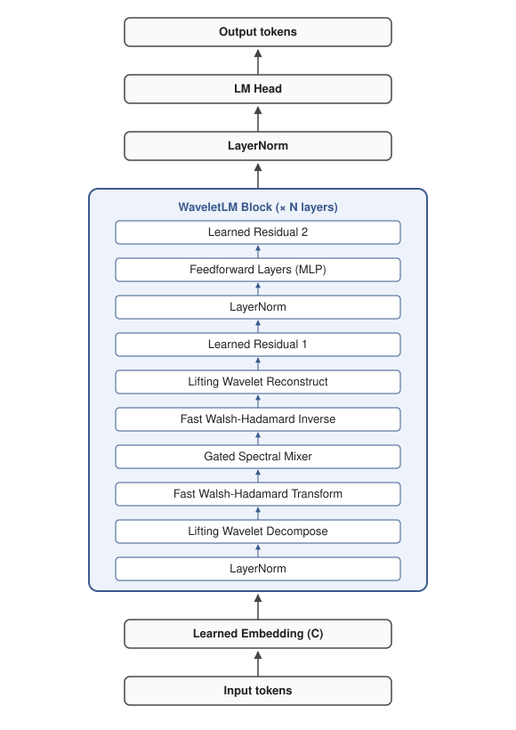

<p align="center">
  
</p>

<br>

WaveletLM is a wavelet-based, attention-free language model that mixes tokens through learned lifting wavelet decomposition, a Fast Walsh-Hadamard Transform, per-scale gated spectral mixing with SwiGLU activation, an inverse FWHT, and wavelet reconstruction. Combined with expanded MLPs and sparse product-key memory, this yields an architecture with no attention and O(n log n) scaling in sequence length.


<p align="center">
<a href="#installation">Installation</a><br>
<a href="#training">Training</a><br>
<a href="#inference">Inference</a><br>
<a href="#sample-generations">Sample Generations</a></br>
<a href="#architecture">Architecture</a><br>
<a href="#results">Results</a><br>
<a href="#future-plans">Future Plans</a><br>
<a href="#license">License</a><br>
<a href="#references">References</a>
</p>


## Installation

Requires Python 3.10+, PyTorch 2.8+, and CUDA.

```bash
git clone https://github.com/ramongougis/WaveletLM.git
cd WaveletLM
pip install torch "datasets<3.0" tiktoken sentencepiece tqdm numpy
```

## Training

Run:

```bash
python train.py
```

`config.json` replicates the current best [883M parameter WikiText-103 run](logs/wikitext-103_2026-04-22_01-36-47/log.txt), which requires 18,235 MiB to train.

Key config options:

| Option | Default | Description |
|--------|---------|-------------|
| `C` | 2048 | Mixer channel width (power of 2 recommended) |
| `layers` | 2 | Number of WaveletLM blocks |
| `levels` | 5 | Wavelet decomposition levels (~log2(block_size)) |
| `mlp_expansion` | 20 | Hidden layer width multiplier |
| `block_size` | 256 | Context length |
| `epochs` | 5 | Training epochs |
| `micro_batch_size` | 8 | Per-step batch size (scale to fit VRAM) |
| `grad_accum` | 1 | Gradient accumulation; effective batch = `micro_batch_size × grad_accum` |
| `lr` | 0.01 | Peak learning rate (Adagrad-tuned; reduce substantially if switching to AdamW) |
| `weight_decay` | 1e-6 | L2 weight decay (1e-6 mildly beneficial; 1e-3 stalls training) |
| `warmup_fraction` | 0.3 | Fraction of total steps spent in LR warmup |
| `dropout_lm_head` | 0.24 | LM-head dropout (other heads: `dropout_mlp` / `mixer` / `projection` / `embedding`) |
| `dataset` | wikitext-103 | HuggingFace dataset ID |
| `seed` | 1337 | RNG seed (e.g. for variance studies) |
| `compile` | True | Enable `torch.compile`; disable when debugging |

Training logs, checkpoints, and configs are saved to `logs/<dataset>_<timestamp>/`. Results from all runs are tracked in [`runs.md`](runs.md). The full default run takes ~14h on an RTX 5090; drop `epochs` to 1 for a quick smoke test.


## Inference

Obtain weights from [HuggingFace](https://huggingface.co/anarmorarm/WaveletLM/tree/main), then replace `best_model_wikitext-103.pt` in the commands below with the path to the file. 

The [current best 883M parameter model](logs/wikitext-103_2026-04-22_01-36-47/log.txt) requires 4,918 MiB for inference and generates at 28.8 tokens/s on a 5090.

Recommended generation command:

```bash
python generate.py --checkpoint best_model_wikitext-103.pt --strategies /
    --prompt "Your prompt here"
```

Default generation:

```bash
python generate.py --checkpoint best_model_wikitext-103.pt
```

Additional options:

```bash
python generate.py --checkpoint best_model_wikitext-103.pt /
    --prompt "Your prompt goes here." --num_tokens 1024 --seed 1337 /
    --n 1 --temperature 1.0 --strategies --ptq8 --num_tokens 9000
```

### Inference Strategies:

Can run all strategies together with `--strategies` or individual ones. Use `--help` for a complete list.

Use all inference strategies:

```bash
python generate.py --checkpoint best_model_wikitext-103.pt --strategies
```

Some strategies options:

```bash
python generate.py --checkpoint best_model_wikitext-103.pt --entropy_adaptive /
    --lookahead_k 3 --lookahead_depth 5 --best_of_n 5 --clean_spacing /
    --wavelet_coherence
```

### Post-Training Quantization (PTQ; optional)

Near-lossless uniform 8-bit PTQ:

```bash
python generate.py --checkpoint best_model_wikitext-103.pt --ptq8
```

PTQ effects:

- +0.0001 BPB hit (negligible performance impact)
- 10% less inference VRAM
- 50% less checkpoint file size
- 12% less tok/s currently. However, PTQ is expected to be 1.4-2.2x faster than the baseline 28.8 tok/s with bit-packed kernels. See [Future Plans → Bit-Packed PTQ Kernels](#bit-packed-ptq-kernels) and [`runs.md`](runs.md#post-release-bit-packed-ptq-kernels)).


## Sample Generations

Below are selections from the [generations log](https://github.com/ramongougis/WaveletLM/blob/main/logs/wikitext-103_2026-04-22_01-36-47/generations.txt) for the WikiText-103 best PPL run, which contains both naive and strategies-mode samples. Samples A, B, and C below were generated with inference strategies enabled:

```bash
python generate.py --checkpoint logs/wikitext-103_2026-04-22_01-36-47/best_model.pt --strategies --n 20
```

The `--strategies` flag enables:

- Entropy-adaptive temperature (capped at 0.9)
- `top_p=0.85`
- `repetition_penalty=1.2`
- Metrics logging (`mean_log_prob`, `Distinct-n`, `Rep-4`)
- WikiText-103 spacing cleanup

Throughput in this mode is comparable to naive sampling (28.8 tok/sec on a 5090). Other strategies, such as `best_of_n`, multi-token `lookahead`, and `wavelet_coherence` decoding bias, are available as separate flags, but are not enabled by `--strategies`.

A naive sampling baseline ("Sample D") is included below for direct comparison. The strategies-on samples were post-processed to clean WikiText-103 spacing artifacts (`@-@`, `@,@`, spaces before punctuation). Raw outputs in the linked log preserve those markers.

**Sample A** with prompt "The history of":

> The history of the city is reflected in its architecture, which includes 
> the historic Old Town and New Castle County Courthouse Square Historic 
> District. The building was designed by John H. Stevens, who also 
> designed the Albany-Fulton Celebration in 1906 and built a steel-hulled 
> shipyard on the lake shore.
>
> In 1909, Fort Wayne became home to the first naval base for military 
> aviation in the United States. The Navy Yard at the former Naval Air 
> Station Pensacola (now known as the Georgia Tech Research Institute), 
> located on the campus' eastern boundary, was constructed in 1925–1926 
> near the site of the original schoolhouse.

**Sample B** with prompt "The album was released":

> The album was released on August 25, 2007 by Sony Music Entertainment 
> and features several songs from the record including "Never Say Die", 
> "The Show", "Don't Cry for Me Argentina" and a cover of "I Can Only 
> Imagine (But You Are Not Alone)".
>
> In 2009, Tyler performed at the Rock in Rio festival held in Lisbon, 
> Portugal; a performance which included performances of his own 
> compositions by Queen Latifah and Ali Zardari. On July 1, 2010 he sang 
> "O Holy Night" during the closing ceremony of the 2012 Summer Olympics 
> opening ceremony at London Olympic Stadium as part of the celebrations 
> of the 75th anniversary of the United States Declaration of Independence.

**Sample C** with prompt "The species was first described":

> The species was first described by Swedish zoologist Carl Linnaeus 
> in 1758 as Agaricus adustus. The genus name is derived from the Latin 
> words perma "to tie", and pous ("like") means "with a large head". In 
> 1821, French mycologists Jean-Baptiste de Lacaille placed it in section 
> Cricetae of the order Carnivora. He later renamed it Spongiforma 
> punctata after the Greek kribensis.
>
> P. nigriceps was originally classified under its current binomial name 
> Sirmuellera speciosa; however, this has been rejected on the grounds 
> that Lactarius deterrimus may not be closely related to Boletus edulis 
> or other similar fungi in general. 

**Sample D** with prompt "The history of" and naive sampling (no `--strategies`, default `temp=1.0`, and `top_p=0.95`):

> The history of the tropical cyclone is unknown, but official records 
> suggest it formed on May 31. It developed into a tropical storm later 
> that day. After turning to the northeast, on September 20 Huron 
> strengthened into a hurricane while east-southeast of Bermuda. During 
> that time, Hurricane Humberto destroyed another ship in a prolonged 
> action. In late October, Ione crossed into the eastern Gulf of Mexico; 
> however, it reintensified slightly and later peaked with winds of 100 
> mph (160 km/h) as it drifted through western Cuba.

Note the typical failure mode: register-coherent meteorological prose, but the model freely interleaves the names of multiple unrelated real storms (Huron, Humberto, Ione) within a single passage. Without `--strategies`, the model is prevented from employing a more conservative sampling regime.


## Architecture

<p align="center">
  
</p>

### Key Components

- **Learnable lifting wavelet decomposition**: Haar-initialized predict/update networks decompose each sequence into multi-scale coefficients per block, trained end-to-end with causality preserved via zero-padded dilation. Decompose/reconstruct weights are shared. Untying them had negligible performance impact while saving parameters.

- **Fast Walsh-Hadamard Transform (FHT)**: a fixed orthogonal O(C log C) cross-channel rotation replacing attention's channel-mixing role. Cost is independent of sequence length.

- **Per-scale gated spectral mixer (SwiGLU)**: mixes each wavelet scale independently in Walsh-Hadamard space via a gated linear layer. Runs in fixed O(S²) per layer for S scales (S = levels + 1), versus attention's O(N²) in sequence length.

- **Expanded MLP (expansion ≥ 20)**: Hidden layer width multiplier for the MLP layers. Logarithmic relationship with BPB.

- **Decompose bypass**: a causal cumulative mean of pre-decompose hidden states, projected per-scale and added as bias to the post-decompose coefficients.

<details>
<summary><b>Additional key components</b> (always-on architectural pieces)</summary>

- LayerNorms near both ends of each block, and one before the LM head
- Two residual connections per block with learned scalar gating (`learned_residual` in config.json)
- Per-scale weights applied after the inverse FHT, one trainable scalar per wavelet scale
- Feature padding to the next power of 2, required for the Walsh-Hadamard transform (`C` → `Cp = next_pow2(C)`)
- Causal zero-padded dilation in the lifting predict/update steps, preserving autoregressive causality at every level

</details>

### Optional Features

- **Per-Layer Embedding**: a learned per-channel residual of the token embedding added at each block, letting deeper blocks reach back to the input representation.

- **Product Key Memory / Fast-Weight Product Key Memory**: sparse key-value memory modules complementing the dense MLP, with optional inference-time fast-weight updates.

- **Low-Rank Factorization**: a rank-r `U·V^T` perturbation added to the spectral mixer; rank=4 yields a measurable BPB improvement at trivial parameter cost.

- **Exponential Parametrization**: reparameterizes mixer weights through `exp()`, stabilizing training under high learning rates that would otherwise NaN.

- **Cross-scale gating (routing mode)**: a learned identity-initialized (S, S) routing matrix that mixes per-scale inputs before each gate, enabling conditional cross-scale interactions.

- **Per-scale mixer widths**: asymmetric per-scale mixer capacity (coarse scales full width, fine scales reduced). At `[1, 1, 1, 0.5, 0.5, 0.5]`: small BPB improvement + ~23% per-epoch speedup.

- **Wavelet crawl**: softmax-weighted mixture of K candidate dilations per level around the base `2^l`, letting the model discover off-power-of-2 receptive fields. K=3 (±1) is the stable sweet spot.

- **Shared lifting weights**: one lifting wavelet module shared across all blocks. Essentially free on BPB; cuts training VRAM by ~5–10% at L=2.

- **Looped blocks (Universal Transformer-style)**: one shared block applied K times in place of L stacked blocks. Reduces BPB at fixed parameter count; compute is usually better spent on more epochs of the stacked model.

<details>
<summary><b>Additional optional features</b> (all configurable in <code>config.json</code>)</summary>

- Data-dependent EMA decompose-bypass (`decompose_bypass_ema`): σ-gated adaptive IIR replacement for the cumulative running mean. Promising at 1 epoch (-0.30 nats val loss), regressed at 5 epochs (BPB 1.0226 vs 1.0201 baseline). Rejected for release; investigation plan in [plans/ema_post_release.md](plans/ema_post_release.md).
- Cross-layer decompose bypass state carry (`decompose_bypass_cross_window`)
- Stable-parametrization master flag (`stable_parametrization`)
- Spectral-norm constraint on mixer weights (`stab_spectral_norm`)
- MLP final-layer variance scaling (`stab_ff_scaling`)
- √C embedding output scaling (`stab_embed_scaling`)
- Projection-out residual-stream scaling (`stab_proj_out_scaling`)
- Mixer init-epsilon scaling (`stab_mixer_eps_scaling`)
- Per-level lifting init damping (`stab_lifting_level_scaling`)
- Multi-basis (K parallel) lifting wavelets (`multi_basis_lifting`, `multi_basis_inits`)
- Untied reconstruction weights (`untied_reconstruction`)
- Linear-only lifting networks - no GELU (`lifting_linear_only`)
- Stacked spectral mixer depth (`mixer_depth`, `mixer_depth_stabilizers`, `mixer_depth_residuals`)
- LoopLM mode - full-stack iterated inference (`loop_iterations`)
- Weight tying between embedding and LM head (`tie_embedding_to_lm_head`)
- Output-projection skip when C equals Cp (`skip_proj_out`)
- Gradient checkpointing (`gradient_checkpointing`)
- Stochastic depth (`stochastic_depth_rate`)
- Per-component dropouts (`dropout_embedding`, `dropout_projection`, `dropout_mixer`, `dropout_mlp`, `dropout_lm_head`)
- Lifting-network hidden-dim multiplier (`lifting_hidden_mult`)
- Lifting initialization choice - Haar / zero / random (`lifting_init`)
- Lifting dropout (`lifting_dropout`)
- Spectral mixer gate toggle and activation (`use_mixer_gate`, `mixer_gate_activation`)
- Non-learned fixed-Haar fallback for the wavelet (`wavelet_mode="haar"`)
- Multinodal feature bagging mode and its sub-flags (`multinodal_enabled`, `multinodal_num_cells`, `multinodal_cell_dim`, `multinodal_seeds`, `multinodal_combination`, `multinodal_cross_cell_gating`, `multinodal_features_per_cell`, `multinodal_bagged_eps`)

</details>


## Results

It is important to note that WaveletLM has **not** been fully optimized: 

- it is underregularized with a 0.8 train/val loss gap, 
- the 5 dropout parameters have not been swept, 
- weight decay needs further tuning, 
- longer training time is needed, and 
- parameter compression has not yet been applied.

My current run budget is limited. Other researchers are encouraged to train the model with these changes to more accurately gauge its potential performance.

See [Areas for Improvement](#areas-for-improvement) below for more info on optimization, and [Future Plans](#future-plans) for ways to push WaveletLM further post-release.

### WikiText-103 Test Set Perplexity Comparison

| Model | Type | Trained on | Params | PPL |
|-------|------|-----------|--------|-----|
| GPT-2 XL | Transformer | WebText (40GB) | 1.5B | 17.5[^3] |
| Transformer-XL Large* | Transformer + recurrence* | WikiText-103 (0.5GB)* | 257M* | 18.3[^2]* |
| GPT-2 Large | Transformer | WebText (40GB) | 774M | 19.3[^3] |
| S4* | SSM* | WikiText-103 (0.5GB)* | 130M* | 20.9[^4]* |
| GPT-2 Medium | Transformer | WebText (40GB) | 355M | 22.1[^3] |
| **WaveletLM** | **Wavelet mixer** | **WikiText-103 (0.5GB)** | **883M** | **23.8†** |
| Transformer-XL Standard* | Transformer + recurrence* | WikiText-103 (0.5GB)* | 151M* | 24.0[^2]* |
| GPT-2 | Transformer | WebText (40GB) | 124M | 29.4[^3] |

\* Both trained and evaluated on WikiText-103 only (direct comparison to WaveletLM). GPT-2 BPE was used by WaveletLM for tokenization.

† Best of 3 seeds PPL of 23.749 with mean PPL of 23.818.

- [3-seed variance study](runs.md#3-seed-variance-study-l2-c2048-20x-dropout-5-epochs) 
- [Best run's training log](logs/wikitext-103_2026-04-22_01-36-47/log.txt)

See [`runs.md`](runs.md) for a record of all training runs, logs, configs, and benchmark results with fully-reproducible point-in-time code snapshots.

### PG-19 Test Set Perplexity Comparison

| Model | Type | Params | PPL |
|-------|------|--------|-----|
| Perceiver AR | Cross-attn + latents | 974M | 28.9[^5] |
| Block-Recurrent Transformer | Transformer + recurrence | ~200M | 29.0[^6] |
| Compressive Transformer | Transformer + compressive memory | 257M | 33.6[^7] |
| Transformer-XL | Transformer + recurrence | 257M | 36.3[^7] |
| **WaveletLM (1 epoch)** | **Wavelet mixer** | **~808M** | **TBD (1 epoch)** (pending [pre-release run](runs.md#pg-19-pre-release-benchmark-best-seed-1-epoch)) |

All models in this table were trained and evaluated on PG-19 with its standard SentencePiece tokenization. Unlike the others, WaveletLM was trained on one epoch only.

Comparison numbers for both datasets are sourced from their respective papers. See References below.

### Areas for Improvement

Longer training time, more regularization, and parameter compression are the surest ways to immediately improve the model's performance.

**More training time**: More research and more resources are needed to uncover the effects of longer training.

**Regularization**: WaveletLM is vastly underregularized, with a 0.8 train/val loss gap at 5+ epochs. Dropout and weight decay parameter sweeps are limited by budget and involve tuning `weight_decay` `dropout_embedding`, `dropout_projection`, `dropout_mixer`, `dropout_mlp`, and `dropout_lm_head` in tandem.

**Parameter compression**: Of WaveletLM's 883M parameter total, around 55% (488M) live in two highly compressible components: dense MLPs (335.6M) and product-key memory modules (PKM: 76M + FwPKM: 76M). Further work is needed to determine the degree of compressivity of each during training, which makes it complementary to PTQ.


## Future Plans

### Combined Parameter Reduction and VRAM Reallocation

Combine four cheap reductions (`mlp_expansion: 10`, `pkm_enabled: false`, `fwpkm_num_keys: 8281`, and `tie_embedding_to_lm_head: true`) to bring the model from 882.5M parameters to ~497.8M (~44% reduction) at a projected +0.025 BPB additive cost. PKM is dropped (rather than FwPKM) since the two perform comparably on quality and FwPKM also retains the optional `fwpkm_inference_updates` capability. The freed VRAM can be reallocated to longer block size, larger effective batch size, more epochs, or dropout retuning at the same hardware budget. See [plans/other_post_release_plans.md §8](plans/other_post_release_plans.md#8-combined-parameter-reduction-and-vram-reallocation) for more.

### Cross-Layer Parameter Sharing

ALBERT-style weight tying across the two WaveletLM blocks. Test sequence: full-block tying first (~338M potential savings), then component-isolated tying with MLP only (~168M), then PKM/FwPKM only (~76M). Tests whether depth-via-iteration substitutes for depth-via-distinct-parameters in the wavelet architecture, as it does in transformers. See [plans/other_post_release_plans.md §9](plans/other_post_release_plans.md#9-cross-layer-parameter-sharing-albert-style) for the full design.

### Dropout Sweep

Re-tune the five dropout values (`dropout_lm_head`, `dropout_mlp`, `dropout_mixer`, `dropout_projection`, and `dropout_embedding`) once model parameters are reduced from above. A doubled-dropout ablation at the prior baseline gave -0.0221 BPB. This is larger than the projected BPB increase from parameter reduction. A true dropout sweep may surpass the gap.

### Weight Decay Sweep

Re-tune `weight_decay`. Current value (1e-6) was only tested alongside 1e-3. More values must to be attempted.

### 2D Wavelet over (Batch, Token) with Sequential Training

Generalize the lifting wavelet decomposition from 1D over the token axis to 2D over the joint (batch, token) axis pair. When training proceeds in document-sequential order, the batch axis carries the same multi-scale temporal structure as the token axis, and the same wavelet machinery applies to both. This requires reorganization of the current batch sampling method into a sequential batch processing method, since batches may not be IID with respect to each other. As one example, consider series of novels in PG-19 with temporal plot dependencies between books. Randomly sampling batches breaks this temporal relationship. Using 2D wavelets is a convenient way to enforce and encode temporal relationships at all levels within the model. See [plans/two_d_wavelet_sequential_training.md](plans/two_d_wavelet_sequential_training.md) for the full design.

### Longer PG-19 Training

The PG-19 run above was trained for a single epoch using the WikiText-optimized config. Published baselines for other models on the same dataset were likely trained for many more epochs or with much more effective compute. 

Once it is possible, the first post-release goal will be to train on PG-19 for 2 epochs, and loss permitting, 5 epochs, in order to better gauge language modeling on a large dataset at the current parameter size.

### Dataset Comparisons

The best WaveletLM config trained on Pile-ArXiv, BookCorpusOpen, OpenWebText, and other datasets to gauge their performance.

### Model Comparisons

Side-by-side benchmarks against Hyena, Transformer, Mamba, RWKV, and other modern architectures on WikiText-103 at matched compute and fully optimized.

### Scaled-Up Model (B200)

The 883M RTX 5090 headline run scales up naturally to a B200:

- `C`: 2048 → 4096 
- `layers`: 2 → 4–8
- `mlp_expansion`: 20 → 50–200
- `pkm_num_keys` & `fwpkm_num_keys`: 16384 → 65536 each
- fp16 → FP8 via Blackwell tensor cores (NYI)

The goal is a 10–15B parameter configuration, trained individually on WikiText-103 and PG-19, and also on a multi-dataset mix of WikiText-103, PG-19, Pile-ArXiv, BookCorpusOpen, TinyStories, & OpenWebText. 

Inference would fit on a single RTX 4090 at fp16 and roughly half the VRAM with [uniform 8-bit PTQ](runs.md#ptq-sweep-summary). See [`runs.md`](runs.md#post-release-scaled-up-b200-configuration) for the pending run entry.

### Optimizer Sweep (Adagrad / AdamW / Muon)

Adagrad (lr=0.01) is the validated optimizer for the released model but has not been directly compared against properly-tuned alternatives. WaveletLM is matrix-parameter-heavy (MLP at expansion=20 produces Linear(2048, 40960) weights, plus per-scale mixers and lifting matrices), so [Muon (Jordan et al., 2025)](https://arxiv.org/abs/2502.16982) - which orthogonalizes matrix gradient updates via Newton-Schulz iteration and reports 1.5–2× wall-clock speedups vs AdamW on small transformers - is a strong candidate. Plan: a 2-phase sweep (1-epoch LR screening + 5-epoch finalist validation) across Adagrad, AdamW, and Muon. Even a 30% wall-clock speedup compounds across every subsequent ablation and the B200 scale-up. See [plans/other_post_release_plans.md §6](plans/other_post_release_plans.md#6-optimizer-sweep-adagrad--adamw--muon).

### Bit-Packed PTQ Kernels

The [current PTQ path](runs.md#ptq-sweep-summary) dequantizes int8 weights to fp16 inside `forward()` and runs a standard fp16 matmul, which pays the dequant cost every step with no bandwidth win - hence the 12% generation slowdown and the fact that sub-8-bit variants compress identically to 8-bit on disk. 

Swapping `QuantizedLinear` / `QuantizedEmbedding` for fused packed-weight kernels (Marlin W8A16 / W4A16, CUTLASS `i8gemm`, bitsandbytes, Triton for the embedding lookup) fixes both: storage scales with bit-width, and each matmul reads half or a quarter as many bytes. Expected generation at batch=1 (fp16 baseline 28.8 tok/s) is **~1.4–1.6× faster** for fused uniform 8-bit and **~1.8–2.2× faster** for fused mixed 8/4/2, with BPB unchanged. See [runs.md](runs.md#post-release-bit-packed-ptq-kernels) for the full plan.

### Semantic Embedding & Interpretability Work

An optional replacement for the learned token embedding is a **semantic embedding**, where each dimension is a plain-language feature (e.g. "is this token a noun?", "is this token associated with anger?", "corpus frequency in deceptive contexts") and each token or n-gram is a vector of values across those dimensions. 

WaveletLM is structurally well-suited for this: the spectral mixer can operate directly on vectorized human-readable features, and multi-scale decomposition lets the same concept be processed at different temporal granularities. The expected tradeoff is improved interpretability at a small performance cost, potentially recovered or even improved via n-gram tokens and careful feature selection for the dimensions. 

See [plans/reincorporate_large_semantic_embedding.md](plans/reincorporate_large_semantic_embedding.md) for the full design, including open questions on coefficient assignment methods: one-hot/binary, LLM-scored, human-rated, or corpus-derived.

### Multinodal Mode

WaveletLM supports a product-of-experts mode where multiple independent nodes process the input in parallel with feature bagging and logit averaging. Enable with `multinodal_enabled: true` in the config. This mode may require stability adjustments such as a lower learning rate with `stable_parametrization` enabled, and acts as an as-yet underexplored capacity/scalability lever. Broader multi-expert training techniques (sparse MoE, mutual learning, weight averaging, Git Re-Basin, & ensemble distillation) surveyed in [plans/multinodal_training_techniques.md](plans/multinodal_training_techniques.md).

### Adaptive Decompose Bypass

Replacing the parameter-free cumulative running mean with a data-dependent EMA (`decompose_bypass_ema`) gained -0.30 nats at 1 epoch, but regressed at 5 epochs (BPB 1.0226 vs 1.0201). The inversion likely due to short-horizon forgetting and learned gate overfitting. Post-release plan: develop freeze-gate/bias correction probes and alternative formulations with a selective SSM bypass as fallback. See [plans/ema_post_release.md](plans/ema_post_release.md).

### Other Post-Release Plans

See [plans/other_post_release_plans.md](plans/other_post_release_plans.md) for info on each.

- Cross-scale phase gating (coarse-modulates-fine)
- Stable parametrization: validation and finishing gaps 
- Data-dependent lifting networks (Mamba-style)
- Wavelet Packet Decomposition (WPD)
- Top-K / hard thresholding in the Hadamard domain


## License

Apache License 2.0

## References

[^2]: Dai et al. "Transformer-XL: Attentive Language Models Beyond a Fixed-Length Context." arXiv:1901.02860, 2019.
[^3]: Radford et al. "Language Models are Unsupervised Multitask Learners." OpenAI, 2019.
[^4]: Gu et al. "Efficiently Modeling Long Sequences with Structured State Spaces." arXiv:2111.00396, 2021.
[^5]: Hawthorne et al. "General-purpose, long-context autoregressive modeling with Perceiver AR." arXiv:2202.07765, 2022.
[^6]: Hutchins et al. "Block-Recurrent Transformers." arXiv:2203.07852, 2022.
[^7]: Rae et al. "Compressive Transformers for Long-Range Sequence Modelling." arXiv:1911.05507, 2019. (PG-19 dataset introduction; reports both Compressive Transformer and Transformer-XL on PG-19.)
