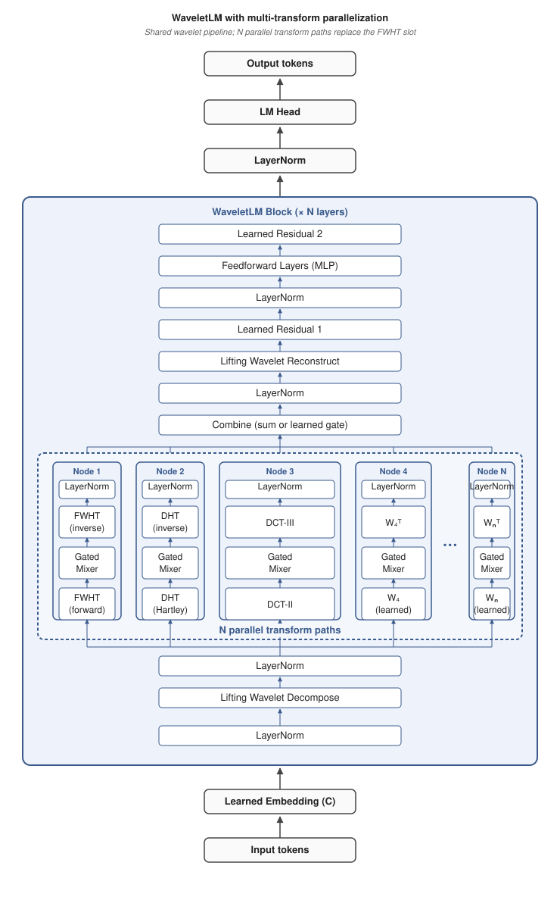

<p align="center">
  
</p>

<p align="center">
  
</p>

<br>

<p align="center">
  <a href="https://www.python.org/"></a>
  <a href="https://github.com/ramongougis/WaveletLM/actions/workflows/codeql.yml"></a>
  <a href="https://github.com/ramongougis/WaveletLM/actions/workflows/scorecard.yml"></a>
  <a href="LICENSE"></a>
</p>

<br>

WaveletLM is a generative, attention-free language model based upon the architecture discovered by Andrew Kiruluta et al. (2025)[^1][^2] in the following papers:

- **Wavelet Logic Machines**: wavelet-based classification on fixed, pretrained embeddings ([arXiv:2507.19514](https://arxiv.org/abs/2507.19514))
- **Learnable Multi-Scale Wavelet Transformer**: wavelet-based machine translation ([arXiv:2504.08801](https://arxiv.org/abs/2504.08801))

WaveletLM adapts the Wavelet Logic Machine's approach to autoregressive language modeling with the components detailed in the [Architecture](#architecture) section below. Furthermore, a planned replacement of the current learned embedding with a fixed, human-readable semantic embedding would more than halve the trainable parameters achieved by our [benchmark results](#results) while extending the Wavelet Logic Machine's interpretability benefits to the generative setting. For details, see the [Future Plans](#future-plans) section.

It uses a learned embedding and mixes tokens using causal lifting wavelet decomposition, a Fast Walsh-Hadamard Transform, per-scale gated spectral mixer with SwiGLU activation, inverse FWHT, and wavelet reconstruction. Combined with a 2-layer, width-expanded MLP and Fast-weight Product Key Memory for inference-time updates, this yields an architecture with no attention and O(n log n) scaling in sequence length with the potential for limited-capacity continual learning.

Current [results](#results) show better performance on PG-19 than Perceiver AR, the Compressive Transformer, and Transformer-XL with a single epoch of training, and better performance on WikiText-103 than Transformer-XL and GPT-2. 

Furthermore, there is clear room for improvement in several areas: parameter reduction, regularization, more levels, recurrence, longer training, scale, and others. In particular, conversion of the learned embedding to a semantic embedding would more than halve the current trainable parameter size while potentially boosting interpretability far beyond other transformer-based or hybrid models.

<br>

<p align="center">
<a href="#installation">Installation</a><br>
<a href="#training">Training</a><br>
<a href="#inference">Inference</a><br>
<a href="#sample-generations">Sample Generations</a></br>
<a href="#architecture">Architecture</a><br>
<a href="#results">Results</a><br>
<a href="#future-plans">Future Plans</a><br>
<a href="#license">License</a><br>
<a href="#references">References</a>
</p>


## Installation

Requires Python 3.10+, PyTorch 2.11+, and CUDA.

```bash
git clone https://github.com/ramongougis/WaveletLM.git
cd WaveletLM
pip install "torch>=2.11" "datasets<3.0" tiktoken sentencepiece tqdm numpy --extra-index-url https://download.pytorch.org/whl/cu128
```

## Training

Run:

```bash
python train.py
```

`config.json` replicates the current best [883M parameter WikiText-103 run](logs/wikitext-103_2026-04-22_01-36-47/log.txt), which requires 18,235 MiB to train.

Key config options:

| Option | Default | Description |
|--------|---------|-------------|
| `C` | 2048 | Mixer channel width (power of 2 recommended) |
| `layers` | 2 | Number of WaveletLM blocks |
| `levels` | 5 | Wavelet decomposition levels (~log2(block_size)) |
| `mlp_expansion` | 20 | Hidden layer width multiplier |
| `block_size` | 256 | Context length |
| `epochs` | 5 | Training epochs |
| `micro_batch_size` | 8 | Per-step batch size (scale to fit VRAM) |
| `grad_accum` | 1 | Gradient accumulation; effective batch = `micro_batch_size × grad_accum` |
| `lr` | 0.01 | Peak learning rate (Adagrad-tuned; reduce substantially if switching to AdamW) |
| `weight_decay` | 1e-6 | L2 weight decay (1e-6 mildly beneficial; 1e-3 stalls training) |
| `warmup_fraction` | 0.3 | Fraction of total steps spent in LR warmup |
| `dropout_lm_head` | 0.24 | LM-head dropout (other heads: `dropout_mlp` / `mixer` / `projection` / `embedding`) |
| `dataset` | wikitext-103 | HuggingFace dataset ID |
| `seed` | 1337 | RNG seed (e.g. for variance studies) |
| `compile` | True | Enable `torch.compile`; disable when debugging |

Training logs, checkpoints, and configs are saved to `logs/<dataset>_<timestamp>/`. Results from all runs are tracked in [`runs.md`](runs.md). The full default run takes ~14h on an RTX 5090; drop `epochs` to 1 for a quick smoke test.


## Inference

Obtain weights from [HuggingFace](https://huggingface.co/anarmorarm/WaveletLM/tree/main), then use `best_model_pg-19.pt`, `best_model_wikitext-103.pt`, or whichever weights file is desired as the checkpoint in the commands below.

The [current best PG-19 model](logs\pg19_2026-04-25_13-34-46\benchmark.txt) requires 5,266 MiB for inference and generates at 28.3 tokens/s on a 5090.

The [current best WikiText-103 model](logs/wikitext-103_2026-04-22_01-36-47/log.txt) requires 5,730 MiB for inference and generates at 28.8 tokens/s on a 5090.

Recommended commands:

```bash
# PG-19
python generate.py --checkpoint best_model_pg-19.pt --strategies /
    --prompt "Your prompt here"

# WikiText-103
python generate.py --checkpoint best_model_wikitext-103.pt --strategies /
    --prompt "Your prompt here"
```

Default generation:

```bash
python generate.py --checkpoint best_model_pg-19.pt
```

Additional options:

```bash
python generate.py --checkpoint best_model_pg-19.pt /
    --prompt "Your prompt goes here." --num_tokens 1024 --seed 1337 /
    --n 1 --temperature 1.0 --strategies --ptq8 --num_tokens 9000
```

### Inference Strategies:

Can run all strategies together with `--strategies` or individual ones. Use `--help` for a complete list.

Use all inference strategies:

```bash
python generate.py --checkpoint best_model_pg-19.pt --strategies
```

Some strategies options:

```bash
python generate.py --checkpoint best_model_pg-19.pt --entropy_adaptive /
    --lookahead_k 3 --lookahead_depth 5 --best_of_n 5 --clean_spacing /
    --wavelet_coherence
```

The `--strategies` flag enables:

- Entropy-adaptive temperature (capped at 0.9)
- `top_p=0.85`
- `repetition_penalty=1.2`
- Metrics logging (`mean_log_prob`, `Distinct-n`, `Rep-4`)
- WikiText-103 spacing cleanup

### Post-Training Quantization (PTQ; optional)

Near-lossless uniform 8-bit PTQ:

```bash
python generate.py --checkpoint best_model_pg-19.pt --ptq8
```

PTQ effects:

- +0.0001 BPB hit (negligible performance impact)
- 10% less inference VRAM
- 50% less checkpoint file size
- 12% less tok/s currently. However, PTQ is expected to be 1.4-2.2x faster than the baseline 28.8 tok/s with bit-packed kernels. See [Future Plans → Bit-Packed PTQ Kernels](#bit-packed-ptq-kernels) and [`runs.md`](runs.md#post-release-bit-packed-ptq-kernels)).


## Sample Generations

### PG-19

Selections from the [PG-19 best run's generations log](https://github.com/ramongougis/WaveletLM/blob/main/logs/pg19_2026-04-25_13-34-46/generations.txt):


**Sample A** with prompt "The history of":

> The history of the world is a long and painful one. It has been so 
> much neglected, that it may be said to have become known through all 
> ages; but its influence is not confined solely to the individual or 
> class, nor even to those who are in any way connected with it. The 
> first thing which strikes us on entering into this subject is, that 
> there is no other mode by which we can bring ourselves to do justice 
> to our fellow-men; for what is more extraordinary than that they 
> should be able to find out the real character of those whom we are 
> about to see? If such were their intentions, as I have before stated, 
> then it would be very difficult indeed for them to keep themselves 
> alive at the present moment; because, if we take away from them 
> anything that makes life pleasant, or comfortable, or agreeable, they 
> must give up all thoughts of it.

<details>
<summary><h3 style="display:inline">More PG-19 samples</h3></summary>

**Sample B** with prompt "She turned to him and said":

> She turned to him and said, "I have been thinking a great deal about 
> you. I know that your father is a very good man; but he would not give 
> me his consent if I were to marry him. But it will be all the same with 
> me." He looked at her as though she had spoken to him out of a book 
> which was lying on the table. When he spoke again there came into her 
> face the expression of a most intense earnestness--a look of deep 
> emotion. It seemed to him that she felt for one moment as if she could 
> read his soul through this wonderful eyes: they were full of tenderness 
> and affection, and she knew that in them lay love's highest hope and 
> joy. Then she rose and walked slowly back to the house, leaving him 
> alone with the dead.
>
> CHAPTER XXXV. A CONFESSION OF ROMANCE.

**Sample C** with prompt "'Beware the High Elf mage,' exclaimed Antimour...":

> 'Beware the High Elf mage,' exclaimed Antimour. 'Although a novice, I 
> sense much arcane affinity within him.' Then he added: 'You have been 
> taught to read and write; but you are now in the seventh heaven of 
> bliss!' 'I am not so old as that, my lord,' replied the astrologer; 
> 'but there is no reason why I should be happy without you.' The 
> astrologer shook his head doubtfully. 'There is nothing for it, then,' 
> said he; 'for the present at least we will talk about the matter. 
> Meanwhile I must tell thee how thou didst come into this world. In what 
> way didst thou escape from thine enemies?' 'By means of some magic 
> wand which I possessed,' answered the magician.

Since PG-19 contains data from 1919 and earlier, this prompt is out of distribution. It uses post-Tolkien fantasy diction which the model routes to the closest pre-1919 register: Edwardian fairy-tale and Arabian Nights prose.

**Sample D** with prompt "The spaceship finally arrived in the Alpha Centauri system":

> The spaceship finally arrived in the Alpha Centauri system. It was 
> found that this would be very much like a double-acting motor, but it 
> was not to be compared with one of these machines which had been 
> invented by Professor Thomson and constructed for him by himself at 
> his own expense. In order to make use of such a machine he must have 
> an efficient engine capable of performing its work as soon as possible.
>
> [Illustration: FIGS. 1, 2, 3 and 4.--DIAGRAM OF ELECTRICAL DICTIONARY 
> INVENTION. A simple form of the principle shown is shown on the 
> accompanying diagram (Fig. 7), which represents a rectangular piece of 
> wire attached to the base of a cylinder.

A second out-of-distribution prompt. The model has no training data on spaceships or interstellar travel, so it routes these to the closest pre-1919 register: a Victorian mechanical-engineering treatise with a figure caption.

**Sample E** with prompt "The soldiers marched" and naive sampling (no `--strategies`, default `temp=1.0`, and `top_p=0.95`):

> The soldiers marched in uniform. Ten minutes later, Mr. Farrell 
> approached Mr. Talbot and the captain of police. He had been told that 
> he must start immediately for New York, and sent for his son, Mr. 
> Waters, to meet him there. With this he departed on his return, leaving 
> his wife in such distress at the selfish desertion of her husband and 
> son as to despair of recovering the stolen property. But both Frank and 
> Harry were deeply anxious about her. They knew that their father would 
> not thank them for killing the lady with whom they had arrived; and 
> when he told them how it was done she resolutely turned away her head. 
> And

One-shot naive sample (without `--strategies`). Naive samples retain more of the model's raw distribution and tend to mix domains more loosely.

**Sample F** with prompt "The history of" and naive sampling (no `--strategies`, default `temp=1.0`, and `top_p=0.95`):

> The history of her interest in the modern world during this quarter, 
> has been given to the journal in which she appeared during her stay; 
> and I could mention no names more memorable than those connected with 
> the several sessions at this distinguished lady's house. In 1856, Mr. 
> Ramsey began the voyage along one of the many channels by which Boston 
> had heretofore eluded him, with very valuable additions to his papers.
>
> On January 30, 1833, a small packet arrived at Charleston from Jamaica, 
> designed for the benefit of George (afterwards Lord) Wilmot, an officer 
> in the American army--a man well qualified to fulfill all the duties 
> of a seaman as before stated. He remained at Point Cotterand until 
> October, 1827, when he died in his lodgings, without either pecuniary 
> credit or pecuniary obligations. At the close of 1805 Mrs. Fry visited 
> us. She had previously known her husband, who held an appointment 
> within a few miles of Camden Town.

Randomly selected naive sample (without `--strategies`) out of 20.

</details>

### WikiText-103

Selections from the [WikiText-103 best run's generations log](https://github.com/ramongougis/WaveletLM/blob/main/logs/wikitext-103_2026-04-22_01-36-47/generations.txt):

**Sample A** with prompt "The history of":

> The history of the city is reflected in its architecture, which includes 
> the historic Old Town and New Castle County Courthouse Square Historic 
> District. The building was designed by John H. Stevens, who also 
> designed the Albany-Fulton Celebration in 1906 and built a steel-hulled 
> shipyard on the lake shore.
>
> In 1909, Fort Wayne became home to the first naval base for military 
> aviation in the United States. The Navy Yard at the former Naval Air 
> Station Pensacola (now known as the Georgia Tech Research Institute), 
> located on the campus' eastern boundary, was constructed in 1925–1926 
> near the site of the original schoolhouse.

<details>
<summary><h3 style="display:inline">More WikiText-103 samples</h3></summary>

**Sample B** with prompt "The album was released":

> The album was released on August 25, 2007 by Sony Music Entertainment 
> and features several songs from the record including "Never Say Die", 
> "The Show", "Don't Cry for Me Argentina" and a cover of "I Can Only 
> Imagine (But You Are Not Alone)".
>
> In 2009, Tyler performed at the Rock in Rio festival held in Lisbon, 
> Portugal; a performance which included performances of his own 
> compositions by Queen Latifah and Ali Zardari. On July 1, 2010 he sang 
> "O Holy Night" during the closing ceremony of the 2012 Summer Olympics 
> opening ceremony at London Olympic Stadium as part of the celebrations 
> of the 75th anniversary of the United States Declaration of Independence.

**Sample C** with prompt "The species was first described":

> The species was first described by Swedish zoologist Carl Linnaeus 
> in 1758 as Agaricus adustus. The genus name is derived from the Latin 
> words perma "to tie", and pous ("like") means "with a large head". In 
> 1821, French mycologists Jean-Baptiste de Lacaille placed it in section 
> Cricetae of the order Carnivora. He later renamed it Spongiforma 
> punctata after the Greek kribensis.
>
> P. nigriceps was originally classified under its current binomial name 
> Sirmuellera speciosa; however, this has been rejected on the grounds 
> that Lactarius deterrimus may not be closely related to Boletus edulis 
> or other similar fungi in general. 

**Sample D** with prompt "Born in":

> Born in the city, and the people who have been living there. The town's 
> only synagogue is located on a hill overlooking the street; it was 
> built by John D. Rockefeller, Jr.
>
> A museum dedicated to the history of Jewish culture in Israel opened 
> in 2008 at the former Beth Elohim building. It features an original 
> painting from the Al-Fakhri Mosque that hangs in the Temple. This is 
> one of four mosques in the district named after Abraham Lincoln.
>
> Hebron Church (Hebrew: בית לחברג 'ה) is believed to be the oldest part 
> of Jerusalem's Old City. The name means "holy place" or "place of 
> prayer" in Islamic law and Arabic texts dating back to prehistory as 
> early as the 6th century BCE.

**Sample E** with prompt "The soldiers marched" and naive sampling (no `--strategies`, default `temp=1.0`, and `top_p=0.95`):

> The soldiers marched through a number of hiding places and ambushes . 
> These were the first major engagements that took place during this 
> time — only one is known from sources , although most historians agree 
> the number differs in details . )
>
> The rebel army commenced its march from Livno on 29 October , followed 
> by their advance towards Palermo on 21 November . So – when there was 
> some initial resistance to that tactic – General Guy de Croix — 
> Enghien 's men started gathering at dawn on September 20 , but most 
> would not arrive until midday . Their combined forces divided into 
> two columns , with reinforcements arriving from all sides within 
> hours . The main

**Sample F** with prompt "The history of" and naive sampling (no `--strategies`, default `temp=1.0`, and `top_p=0.95`), but with the spacing post-processing fix now included in naive generations:

> The history of the tropical cyclone is unknown, but official records 
> suggest it formed on May 31. It developed into a tropical storm later 
> that day. After turning to the northeast, on September 20 Huron 
> strengthened into a hurricane while east-southeast of Bermuda. During 
> that time, Hurricane Humberto destroyed another ship in a prolonged 
> action. In late October, Ione crossed into the eastern Gulf of Mexico; 
> however, it reintensified slightly and later peaked with winds of 100 
> mph (160 km/h) as it drifted through western Cuba.

Note the typical failure mode with the naive generation: register-coherent meteorological prose, but the model freely interleaves the names of multiple unrelated real storms (Huron, Humberto, Ione) within a single passage. Without `--strategies`, the model does not employ a more conservative sampling regime.

</details>


## Architecture

<p align="center">
  
</p>

The high-level architectural premise, using learnable wavelets in place of self-attention as a sequence mixer, follows Kiruluta's' Wavelet Logic Machine[^1] and Kiruluta, Burity, and Williams's Learnable Multi-Scale Wavelet Transformer[^2]. WaveletLM extends this approach from sentiment classification to language modeling with several architectural additions and components, detailed below.

### Key Components

- **Learned lifting wavelets**: Haar-initialized MLPs decompose each block into multi-scale coefficients via lifting predict/update steps. Each wavelet scale processes either coarse summaries or fine details across tokens. Reconstruction reuses the same MLPs in reverse with a sign flip, so perfect inversion is structurally guaranteed regardless of what the weights learn. About 16.8M parameters per (predict, update) pair at C=2048, one pair per scale, and shared across all layers via `shared_lifting_weights`.

- **Fast Walsh-Hadamard Transform (FHT)**: a fixed orthogonal O(C log C) cross-channel rotation replacing attention's channel-mixing role. Cost is independent of sequence length.

- **Per-scale gated spectral mixer (SwiGLU)**: mixes each wavelet scale independently in Walsh-Hadamard space via a gated linear layer. Runs in fixed O(S²) per layer for S scales (S = levels + 1), versus attention's O(N²) in sequence length.

- **Expanded MLP (expansion ≥ 20)**: Hidden layer width multiplier for the MLP layers. Logarithmic relationship with BPB.

- **Decompose bypass**: a causal cumulative mean of pre-decompose hidden states, projected per-scale and added as bias to the post-decompose coefficients.

<details>
<summary><b>Additional key components</b> (always-on architectural pieces)</summary>

- LayerNorms near both ends of each block, and one before the LM head
- Two residual connections per block with learned scalar gating (`learned_residual` in config.json)
- Per-scale weights applied after the inverse FHT, one trainable scalar per wavelet scale
- Feature padding to the next power of 2, required for the Walsh-Hadamard transform (`C` → `Cp = next_pow2(C)`)
- Causal zero-padded dilation in the lifting predict/update steps, preserving autoregressive causality at every level

</details>

### Optional Features

- **Per-Layer Embedding**: a learned per-channel residual of the token embedding added at each block, letting deeper blocks reach back to the input representation.

- **Product Key Memory / Fast-Weight Product Key Memory**: sparse key-value memory modules complementing the dense MLP, with optional inference-time fast-weight updates.

- **Low-Rank Factorization**: a rank-r `U·V^T` perturbation added to the spectral mixer; rank=4 yields a measurable BPB improvement at trivial parameter cost.

- **Exponential Parametrization**: reparameterizes mixer weights through `exp()`, stabilizing training under high learning rates that would otherwise NaN.

- **Cross-scale gating (routing mode)**: a learned identity-initialized (S, S) routing matrix that mixes per-scale inputs before each gate, enabling conditional cross-scale interactions.

- **Per-scale mixer widths**: asymmetric per-scale mixer capacity (coarse scales full width, fine scales reduced). At `[1, 1, 1, 0.5, 0.5, 0.5]`: small BPB improvement + ~23% per-epoch speedup.

- **Wavelet crawl**: softmax-weighted mixture of K candidate dilations per level around the base `2^l`, letting the model discover off-power-of-2 receptive fields. K=3 (±1) is the stable sweet spot.

- **Shared lifting weights**: one lifting wavelet module shared across all blocks. Essentially free on BPB; cuts training VRAM by ~5–10% at L=2.

- **Looped blocks (Universal Transformer-style)**: one shared block applied K times in place of L stacked blocks. Reduces BPB at fixed parameter count; compute is usually better spent on more epochs of the stacked model.

<details>
<summary><b>Additional features</b> (all configurable in <code>config.json</code>)</summary>

- Data-dependent EMA decompose-bypass (`decompose_bypass_ema`): σ-gated adaptive IIR replacement for the cumulative running mean. Promising at 1 epoch (-0.30 nats val loss), regressed at 5 epochs (BPB 1.0226 vs 1.0201 baseline). Rejected for release; investigation plan in [plans/ema_post_release.md](plans/ema_post_release.md).
- Cross-layer decompose bypass state carry (`decompose_bypass_cross_window`)
- Stable-parametrization master flag (`stable_parametrization`)
- Spectral-norm constraint on mixer weights (`stab_spectral_norm`)
- MLP final-layer variance scaling (`stab_ff_scaling`)
- √C embedding output scaling (`stab_embed_scaling`)
- Projection-out residual-stream scaling (`stab_proj_out_scaling`)
- Mixer init-epsilon scaling (`stab_mixer_eps_scaling`)
- Per-level lifting init damping (`stab_lifting_level_scaling`)
- Multi-basis (K parallel) lifting wavelets (`multi_basis_lifting`, `multi_basis_inits`)
- Untied reconstruction weights (`untied_reconstruction`)
- Linear-only lifting networks - no GELU (`lifting_linear_only`)
- Stacked spectral mixer depth (`mixer_depth`, `mixer_depth_stabilizers`, `mixer_depth_residuals`)
- LoopLM mode - full-stack iterated inference (`loop_iterations`)
- Weight tying between embedding and LM head (`tie_embedding_to_lm_head`)
- Output-projection skip when C equals Cp (`skip_proj_out`)
- Gradient checkpointing (`gradient_checkpointing`)
- Stochastic depth (`stochastic_depth_rate`)
- Per-component dropouts (`dropout_embedding`, `dropout_projection`, `dropout_mixer`, `dropout_mlp`, `dropout_lm_head`)
- Lifting-network hidden-dim multiplier (`lifting_hidden_mult`)
- Lifting initialization choice - Haar / zero / random (`lifting_init`)
- Lifting dropout (`lifting_dropout`)
- Spectral mixer gate toggle and activation (`use_mixer_gate`, `mixer_gate_activation`)
- Non-learned fixed-Haar fallback for the wavelet (`wavelet_mode="haar"`)
- Multinodal feature bagging mode and its sub-flags (`multinodal_enabled`, `multinodal_num_cells`, `multinodal_cell_dim`, `multinodal_seeds`, `multinodal_combination`, `multinodal_cross_cell_gating`, `multinodal_features_per_cell`, `multinodal_bagged_eps`)

</details>


## Results

It is important to note that WaveletLM has **not** been fully optimized: 

- it is underregularized with a 0.8 train/val loss gap, 
- the 5 dropout parameters have not been swept, 
- weight decay needs further tuning, 
- longer training time is needed, and 
- parameter compression has not yet been applied.

My current run budget is limited. Other researchers are encouraged to train the model with these changes to more accurately gauge its potential performance.

See [Areas for Improvement](#areas-for-improvement) below for more info on optimization, and [Future Plans](#future-plans) for ways to push WaveletLM further post-release.

### PG-19 Test Set Perplexity Comparison

| Model | Type | Params | Context | Epochs | PPL |
|-------|------|--------|---------|--------|-----|
| Hyena ‡ | Long convolution and recurrence | 153M | 16,384 | 8 | 14.6[^10] |
| **WaveletLM (1 epoch)** | **Wavelet mixer** | **808M** | **256** | **1** | **27.40†** |
| Perceiver AR | Cross-attn + latents | 974M | 4,096 | ~210 | 28.9[^7] |
| Block-Recurrent Transformer | Transformer + recurrence | ~200M | 4,096 + recurrent | — | 29.0[^8] |
| Compressive Transformer | Transformer + compressive memory | 257M | 2,048 effective | ~50 | 33.6[^9] |
| Transformer-XL | Transformer + recurrence | 257M | 1,024 effective | ~50 | 36.3[^9] |

All models in this table were trained and evaluated on PG-19. Most use SentencePiece tokenization; Hyena uses GPT-2 BPE. WaveletLM was trained for one epoch only at the smallest context length of any entry.

Context and epoch derivations from source papers:

- **Compressive Transformer / Transformer-XL** (Rae et al. 2019): `~100B tokens / 2B PG-19 tokens ≈ 50 epochs`. Effective context: `512 (window) + 512 (memory) + 512 × 2 (compressed, C=2) = 2,048` (CT); `512 (window) + 512 (cache) = 1,024` (TX-L).
- **Block-Recurrent Transformer**: Context: `4,096-token segments + 512-vector recurrent state`, trained for 500k steps. Epoch count cannot be derived because the batch size was not reported.
- **Perceiver AR**: `~200k steps per batch × 2048 batches ≈ 420B tokens`; `420B / 2B PG-19 tokens ≈ 210 epochs` at `4,096-token context`.

† 27.40 sliding-window PPL. See the [PG-19 pre-release run](runs.md#pg-19-pre-release-benchmark-best-seed-1-epoch) for full details and the [run log](logs/pg19_2026-04-25_13-34-46/log.txt). Increased regularization and training time are in the [Future Plans](#future-plans) section.

‡ Hyena was trained with `block_size=16384` (64× WaveletLM's) and 8 epochs (8× WaveletLM's). It is also incredibly efficient parameter-wise with 153M vs. WaveletLM's 807M. Increasing both block size and epochs for WaveletLM while decreasing parameters are some of the [Future Plans](#future-plans).

Comparison numbers for both datasets are sourced from their respective papers. See References below.

### WikiText-103 Test Set Perplexity Comparison

| Model | Type | Trained on | Params | Context | PPL |
|-------|------|-----------|--------|---------|-----|
| GPT-2 XL | Transformer | WebText (40GB) | 1.5B | 1024 | 17.5[^5] |
| Transformer-XL Large* | Transformer + recurrence* | WikiText-103 (0.5GB)* | 257M* | 1024 effective* | 18.3[^4]* |
| GPT-2 Large | Transformer | WebText (40GB) | 774M | 1024 | 19.3[^5] |
| S4* | SSM* | WikiText-103 (0.5GB)* | 130M* | 1024* | 20.9[^6]* |
| GPT-2 Medium | Transformer | WebText (40GB) | 355M | 1024 | 22.1[^5] |
| **WaveletLM** | **Wavelet mixer** | **WikiText-103 (0.5GB)†** | **883M** | **256†** | **23.8†** |
| Transformer-XL Standard* | Transformer + recurrence* | WikiText-103 (0.5GB)* | 151M* | 1024 effective* | 24.0[^4]* |
| GPT-2 | Transformer | WebText (40GB) | 124M | 1024 | 29.4[^5] |

\* Both trained and evaluated on WikiText-103 only (direct comparison to WaveletLM). GPT-2 BPE was used by WaveletLM for tokenization.

† Best of 3 seeds PPL of 23.749 with mean PPL of 23.818. Significant parameter reduction is planned post-release in the [Future Plans](#future-plans) section.

- [3-seed variance study](runs.md#3-seed-variance-study-l2-c2048-20x-dropout-5-epochs) 
- [Best run's training log](logs/wikitext-103_2026-04-22_01-36-47/log.txt)

See [`runs.md`](runs.md) for a record of all training runs, logs, configs, and benchmark results with fully-reproducible point-in-time code snapshots.

### Areas for Improvement

Longer training time, more regularization, and parameter compression are the surest ways to immediately improve the model's performance.

**More training time**: More research and more resources are needed to uncover the effects of longer training.

**Regularization**: WaveletLM is vastly underregularized, with a 0.8 train/val loss gap at 5+ epochs. Dropout and weight decay parameter sweeps are limited by budget and involve tuning `weight_decay` `dropout_embedding`, `dropout_projection`, `dropout_mixer`, `dropout_mlp`, and `dropout_lm_head` in tandem.

**Parameter compression**: Of WaveletLM's 883M parameter total, around 55% (488M) live in two highly compressible components: dense MLPs (335.6M) and product-key memory modules (PKM: 76M + FwPKM: 76M). Further work is needed to determine the degree of compressivity of each during training, which makes it complementary to PTQ.


## Future Plans

- [(Done) Single-Layer WaveletLM with Current Best Config](#done-single-layer-waveletlm-with-current-best-config)
- [(Done) Parameter Reduction](#done-parameter-reduction)
- [(Done) Larger Block Size](#done-larger-block-size)
- [(Done) Per-Scale Mixer Width Contraction and Expansion](#done-per-scale-mixer-width-contraction-and-expansion)
- [(Done) Mixer Low Rank](#done-mixer-low-rank)
- [(Done) T1 Baseline Without Wavelet Crawl](#done-t1-baseline-without-wavelet-crawl)
- [(Done) New Baseline T2 with 7 Levels, more Per-Scale Mixer Weights, and Wavelet Crawl](#new-baseline-t2-with-7-levels-more-per-scale-mixer-weights-and-wavelet-crawl)
- [Optimizer Swap (Muon)](#optimizer-swap-muon)
- [(Done) Sequential Block Ordering](#done-sequential-block-ordering)
- [(Shelved on WikiText-103) 2D Wavelet over (Batch, Token) with Sequential Training](#shelved-on-WikiText-103-2d-wavelet-over-batch-token-with-sequential-training)
- [Bisected Block Context Extension](#bisected-block-context-extension)
- [Adagrad Learning Rate Tuning](#adagrad-learning-rate-tuning)
- [New T3 Baseline](#new-t3-baseline)
- [Recurrence with Adagrad (partial)](#recurrence-with-adagrad-partial)
- [Optimizer Swap (AdamW) and Wavelet Norms](#optimizer-swap-adamw-and-wavelet-norms)
- [Optimizer Tuning (Adagrad) with Wavelet Norms](#optimizer-tuning-adagrad-with-wavelet-norms)
- [Spectral Norm](#spectral-norm)
- [New T4 Baseline](#new-t4-baseline)
- [Recurrence with Adagrad (no residual)](#recurrence-with-adagrad-no-residual)
- [Recurrence with Adagrad (with residual)](#recurrence-with-adagrad-with-residual)
- [Recurrence Efficiency: Gate Caching](#recurrence-efficiency-gate-caching)
- [Long-Range Context: Multi-Pole SSM + Truncated BPTT](#long-range-context-multi-pole-ssm--truncated-bptt)
- [Dense Mixer Recurrence](#dense-mixer-recurrence)
- [Untied Wavelet Reconstruction](#untied-wavelet-reconstruction)
- [Dropout](#dropout)
- [Weight Decay](#weight-decay)
- [Complex Wavelets and Complex Mixer](#complex-wavelets-and-complex-mixer)
- [Wavelet Crawl Off](#wavelet-crawl-off)
- [Wavelet Sparsity Probe & Wavelet Shrinkage](#wavelet-sparsity-probe--wavelet-shrinkage)
- [Inference-Depth Flexibility with Mixer Recurrence (Train Deep, Infer Shallow)](#inference-depth-flexibility-with-mixer-recurrence-train-deep-infer-shallow)
- [Mixer Transform Ablation](#mixer-transform-ablation)
- [Step-Time Speedups](#step-time-speedups)
- [T5 Baseline](#t5-baseline)
- [More Layers](#more-layers)
- [Longer PG-19 Training](#longer-pg-19-training)
- [Dataset Comparisons](#dataset-comparisons)
- [Model Comparisons](#model-comparisons)
- [Bit-Packed PTQ Kernels](#bit-packed-ptq-kernels)
- [Multi-Transform Parallelization](#multi-transform-parallelization)
- [Semantic Embedding & Interpretability Work](#semantic-embedding--interpretability-work)
- [Combined Multi-Transform + Semantic Embedding (Interpretability Compound)](#combined-multi-transform--semantic-embedding-interpretability-compound)
- [Adaptive Decompose Bypass](#adaptive-decompose-bypass)
- [Multinodal Mode (Product-of-Experts)](#multinodal-mode-product-of-experts)
- [Final Regularization Sweep](#final-regularization-sweep)
- [Scaled-Up Model (B200)](#scaled-up-model-b200)
- [Scaled-Up Model with PTQ and other Infernece Strategies](#scaled-up-model-with-ptq-and-other-infernece-strategies)
- [Other Post-Release Plans](#other-post-release-plans)

<p align="center">
  
</p>

### (Done) Single-Layer WaveletLM with Current Best Config

**Result:** 

Tested `layers=1` and `layers=2`, each for 1 epoch and 5 epochs. Both runs were also trained at near-equal wall-clock by extending the 1-layer result to 8 epochs (`layers=1` and `epochs=8` took 15.86h, while `layers=2` and `epochs=5` took 16.25h). 

| Run | Layers | Epochs | BPB sliding | PPL sliding | Params | Train time | Links |
|-----|--------|--------|-------------|-------------|--------|------------|-------|
| A | 1 | 1 | 1.1648 | 38.04 | 586.15M | 2.09h | [link](logs/wikitext-103_2026-04-29_20-45-37/log.txt) |
| B | 2 | 1 | 1.1129 | 32.35 | 882.51M | 3.43h | [link](logs/wikitext-103_2026-04-29_22-52-28/log.txt) |
| C | 1 | 5 | 1.0809 | 29.28 | 586.15M | 9.74h | [link](logs/wikitext-103_2026-04-30_02-20-35/log.txt) |
| D | 2 | 5 (headline) | **1.0140** | **23.75** | 882.51M | 16.25h | [link](logs/wikitext-103_2026-04-22_01-36-47/log.txt) |
| E | 1 | 8 (compute-equalized) | 1.0715 | 28.43 | 586.15M | 15.86h | [link](logs/wikitext-103_2026-04-30_12-20-45/log.txt) |

**Conclusions:** 
- `layers=1` and `epochs=1` are set for future tests to hasten iteration time.
- Benchmark runs will use `layers=2` and `epochs=5`, or more of each.
- Training `layers=1` and `layers=2` for approximately equal wall-clock time does not compensate for the lack of layers.

<p align="center">
  
</p>

### (Done) Parameter Reduction

Starting with the best WikiText-103 config, we made the following changes to reduce parameters:

- `mlp_expansion: 20 → 10`
- `pkm_enabled: true → false`
- `fwpkm_num_keys: 16384 → 8281`
- `tie_embedding_to_lm_head: false → true`

**Results:** 
- 41% fewer parameters
- 21% less training time
- minimal performance impact (−0.0013 BPB)
- 26% smaller train/val loss gap (implicit regularization via less params)

The "Test 1", aka **T1**, configuration in the table below incorporates these reductions. 

| Run | Recipe | Folder | BPB sliding | PPL sliding | Best val | Min train | Train/val gap | Params | Train time | Training VRAM |
|-----|--------|--------|-------------|-------------|----------|-----------|---------------|--------|------------|------|
| Best WikiText-103 run with layers=1 | Best run with layers=1 | [link](logs/wikitext-103_2026-04-30_02-20-35/log.txt) | 1.0809 | 29.28 | 3.3275 | 2.8292 | 0.498 | 586.15M | 9.74h | 11,537 MiB |
| **T1/Test 1** | Best run with layers=1 and parameter reductions | [link](logs/wikitext-103_2026-05-01_06-33-48/log.txt) | **1.0796** | **29.15** | 3.3341 | 2.9649 | **0.369** | **344.63M** | 7.69h | 6,867 MiB |
| Δ | — | — | −0.0013 | −0.13 | +0.007 | +0.136 | −26% | −41% | −21% | — |

**Conclusion:** Keep the parameter reductions listed here and use T1 as the baseline for tests (until it's changed to the [T2 baseline](#new-baseline-t2-with-7-levels-more-per-scale-mixer-weights-and-no-wavelet-crawl)).

<p align="center">
  
</p>

### (Done) Larger Block Size

In this section, we tested the new T1 baseline with `block_size=16384`, which required various adjustments to fit it into VRAM. With these changes, it was temporarily named the **R0** run and used as a new test baseline, but later deprecated as the baseline.

Changes required:

- All four [parameter reduction](#done-parameter-reduction) changes above from the T1 (reduced parameter) build
- `block_size: 256 → 16384` for more context and direct comparison with other models
- `levels: 5 → 7` to process the higher context
- `per_scale_mixer_widths` extended to 8 entries to match levels + 1 scales
- `micro_batch_size: 8 → 1` to accommodate the larger block size in VRAM
- `wavelet_crawl: True → False` to remove the only (very small) convolutional component, which also showed no performance benefit in earlier ablations
- `epochs: 5 → 1` for faster test time

**Results:**

| Run | Epochs | Folder | BPB (sliding) | Params | Train VRAM | Notes |
|-----|--------|--------|---------------|--------|------------|-------|
| Test 1 | 1 | [link](logs/wikitext-103_2026-05-09_07-52-25/log.txt) | 1.1762 † | 344.63M | 6,867 MiB | Inference VRAM 2,876 MiB |
| **R0** (T1 with changes above) | 1 | [link](logs/wikitext-103_2026-05-02_21-43-22/log.txt) | 1.2361 | 392.91M | 23,411 MiB | 1-epoch reference for future tests |
| Test 1 | 5 | [link](logs/wikitext-103_2026-05-01_06-33-48/log.txt) | 1.0796 | 344.63M | 6,867 MiB | 5-epoch production result |
| **R0** (T1 with changes above) | 5 | [link](logs/wikitext-103_2026-05-03_02-13-07/log.txt) | 1.0974 | 392.91M | 23,411 MiB | 5-epoch comparison to Test 1 |

At 5 epochs, R0 is +0.0178 BPB higher than T1 (1.0974 vs 1.0796). 

**Decision:** 

Keep T1. 

We used  R0's larger block size as the baseline for some later tests in anticipation of higher performance which didn't materialize. This was later reverted back to T1, and those sections moved to the [runs.md](runs.md) doc's Deprecated section near the bottom. 

<p align="center">
  
</p>

### (Done) Per-Scale Mixer Width Contraction and Expansion

**Results:** 

| Variant | per_scale_mixer_widths | Epochs | BPB sliding | ΔBPB vs R0 | Mixer params | Run Log |
|---|---|---|---|---|---|---|
| Baseline (R0, 1ep) | [1.0×4, 0.5×4] | 1 | 1.2361 | — | 59.11M | [link](logs/wikitext-103_2026-05-02_21-43-22/log.txt) |
| Baseline (R0, 5ep) | [1.0×4, 0.5×4] | 5 | 1.0974 | — | 59.11M | [link](logs/wikitext-103_2026-05-03_02-13-07/log.txt) |
| Mild contraction (1ep) | [0.5×4, 0.25×4] | 1 | 1.2437 | +0.0076 | 35.70M (−39%) | [link](logs/wikitext-103_2026-05-05_05-48-40/log.txt) |
| Mild contraction (5ep) | [0.5×4, 0.25×4] | 5 | pending | pending | 35.70M (−39%) | queued |
| Aggressive contraction | [0.1×4, 0.05×4] | 1 | NaN at step 1250 | — | — | [link](logs/wikitext-103_2026-05-05_04-37-47/log.txt) |
| Expansion | [1.5×4, 0.5×4] | 5 | 1.1037 | +0.0063 | 73.06M (+24%) | [link](logs/wikitext-103_2026-05-05_14-00-32/log.txt) |

Full details in [runs.md → Mixer width contractions](runs.md#mixer-width-contractions-post-combined-reduction-baseline-l1-levels7-epochs1).

**Decision:** Minor parameter savings for too much performance cost. Keeping T1's `per_scale_mixer_width=[1.0x4, 0.5x4]`.

<p align="center">
  
</p>

### (Done) Mixer Low Rank

**Result:** `low_rank=16` (LR16) achieves a 1-epoch sliding BPB of 1.2342 vs. the reference BPB of 1.2361. A longer [5-epoch test](logs/wikitext-103_2026-05-05_21-36-45/log.txt) yielded 1.0971 vs. the baseline 1.0974 = −0.0003, a negligible difference. Full table in [runs.md → Low-rank ablations](runs.md#low-rank-ablations-post-combined-reduction-baseline-l1-levels7-epochs1).

**Decision:** Keep T1 with `low_rank=4`.

<p align="center">
  
</p>

### (Done) T1 Baseline Without Wavelet Crawl

Test the T1 baseline without wavelet crawl for 1 epoch. This removes the only (very small: only 15 parameters with levels=5) convolution operation in the model. Performance impact negligible.

| Variant | Params (dense) | BPB sliding | Best val | Train VRAM | Inference VRAM (strategies) | Run Log |
|---|---|---|---|---|---|---|
| T1 (1ep) | 344.63M | 1.1762 | 3.6393 | 6,867 MiB | 2,876 MiB | [link](logs/wikitext-103_2026-05-09_07-52-25/log.txt) |
| T1_NoWC (1ep) | 344.63M | 1.1845 | 3.6658 | 6,867 MiB | 2,954 MiB | [link](logs/wikitext-103_2026-05-10_00-02-14/log.txt) |

**Conclusion:** Keep wavelet crawl on until a 5+ epoch test validates or refutes this result. Removing wavelet crawl had a detrimental +0.0083 BPB impact on performance across 1 epoch.

<p align="center">
  
</p>

### (Done) New Baseline T2 with 7 Levels, more Per-Scale Mixer Weights, and Wavelet Crawl

Test the T1 baseline with wavelet crawl, levels = 7, and per_scale_mixer_weights = [1.0, 1.0, 1.0, 1.0, 0.5, 0.5, 0.5, 0.5]. Keep whatever improves performance.

The new baseline shall be named **T2**.

| Variant | Levels | Wavelet Crawl | Epochs | Params (dense) | BPB sliding | PPL sliding | Best val | Train VRAM | Inference VRAM (strategies) | Run Log |
|---|---|---|---|---|---|---|---|---|---|---|
| T1 | 5 | ✗ | 1 | 344.63M | 1.1845 | 40.4564 | 3.6658 | 6,867 MiB | 2,954 MiB | [link](logs/wikitext-103_2026-05-10_00-02-14/log.txt) |
| T1 | 5 | ✓ | 1 | 344.63M | 1.1762 | 39.4195 | 3.6393 | 6,867 MiB | 2,876 MiB | [link](logs/wikitext-103_2026-05-09_07-52-25/log.txt) |
| T1 | 5 | ✓ | 5 | 344.63M | 1.0796 | 29.1533 | 3.3341 | 6,867 MiB | 2,876 MiB | [link](logs/wikitext-103_2026-05-01_06-33-48/log.txt) |
| T2 | 7 | ✗ | 1 | 392.91M | 1.1616 | 37.6678 | 3.6094 | 7,788 MiB | 3,186 MiB | [link](logs/wikitext-103_2026-05-10_01-39-25/log.txt) |
| **T2** | **7** | **✓** | **1** | **392.91M** | **1.1541** | **36.7905** | **3.5881** | **7,788 MiB** | **3,258 MiB** | [link](logs/wikitext-103_2026-05-10_03-39-43/log.txt) |
| **T2** | **7** | **✓** | **5** | **392.91M** | **1.0485** | **26.4564** | **3.2630** | **7,788 MiB** | **3,238 MiB** | [link](logs/wikitext-103_2026-05-10_05-33-24/log.txt) |

**Conclusion:** T2 baseline now includes wavelet crawl, levels = 7, and per_scale_mixer_weights = [1.0, 1.0, 1.0, 1.0, 0.5, 0.5, 0.5, 0.5].

<p align="center">
  
</p>

### Optimizer Swap (Muon)

**Phase 1: Muon** ([Jordan et al., 2025](https://arxiv.org/abs/2502.16982); used in DeepSeek-V4) — Newton-Schulz orthogonalization bounds every update's spectral norm, applied to the matrix-heavy MLP / mixer / lifting `Linear(C, C)`. Hybrid split: 2D non-embedding hidden weights → Muon, biases / norms / embeddings / LM head → AdamW. **Phase 2: AdamW** as fallback baseline. All runs use T2 architecture (`levels=7`, T2 mixer widths, `wavelet_crawl=true`, `bs=256`, `MBS=8`).

| Optimizer | LR | Weight Decay | Momentum | Eps | NS Steps | NS Coefficients | Adjust LR Fn | Epochs | BPB sliding | PPL sliding | Best val | Train Time | Train VRAM | Inference VRAM (strategies) | Run Log |
|---|---|---|---|---|---|---|---|---|---|---|---|---|---|---|---|
| Adagrad (T2 ref, 1ep) | 0.01 | 1e-6 | — | 2e-13 | — | — | — | 1 | 1.1541 | 36.7905 | 3.5881 | ~1.86h | 7,788 MiB | 3,258 MiB | [link](logs/wikitext-103_2026-05-10_03-39-43/log.txt) |
| Adagrad (T2 ref, 5ep) | 0.01 | 1e-6 | — | 2e-13 | — | — | — | 5 | 1.0485 | 26.4564 | 3.2630 | ~8.92h | 7,788 MiB | 3,238 MiB | [link](logs/wikitext-103_2026-05-10_05-33-24/log.txt) |
| Muon (defunct ※) | 0.001 | 0.1 | 0.95 | 1e-7 | 5 | (3.4445, -4.775, 2.0315) | original | 1 (cancelled 47%) | — | — | val=4.1243 vs T2 Adagrad's 3.9342 at matched step | partial | 7,788 MiB | — | [link](logs/wikitext-103_2026-05-10_15-49-10/log.txt) |
| Muon (over-aggressive ✗) | 0.01 | 0.1 | 0.95 | 1e-7 | 5 | (3.4445, -4.775, 2.0315) | original | 1 (cancelled 30%) | — | — | plateau in 4.72–4.77 band from step ~5000 | partial | 7,788 MiB | — | [link](logs/wikitext-103_2026-05-10_17-45-55/log.txt) |
| **Muon (queued)** | **0.003** | 0.1 | 0.95 | 1e-7 | 5 | (3.4445, -4.775, 2.0315) | original | 1 | queued | queued | queued | queued | queued | queued | queued |
| **Muon (queued)** | **0.005** | 0.1 | 0.95 | 1e-7 | 5 | (3.4445, -4.775, 2.0315) | original | 1 | queued | queued | queued | queued | queued | queued | queued |

※ **lr=0.001 under-scaled.** With `adjust_lr_fn="original"` (API default), `torch.optim.Muon` scales LR by `max(1, sqrt(A/B))` — for 2048×2048 that's 1.0, no amplification. The 0.001 default is calibrated for `match_rms_adamw` (~9–29× scaling for our matrices); effective LR was 10–50× below reference Muon recipes. Trains, but ~0.19 nats behind T2 at matched step.

✗ **lr=0.01 over-aggressive.** Strong early lead through step ~6000 (0.18–0.39 nats ahead), then plateau/oscillation in 4.72–4.77 val band from step ~5000 — classic too-high-LR signature. Cancelled at 30%; lr ∈ {0.05, 0.10, 0.20} skipped as guaranteed worse. The lr=0.003 / lr=0.005 sweep splits the band between under-scaled (0.001) and over-aggressive (0.01).

**Compute-justified-only criterion.** Muon's per-step cost is ~2× Adagrad's. To justify keeping Muon, it must clear T2 Adagrad's 1ep best val (3.5881) by enough that matched-compute favors it; otherwise Adagrad stays.

<p align="center">
  
</p>

### (Done) Sequential Block Ordering

Test whether visiting every token in corpus order (stride = `block_size`, no overlap, no shuffling, document boundaries ignored) helps as a standalone feature. Prerequisite for [2D Wavelet over (Batch, Token)](#2d-wavelet-over-batch-token-with-sequential-training); convenient (not strictly required) for efficient [BBCE](#bisected-block-context-extension) compression.

**Results:**

| Run | MBS | GA | LR | Epochs | BPB sliding | PPL sliding | Best val | Train Time | Train VRAM | Inference VRAM (strategies) | Run Log |
|---|---|---|---|---|---|---|---|---|---|---|---|
| T2 random sampling | 8 | 1 | 0.01 | 1 | 1.1541 | 36.79 | 3.5881 | ~1.86h | 7,788 MiB | 3,258 MiB | [link](logs/wikitext-103_2026-05-10_03-39-43/log.txt) |
| T2 random sampling | 8 | 1 | 0.01 | 5 | 1.0485 | 26.46 | 3.2630 | ~8.92h | 7,788 MiB | 3,238 MiB | [link](logs/wikitext-103_2026-05-10_05-33-24/log.txt) |
| T2 sequential | 8 | 1 | 0.01 | 1 | 1.1726 | 38.98 | 3.6601 | ~1.85h | 8,065 MiB | 3,258 MiB | [link](logs/wikitext-103_2026-05-10_19-36-28/log.txt) |
| T2 sequential | 8 | 1 | 0.01 | 2 | 1.1146 | 32.52 | 3.5072 | ~3.64h | 8,065 MiB | 3,258 MiB | [link](logs/wikitext-103_2026-05-10_21-29-38/log.txt) |
| T2 sequential | 1 | 8 | 0.01 | 1 | 1.1901 | 41.17 | 3.6503 | ~4.18h | 7,662 MiB | 3,166 MiB | [link](logs/wikitext-103_2026-05-11_01-09-59/log.txt) |
| **T2 sequential + lr=0.015** | **8** | **1** | **0.015** | **1** | **1.1580** | **37.25** | **3.6231** | **~1.91h** | **8,065 MiB** | **3,258 MiB** | [link](logs/wikitext-103_2026-05-11_10-14-25/log.txt) |
| T2 sequential + 2D internal | 8 | 1 | 0.01 | 1 | 1.1765 | 39.47 | 3.6691 | ~2.11h | 8,269 MiB | 3,398 MiB | [link](logs/wikitext-103_2026-05-11_08-05-10/log.txt) |
| T2 sequential + 2D subband | 8 | 1 | 0.01 | 1 | 1.1939 | 41.66 | 3.7199 | ~2.40h | 8,990 MiB | 3,514 MiB | [link](logs/wikitext-103_2026-05-11_13-00-11/log.txt) |

**Findings.** Sequential at lr=0.01 underperforms random (+0.0720 best val, +0.0185 BPB). **Sequential + lr=0.015 recovers ~50% of the gap** (best val 3.6231 vs 3.5881; remaining Δ +0.0350). The second-epoch gain (Δ −0.1529 between 1ep and 2ep) confirms sequential is a viable substrate for downstream features that require it (BBCE caching, longer-context, PG-19 2D revisit). **2D wavelet modes regressed**: "internal" +0.0090 vs sequential baseline (~6× noise, +14% wall-clock); "subband" +0.0598 (~40× noise, +16% params, +30% wall-clock). Both shelved — Wikipedia articles are largely independent so cross-batch temporal structure isn't present on WikiText-103; PG-19 (multi-book dependencies) is the natural revisit. Code preserved at [tools/two_d_wavelets.py](tools/two_d_wavelets.py); runs.sh entries commented out.

<p align="center">
  
</p>

### (Shelved on WikiText-103) 2D Wavelet over (Batch, Token) with Sequential Training

Generalize the lifting wavelet from 1D (token axis) to 2D (joint batch-token axis), requiring sequential batch processing so cross-batch temporal structure is preserved (e.g., PG-19 multi-book plot dependencies). Two variants tested at 1ep on T2 + sequential WikiText-103: `"internal"` (+6% params, same output shape) and `"subband"` (+16% params, 4 sub-bands per joint level exposed to per-band mixers) — both regressed (3.6691 / 3.7199 vs 3.6601 best val) at +14% / +30% wall-clock. Wikipedia articles are largely independent at chunk level, so the cross-batch structure 2D decomposition needs isn't there. **PG-19** (long-form novels) is the natural revisit. Design: [plans/two_d_wavelet_sequential_training.md](plans/two_d_wavelet_sequential_training.md); code: [tools/two_d_wavelets.py](tools/two_d_wavelets.py).

<p align="center">
  
</p>

### Bisected Block Context Extension

Inspired by [DeepSeek-V4](https://huggingface.co/collections/deepseek-ai/deepseek-v4): take the most recent `block_size/2` slots as uncompressed input; use the other `block_size/2` slots to hold per-channel means of `g = (block_size_compressed − block_size/2) / (block_size/2)` consecutive corpus tokens. The half-block-size seam aligns with every wavelet scale's dyadic partitions, giving O(log block_size) seam-bridging predict/update ops. Sweep across `block_size × block_size_compressed ∈ {256, 512, 1024, 2048} × {65K, 131K, 250K}` was queued; partially completed before project closure on 2026-05-13.

**Findings (sweep partial).** Only **bs=256 / bc=65K (g=511)** measurably beat T2 baseline on Best Val (Δ −0.0156, ~10× the 0.0015-nat noise threshold); on test-set BPB it was statistically tied (Δ +0.0010). Increasing `bc` at fixed `bs ≥ 512` regressed in every measured case (bs=512: 3.5922 → 3.6364 → 3.6247 across bc ∈ {65K, 131K, 250K}); increasing `bs` at fixed `bc=65K` monotonically regressed (3.5725 → 3.5922 → 3.6541). Reproducibility was excellent (Δ 0.0011 between bs=2048/bc=65K reruns). The g-matched diagonal that would disambiguate `bs` vs `g` was not completed. Tentative read: BBCE may help in the *high-g, small-bs* regime where compressed slots carry topic-vector-like density; the "more bc monotonically helps" hypothesis was not supported.

Note: the results below do not include a sliding window BPB.

| Config | Source | Best val (BBCE) | BPB (`evaluate_bbce`) | PPL | BPT | Params | LR | Epochs | Train VRAM |
|---|---|---|---|---|---|---|---|---|---|
| bs=256, bc=65K, g=511 | [log](logs/wikitext-103_2026-05-11_17-25-07/log.txt) / [bench](logs/wikitext-103_2026-05-11_17-25-07/benchmark.txt) | 3.8018 | 1.2158 | 44.6146 | 5.4794 | 392.91M | 0.01 | 1 | 7,809 MiB |

**Methodological contributions preserved for future researchers** (architecture outcome aside):

1. **Active-stride epoch definition** — count `1 epoch` as one full pass over *supervised positions* (stride `block_size/2` under bisected-context, `block_size` otherwise). Makes epoch counts comparable across compressed-context schemes.
2. **g-matched comparison framework** — hold `g = tokens-per-compressed-slot` constant, not `bc`. The g axis determines per-slot information density; varying bc at fixed bs conflates two effects.
3. **HF-style sliding-window benchmark for bisected-context models** (`evaluate_bbce`) — stride = `block_size/2`, score supervised half only, explicit padded-window accounting. Directly comparable to standard sliding-window BPB in the literature.
4. **Explicit dataset-ceiling documentation** — for WikiText-103, the val cliff at bc=251K and padding-pressure ramp to bc=287K must be documented to distinguish "didn't help" from "couldn't measure cleanly." **PG-19** (~28M test tokens, multi-book structure) is the natural scale-up for bc > 256K.

Full sweep tables, the `bbce_compressed_grad` toggle, and the bc=1M OOM analysis are preserved in git history at the project-closure commit; the code path lives in `tools/bbce.py`.


<p align="center">
  
</p>

### Adagrad Learning Rate Tuning

T2's default `lr=0.01` was inherited from earlier baselines. Sequential block ordering surfaced that lr=0.015 recovered ~50% of the sequential-vs-random gap; the follow-up was whether this generalizes to T2 random.

**Isolation test (T2 random + lr=0.015, complete).** Same configuration as T2 reference, only LR bumped from 0.01 → 0.015 (with `min_lr` scaled to 0.0003). Run log: [logs/wikitext-103_2026-05-11_15-26-31/log.txt](logs/wikitext-103_2026-05-11_15-26-31/log.txt).

| Variant | Best val | BPB sliding | PPL sliding | Train time | Train VRAM | Inference VRAM |
|---|---|---|---|---|---|---|
| T2 baseline (lr=0.01) | 3.5881 | 1.1541 | 36.79 | 1.83h | 7,788 MiB | 3,258 MiB |
| T2 + lr=0.015 | **3.5345** | **1.1362** | **34.79** | 1.84h | 8,065 MiB | 3,258 MiB |
| Δ | **−0.0536** | **−0.0179** | **−2.00** | +0.6% | +3.6% | (matched) |

Δ best val of **−0.0536 nats is ~36× the noise threshold** — unambiguous win at near-zero compute cost. **T3 = T2 + lr=0.015** is the new baseline (or **T3 = T2 + lr=0.015 + BBCE** if BBCE shows a stack-on win). A lr=0.020 canary is queued to confirm 0.015 isn't undershooting; at sufficiently high LR Adagrad's accumulator dynamics may change qualitatively. The BBCE sweep stays at lr=0.01 for apples-to-apples comparison; winners get re-run at the locked LR as part of T3 consolidation.

<p align="center">
  
</p>

### New T3 Baseline

Establishing a new baseline of T3 using lr = 0.015 (without the BBCE). Comparison table:

| Variant | Best val | BPB sliding | PPL sliding | Train time | Train VRAM | Inference VRAM |
|---|---|---|---|---|---|---|
| T2 baseline (lr=0.01) | 3.5881 | 1.1541 | 36.79 | 1.83h | 7,788 MiB | 3,258 MiB |
| T3 = T2 + lr=0.015 | **3.5345** | **1.1362** | **34.79** | 1.84h | 8,065 MiB | 3,258 MiB |
| Δ | **−0.0536** | **−0.0179** | **−2.00** | +0.6% | +3.6% | (matched) |

<p align="center">
  
</p>

### Recurrence with Adagrad (partial)

Due to wavelet decomposition and reconstruction being inverses of each other, and FWHT being its own inverse, one form of recurrence in WaveletLM only requires repeating the mixer operation. In other words, N steps of recurrence would look like:

`x → Decompose → FWHT → Mixer₁ → Mixer₂ → ... → Mixer_N → iFWHT → Reconstruct → x'`

Three parameters control the sweep:

- **N = `mixer_recurrence_steps`** — outer-loop count.
- **K = `mixer_recurrence_distinct_mixer_count`** — distinct per-scale mixer banks per cycle.
- **`mixer_recurrence_residuals`** (bool, default `true`) — add a residual `X + mixer(X)` at every recurrent step to prevent representation collapse over many applications. Only applied when N×K > 1; at the default N=K=1 the residual is skipped to preserve baseline behavior.

**Semantics** (nested loops): one cycle applies bank 0, bank 1, …, bank K−1 in sequence, and the cycle repeats N times. Total mixer applications per block = **N × K**.

| (N, K) shape | Meaning | Param cost | Total applications |
|---|---|---|---|
| K = 1 | One shared bank reused N times | none | N |
| K > 1 | K independent banks; sequence repeats N times | (K − 1)× mixer-only params | N × K |

Mutually exclusive with `untied_reconstruction` (recurrence relies on `Reconstruct ∘ Decompose = I`). K > 1 additionally requires `mixer_depth == 1` (banks are only allocated for the depth-1 mixer path); N > 1 works at any depth — the depth cascade itself is wrapped in the N-loop.

**Wall-clock cost.** The mixer is roughly **~55%** of per-block forward+backward compute at T2, so total time ≈ `(1 + (N·K − 1) · 0.55) × baseline`. T3 baseline at 1 epoch is ~1.84h:

| N | K | Total apps | Cost factor | Wall-clock (1ep, 5090) |
|---|---|---|---|---|
| 2 | 1 | 2 | ~1.55× | ~2.8h |
| 2 | 2 | 4 | ~2.65× | ~4.9h |
| 5 | 1 | 5 | ~3.20× | ~5.9h |
| 5 | 2 | 10 | ~5.95× | ~10.9h |
| 10 | 1 | 10 | ~5.95× | ~10.9h |
| 20 | 1 | 20 | ~11.45× | ~21h |

(On A5000, multiply each by roughly 1.9× — see A5000 vs 5090 throughput note in the BBCE/optimizer-sweep context.)

**Sweep (1 epoch each, ordered cost-ascending; reference row = T3 baseline at N=K=1).**

| Run | N | K | Mode | Total apps | BPB sliding | PPL sliding | Best val | Δ vs T3 | Train Time† | Train VRAM | Run Log |
|---|---|---|---|---|---|---|---|---|---|---|---|
| T3 baseline (N=1, K=1) | 1 | 1 | — | 1 | 1.1362 | 34.79 | 3.5345 | (ref) | 1.84h (5090) | 8,065 MiB | [link](logs/wikitext-103_2026-05-11_15-26-31/log.txt) |
| T3 + recur N=2 K=1 | 2 | 1 | shared | 2 | 1.1357 | 34.74 | 3.5294 | −0.0051 | 5.08h (A5000) | 7,789 MiB | [link](logs/wikitext-103_2026-05-16_10-03-55/log.txt) |
| T3 + recur N=2 K=2 | 2 | 2 | distinct | 4 | 1.1310 | 34.23 | 3.5162 | −0.0183 | 6.30h (A5000) | 8,910 MiB | [link](logs/wikitext-103_2026-05-16_15-25-50/log.txt) |
| T3 + recur N=5 K=1 | 5 | 1 | shared | 5 | NaN (step 8000) | — | 4.6052‡ | — | 5.98h (A5000) | 7,789 MiB | [link](logs/wikitext-103_2026-05-16_21-47-17/log.txt) |
| T3 + recur N=5 K=2 | 5 | 2 | cyclic | 10 | NaN (step 250) | — | — | — | killed | 8,910 MiB | [link](logs/wikitext-103_2026-05-17_03-48-49/log.txt) |

† Train time was highly affected by GPU. Baseline was trained on a 5090, but the other runs were on an A5000. May redo the baseline on an A5000 later for a clean comparison.
‡ Best val achieved before NaN onset; value is from mid-warmup and not comparable to a full run. 

**Decision rule.** A recurrence variant must clear T3 best val (3.5345) by more than the 0.0015-nat noise threshold to be considered a win.

**What each row tests.** The N ∈ {2, 5, 10, 20}, K=1 column probes the *fixed-point dynamics* of repeatedly applying the same mixer — does it converge to a useful attractor, oscillate, or collapse? Per-step residuals (`mixer_recurrence_residuals=true`) prevent representation collapse over many steps, mirroring the design of Universal Transformers / ALBERT. The N=2, K=2 distinct cell tests whether two fully-decoupled banks (4 total apps) behave as a "deeper architecture" or just over-parameterize. The N=5, K=2 cyclic cell is the cheap diversification: one extra bank, two-state recurrent structure across 10 apps.

Other recurrence approaches likely exist, but this section will only test the mixer.

<p align="center">
  
</p>

### Optimizer Swap (AdamW) and Wavelet Norms

Adagrad NaN'd at recurrence N ≥ 5 (step 8,000 for K=1; immediate for K=2), prompting the switch to AdamW. The sweep also revealed the entire wavelet path (decompose → FWHT → mixer → iFWHT → reconstruct) was unnormalized between `ln1` and `ln2`, allowing the mixer to feed unconstrained magnitudes into reconstruction. Two per-scale `LayerNorm(Cp)` modules — `wavelet_decomp_norm` (after decompose) and `wavelet_recon_norm` (after iFWHT) — extend the stable LR range (A3/A4 complete cleanly where they previously NaN'd) and accelerate early convergence, but shift the effective LR landscape: normed runs trail the T3 baseline across all LRs tested so far. A1+norms and A2+norms sweep lower LRs to find the optimum; A3 was run at both clip values to isolate grad_clip. **All prior ablation deltas were measured on the unnormed baseline and will need re-sweeping** once the optimal normed LR is confirmed.

**Divergence visibility.** Without norms, instability was a near-instantaneous event — a single gradient spike permanently corrupting AdamW's `v_t`. With norms, the A5 (lr=0.01) run shows ~6,750 steps of visible stagnation (val loss plateaued at ~5.37 while LR was still ramping through warmup) before a spike at step 15,000 and NaN at step 15,250. Norms convert the failure mode from a sudden catastrophic event to an observable gradual divergence: warmup stagnation is now a legible early-warning signal that the LR is in an untenable regime, and NaN is a lagging indicator rather than the primary event. LR sensitivity remains tight — small LR differences produce large quality gaps — but the training regime is now diagnosable rather than unpredictably brittle.

**Config:** T3 base (C=2048, L=1, levels=7, T2 mixer widths, `wavelet_crawl=true`), AdamW defaults (`betas=(0.9, 0.999)`, `eps=1e-8`, `weight_decay=0.01`), `min_lr = lr / 50`, bf16 (A2 fp16 diverged from overflow); LRs span ±2 √10-steps around 0.001.

**LR sweep (1 epoch each, T3 architecture base):**

| Run | lr | min_lr | betas | eps | weight_decay | amsgrad | amp_dtype | grad_clip | wavelet_norms | BPB sliding | PPL sliding | Best val | Δ vs T3 | Train time | Run log |
|---|---|---|---|---|---|---|---|---|---|---|---|---|---|---|---|
| T3 baseline (Adagrad ref) | 0.015 | 0.0003 | — | — | — | — | fp16 | 1.0 | ✗ | 1.1362 | 34.79 | 3.5345 | (ref) | 1.84h (5090) | [link](logs/wikitext-103_2026-05-11_15-26-31/log.txt) |
| AdamW A1 | 0.0001 | 2e-6 | (0.9, 0.999) | 1e-8 | 0.01 | False | fp16 | 1.0 | ✗ | 1.1539 | 36.77 | 3.5822 | +0.048 | 4.7h (A5000) | [link](logs/wikitext-103_2026-05-17_04-46-42/log.txt) |
| AdamW A2 (fp16)† | 0.00031623 | 6.32e-6 | (0.9, 0.999) | 1e-8 | 0.01 | False | fp16 | 1.0 | ✗ | NaN† | NaN† | 4.0270‡ | — | 4.7h (A5000) | [link](logs/wikitext-103_2026-05-17_09-57-10/log.txt) |
| AdamW A2 (bf16) | 0.00031623 | 6.32e-6 | (0.9, 0.999) | 1e-8 | 0.01 | False | bf16 | 1.0 | ✗ | 1.1495 | 36.26 | 3.5725 | +0.038 | 4.6h (A5000) | [link](logs/wikitext-103_2026-05-17_13-17-31/log.txt) |
| AdamW A3 (no norms, clip=1.0)§ | 0.001 | 2e-5 | (0.9, 0.999) | 1e-8 | 0.01 | False | bf16 | 1.0 | ✗ | NaN§ | NaN§ | 4.4307§ | — | — | [link](logs/wikitext-103_2026-05-17_17-53-14/log.txt) |
| AdamW A3 (no norms, clip=0.5)¶ | 0.001 | 2e-5 | (0.9, 0.999) | 1e-8 | 0.01 | False | bf16 | 0.5 | ✗ | NaN¶ | NaN¶ | — | — | — | [link](logs/wikitext-103_2026-05-17_23-20-31/log.txt) |
| AdamW A4 (no norms)‖ | 0.0031623 | 6.32e-5 | (0.9, 0.999) | 1e-8 | 0.01 | False | bf16 | 0.5 | ✗ | NaN‖ | NaN‖ | — | — | — | [link](logs/wikitext-103_2026-05-18_03-38-58/log.txt) |
| AdamW A3 (norms, clip=0.5) | 0.001 | 2e-5 | (0.9, 0.999) | 1e-8 | 0.01 | False | bf16 | 0.5 | ✓ | 1.1891 | 41.05 | 3.6888 | +0.154 | 4.75h (A5000) | [link](logs/wikitext-103_2026-05-18_06-05-19/log.txt) |
| AdamW A3 (norms, clip=1.0) | 0.001 | 2e-5 | (0.9, 0.999) | 1e-8 | 0.01 | False | bf16 | 1.0 | ✓ | 1.1729 | 39.02 | 3.6374 | +0.103 | 4.7h (A5000) | [link](logs/wikitext-103_2026-05-18_10-53-23/log.txt) |
| AdamW A4 (norms) | 0.0031623 | 6.32e-5 | (0.9, 0.999) | 1e-8 | 0.01 | False | bf16 | 1.0 | ✓ | 1.2273 | 46.24 | 3.7932 | +0.259 | 4.7h (A5000) | [link](logs/wikitext-103_2026-05-18_15-35-44/log.txt) |
| AdamW A5 (norms)♦ | 0.01 | 2e-4 | (0.9, 0.999) | 1e-8 | 0.01 | False | bf16 | 1.0 | ✓ | NaN♦ | NaN♦ | — | — | — | [link](logs/wikitext-103_2026-05-18_20-19-39/log.txt) |
| AdamW A1 (norms)★ | 0.0001 | 2e-6 | (0.9, 0.999) | 1e-8 | 0.01 | False | bf16 | 1.0 | ✓ | 1.1554 | 36.94 | 3.5887 | +0.054 | 4.7h (A5000) | [link](logs/wikitext-103_2026-05-18_21-50-54/log.txt) |
| AdamW A1.25 (norms)◆ | 0.00013335 | 2.6670e-6 | (0.9, 0.999) | 1e-8 | 0.01 | False | bf16 | 1.0 | ✓ | 1.1445 | 35.71 | 3.5593 | +0.025 | 4.71h (A5000) | [link](logs/wikitext-103_2026-05-19_14-04-06/log.txt) |
| AdamW A1.375 (norms)◆ | 0.00015399 | 3.0798e-6 | (0.9, 0.999) | 1e-8 | 0.01 | False | bf16 | 1.0 | ✓ | 1.1419 | 35.41 | 3.5488 | +0.014 | 4.66h (A5000) | [link](logs/wikitext-103_2026-05-19_23-42-39/log.txt) |
| AdamW A1.5 (norms)◆ | 0.00017783 | 3.5566e-6 | (0.9, 0.999) | 1e-8 | 0.01 | False | bf16 | 1.0 | ✓ | 1.1393 | 35.13 | 3.5429 | +0.008 | 4.75h (A5000) | [link](logs/wikitext-103_2026-05-19_08-50-57/log.txt) |
| AdamW A1.75 (norms)◆ | 0.00023714 | 4.7428e-6 | (0.9, 0.999) | 1e-8 | 0.01 | False | bf16 | 1.0 | ✓ | 1.1393 | 35.13 | 3.5435 | +0.009 | 4.64h (A5000) | [link](logs/wikitext-103_2026-05-20_04-24-59/log.txt) |
| AdamW A2 (norms)★ | 0.00031623 | 6.32e-6 | (0.9, 0.999) | 1e-8 | 0.01 | False | bf16 | 1.0 | ✓ | 1.1394 | 35.15 | 3.5396 | +0.005 | 4.75h (A5000) | [link](logs/wikitext-103_2026-05-19_02-37-49/log.txt) |
| AdamW A2.25 (norms)◆ | 0.00042170 | 8.4340e-6 | (0.9, 0.999) | 1e-8 | 0.01 | False | bf16 | 1.0 | ✓ | 1.1412 | 35.34 | 3.5465 | +0.012 | 4.65h (A5000) | [link](logs/wikitext-103_2026-05-20_09-05-23/log.txt) |
| AdamW A2.5 (norms)◆ | 0.00056234 | 1.1247e-5 | (0.9, 0.999) | 1e-8 | 0.01 | False | bf16 | 1.0 | ✓ | 1.1428 | 35.51 | 3.5528 | +0.018 | 4.67h (A5000) | [link](logs/wikitext-103_2026-05-19_18-49-14/log.txt) |
| AdamW β₂=0.98 (norms)◇ | 0.00023714 | 4.7428e-6 | (0.9, 0.98) | 1e-8 | 0.01 | False | bf16 | 1.0 | ✓ | 1.2685 | 52.59 | 3.9309 | +0.396 | 4.68h (A5000) | [link](logs/wikitext-103_2026-05-20_14-10-07/log.txt) |
| AdamW β₂=0.99 (norms)◇ | 0.00023714 | 4.7428e-6 | (0.9, 0.99) | 1e-8 | 0.01 | False | bf16 | 1.0 | ✓ | 1.2062 | 43.30 | 3.7399 | +0.205 | 4.73h (A5000) | [link](logs/wikitext-103_2026-05-20_18-53-21/log.txt) |
| AdamW β₂=0.99986 (norms)◇ | 0.00023714 | 4.7428e-6 | (0.9, 0.99986) | 1e-8 | 0.01 | False | bf16 | 1.0 | ✓ | 1.1366 | 34.83 | 3.5324 | −0.002 | 4.72h (A5000) | [link](logs/wikitext-103_2026-05-21_05-08-36/log.txt) |
| AdamW β₂=0.99988 (norms)◇ | 0.00023714 | 4.7428e-6 | (0.9, 0.99988) | 1e-8 | 0.01 | False | bf16 | 1.0 | ✓ | 1.1365 | 34.82 | 3.5323 | −0.002 | 4.70h (A5000) | [link](logs/wikitext-103_2026-05-21_09-52-27/log.txt) |
| AdamW β₂=0.9999 (norms)◇ | 0.00023714 | 4.7428e-6 | (0.9, 0.9999) | 1e-8 | 0.01 | False | bf16 | 1.0 | ✓ | 1.1370 | 34.88 | 3.5310 | −0.003 | 4.71h (A5000) | [link](logs/wikitext-103_2026-05-20_23-39-18/log.txt) |
| AdamW β₂=0.99992 (norms)◇ | 0.00023714 | 4.7428e-6 | (0.9, 0.99992) | 1e-8 | 0.01 | False | bf16 | 1.0 | ✓ | 1.1367 | 34.85 | 3.5344 | 0.000 | 4.71h (A5000) | [link](logs/wikitext-103_2026-05-21_14-35-13/log.txt) |
| AdamW β₂=0.99994 (norms)◇ | 0.00023714 | 4.7428e-6 | (0.9, 0.99994) | 1e-8 | 0.01 | False | bf16 | 1.0 | ✓ | 1.1382 | 35.01 | 3.5342 | 0.000 | 4.75h (A5000) | [link](logs/wikitext-103_2026-05-21_19-18-41/log.txt) |
| AdamW β₁=0.0 (norms)✦ | 0.00023714 | 4.7428e-6 | (0.0, 0.99988) | 1e-8 | 0.01 | False | bf16 | 1.0 | ✓ | 1.1396 | 35.17 | 3.5358 | +0.001 | 4.72h (A5000) | [link](logs/wikitext-103_2026-05-22_05-38-12/log.txt) |
| AdamW β₁=0.85 (norms)✦ | 0.00023714 | 4.7428e-6 | (0.85, 0.99988) | 1e-8 | 0.01 | False | bf16 | 1.0 | ✓ | 1.1374 | 34.92 | 3.5307 | −0.004 | 4.69h (A5000) | [link](logs/wikitext-103_2026-05-22_10-22-19/log.txt) |
| AdamW β₁=0.875 (norms)✦ | 0.00023714 | 4.7428e-6 | (0.875, 0.99988) | 1e-8 | 0.01 | False | bf16 | 1.0 | ✓ | 1.1367 | 34.85 | 3.5320 | −0.003 | 4.71h (A5000) | [link](logs/wikitext-103_2026-05-22_15-05-03/log.txt) |
| AdamW β₁=0.925 (norms)✦ | 0.00023714 | 4.7428e-6 | (0.925, 0.99988) | 1e-8 | 0.01 | False | bf16 | 1.0 | ✓ | 1.1372 | 34.90 | 3.5313 | −0.003 | 4.73h (A5000) | [link](logs/wikitext-103_2026-05-22_19-49-14/log.txt) |
| AdamW β₁=0.95 (norms)✦ | 0.00023714 | 4.7428e-6 | (0.95, 0.99988) | 1e-8 | 0.01 | False | bf16 | 1.0 | ✓ | 1.1371 | 34.89 | 3.5321 | −0.002 | 4.73h (A5000) | [link](logs/wikitext-103_2026-05-23_00-34-13/log.txt) |
| AdamW amsgrad=True (norms)✧ | 0.00023714 | 4.7428e-6 | (0.9, 0.99988) | 1e-8 | 0.01 | True | bf16 | 1.0 | ✓ | 1.1367 | 34.85 | 3.5342 | +0.005 | 4.82h (A5000) | [link](logs/wikitext-103_2026-05-23_07-35-55/log.txt) |

† Benchmark invalid — permanent NaN from step 27,250 due to fp16 overflow corrupting `v_t`.  
‡ Best val before divergence (step 27,000); not comparable to completed runs.  
§ NaN from step 19,250 (gradient spike at peak LR; best pre-divergence val not comparable).  
¶ NaN from step 25,250 (`grad_clip=0.5` delayed onset ~30% vs clip=1.0 but did not prevent it).  
‖ NaN from step 11,250 (3.16× higher peak LR overwhelmed clip=0.5; earlier onset than A3 despite tighter clip).  
★ LR recalibration runs: A3+norms trailed T3 baseline after warmup, indicating the wavelet norms shift the effective loss landscape. A1+norms and A2+norms cover the lower-LR end of the sweep under the normalized architecture (bf16, clip=1.0). Original A1/A2 rows above are retained for comparison. 
◆ Bisection runs: Full sweep complete. A flat plateau spans lr=0.00017783–0.00031623 (A1.5 through A2), with BPB pinned at 1.1393–1.1394 across all three interior points (A1.5, A1.75, A2). Lower cliff: A1.375 (0.00015399, BPB 1.1419) sits just below; upper cliff: A2.25 (0.00042170, BPB 1.1412) sits just above. **A1.75 (lr=0.00023714) is selected as the optimal LR**: geometric centre of the plateau, BPB tied with A1.5/A2 within noise, most robust to LR shift across future sweeps.  
♦ Divergence visible from step ~8,250 (val loss stagnant at ~5.37 while LR ramped); spike at step 15,000, NaN at step 15,250 (lr ~8.84e-3). Norms extend the stable range (A3/A4 complete cleanly) but do not eliminate instability at lr=0.01.

◇ β₂ sweep: all runs at lr=0.00023714 (A1.75). Baseline β₂=0.999 (A1.75 row above, BPB 1.1393, val 3.5435). Results trend monotonically: lower β₂ regresses sharply (0.98: +0.129 BPB; 0.99: +0.067 BPB), while higher β₂ improves. Fine bisection around 0.9999 (±0.00002, ±0.00004) reveals a flat BPB plateau from 0.99986–0.99992 (BPB 1.1365–1.1367); above 0.99992 performance regresses (0.99994: BPB 1.1382, val back to T3 level). Val-optimal is β₂=0.9999 (val 3.5310); BPB-optimal is β₂=0.99988 (BPB 1.1365). **β₂=0.99988 selected** as the locked value for subsequent sweeps (BPB-primary metric).

✦ β₁ sweep: all runs at lr=0.00023714, β₂=0.99988. Reference β₁=0.9 (β₂=0.99988 row above, BPB 1.1365, val 3.5323). Sweep complete. BPB is flat from 0.875–0.95 (1.1365–1.1372); β₁=0.0 regresses on both metrics (BPB 1.1396, val 3.5358). Val-optimal is β₁=0.85 (3.5307) but BPB regresses slightly (+0.0009). **β₁=0.9 (PyTorch default) confirmed as BPB-optimal**; locked for subsequent sweeps.

✧ AMSGrad probe: single run at the locked config (lr=0.00023714, β₁=0.9, β₂=0.99988, amsgrad=True). AMSGrad replaces the second-moment EMA with a running max (v̂_t = max(v̂_{t-1}, v_t)), providing stronger convergence guarantees at the cost of slower forgetting. **Result: BPB 1.1367 — indistinguishable from T4 baseline (1.1365).** No meaningful improvement; AMSGrad discarded from further sweeps.

After the amsgrad probe, `eps` and `weight_decay` sweeps follow.

<p align="center">
  
</p>

### Optimizer Tuning (Adagrad) with Wavelet Norms

The T3 Adagrad reference ran on the un-normed architecture. Ag0 (norms at the T3 LR of 0.015) yields BPB 1.1332 — better than T3 (1.1362) and T4 AdamW (1.1365) with no LR retuning, showing norms help Adagrad in place. Ag1 (10× lower, lr=0.0015) collapses to BPB 1.3340, ruling out the lower end. The 15× AdamW conversion hypothesis is retired. A log-symmetric grid centred on 0.015 (×10, ×√10, ×∛10, ÷∛10, ÷√10; or until divergence) locates the normed Adagrad optimum. All normed rows use fp16, `wavelet_decomp_norm=true`, `wavelet_recon_norm=true`, eps=2e-13, weight_decay=1e-6, grad_clip=1.0.

**LR tuning**

| Run | lr | min_lr | BPB sliding | PPL sliding | Best val | Δ vs T3 | Train time | Run log |
|---|---|---|---|---|---|---|---|---|
| T3 baseline (Adagrad, no norms, ref) | 0.015000 | 3e-4 | 1.1362 | 34.79 | 3.5345 | (ref) | 1.84h (5090) | [link](logs/wikitext-103_2026-05-11_15-26-31/log.txt) |
| Adagrad Ag1 + norms (lr=0.0015, ÷ 10) | 0.001500 | 3e-5 | 1.3340 | 64.52 | 4.1472 | +0.198 | 4.77h (A5000) | [link](logs/wikitext-103_2026-05-23_17-11-47/log.txt) |
| Adagrad Ag ÷√10 + norms (lr=0.004743) | 0.004743 | 9.486e-5 | 1.1953 | 41.85 | 3.7071 | +0.059 | 4.76h (A5000) | [link](logs/wikitext-103_2026-05-23_22-26-07/log.txt) |
| Adagrad Ag ÷∛10 + norms (lr=0.006963) | 0.006963 | 1.393e-4 | 1.1648 | 38.04 | 3.6168 | +0.029 | 4.72h (A5000) | [link](logs/wikitext-103_2026-05-24_03-12-28/log.txt) |
| Adagrad Ag0 + norms (lr=0.015, same as T3) | 0.015000 | 3e-4 | 1.1332 | 34.47 | 3.5273 | −0.003 | 4.75h (A5000) | [link](logs/wikitext-103_2026-05-23_12-25-37/log.txt) |
| Adagrad Ag ×1.25 + norms (lr=0.01875) | 0.01875 | 3.75e-4 | 1.1319 | 34.33 | 3.5194 | −0.004 | 4.77h (A5000) | [link](logs/wikitext-103_2026-05-24_14-35-21/log.txt) |
| Adagrad Ag ×1.50 + norms (lr=0.02250)★ | 0.02250 | 4.50e-4 | **1.1311** | **34.24** | **3.5157** | **−0.005** | 4.78h (A5000) | [link](logs/wikitext-103_2026-05-24_19-22-19/log.txt) |
| Adagrad Ag ×1.75 + norms (lr=0.02625) | 0.02625 | 5.25e-4 | 1.1328 | 34.42 | 3.5210 | −0.003 | 4.75h (A5000) | [link](logs/wikitext-103_2026-05-25_00-10-39/log.txt) |
| Adagrad Ag ×∛10 + norms (lr=0.032316)✶ | 0.032316 | 6.463e-4 | NaN✶ | NaN✶ | 4.0763✶ | — | 4.60h (A5000) | [link](logs/wikitext-103_2026-05-24_07-57-45/log.txt) |

✶ Late-training divergence: best_model.pt was saved cleanly (val 4.0763 before spike), but NaN contaminated the logits for some benchmark windows — BPB unmeasurable. Text generation remains functional from that checkpoint.

★ New LR optimum. All three fine-grained runs beat Ag0: ×1.25 (BPB 1.1319, −0.001), ×1.50 (BPB 1.1311, −0.002), ×1.75 (BPB 1.1328, 0.000). The curve peaks cleanly at ×1.50 (lr=0.02250) — symmetric regression on both sides — with the stability cliff confirmed between ×1.75 (stable, BPB 1.1328) and ×∛10 (diverges, NaN). ×√10 and ×10 remain cancelled.

**LR Tuning Findings:**

Below-baseline LRs regress monotonically (÷10: +0.198 BPB; ÷√10: +0.059; ÷∛10: +0.029). Above-baseline, all three fine-grained runs improve: the optimum is a clean single peak at **lr=0.02250 (Ag150, BPB 1.1311)**, with symmetric regression on both sides and a sharp stability cliff between lr=0.02625 and 0.032316. LR sweep complete.

**Other parameter tuning**

All runs use the locked Ag0 config as base (lr=0.015, min_lr=3e-4, fp16, wavelet norms, T3 architecture). One parameter is varied per run; all others held at Ag0 defaults (eps=2e-13, initial_accumulator_value=0, weight_decay=1e-6). Δ is BPB vs Ag0 (1.1332).

| Run | eps | initial_acc | weight_decay | BPB sliding | PPL sliding | Best val | Δ vs Ag0 | Train time | Run log |
|---|---|---|---|---|---|---|---|---|---|
| Ag0 (reference) | 2e-13 | 0 | 1e-6 | 1.1332 | 34.47 | 3.5273 | (ref) | 4.75h (A5000) | [link](logs/wikitext-103_2026-05-23_12-25-37/log.txt) |
| Adagrad initial_acc=0.1 | 2e-13 | 0.1 | 1e-6 | 1.7136 | 211.30 | 5.3393 | +0.5804 | 4.68h (A5000) | [link](logs/wikitext-103_2026-05-25_04-56-16/log.txt) |
| Adagrad initial_acc=1.0 | 2e-13 | 1.0 | 1e-6 | 1.9636 | 461 | 6.1071 | +0.8304 | 4.68h (A5000) | [link](logs/wikitext-103_2026-05-25_09-39-20/log.txt) |
| Adagrad eps=1e-10 (PyTorch default) | 1e-10 | 0 | 1e-6 | 1.1328 | 34.43 | 3.5277 | −0.0004 | 5.27h (A5000) | [link](logs/wikitext-103_2026-05-25_14-21-20/log.txt) |
| Adagrad eps=1e-8 | 1e-8 | 0 | 1e-6 | 1.1332 | 34.47 | 3.5271 | 0.0000 | 4.86h (A5000) | [link](logs/wikitext-103_2026-05-25_19-39-37/log.txt) |
| Adagrad weight_decay=0 | 2e-13 | 0 | 0 | 1.1400 | 35.20 | 3.5415 | +0.0068 | 4.62h (A5000) | [link](logs/wikitext-103_2026-05-26_00-33-17/log.txt) |
| Adagrad weight_decay=1e-4 | 2e-13 | 0 | 1e-4 | 1.3010 | 58.27 | 4.0522 | +0.1678 | 4.63h (A5000) | [link](logs/wikitext-103_2026-05-26_05-12-35/log.txt) |

**Other Tuning Findings:**

`initial_acc` degrades monotonically: 0.1 → +0.58 BPB, 1.0 → +0.83 BPB. With essentially-zero epsilon, Ag0's initial accumulator=0 allows an effectively unbounded first-step learning rate (bounded only by the warmup schedule), enabling rapid early adaptation. Any positive initial_acc pre-fills the denominator, capping the effective LR to `lr/√initial_acc` from the start and suppressing the adaptive advantage precisely where it matters most. Rule: **never use initial_acc > 0 with eps < 1e-8**.

`eps` is essentially inert across 5 orders of magnitude with `initial_acc=0`: eps ∈ {2e-13, 1e-10, 1e-8} all give BPB 1.1328–1.1332 (Δ ≤ 0.0004, within run-to-run noise). With initial_acc=0, the early-step accumulator is dominated by the gradient squared (which is >>eps for any reasonable eps), so the choice of eps doesn't bound the effective LR until much later in training when the accumulator has grown large enough that the additive eps becomes negligible regardless. The PyTorch default (1e-10) and the textbook-conservative 1e-8 are both safe; the locked Ag0 baseline at 2e-13 is overconservative but harmless. Sweep can be retired.

`weight_decay` has a real but narrow sweet spot at the Ag0 default of 1e-6. Both extremes regress: `wd=0` is +0.0068 BPB (mild — the model still trains, just overfits slightly more without the decay-driven regularization on the wavelet-norm-scaled weights), `wd=1e-4` is +0.1678 BPB (severe — 100× more aggressive decay underfits, val loss climbing to 4.05 vs Ag0's 3.53). The asymmetry (wd=0 mild, wd=1e-4 severe) suggests the optimum is closer to the current 1e-6 than to 0 — a follow-up sweep at {3e-7, 1e-6, 3e-6} could tighten this, but the lift is bounded by the wd=0 gap of 0.0068. Lower priority than other levers; sweep effectively closed at the existing baseline.

<p align="center">
  
</p>

### Spectral Norm

Adding for stability and testing its performance.

All runs use the locked Ag0 config as base (lr=0.015, min_lr=3e-4, fp16, wavelet norms, T3 architecture, Adagrad eps=2e-13, initial_acc=0, weight_decay=1e-6). `stab_spectral_norm` constrains the GatedSpectralMixer's dense routing matrix to σ₁(W) ≤ 1, preventing singular-value-driven amplitude growth. Δ is BPB vs Ag0 (1.1332).

| Run | lr | stab_spectral_norm | BPB sliding | PPL sliding | Best val | Δ vs Ag0 | Train time | Run log |
|---|---|---|---|---|---|---|---|---|
| Ag0 + norms (no SN, ref) | 0.015 | ✗ | 1.1332 | 34.47 | 3.5273 | (ref) | 4.75h (A5000) | [link](logs/wikitext-103_2026-05-23_12-25-37/log.txt) |
| SN1: Ag0 + SN (lr=0.015) | 0.015 | ✓ | 1.1329 | 34.43 | 3.5245 | −0.0003 | 4.74h (A5000) | [link](logs/wikitext-103_2026-05-26_09-53-04/log.txt) |
| SN2: Ag0 + SN (lr=0.032316, prev. NaN) | 0.032316 | ✓ | 1.1337 | 34.50 | 3.5230 | +0.0005 | 4.77h (A5000) | [link](logs/wikitext-103_2026-05-26_14-40-09/log.txt) |
| SN3✶: Ag0 + SN (lr=0.15, extreme) | 0.15 | ✓ | 13.1521✶ | —✶ | 5.4301✶ | +12.02✶ | 4.07h (A5000) | [link](logs/wikitext-103_2026-05-26_19-28-42/log.txt) |

**Spectral Norm Findings:**

`stab_spectral_norm` is a **stability lever, not a performance lever**. At the Ag0 baseline LR (0.015), SN1 reproduces Ag0 within noise (−0.0003 BPB) — the σ₁ ≤ 1 constraint on the GatedSpectralMixer's routing matrix doesn't materially restrict learning at this LR, but it also doesn't add anything. The real value shows at higher LRs: SN2 (lr=0.032316) successfully trains where the unconstrained Adagrad Ag ×∛10 + norms variant NaN'd (4.0763 val loss, never recovered). Spectral norm extends the stable-LR range upward by roughly one log-spaced step (×∛10 ≈ 2.15×).

But the achieved BPB at SN2 (1.1337) is *worse* than Ag0's baseline (1.1332). Pushing further to lr=0.15 (×10), SN3 still diverges — spectral norm has limits. The Pareto frontier of (stability, PPL) is shaped such that **no SN-enabled LR beats T4's lr=0.02250 + no SN at BPB 1.1311**. Spectral norm is best understood as an insurance mechanism for aggressive LR settings rather than a default-on configuration improvement.

✶ SN3 diverged early — best val settled at 5.4301 (vs Ag0's 3.5273) and never recovered; BPB / PPL are reported as-is for the record but reflect a broken model, not a meaningful comparison.

<p align="center">
  
</p>

### New T4 Baseline

T4 = T3 architecture + wavelet norms (`wavelet_decomp_norm` + `wavelet_recon_norm`) + tuned hyperparameters for the best optimizer. LR sweep complete — optimum locked at **lr=0.02250** (Ag150, BPB 1.1311), a clean single peak confirmed by the fine-grained ×1.25/×1.50/×1.75 sweep. T4 updated accordingly.

| Variant | Best val | BPB sliding | PPL sliding | Train time | Train VRAM | Inference VRAM | Run log |
|---|---|---|---|---|---|---|---|
| T3 (Adagrad, lr=0.015, no wavelet norms, fp16) | 3.5345 | 1.1362 | 34.79 | 1.84h | 8,065 MiB | 3,258 MiB | [link](logs/wikitext-103_2026-05-11_15-26-31/log.txt) |
| T4 (Adagrad, lr=0.02250, wavelet norms, fp16) | **3.5157** | **1.1311** | **34.24** | 4.78h (A5000) | 7,790 MiB | ≈3,096 MiB ✶ | [link](logs/wikitext-103_2026-05-24_19-22-19/log.txt) |
| Δ vs T3 | **−0.019** | **−0.005** | **−0.55** | +2.60× | −275 MiB | ≈−162 MiB ✶ | — |

✶ T4 inference VRAM is the post-fix safety-net estimate (`torch.cuda.max_memory_allocated()` + ~750 MiB CUDA context). The pod's PID namespace prevents nvidia-smi from directly attributing memory to the generate.py process, so the precise number isn't measurable in this environment; the T3 row's 3,258 MiB is the real nvidia-smi reading from before the pod migration. All other post-2026-05-13 T3/T4-architecture runs (Adagrad parameter sweep, spectral norm sweep, recurrence) measure ≈3,096 MiB via the same estimator — the architecture is shared, so per-table Inference VRAM columns would be redundant and aren't added.

<p align="center">
  
</p>

### Recurrence with Adagrad (no residual)

> **What "no residual" means here.** These runs had `mixer_recurrence_residuals=true`, so each step applied the *step-local* residual `Xₜ = Xₜ₋₁ + m(Xₜ₋₁)`. But the residual was **incomplete**: it never re-injected the initial input X⁰, so the recurrence was a shared-weight (or weight-cycled) residual stack with no anchor to the input. Mathematically it had nowhere to converge — each step transforms the previous step's output, so more steps = more drift, which is why **depth past N=2 regresses** (see findings). The [with-residual section](#recurrence-with-adagrad-with-residual) corrects this by re-injecting X⁰ at every step (input-anchored iteration). The numbers below stand as the no-anchor baseline.

Full recurrence sweep using the locked T4 baseline (Adagrad, lr=0.02250, min_lr=4.50e-4, wavelet norms enabled, eps=2e-13, initial_acc=0, weight_decay=1e-6, fp16). T4 supersedes T3 as the reference here because the earlier [Recurrence (Adagrad, partial)](#recurrence-adagrad-partial) attempts NaN'd at N ≥ 5 — wavelet norms extend the stable range, and the tuned LR is materially better than T3 (Δ −0.005 BPB at N=K=1). Stability headroom is the prerequisite for pushing N deep; SN is available as an optional add-on if any specific cell diverges, but is **off** for the canonical sweep so results stay comparable to the T4 reference.

**Sweep (1 epoch each, ordered cost-ascending; reference row = T4 baseline at N=K=1). Decision rule: a recurrence variant must clear T4 best val (3.5157) by > 0.0015 (noise threshold) to be a win.**

| Run | N | K | Mode | Total apps | BPB sliding | PPL sliding | Best val | Δ vs T4 | Train Time | Train VRAM | Run Log |
|---|---|---|---|---|---|---|---|---|---|---|---|
| T4 baseline (N=1, K=1) | 1 | 1 | — | 1 | 1.1311 | 34.24 | 3.5157 | (ref) | 4.78h (A5000) | 7,790 MiB | [link](logs/wikitext-103_2026-05-24_19-22-19/log.txt) |
| T4 + recur N=1 K=2 | 1 | 2 | distinct | 2 | 1.1249 | 33.60 | 3.4973 | −0.0062 | 5.66h (A5000) | 8,912 MiB | [link](logs/wikitext-103_2026-05-27_20-39-29/log.txt) |
| T4 + recur N=2 K=1 | 2 | 1 | shared | 2 | 1.1279 | 33.91 | 3.5070 | −0.0032 | 5.46h (A5000) | 7,790 MiB | [link](logs/wikitext-103_2026-05-28_02-21-45/log.txt) |
| T4 + recur N=2 K=2 | 2 | 2 | distinct | 4 | **1.1227** | **33.37** | **3.4904** | **−0.0084** | 6.76h (A5000) | 9,028 MiB | [link](logs/wikitext-103_2026-05-28_07-52-14/log.txt) |
| T4 + recur N=5 K=1 | 5 | 1 | shared | 5 | 1.1291 | 34.04 | 3.5112 | −0.0020 | 7.31h (A5000) | 8,932 MiB | [link](logs/wikitext-103_2026-05-28_14-41-00/log.txt) |
| T4 + recur N=5 K=2 | 5 | 2 | cyclic | 10 | 1.1275 | 33.87 | 3.5086 | −0.0036 | 10.40h (A5000) | 11,814 MiB | [link](logs/wikitext-103_2026-05-28_22-02-41/log.txt) |'

**Inter-step stabilization (auto, N·K > 1).** A per-scale `LayerNorm(Cp)` is applied **between** mixer applications inside the recurrent loop (N·K − 1 invocations per forward; the final step is left unnormalized so `wavelet_recon_norm` after iFWHT stays the sole boundary norm). It prevents fp16 overflow / divergence in the recurrence — observed in two modes before the fix: distinct banks (N=2 K=2) NaN'd at step 750, and depth (N=5 K=1) overflowed at step 1 (loss=nan at lr=0) then diverged. Five residual-mixer steps on ~√Cp-amplified post-FWHT coefficients exceed fp16's 65504 ceiling without it. Originally scoped to K>1; broadened to **N·K > 1** after the N=5 K=1 divergence showed depth needs it too. Auto-instantiated, no config flag; the N=1 K=1 baseline is unaffected. Compute cost is negligible (memory-bound LayerNorm).

**Consistent norm regime.** All rows below were (re-)run with the same N·K>1 inter-step norm and seed 1337, so they are directly comparable. The factor-isolation design at fixed compute (2 mixer applications): **N=2 K=1** (shared bank, +0 params) vs **N=1 K=2** (two distinct banks, +58.85M params) isolates the pure value of parameter diversity; **N=2 K=2** adds depth×diversity. Decision rule: a variant must clear T4 best val (3.5157) by > 0.0015 (noise threshold) to count as a win — all five clear it.

**Findings:**

All five re-runs share seed 1337 and the N·K>1 inter-step norm, so the comparison is clean. Two results overturn the going-in hypothesis (which expected log-scaling improvement with depth N):

- **Diversity (K) beats depth (N), decisively.** Every K=2 run beats every K=1 run on BPB — the *worst* K=2 run (N=5 K=2, 1.1275) edges the *best* K=1 run (N=2 K=1, 1.1279). Parameter diversity across distinct mixer banks is the real lever; iterating a shared bank is the weaker one.
- **The fixed-compute isolation is conclusive.** At exactly 2 mixer applications: **N=1 K=2** (distinct banks, +58.85M params) hits 1.1249 / val 3.4973, vs **N=2 K=1** (shared, +0 params) at 1.1279 / val 3.5070. The diversity configuration wins by −0.0030 BPB / −0.0097 val at identical compute — the second bank's parameters do real work that shared-weight repetition does not replicate.
- **Depth past N=2 regresses.** Within both K values, going N=2 → N=5 *hurts*: K=1 worsens 1.1279 → 1.1291, K=2 worsens 1.1227 → 1.1275. And N=1 K=2 (1.1249) beats N=5 K=2 (1.1275). There is no log-scaling-up-with-depth regime here; recurrence peaks at low N and declines — likely harder optimization under a 1-epoch budget and/or representational drift the residual+norm only partly contain.
- **Best absolute: N=2 K=2** (1.1227, val 3.4904, Δ −0.0084 BPB / −0.0253 val vs T4) — but it costs +58.85M params *and* 4 apps (6.76h). **Best efficiency: N=1 K=2** (1.1249, 2 apps, 5.66h) captures ~75% of the BPB gain at the same param cost and far less compute.
- **Implication for the deep sweep:** N=10 K=1 and N=20 K=1 are very likely to regress further (K=1 already worsens from N=2 to N=5, and depth is the losing axis). **Recommend cancelling both** per the cost-ascending sweep's "cancel if depth plateaus/regresses" rule — they would cost ~28h and ~55h respectively to confirm a decline the N=5 K=1 point already establishes. Compute is better spent on the parameter-diversity axis (higher K at low N) or the still-open param-matched comparison below.

**Still open — is the diversity win worth its params vs. the primary lever?** N=1 K=2 buys −0.0062 BPB for +58.85M params. The established primary capacity lever is MLP expansion; the decisive comparison is a **param-matched single-pass T4** (`mlp_expansion` ~10→17, ≈+59M, no recurrence) against N=1 K=2. If the param-matched MLP matches or beats it, the params are better spent on width; if N=1 K=2 wins, the distinct-bank structure adds something raw capacity does not.

<p align="center">
  
</p>

### Recurrence with Adagrad (with residual)

Re-runs the recurrence sweep under the **corrected, input-anchored residual**. The fix (in `model.py`, folded into the already-`true` `mixer_recurrence_residuals` — no new flag) re-injects the initial post-FWHT spectrum X⁰ at the input of every mixer application *after the first*, in addition to the running-state residual:

$$X^{(t)} = \mathrm{LN}\!\left(\tilde{X}^{(t)} + m\big(\tilde{X}^{(t)}\big)\right), \qquad \tilde{X}^{(t)} = \begin{cases} X^{(0)} & t = 1 \\ X^{(t-1)} + X^{(0)} & t \geq 2 \end{cases}$$

The first step is the plain residual (the running state already equals X⁰ there, so re-adding it would double-count to 2·X⁰); injection starts at step 2. From there X⁰ feeds the mixer, the cross-scale gate routing, and the residual base at every step; it accumulates in the stream as a persistent **memory channel**, and the per-step LayerNorm rescales the magnitude. This converts the recurrence from a drifting shared-weight residual stack into an iteration *anchored* to the input — the structure that lets Universal Transformers / DEQs scale with depth. **Central hypothesis: input anchoring rescues depth**, which regressed past N=2 in the [no-residual section](#recurrence-with-adagrad-no-residual). N=5/10/20 are therefore back in scope.

**Sweep (1 epoch each; reference = T4 baseline at N=K=1, best val 3.5157 / BPB 1.1311). Each row pairs with its no-residual twin above; Δ resid = BPB change from adding input anchoring.**

| Run | N | K | Mode | Total apps | BPB sliding | PPL sliding | Best val | Δ vs T4 | no-resid BPB | Δ resid | Run Log |
|---|---|---|---|---|---|---|---|---|---|---|---|
| T4 baseline (N=1, K=1) | 1 | 1 | — | 1 | 1.1311 | 34.24 | 3.5157 | (ref) | 1.1311 | — | [link](logs/wikitext-103_2026-05-24_19-22-19/log.txt) |
| + resid N=1 K=2 | 1 | 2 | distinct | 2 | 1.1262 | 33.72 | 3.4966 | −0.0049 | 1.1249 | +0.0013 | [link](logs/wikitext-103_2026-05-29_09-36-18/log.txt) |
| + resid N=2 K=1 | 2 | 1 | shared | 2 | 1.1272 | 33.83 | 3.5094 | −0.0039 | 1.1279 | −0.0007 | [link](logs/wikitext-103_2026-05-29_16-13-40/log.txt) |
| + resid N=2 K=2 | 2 | 2 | distinct | 4 | 1.1219 | 33.28 | 3.4906 | −0.0092 | 1.1227 | −0.0008 | [link](logs/wikitext-103_2026-05-29_21-45-14/log.txt) |
| + resid N=5 K=1 | 5 | 1 | shared | 5 | 1.1240 | 33.51 | 3.4986 | −0.0071 | 1.1291 | −0.0051 | [link](logs/wikitext-103_2026-05-30_04-52-42/log.txt) |
| + resid N=5 K=2 | 5 | 2 | cyclic | 10 | **1.1215** | **33.23** | **3.4852** | **−0.0096** | 1.1275 | −0.0060 | [link](logs/wikitext-103_2026-05-30_12-37-15/log.txt) |
| + resid N=10 K=1 | 10 | 1 | shared | 10 | 1.1256 | 33.66 | 3.4979 | −0.0055 | N/A | N/A | [link](logs/wikitext-103_2026-05-30_23-16-36/log.txt) |
| + resid N=20 K=1 | 20 | 1 | shared | 20 | queued | queued | queued | — | — | queued | queued |

**What each comparison tests:**
- **N=5 K=1 (depth-rescue, the key test):** no-residual regressed to 1.1291 (worse than N=2 K=1's 1.1279). If the anchored version beats N=2 K=1 instead, input injection has flipped depth from harmful to helpful — the headline result. If it still regresses, depth genuinely doesn't help this architecture even when anchored.
- **N=10 / N=20 K=1:** conditional on N=5 improving. If anchoring rescues depth, these probe how far it scales (the regime the no-residual sweep ruled out). Cancel each if the prior depth step plateaus/regresses. → *Result: N=10 regressed vs N=5 (1.1256 vs 1.1240), so N=20 was cancelled per this rule.*
- **N=1/2 K=2, N=2 K=1:** re-establish the diversity-vs-depth picture under anchoring; checks whether the "K beats N" finding survives, and whether anchoring lifts the current best (N=2 K=2, 1.1227) further.

**Findings:**

- **Depth rescued — the headline result.** No-residual N=5 K=1 *regressed* to 1.1291 (worse than N=2 K=1's 1.1279); with input anchoring it improves to **1.1240 (Δ resid −0.0051)** and now *beats* anchored N=2 K=1 (1.1272). Anchoring flips depth from harmful to helpful: where the shared-weight stack drifted, the input-anchored iteration converges. Confirms the hypothesis — the no-residual depth regression was a missing-input-anchor problem, not a fundamental depth ceiling.
- **Partial parameter-efficiency win — depth closes most of the gap to diversity, but doesn't overtake it.** Anchored N=5 K=1 (1.1240, **+0 params** vs T4) lands within ~0.002 of the K=2 plateau — near the noise floor. So shared-bank depth is now *competitive* with expensive distinct-bank diversity, but the best results still carry the +58.85M K=2 bank. This is exactly the gap the [Dense Mixer Recurrence](#dense-mixer-recurrence) experiments target: can learned trajectory routing over the shared bank close that last ~0.002 for free?
- **K=2 saturates with depth; N=5 K=2 (1.1215) is the marginal new best.** Adding depth on top of diversity barely moves anything: N=2 K=2 (1.1219) → N=5 K=2 (1.1215) is only −0.0004 (within noise), for 2.5× the apps (10 vs 4, 10.6h vs 6.8h). The best recurrence results plateau at **~1.1215–1.1219** regardless of N once K=2 is present. Anchoring still helped N=5 K=2 (Δ resid −0.0060), consistent with the depth-dependent anchoring benefit — but depth and diversity don't compound. Diversity (K) sets the ceiling; depth (N) just reaches it faster or, once there, adds nothing.
- **Anchoring is neutral at low depth, decisive at higher depth.** Δ resid: N=1 K=2 +0.0013, N=2 K=1 −0.0007, N=2 K=2 −0.0008 (all within noise) → N=5 K=1 **−0.0051** (clearly real). At N·K ≤ 4 there's little iteration to stabilize; at N=5 the anchor earns its keep — the depth-dependent pattern the mechanism predicts.
- **Depth peaks at N=5, then regresses.** Anchored N=10 K=1 lands at **1.1256 (−0.0055)** — **+0.0016 worse than N=5 K=1 (1.1240)**, just past the ~0.0010 noise floor. So anchoring extends the useful-depth range from N=2 (no-residual) to N=5, but does not make depth scale indefinitely: past N=5 the shared-bank iteration gives ground back. This confirms the ~1.121–1.124 plateau and removes the rationale for **N=20 K=1** — depth has already turned over, so the deeper probe is not worth its ~15.7h. K=2 diversity (1.1215) remains the ceiling.

<p align="center">
  
</p>

### Recurrence Efficiency: Gate Caching

Recurrence multiplies the per-step mixer cost by N. Each step's dominant cost is two `C'×C'` matmuls — the signal projection `W_mix·X` and the gate projection `W_gate·(R·X)` (cross-scale routed). The **gate caching** approximation (`mixer_recurrence_cache_gate`) computes the gate `φ(W_gate·R·X)` once on the first recurrence cycle and reuses it for cycles 2..N, eliminating the `W_gate` matmul + routing einsum on all but the first cycle — roughly halving per-step matmul cost at K=1. The trade-off: the gate no longer tracks the evolving spectral state past cycle 1.

**Hypothesis:** the cross-scale gate stabilizes quickly across recurrence steps, so re-gating each step is wasted compute. If true, caching is a near-free runtime win; if the gate is load-bearing per-step, quality regresses and we keep recomputing.

Auto-conditions: active only when `N > 1` (needs cycles to amortize over) and `use_mixer_gate=True`. Exact-equivalent to the baseline at N=1 (no caching possible). Baseline = the queued N=5 K=1 run (cache off); the test is identical except `cache_gate=true`.

| Run | N | K | cache_gate | BPB sliding | PPL sliding | Best val | Δ val vs base | Train time | Δ time | Run log |
|---|---|---|---|---|---|---|---|---|---|---|
| N=5 K=1 (baseline) | 5 | 1 | ✗ | 1.1240 | 33.51 | 3.4986 | (ref) | — | — | [link](logs/wikitext-103_2026-05-30_04-52-42/log.txt) |
| N=5 K=1 + gate cache | 5 | 1 | ✓ | 1.1268 | 33.79 | 3.5041 | +0.0055 | 6.38h | — | [link](logs/wikitext-103_2026-05-31_13-38-53/log.txt) |

**Decision rule:** if Δ best val < 0.0015 (within noise) **and** wall-clock drops meaningfully, caching is a free win: enable for all deeper-N runs (N=10, N=20, N=50). If best val regresses past noise, the per-step re-gating is load-bearing and caching is rejected.

**Findings:**

**Gate caching rejected.** Δ best val = **+0.0055** (nearly 4× the 0.0015 noise threshold) — the per-step re-gating is load-bearing and the approximation degrades quality. BPB sliding improved by −0.0028 (1.1268 vs 1.1240), but this falls within the architecture's known val/BPB non-correlation band and does not override the val signal. The gate is not a redundant computation; it carries meaningful information about the evolving recurrent state at each step. Gate caching is **not enabled** for deeper-N runs.

<p align="center">
  
</p>

### Long-Range Context: Multi-Pole SSM + Truncated BPTT

Two attention-free upgrades targeting **cross-window** long-range dependency. Within a 256-token block, the lifting wavelet already couples tokens ~128 apart (multi-scale, O(n log n)); beyond the block, the only carrier is the decompose-bypass cross-window state, which today is (a) a first-moment causal mean, (b) `.detach()`ed so it's never trained across windows, (c) a single per-channel vector. Plan: [plans/long_range_ssm_bptt.md](plans/long_range_ssm_bptt.md). Both default off; `false` = byte-identical to T4.

**#1 — Multi-pole diagonal SSM (`decompose_bypass_ssm`).** Replaces the cumulative-mean context summary with a bank of P parallel EMAs at learned per-channel decay rates (S4D-style diagonal SSM) — the existing single-EMA path (`decompose_bypass_ema`) is the P=1 case. Decays `a = exp(-softplus(θ))`, init spanning timescales τ ∈ [1, 256]; output `o = Σ_p G·h_p`, init `G=1/P` so it starts ≈ the multi-scale mean it replaces. ~2·C·P ≈ 16K params at P=4. By default the scan is **within-window**.

**#1b — Cross-window SSM carry (`decompose_bypass_ssm_cross_window`).** Carries the final pole state `h_{T-1} ∈ [B,C,P]` across block boundaries so the long poles integrate beyond the 256-token window — the genuine cross-block long-range mechanism. (The within-window SSM is a *confounded* proxy for it: within a block the SSM competes with the wavelet's own multi-scale mixing, so a flat within-window result is ambiguous; cross-block, nothing else reaches.) Block-local carry, **forward-only in v1** — detached each window, so it propagates multi-timescale memory but isn't BPTT-trained through the pole state (that's a follow-up). Requires sequential batching + gradient checkpointing off.

**#2 — Truncated BPTT across windows (`decompose_bypass_bptt`).** Stops detaching the cross-window [B,C] state every window; retains the graph across the grad-accum span (consecutive windows) and backprops once, so the model is *trained* to write useful long-range info into the carried state. Sequential-mode only (random windows are unrelated → auto-disabled with a log line). Memory ~span× (holds the span's activations at once).

**Ablation (T4 base, 1 epoch, sequential, `grad_accum=2`, MBS=8, eff. batch 16; decision rule clear T4 best val 3.5157 by > 0.0015).** All six share the batch config so only the SSM/x-window/BPTT flags vary — `grad_accum=2` is required because BPTT's span = grad_accum, so the default GA=1 would make BPTT a single-window no-op. The reference is the sequential GA=2 baseline (LR0), not the random-batched T4.

| Variant | SSM | x-win | BPTT | BPB sliding | PPL sliding | Best val | Δ vs T4 | Run Log |
|---|---|---|---|---|---|---|---|---|
| T4 baseline (sequential) | ✗ | ✗ | ✗ | 1.1499 | 36.31 | 3.6043 | (ref) | [link](logs/wikitext-103_2026-05-31_09-51-52/log.txt) |
| + SSM (within-window) | ✓ | ✗ | ✗ | 1.1464 | 35.92 | 3.5511 | −0.0035 | [link](logs/wikitext-103_2026-05-31_20-08-12/log.txt) |
| + BPTT | ✗ | ✗ | ✓ | 1.1497 | 36.30 | 3.6179 | −0.0002 | [link](logs/wikitext-103_2026-06-01_00-49-00/log.txt) |
| + SSM + BPTT | ✓ | ✗ | ✓ | 1.1466 | 35.94 | 3.5633 | −0.0033 | [link](logs/wikitext-103_2026-06-01_04-25-04/log.txt) |
| + SSM cross-window | ✓ | ✓ | ✗ | 1.1454 | 35.81 | 3.5522 | −0.0045 | [link](logs/wikitext-103_2026-06-01_09-03-24/log.txt) |
| + SSM cross-window + BPTT | ✓ | ✓ | ✓ | 1.1467 | 35.96 | 3.5869 | −0.0032 | [link](logs/wikitext-103_2026-06-01_13-42-34/log.txt) |

**What each tests:** within-window SSM — does a multi-timescale summary beat the first moment (confounded by wavelet redundancy)? BPTT — does *training* the mean cross-window state help? cross-window SSM — does carrying multi-timescale memory across blocks help (the non-redundant long-range test)? The stacked rows probe whether the axes compound. If even the full stack is flat, cross-window dependency isn't where WT103 perplexity lives at this scale (a clean negative result). The reference is a **sequential** T4 (the cross-window state only does anything in sequential mode), not the random-batched T4 number.

**Findings:**

(pending runs)

<p align="center">
  
</p>

### Dense Mixer Recurrence

DenseNet-style depth-weighted averaging over the mixer recurrence steps ([DenseFormer](https://arxiv.org/abs/2402.02622), Pagliardini et al. 2024, applied to the recurrence depth axis). Instead of each step's input being just `latest + X⁰` (the input-anchored residual), it becomes a **learned weighted combination of all prior step outputs**: with M = N·K applications and states `[X⁰, X⁽¹⁾, …]`, step *t*'s input is `inpₜ = Σ_{k≤t} A[t,k]·stateₖ`, where `A` is an M×M lower-triangular learnable matrix. Plan: [plans/dense_recurrence.md](plans/dense_recurrence.md). Config: `mixer_recurrence_dense` (+ `mixer_recurrence_dense_normalize` for softmax/convex rows). Default off = identical to today.

`A` is **initialized to reproduce the input-anchored residual exactly** (`A[t,t]=1`, `A[t,0]=1` for t≥1) — verified bit-identical at init — so dense starts from the current best and learns away from it. Cost is ~M²/2 scalars (≈15 at N=5 K=1) and the intermediate states are already in the autograd graph, so memory is marginal.

**The thesis is parameter efficiency.** The recurrence sweep showed diversity (K>1, distinct banks) beats depth — but K>1 costs +58.85M params per bank. Dense routing over a *shared* bank (K=1) costs ~15 params. The headline test: can dense N=5 K=1 approach the quality of distinct-bank K=2? If so, routing substitutes for parameters. Secondary: dense routing may let depth scale where input-anchoring plateaus (each step sees the whole trajectory, not just t−1 + X⁰).

**Interpretability:** `A` is a legible depth-routing table — it shows whether the model uses its full trajectory or collapses back to "latest + X⁰", and how much it leans on the X⁰ anchor. The normalized variant gives a per-step distribution over depths. This *adds* inspectable structure rather than opaque mixing, aligning with the project's legibility thesis.

**Ablation (T4 base, 1 epoch; rank by BPB sliding — val loss understates context-exploiting configs; ~0.0010 BPB threshold). Report the learned `A` matrix per run.**

| Run | N | K | dense | BPB sliding | PPL sliding | Best val | Δ vs T4 | Run Log |
|---|---|---|---|---|---|---|---|---|
| input-anchored N=5 K=1 (ref) | 5 | 1 | ✗ | 1.1240 | 33.51 | 3.4986 | (ref) | [link](logs/wikitext-103_2026-05-30_04-52-42/log.txt) |
| dense N=5 K=1 (raw) | 5 | 1 | ✓ | 1.1249 | 33.59 | 3.5030 | −0.0009 (within noise) | [link](logs/wikitext-103_2026-06-01_18-23-09/log.txt) |
| dense N=5 K=1 (normalized) | 5 | 1 | ✓ softmax | 1.1257 | 33.67 | 3.4982 | −0.0017 | [link](logs/wikitext-103_2026-06-02_01-55-46/log.txt) |
| dense N=10 K=1 | 10 | 1 | ✓ | 1.1257 | 33.66 | 3.5011 | −0.0017 | [link](logs/wikitext-103_2026-06-02_09-23-30/log.txt) |

**What dense has to beat.** Input-anchored N=5 K=1 (+0 params) reached **1.1240** — competitive with distinct-bank K=2 (1.1219, +58.85M) but not beating it (gap 0.0021). Dense's job is to close that last gap *for free*: does learned trajectory routing extract more from the same shared-bank depth than the fixed "latest + X⁰" anchor? If dense N=5 K=1 reaches ~1.1219 or below, routing has bought diversity-grade quality at ~15 params instead of +58.85M — the parameter-efficiency result this section exists to find. Since dense's `A` init *is* the anchored loop (1.1240), it can only match-or-beat that unless training moves `A` somewhere worse — so the question is purely whether the off-anchor routing weights find anything. A flat result (A stays near init) would say "latest + X⁰ is all the trajectory routing the model wants."

**Findings:**

(pending runs)

<p align="center">
  
</p>

### Untied Wavelet Reconstruction

The current implementation **ties** the wavelet reconstruct path to the decompose path: they share the same `predict_nets` and `update_nets` (perfect mathematical invertibility — decompose followed by reconstruct is exactly identity when no processing happens in between). The flag `untied_reconstruction` (already in config.json, currently `false`) would give the reconstruct path its **own** predict/update networks — same architecture, separate weights.

**Trade-off:**
- **Tied** (current): invertibility preserved. The structural identity `Reconstruct ∘ Decompose = I` is what enables [Recurrence (Adagrad, partial)](#recurrence-adagrad-partial) to express N-step recurrence as just N chained mixers (since adjacent Decompose-Reconstruct cycles cancel). Lower parameter count.
- **Untied**: reconstruct can apply learned transformations that aren't constrained to invert decomposition. More expressive — reconstruction can "fix up" the mixer's spectral output in ways the strict inverse would not allow. But the structural identity breaks, so the model's `x → Decompose → mixers → Reconstruct → x'` is no longer reducible to "mixers in a wavelet basis." Adds ~83.93M params per layer at T2 (matching the existing wavelet param count) — roughly +21% over T2.

**Mutually exclusive with Recurrence (Mixer Only).** Untied reconstruction breaks the invariant that justifies "mixer only" recurrence. If both are pursued, the recurrence design has to be reformulated — either to fold the full `Decompose → ... → Reconstruct` cycle into the recurrent loop (multiplying compute by N), or to share recurrent updates only within the spectral basis with explicit care for the non-inverse reconstruct. Cleaner to commit to one direction first: test untied reconstruction as a standalone variant against T2 baseline (1-epoch at fixed compute), then decide whether to compose it with recurrence.

**Test plan:** single-flag flip (`untied_reconstruction: true`) on T4 + 1ep (random batching). Compare BPB sliding and best val to T4 reference.

| Variant | Params | BPB sliding | PPL sliding | Best val | Δ vs T4 | Run log |
|---|---|---|---|---|---|---|
| T4 baseline (tied, ref) | 393.01M | 1.1311 | 34.24 | 3.5157 | (ref) | [link](logs/wikitext-103_2026-05-24_19-22-19/log.txt) |
| + untied reconstruction | 510.48M | 1.1324 | 34.38 | 3.5197 | +0.0013 | [link](logs/wikitext-103_2026-06-03_01-48-38/log.txt) |

**Result — tying is load-bearing, not just cheaper.** Untied reconstruction spent **+117.5M params (+30%)** and came out *worse* on both metrics: BPB +0.0013 (just past the ~0.0010 noise floor) and best val +0.0040 (~2.7× noise). The headline isn't the size of the quality gap (small) — it's that a pure **expressivity increase** (reconstruct freed to apply non-inverse transforms) plus 30% more parameters still couldn't match the tied baseline. The `Reconstruct ∘ Decompose = I` symmetry is doing real work, not merely saving parameters: the model's function genuinely depends on the wavelet stage being a true invertible transform around the mixer, not an arbitrary learned encoder/decoder. **Decision: keep tied.** Untied is rejected; the symmetry constraint stays.

<p align="center">
  
</p>

### Dropout

Re-tune the five dropout values (`dropout_lm_head`, `dropout_mlp`, `dropout_mixer`, `dropout_projection`, and `dropout_embedding`) once model parameters are reduced from above. A doubled-dropout ablation at the prior baseline gave -0.0221 BPB. This is larger than the projected BPB increase from parameter reduction. A true dropout sweep may surpass the gap.

Sweep is to be conducted at L=1 first (faster iteration, more sensitive to regularization signal). The resulting optimal values will then be retroactively applied to L=2 (and any other higher-layer formulations) for performance measurement and benchmarking to verify whether L=2's (or higher level's) val loss also improves under the L=1-tuned regularization recipe. Headline numbers accordingly.

**Sweep — coordinate descent (1ep each).** One dropout type at a time, ±10% around its current value; the **winner of each pair (or the incumbent, if neither clears the ~0.0010 BPB noise floor) is carried forward** into the next type's runs. Each row's non-varied columns show the values *in force at that step*. The final coordinate's run *is* the optimized stack — no separate combine run needed. Bolded cell = the value being varied.

| Step | drop_emb | drop_proj | drop_mix | drop_mlp | drop_lm | BPB sliding | PPL sliding | Best val | Δ vs T4 | Run log |
|---|---|---|---|---|---|---|---|---|---|---|
| T4 baseline | 0.20 | 0.10 | 0.10 | 0.10 | 0.240 | 1.1311 | 34.24 | 3.5157 | (ref) | [link](logs/wikitext-103_2026-05-24_19-22-19/log.txt) |
| emb −10% | **0.18** | 0.10 | 0.10 | 0.10 | 0.240 | 1.1307 | 34.20 | 3.5161 | −0.0004 | [link](logs/wikitext-103_2026-06-03_06-43-53/log.txt) |
| emb +10% | 0.22 | 0.10 | 0.10 | 0.10 | 0.240 | 1.1309 | 34.22 | 3.5187 | −0.0002 | [link](logs/wikitext-103_2026-06-03_11-49-52/log.txt) |
| proj −10% | 0.18 | **0.09** | 0.10 | 0.10 | 0.240 | 1.1304 | 34.16 | 3.5164 | −0.0007 | [link](logs/wikitext-103_2026-06-03_16-46-23/log.txt) |
| proj +10% | 0.18 | 0.11 | 0.10 | 0.10 | 0.240 | 1.1316 | 34.30 | 3.5169 | +0.0005 | [link](logs/wikitext-103_2026-06-03_21-36-30/log.txt) |
| mix −10% | 0.18 | 0.09 | **0.09** | **0.10** | 0.240 | 1.1295 | 34.07 | 3.5143 | −0.0016 | [link](logs/wikitext-103_2026-06-04_05-24-45/log.txt) |
| mix +10% | 0.18 | 0.09 | 0.11 | 0.10 | 0.240 | 1.1311 | 34.24 | 3.5152 | +0.0000 | [link](logs/wikitext-103_2026-06-04_10-10-20/log.txt) |
| mlp −10% | 0.18 | 0.09 | 0.09 | 0.09 | 0.240 | 1.1305 | 34.17 | 3.5131 | −0.0006 | [link](logs/wikitext-103_2026-06-04_15-15-53/log.txt) |
| mlp +10% | 0.18 | 0.09 | 0.09 | 0.11 | 0.240 | 1.1309 | 34.22 | 3.5160 | −0.0002 | [link](logs/wikitext-103_2026-06-04_20-06-51/log.txt) |
| lm_head −10% | 0.18 | 0.09 | 0.09 | 0.10 | **0.216** | **1.1285** | **33.96** | **3.5127** | **−0.0026** | [link](logs/wikitext-103_2026-06-05_01-38-46/log.txt) |
| lm_head +10% | 0.18 | 0.09 | 0.09 | 0.10 | 0.264 | 1.1305 | 34.18 | 3.5158 | −0.0006 | [link](logs/wikitext-103_2026-06-05_06-27-30/log.txt) |
| **Final stack** | **0.18** | **0.09** | **0.09** | **0.10** | **0.216** | **1.1285** | **33.96** | **3.5127** | **−0.0026** | [link](logs/wikitext-103_2026-06-05_01-38-46/log.txt) |

**Coordinate-descent close.** Final optimized dropout stack: **emb 0.18 / proj 0.09 / mix 0.09 / mlp 0.10 / lm_head 0.216**, BPB sliding **1.1285** (−0.0026 vs T4 1.1311). The last coordinate's winning run *is* the stack — no separate combine run.

- **Cumulative, not per-step.** Every individual pair landed at-or-below the ~0.0010 noise floor; the −0.0026 stack total is the sum of small same-direction steps (SGD-trajectory effect), ~2.6× the single-seed floor.
- **Four of five coordinates wanted *less* dropout** (emb↓, proj↓, mix↓, lm_head↓; only mlp held at 0.10). Coherent signal that **L=1 is mildly over-regularized at the T4 defaults** — consistent with the project's "L=1 is regularization-bound" finding.
- **Not yet confirmed.** −0.0026 is single-seed and built by picking the lower-BPB value at five sub-noise steps, which is positively biased (min-of-noisy-pairs selection). True effect is likely between ~0 and −0.0026. **Requires a 2–3 seed check of the final stack vs T4 before being trusted as a real win.**

**Follow-ups for the higher-layer re-run** (where ±10% steps should clear noise and the surface isn't flat):
- **Edge-winners — continue the line search downward** (winner sat at the bottom of the tested range, monotonic): **proj** (probe 0.08, 0.07…), **mix** (probe 0.08…), **lm_head** (probe 0.20, 0.18…).
- **mlp — metric split.** BPB had an interior min at 0.10; best val was monotonic-down (0.09 best). Both variations were within seed-noise, so the disagreement may be two noise patterns over a flat surface. Probe **mlp ≤0.08, seed-checked**, to resolve.
- **emb — flat tie** (non-monotonic, 0.0004 spread); 0.18 is a weak prior only.
- **Convergence test:** a full second sweep with zero coordinate moves (one sweep can leave a jointly-suboptimal point since fixing one coordinate can shift another's optimum).

<p align="center">
  
</p>

### Weight Decay

Re-tune `weight_decay`. Current value (1e-6) was only tested alongside 1e-3. More values must to be attempted (likely slightly higher is best).

| weight_decay | BPB sliding | PPL sliding | Best val | Δ vs T4 | Run log |
|---|---|---|---|---|---|
| 1e-06 (T4 baseline) | 1.1311 | 34.24 | 3.5157 | (ref) | [link](logs/wikitext-103_2026-05-24_19-22-19/log.txt) |
| 5e-07 (lower) | 1.1330 | 34.45 | 3.5271 | +0.0019 | [link](logs/wikitext-103_2026-06-05_17-58-36/log.txt) |
| **2e-06 (higher)** | **1.1276** | **33.87** | **3.5107** | **−0.0035** | [link](logs/wikitext-103_2026-06-05_22-45-57/log.txt) |

**Finding — higher WD helps, and it's the cleanest single result of the cycle.** Monotonic with both metrics agreeing (5e-7 → 1e-6 → 2e-6: BPB 1.1330 → 1.1311 → 1.1276, val 3.5271 → 3.5157 → 3.5107). **2e-6 beats T4 by −0.0035 BPB (~3.5× the single-seed noise floor) on a single step** — the only individual ablation in this cycle to clear noise on its own (every dropout step was at/below floor; this is decisively above). Run at T4 dropout defaults, so directly comparable to T4.

**The dropout↔WD asymmetry is the interesting part.** Dropout wanted to go *down* (4 of 5 coordinates ↓), but weight decay wants to go *up*. Not a contradiction — they regularize different things: the model wanted *less* stochastic/activation regularization (dropout, targets co-adaptation) but *more* weight-norm regularization (WD). Suggests L=1's overfitting is more weight-magnitude growth than co-adaptation.

**Caveats / follow-ups:** (1) 2e-6 is the **range edge** — true optimum may be higher (5e-6, 1e-5); continue upward at T5/higher-L. (2) Single-seed; rides to the same seed-check as the dropout stack before locking. (3) Stacking with the dropout stack untested — both go into the scheduled **T5 Baseline** consolidation, not the current default.

<p align="center">
  
</p>

### Complex Wavelets and Complex Mixer

Replace the real-valued wavelet basis with a complex-valued one (e.g., dual-tree complex wavelet transform à la Kingsbury, or direct complex parameterization of the lifting predict/update networks). The motivation that matters is **not** "phase carries bonus information" (the vague version) but **shift-invariance** (the structural version).

**The real mechanism: shift-invariance.** A critically-sampled wavelet transform — including our learned lifting scheme — is shift-*variant*. The split into even/odd lattices is a fixed sampling operation, so the same token pattern starting at position 4 vs position 5 produces materially different coefficient patterns. The learned predict/update networks **cannot fully correct this**, because the variance comes from the sampling lattice, not the filter weights. The classic reason to go complex (the dual-tree CWT) is precisely that an analytic/complex representation yields *approximately shift-invariant magnitude*, with phase encoding where within the subband a feature sits.

For language this is a concrete inductive-bias gap, not an analogy: every syntactic constituent or n-gram that recurs at different offsets currently forces the mixer to learn multiple shifted coefficient signatures of the *same* structure. This is the same positional-binding / agreement-attraction weakness where WaveletLM is structurally weakest versus attention — the place a shift-invariant representation would most directly help.

**Why the added parameters could be load-bearing rather than confounding.** Widening a real lifting net adds capacity to *memorize* both shifted versions; it does **not** make the representation shift-invariant. Complex makes the magnitude shift-invariant *by construction*. So a matched-param win (complex > real-at-equal-params) would be a genuine architectural result — capability emerging *from the structure*, not from capacity. This is the cleanest such test in the current backlog. Secondary, more speculative upsides: the FWHT mixer currently never sees within-subband position (real coefficients collapse it), so phase could let cross-scale gating route on *relative position* — a capability the architecture structurally lacks today; and a complex representation is a richer substrate for *positional* mechanistic probing (you can read off where in the window a feature lives), a non-perplexity reason aligned with the interpretability direction.

**Cost (measured).** The real lifting stage is **117.50M params** (T4 breakdown, [log](logs/wikitext-103_2026-05-24_19-22-19/log.txt)), shared across layers, reconstruct tied (free). The invertible complex wavelet is **469.99M** — complex predict *and* update nets (each ≈2× a real net), reconstruct tied — measured via `tools/complex_wavelets.param_count()` at C=2048/levels=7. Total model **≈745.50M** vs T4's 393.01M. The spectral stack runs on both real and imaginary parts (the mixer sees the imaginary channel — that's how phase is mixed), so spectral-stage compute is ~2× as well; the real part only is taken at the block output.

**Overlap with `wavelet_crawl` (already harvesting part of this benefit).** `wavelet_crawl` (learned ±1 dilation per level, −0.0037 at T4) is a cheap existing mechanism that already buys *some* shift/scale-robustness. So complex wavelets are competing for a *smaller* marginal headroom than a from-scratch estimate would suggest — part of the shift-robustness gain is already taken. The matched-param control must run with `wavelet_crawl` in its current T4 state so the comparison isolates what complex adds *on top of* crawl.

**Construction — invertible, tied.** The wavelet decomposes to *full complex* coefficients, the spectral mixer processes them, and a **tied** reconstruct (reusing decompose's nets) inverts exactly — `Reconstruct∘Decompose = I` is preserved. This matters because the [untied reconstruction](#untied-wavelet-reconstruction) ablation showed that symmetry is load-bearing (+117.5M untied params *regressed*). So the complex wavelet keeps the symmetry *and* mixes phase, rather than collapsing phase away. Phase enters the mixer via `complex_mixer_activation`:
- **`split`** — the real spectral stack runs on the real and imaginary parts independently (split-complex; no re/im cross-coupling).
- **`modulus_phase`** — gate the magnitude `|z|` (the shift-invariant quantity) with a **non-negative** (softplus) gate and re-apply the preserved unit phase, so it scales magnitude without spurious sign-flips.

Round-trip identity verified to ~1e-6 (off-init weights), causality verified (no future leak), imaginary path verified to receive gradient at init.

**Test design (matched-param form).** A bare complex run beating T4 would be uninterpretable — params help monotonically here, so a win could be capacity, not phase. Each complex variant is paired with a **real-wavelet control widened (via `lifting_hidden_mult`) to the same param count**, and is validated only if it beats *that control*, not merely T4. The invertible wavelet is 469.99M (complex predict AND update, tied reconstruct → ~745M total); its matched real control is `hidden_mult=4` (469.91M wavelet, ratio 1.000 — near-exact).

| Variant | Params | BPB sliding | Best val | Δ vs T4 | Train VRAM | Inf VRAM | Run log |
|---|---|---|---|---|---|---|---|
| T4 baseline (real, tied) | 393.01M | 1.1311 | 3.5157 | (ref) | 7,790 MiB | n/m | [link](logs/wikitext-103_2026-05-24_19-22-19/log.txt) |
| complex invertible / split | 745.50M | 1.1500 | 3.5689 | +0.0189 | 10,229 MiB | 3,759 MiB | [link](logs/wikitext-103_2026-06-07_09-03-30/log.txt) |
| complex invertible / modulus_phase (softplus) | 745.50M | NaN | NaN | — | — | — | [link](logs/wikitext-103_2026-06-07_17-33-50/log.txt) |
| complex invertible / modulus_phase (tanh) | 745.50M | NaN | NaN | — | — | — | [link](logs/wikitext-103_2026-06-07_20-01-24/log.txt) |
| **real control (hidden_mult=4)** | 745.45M | **1.1362** | 3.5305 | −0.0011 (wins) | 14,511 MiB | 5,112 MiB | [link](logs/wikitext-103_2026-06-08_02-58-19/log.txt) |

**Verdict (complex wavelet): regresses, control wins.** split (1.1500) loses to its matched-param real control (1.1362) by **+0.0138** — the control converts the extra params to a small *gain* over T4 (−0.0011), while the complex machinery turns them into a loss. Both modulus_phase variants NaN'd at peak LR (~step 14k, lr≈0.019) regardless of gate (softplus or tanh) — the instability is in the magnitude/phasor path, not the gate; lr=0.01 would be the cheap fallback if ever revisited, but the split result already shows the basis doesn't help here.

The **tanh** gate variant (`complex_gate_activation="tanh"`) is bounded (|g|≤1, a stabilizer) and bipolar (learns discrete π phase flips — expressivity the strictly-positive softplus lacks), init-shifted to start at ln2 = softplus's init value so the two are a clean ablation.

Implementation: [plans/complex_wavelets.md](plans/complex_wavelets.md) and [tools/complex_wavelets.py](tools/complex_wavelets.py). Two real tensors (not native `complex64`), CGELU, tied complex reconstruct, ComplexLayerNorm (joint re/im whitening) for stability. Config: `wavelet_basis`, `complex_mixer_activation: "split"|"modulus_phase"`, `complex_gate_activation: "softplus"|"tanh"`. Mutually exclusive (hard-errored) with recurrence, mixer_depth>1, untied reconstruction, multi-basis, 2D wavelet, non-shared lifting, and wavelet_crawl.

**Option C — complex in the MIXER, real wavelet.** The complex wavelet regressed (split +0.0189 vs T4 at L=1), plausibly because the wavelet's invertibility/causality constraints fight the complex machinery. The mixer operates in spectral space where phase is native, so a separate experiment keeps the wavelet **real and exactly invertible** and makes the *mixer* complex via a per-scale learned real↔complex projection (`RealToComplexProjection`) around the FWHT — up-project real coeffs to (re, im), run the complex spectral pass, down-project to real, then the real reconstruct. This is the cleaner test of "does a complex spectral representation help" without the wavelet-side constraints, and it's a *distinct beast* from complex wavelets (mutually exclusive; `complex_mixer=true`). Measured 527.13M at T4 (+134.22M from the projections); matched real control = `hidden_mult=2` (510.38M, ~3% under — no integer hm matches exactly).

| Variant | Params | BPB sliding | Best val | Δ vs T4 | Train VRAM | Inf VRAM | Run log |
|---|---|---|---|---|---|---|---|
| complex mixer / split | 527.13M | 1.1535 | 3.5825 | +0.0224 | 10,288 MiB | 3,854 MiB | [link](logs/wikitext-103_2026-06-08_11-07-18/log.txt) |
| complex mixer / modulus_phase | 527.13M | 1.1642 | 3.6188 | +0.0331 | 10,288 MiB | 3,854 MiB | [link](logs/wikitext-103_2026-06-08_17-53-04/log.txt) |
| **real control (hidden_mult=2)** | 510.38M | **1.1434** | 3.5500 | +0.0123 | 10,030 MiB | 3,768 MiB | [link](logs/wikitext-103_2026-06-08_23-52-43/log.txt) |

**Verdict (complex mixer, Option C): also regresses, control also wins.** Stable (no NaNs, unlike the complex-wavelet modphase), but split (1.1535) and modphase (1.1642) both lose to their matched-param real control (1.1434) by **+0.0101 and +0.0208** respectively. modphase is worse than split here too, consistent with the wavelet results.

**Combined conclusion — complex representations don't help WaveletLM at L=1, regardless of location.** This was the question Option C was built to answer: are wavelet-complexity and mixer-complexity different beasts? **No** — both regress against their size-matched real controls, same direction, similar magnitude (wavelet split +0.0138; mixer split +0.0101). In every case a plain real widening converts the extra parameters to quality more effectively than the complex machinery does. The feature is a wash and is **set aside** (the per-block phase reset / cross-depth phase propagation, deferred items #1/#4, would be the only remaining avenue, and only worth revisiting at higher layer depth where shift-invariance could plausibly pay off — not at L=1). Config flags and code retained for that potential future depth-gated retest; not in any baseline.

<p align="center">
  
</p>

### Wavelet Crawl Off

**Chronological correction.** An earlier section (the deprecated bs=16384 / R0 / Test-1 line) recorded `wavelet_crawl` as removable "at no performance benefit," and that verdict is preserved there as an accurate snapshot of what was believed at that point. It was **regime-specific and later reversed.** At the *production* regime (T2: bs=256, levels=7 — the line that became T4), `wavelet_crawl` was re-ablated and is a real, repeatable win:

| Variant | Params | BPB sliding | Best val | Run log |
|---|---|---|---|---|
| T2 without wavelet_crawl (1ep) | 392.91M | 1.1616 | 3.6094 | [link](logs/wikitext-103_2026-05-10_01-39-25/log.txt) |
| **T2 with wavelet_crawl (1ep)** | 392.91M | **1.1541** | **3.5881** | [link](logs/wikitext-103_2026-05-10_03-39-43/log.txt) |
| Δ at T2 (crawl on − off) | — | **−0.0075** | **−0.0213** | ~5× the 0.0015 noise floor |
| T4 without wavelet_crawl (1ep) ‡ | 393.01M | 1.1492 | 3.5670 | [link](logs/wikitext-103_2026-06-09_22-59-25/log.txt) |
| **T4 with wavelet_crawl (1ep)** | 393.01M | **1.1311** | **3.5157** | [link](logs/wikitext-103_2026-05-24_19-22-19/log.txt) |
| **Δ at T4 (crawl on − off)** | — | **−0.0181** | **−0.0513** | **~18× the noise floor** |

‡ Measured incidentally as the fwht control of the [Mixer Transform Ablation](#mixer-transform-ablation) — identical config to T4 except `wavelet_crawl=false`.

So `wavelet_crawl=true` is a genuine part of the T4 production baseline (config.json default), *not* the no-op the deprecated section described. The two verdicts are both correct for their regimes: crawl is inert at bs=16384 (the coarsest scales span hundreds of tokens, where ±1 dilation is negligible) but helps at bs=256/levels=7 (the ±1 dilation offset is meaningful relative to the finer scales). **And the effect grows with the regime's tuning: at T4 (lr=0.0225) crawl is worth −0.0181 — 2.4× its T2 (lr=0.01) value, and the single largest component-level win measured on the T4 line.** The learned-dilation convolution axis is doing more work than the spectral-transform axis (see the transform ablation's identity result); pushing it further is the subject of the [Wavelet Crawl Dilation Window (K) Sweep](#wavelet-crawl-dilation-window-k-sweep).

**Relevance to [Complex Wavelets and Complex Mixer](#complex-wavelets-and-complex-mixer).** The complex trees do not implement `wavelet_crawl` (and `model.py` hard-errors `wavelet_basis=complex` + `wavelet_crawl=true` rather than silently ignore it). So **all complex wavelet runsn have wavelet crawl turned off**, which is why their in-section reference is the matched real control (CW4, also crawl-off) and **not** the crawl-on T4 baseline — comparing a crawl-off complex run to crawl-on T4 would conflate the basis change with the loss of this −0.0075 crawl win.

<p align="center">
  
</p>

### Wavelet Sparsity Probe & Wavelet Shrinkage

A diagnostic probe ([tools/wavelet_sparsity_probe.py](tools/wavelet_sparsity_probe.py)) on the sparsity structure of the learned wavelet's detail coefficients — a property classical wavelet compression (JPEG 2000) heavily exploits in *fixed* wavelets on natural images, here measured for the first time on our *learned* wavelet on language. Forward hooks capture per-scale detail coefficients of the T4 checkpoint ([log](logs/wikitext-103_2026-05-24_19-22-19/log.txt), L=1, levels=7) over 8 held-out WikiText-103 batches; no training, ~30 s.

**Magnitude distribution per scale.** Detail-coefficient magnitudes decay smoothly from coarse (scale 0) to fine (scale 6), but the per-scale distributions are *spread*, not spiked: median sits at ~6% of max and `mean ≈ median` (the signature of a mildly right-skewed distribution, **not** the sharp spike-at-zero of a sparse wavelet). Only ~11% of coefficients fall below 1% of the per-scale max.

| Scale | mean\|d\| | median | p90 | p99 | max | frac < 0.01·max |
|---|---|---|---|---|---|---|
| 0 | 0.8236 | 0.6818 | 1.6832 | 2.9558 | 11.6351 | 0.082 |
| 1 | 0.4927 | 0.3994 | 1.0178 | 1.8188 | 8.4953 | 0.096 |
| 2 | 0.4191 | 0.3355 | 0.8704 | 1.6009 | 7.6758 | 0.104 |
| 3 | 0.3610 | 0.2838 | 0.7583 | 1.4573 | 7.1620 | 0.117 |
| 4 | 0.2657 | 0.2090 | 0.5619 | 1.0396 | 4.5080 | 0.099 |
| 5 | 0.1868 | 0.1472 | 0.3959 | 0.7119 | 6.8283 | 0.141 |
| 6 | 0.1240 | 0.0946 | 0.2693 | 0.4910 | 3.0489 | 0.125 |
| **mean** | | | | | | **0.109** |

**Energy-retention curve (the real compressibility metric).** Count-below-threshold depends on an arbitrary cutoff; what actually governs compressibility is *energy* (∑d²), since a few large coefficients dominate. For each scale we hard-threshold the smallest coefficients and ask: to retain X% of energy, what fraction of coefficients can be zeroed? The curve is remarkably **scale-uniform** (every scale within ±0.02 of the mean) — unlike fixed wavelets, where fine scales are far sparser than coarse.

| Energy retained | mean droppable fraction |
|---|---|
| 90% | 0.597 |
| 95% | 0.485 |
| 99% | 0.291 |
| 99.9% | 0.137 |
| 99.99% | 0.064 |
| 99.999% | 0.030 |
| 99.9999% | 0.014 |

**Verdict: semi-sparse, unstructured.** The learned wavelet is meaningfully compressible — drop ~29% of coefficients for 1% energy loss — but far from the ~95%-droppable of fixed wavelets on images, and well above the ~4% of a uniform distribution. The tail decays smoothly with no spike of machine-zero coefficients (even at 99.9999% energy only 1.4% are droppable), so there is **no free sparse tier to exploit**. This is itself the finding: **language, under a learned wavelet, does not concentrate into sparse detail coefficients the way smooth natural signals do** — the model spreads linguistic information densely and evenly across all scales (the cross-scale gating and per-scale widths appear to equalize the load).

**Wavelet shrinkage — not pursued.** Soft-thresholding detail coefficients during training was the planned follow-up *if* the representation proved sparse. It did not. With energy spread across the bulk (the smallest 29% of coefficients still carry 1% of energy, and dropping more costs real signal), shrinkage would either be a no-op (tiny λ) or actively harmful (meaningful λ). Separately, **dropping coefficients yields no inference-efficiency win regardless of sparsity**: detail coefficients are dense activations, so zeroing values neither reduces peak VRAM (a zero occupies the same fp16 slot) nor latency (the downstream FWHT/mixer are dense ops over every entry). The only efficiency lever the architecture supports here is low-bit *quantization* of the detail path (keep all coefficients, fewer bits), which is orthogonal to sparsity and tracked under the quantization config. The probe is therefore recorded as an **interpretability data point** about learned-wavelet behavior, not an optimization.

<p align="center">
  
</p>

### Inference-Depth Flexibility with Mixer Recurrence (Train Deep, Infer Shallow)

Recurrence multiplies inference latency, not just training cost: every token pays N× the mixer (N=5 K=2 generates at ~18 tok/s vs T4's ~34 tok/s). This section pursues **decoupling inference depth N′ from training depth N** — keeping the deep-trained quality while recovering speed. **Target checkpoint: the recurrence sweep settled on N=5 K=1** (BPB 1.1240, best val 3.4986, +0 params over T4 — the depth-ladder winner; N=10 regressed, so N=5 is the chosen depth). K=1 is also the clean case for Route 1's fixed-point argument (a single shared bank converges to one point; K>1 would converge to a K-cycle).

**Route 1 — N′ convergence sweep (no retraining, cheap, run first).** The input-anchored recurrence iterates toward a fixed point `X* = LN(X⁰ + m(X*+X⁰))`, so its output should *plateau* at some N′ ≤ N. On the N=5 K=1 checkpoint, cap the forward loop at N′ and measure BPB(N′). Requires a `mixer_recurrence_inference_steps` override that changes only the loop bound (the model is still *constructed* at the trained N=5 so the per-step norms match the checkpoint; inference reuses the first N′−1 norms). **Measured (see table below):** quality plateaus within noise at N′=4 (free), with a real but small cost at N′=3, and collapse below — matching the predicted shape (N′=1 worse than T4; the mixer is a refinement step toward the fixed point, not a one-shot transform). The deliverable is the quality/latency frontier, so report **BPB(N′) and tok/s(N′) together.**

Checkpoint: N=5 K=1 ([log](logs/wikitext-103_2026-05-30_04-52-42/log.txt)), trained BPB 1.1240. Each row caps the recurrence loop at N′ at inference only.

| N′ (infer steps) | BPB sliding | Δ vs full N=5 | Δ vs T4 (no recur) | tok/s | Speedup | Peak VRAM |
|---|---|---|---|---|---|---|
| 1 | 1.2290 | +0.1050 | +0.0979 | 36.2 | 1.36× | 3,096 MiB |
| 2 | 1.1417 | +0.0177 | +0.0106 | 30.1 | 1.13× | 3,096 MiB |
| 3 | 1.1285 | +0.0045 | −0.0026 | 29.4 | 1.11× | 3,096 MiB |
| 4 | 1.1249 | +0.0009 | −0.0062 | 26.5 | 1.00× | 3,096 MiB |
| 5 (= trained N) | 1.1240 | (ref) | −0.0071 | 26.6 | (ref) | 3,096 MiB |

(tok/s = mean of two warmed 512-token generations; speedup vs full N=5.)

**Findings — quality.** The N′=5 row reproduces the trained 1.1240 exactly, confirming the override changes only the loop bound (the full-depth path is untouched). Recovery is **monotonic and rapid** — validating the input-anchored residual: a plain (un-anchored) stack would not truncate gracefully. The plateau is at **N′=4, not N′=3**: N′=4 is within the ~0.0010 noise floor of full depth (+0.0009), while N′=3 costs a real +0.0045 (4.5× noise) though it still beats no-recurrence. The crossover vs the no-recurrence T4 baseline is **N′=3** — below that (N′≤2) truncation has eaten the entire recurrence benefit and then some, so you'd be better off not training recurrence at all. N′=1 is catastrophic (+0.098 over T4), confirming the mixer is a *refinement* step toward the fixed point, not a one-shot transform. As fixed-point dynamics, this is clean: the input-anchored iteration reaches its attractor by ~step 4.

**Findings — latency (the payoff does not land where quality is preserved).** VRAM is **flat at 3,096 MiB** across all N′ — recurrence intermediates are transient and weights dominate, so this is a compute knob, not a memory one (as predicted). On throughput, the catch: **N′=4, the free-quality point, gives essentially zero speedup** (1.00×, tied with N′=5 within timing noise). Meaningful speedup only appears at **N′≤3** (1.11× at N′=3), which costs quality, and the large gains (1.36× at N′=1) live in the quality-collapse zone. The reason is structural — at K=1, recurrence is 5 mixer applications out of a per-token forward dominated by lifting / MLP / PKM / FwPKM / head, so truncating one step is a small wall-clock fraction. **Net verdict:** "train deep, infer shallow" works as a *quality-graceful* knob (you can truncate to N′=3 without catastrophe), but it is **not a useful latency lever for this K=1 checkpoint** — the only operating point that preserves quality (N′=4) saves no time, and the only points that save time sacrifice quality. The standout deliverable is the **fixed-point convergence result**, not a practical speedup. (A heavier recurrence config — e.g. K=2, 10 applications — would give truncation more headroom to recover; not tested here.)

**Route 2 — per-step deep supervision (train-for-it, fallback).** To make low N′ (≤2) viable, train so that *every* intermediate is a valid prediction: apply the shared LM-head loss at each recurrence step (deep supervision / "anytime" inference), or randomize N during training (stochastic depth on N). Either makes inference depth a free knob — enabling aggressive early exit, even N′=1 — at the cost of extra training compute and a quality trade at full N. **Critical caveat (from Route 1's result):** flattening the curve for cheap low-N′ inference necessarily erodes the N=5 peak — the model can no longer specialize for exactly-5-step dynamics, so trained-for-flexibility N=5 BPB rises toward the truncated values. Net, randomized-N training trades peak quality for low-N′ robustness; it does not give both. And the latency results make the trade worse: the speedup Route 2 would unlock (N′≤2, up to 1.36×) is modest, while the quality-preserving zone already reachable for free (N′=3, 1.11×) captures most of the available throughput. Given that (a) the latency lever is structurally weak at K=1 (recurrence is a small forward fraction), and (b) recurrence's total benefit over T4 is only −0.0071, Route 2 is **not worth it** unless a deployment specifically needs the aggressive N′≤2 speedup *and* can absorb the quality loss.

**Decision logic:** Route 1 (free) is **done**. Its verdict: graceful quality truncation confirmed (a clean fixed-point result), but the latency payoff is weak — N′=4 preserves quality at zero speedup, N′=3 gives 1.11× at a small quality cost. Route 2 stays deferred/unlikely per the caveat above; only revisit if aggressive N′≤2 serving becomes a hard requirement and the quality trade is acceptable.

<p align="center">
  
</p>

### Mixer Transform Ablation

Tests the contribution of the FWHT slot in the per-scale mixer against alternative orthonormal transforms: no transform (identity), Hartley (DHT), DCT, and a **learned** orthogonal butterfly. All candidates are orthonormal, so they are amplitude-matched and **parameter-free** (learned_butterfly adds only log₂(Cp)·Cp/2 ≈ 11k angle params, ~0.003%) — there is no param confound, the only variable is the basis. Run at the T4 reference (L=1, levels=7, lr=0.0225, crawl off, wavelet norms on). See [plans/other_post_release_plans.md §10](plans/other_post_release_plans.md#10-per-scale-mixer-transform-ablation) for the full design.

**Why the basis can matter at all (it shouldn't, for the linear part).** The mixer's linear map is *basis-absorbable*: FWHT∘W∘FWHT⁻¹ is just another linear, so identity can replicate it with different weights. The only basis-*dependent* operation is the mixer's **element-wise gate** — gating Walsh-frequencies (FWHT) is a different nonlinearity than gating raw channels (identity) or other bases. So this ablation is really "does the gate care which basis it acts in?", and the **learned butterfly** is the definitive version: it lets gradient descent pick its own orthogonal gating basis (init = identity; rotation-only, so it spans a structured SO family rather than exactly containing FWHT's reflections).

| Transform | Learned? | BPB sliding | Best val | Δ vs T4† | Train VRAM | Inf VRAM | Run log |
|---|---|---|---|---|---|---|---|
| T4 baseline (fwht, crawl **on**) | no | 1.1311 | 3.5157 | (ref) | 7,790 MiB | 3,096 MiB | [link](logs/wikitext-103_2026-05-24_19-22-19/log.txt) |
| **learned_butterfly** | **yes** | **1.1455** | 3.5596 | +0.0144 | 10,090 MiB | 3,096 MiB | [link](logs/wikitext-103_2026-06-09_17-40-33/log.txt) |
| identity (no transform) | no | 1.1463 | 3.5596 | +0.0152 | 7,790 MiB | 3,096 MiB | [link](logs/wikitext-103_2026-06-09_13-12-26/log.txt) |
| fwht control (crawl **off**) | no | 1.1492 | 3.5670 | +0.0181 | 7,790 MiB | 3,096 MiB | [link](logs/wikitext-103_2026-06-09_22-59-25/log.txt) |
| dht (Hartley) | no | 1.1479 | 3.5683 | +0.0168 | 7,806 MiB | 3,112 MiB | [link](logs/wikitext-103_2026-06-10_03-44-52/log.txt) |
| dct | no | 1.1478 | 3.5654 | +0.0167 | 7,806 MiB | 3,112 MiB | [link](logs/wikitext-103_2026-06-10_08-16-53/log.txt) |

†Δ is against the T4 baseline (crawl **on**). The clean same-config reference is the **fwht control (crawl off)**: all crawl-off rows compare against its 1.1492.

**Findings (fixed-basis sweep complete; crawl×transform follow-ups pending):**

1. **FWHT actively hurts at this config.** Against the clean crawl-off control, identity (*no transform at all*, 1.1463) **beats** FWHT (1.1492) by −0.0029 (~3× noise). The Walsh basis isn't merely non-integral — gating raw channels works *better* than gating Walsh-frequencies here. This confirms the absorbability reasoning (the mixer's linear part never needed a basis) and sharpens it: the hand-picked basis was a small net negative.
2. **The learned butterfly stays home.** Given free choice of orthogonal gating basis (init = identity), it converged to 1.1455 — only −0.0008 below identity (**within the ~0.0010 noise floor**) and identical best val (3.5596). Gradient descent, free to rotate into any basis in its family, found nothing meaningfully better than no rotation. Together with (1): **no specially-good gating basis appears to exist** at this config — the gate is close to basis-indifferent, with FWHT slightly on the wrong side of indifferent. Note the butterfly costs +2,300 MiB train VRAM (fp32 butterfly-layer activations) for its within-noise gain; inference VRAM is unchanged.
3. **DHT and DCT land between identity and FWHT, statistically tied with each other** (1.1479 and 1.1478: ~+0.0016 over identity, ~−0.0013 under FWHT), as the basis-indifference picture predicts. Final ranking: butterfly (1.1455) ≤ identity (1.1463) < dct ≈ dht (1.1478/1.1479) < fwht (1.1492). The full spread across all five variants is just **0.0037** — every fixed basis loses to no-basis, the two smooth-frequency bases are interchangeable to 4 decimal places, and the entire transform axis is worth less than a fifth of the crawl effect. **The fixed-basis question is closed**: there is no spectral basis worth hand-picking for the gate at this config.
4. **Incidental but important: the T4 crawl-off datapoint.** The fwht control is *exactly* T4-with-crawl-off, so this sweep incidentally measured the crawl contribution at T4: **−0.0181** (1.1311 vs 1.1492) — substantially larger than the −0.0075 measured at T2 (lr=0.01). Wavelet crawl matters *more* in the T4 LR regime, not less; it is doing more work than the transform slot is.

Implication for [Multi-Transform Parallelization](#multi-transform-parallelization): the leading indicator is unfavorable — if the gate barely distinguishes bases (and the learnable basis stays at identity), parallel fixed bases are likely redundant perspectives, and the compound would mostly add capacity that MLP width provides more cheaply. dht/dct complete the picture.

**Crawl-interaction follow-ups (scheduled):** the transform sweep ran with crawl off for cleanliness, but crawl is worth −0.0181 at T4 (see [Wavelet Crawl Off](#wavelet-crawl-off)), so two combination runs are queued: `crawl + learned_butterfly` and `crawl + identity`. The latter is the consequential one — if crawl+identity ≈ T4 (crawl+fwht), the FWHT can be **deleted from the headline config entirely** (one less component, same quality), and the T5 baseline proceeds transform-free.

<p align="center">
  
</p>

### Wavelet Crawl Dilation Window (K) Sweep

Wavelet crawl replaced the fixed per-level dilation with a **learned K-tap causal look-back**: at level ℓ, instead of pairing each position with the single sample `2^ℓ` steps back, the "odd" stream is a softmax-weighted convex combination of K distinct look-back offsets in a window centered on `2^ℓ` (shifted upward at fine levels so all offsets stay ≥ 1). Initialization places nearly all softmax mass (logit 5.0) on the base offset, so K=anything starts ≈ the standard wavelet and learns to spread only if it helps. Parameters: `levels × K` logits — **21 params at K=3** — making this possibly the highest BPB-per-parameter feature in the model (−0.0181 at T4 for 21 params).

This is a learned, normalized, dilated causal convolution over time — the same structural family as Hyena's implicit long convolutions, in miniature. The T4 crawl result (−0.0181, 2.4× its T2 value, the largest component win on the T4 line) suggests the convolutional axis has more headroom, which this sweep probes by widening the window.

**What bounds K:** K must be odd (symmetric window), and it is *not* bounded by channels — the mixture is over time offsets, shared across all channels. The practical bounds are (a) look-back reach: the deepest level's largest offset is `2^(levels−1) + (K−1)/2`, which must stay sensible relative to `block_size=256` (at levels=7: K ≤ ~385 before the window exceeds the context itself); (b) softmax dilution: with one base-offset logit at 5.0 and K−1 at 0, the init mass on the base falls slowly (98.7% at K=3, ~95% at K=9, ~82% at K=33) — safe; and (c) window overlap: adjacent fine levels' windows begin to overlap at small K already (level-1 and level-2 windows touch at K=3), so growing K makes fine scales progressively less distinct — informative if it helps, diagnostic if it hurts.

**Sweep (1ep, T4 base + crawl on + `mixer_transform=identity`, geometric K spacing; extend to K=33 only if K=17 still improves).** Base/reference is the queued crawl+identity (K=3) run from the transform-ablation follow-ups, so the sweep and the T5-bound config share a lineage. ⚠️ If crawl+identity unexpectedly regresses vs T4 (crawl+fwht), the sweep base switches back to fwht and the reference becomes T4 (1.1311).

| K | Window at level 0 / level 6 | BPB sliding | Best val | Δ vs K=3 ref | Run log |
|---|---|---|---|---|---|
| 3 (ref) | [1..3] / [63..65] | queued (crawl+identity run) | queued | (ref) | queued |
| 5 | [1..5] / [62..66] | queued | queued | — | queued |
| 9 | [1..9] / [60..68] | queued | queued | — | queued |
| 17 | [1..17] / [56..72] | queued | queued | — | queued |

<p align="center">
  
</p>

### Step-Time Speedups

> **Status (2026-06-10): descoped to a pre-B200 checklist.** The original plan — profile step time across `bs ∈ {256 … 16384}` and attack whatever dominates at 16384 — targeted the deprecated bs=16384 line. Production is bs=256 (long context via [BBCE](#bisected-block-context-extension)/cross-window state, not raw block growth), so the multi-block-size scaling study answers a question the architecture no longer asks. One of the section's premises also didn't survive contact: the "fused SwiGLU" candidate doesn't apply (the MLP is plain GELU, which `torch.compile` already fuses well). The profiler itself exists at [`OLD/profile_step.py`](OLD/profile_step.py) (per-component `record_function` hooks + `with_modules` attribution, multi-bs, Chrome traces; built 2026-05-02, so it predates the complex/transform/recurrence additions and will need a small refresh against current `train.py`/`model.py` before use). Note the cost concern that motivated descoping the *study* was misplaced in one respect: speed profiling needs no trained models and no per-bs tuning — step time is weight-value-independent, so any profiling run costs minutes, not training runs. The study is dropped because its target regime is dead, not because it was expensive.

What survives is the part with real money attached — **cheap step-time wins applied just before the long headline runs** (3-seed × 5-epoch T5 + PG-19), where a 10–20% step-time saving compounds into days of GPU time. Checklist, in cost order:

1. **`compile_mode: "reduce-overhead"`** — already a config key; one short A/B timing run at the T5 config. CUDA-graph capture typically helps small-batch, kernel-launch-bound regimes like bs=256/MBS=8. Watch for recompile churn from the eval/benchmark interleave.
2. **`foreach`/`fused` Adagrad** — check the pod's torch version for fused Adagrad support; one-line optimizer change, one short run. ⚠️ Verify loss-curve equivalence over a few hundred steps before trusting it: the fp16 + `eps=2e-13` regime is numerically delicate and fused-kernel accumulation order differs.
3. **(Only if 1–2 disappoint) component attribution via the existing profiler** — refresh [`OLD/profile_step.py`](OLD/profile_step.py) against current `train.py`/`model.py` (likely minutes: it hooks submodules by class name, so the main drift risk is the dataset-loader/config API, not the model), then run it at the production config only (`--block_sizes 256`) to see whether lifting / mixer / MLP / FwPKM dominates before considering anything architectural (e.g. low-rank lifting predict/update). No multi-bs sweep.

Slot this alongside the final regularization sweep in the pre-B200 window — same "tune once, right before the expensive runs" logic.

<p align="center">
  
</p>

### T5 Baseline

Time to establish a new baseline. Here, we'll incorporate the best features performance-wise so far and roll them all together.

**Regularization 2×2 (transfer + coupling test).** The [Dropout](#dropout) coordinate descent (final stack: emb 0.18 / proj 0.09 / mix 0.09 / mlp 0.10 / lm_head 0.216, −0.0026 at L=1) and [Weight Decay](#weight-decay) sweep (2e-6, −0.0035 at L=1) were both tuned at L=1/1-epoch and are single-seed. Before folding them into the production baseline they must (a) be confirmed to *transfer* to T5 scale — the dropout-down direction is the fragile one and may flip if a deeper/wider T5 wants more dropout, whereas WD-up is more likely scale-monotone — and (b) be checked for *coupling*, since dropout and WD are both regularizers and may trade off (a ridge) rather than stack additively. A 2×2 factorial answers both with 3 runs on top of the T5 baseline (which *is* the old/old corner — keep it at T4 dropout defaults + WD=1e-6, all other accepted T5 wins folded in). All four cells identical except the dropout/WD axes.

| Cell | Dropout | Weight decay | BPB sliding | PPL sliding | Best val | Δ vs T5 base | Run log |
|---|---|---|---|---|---|---|---|
| T5 baseline (old / old) | T4 defaults | 1e-6 | queued | queued | queued | (ref) | queued |
| + new dropout only | descent stack | 1e-6 | queued | queued | queued | — | queued |
| + new WD only | T4 defaults | 2e-6 | queued | queued | queued | — | queued |
| + both | descent stack | 2e-6 | queued | queued | queued | — | queued |

**Reading:** *new-dropout-only* vs base = does the L=1 dropout stack transfer to T5; *new-WD-only* vs base = does WD=2e-6 transfer; *both* vs (sum of the two single-axis Δs) = additive (independent → fold both in) or coupled (ridge → keep the better single axis, or tune jointly at the [final regularization sweep](#final-regularization-sweep)). Edge-winner directions to continue if confirmed: dropout proj/mix/lm_head ↓, WD ↑. Single-seed at T5 too — the chosen recipe still gets a seed-check before B200.

<p align="center">
  
</p>

### More Layers

Adding layers again after most of the tuning and architectural test ablations. Aim to identify low and high layer variants to work with.

<p align="center">
  
</p>

### Longer PG-19 Training

The PG-19 run above was trained for a single epoch using the WikiText-optimized config. Published baselines for other models on the same dataset were likely trained for many more epochs or with much more effective compute. 

Once it is possible, the first post-release goal will be to train on PG-19 for 2 epochs, and loss permitting, 5 epochs, in order to better gauge language modeling on a large dataset at the current parameter size.

<p align="center">
  
</p>

### Dataset Comparisons

The best WaveletLM config trained on Pile-ArXiv, BookCorpusOpen, OpenWebText, and other datasets to gauge their performance.

<p align="center">
  
</p>

### Model Comparisons

Side-by-side benchmarks against Hyena, Transformer, Mamba, RWKV, and other modern architectures on WikiText-103 at matched compute and fully optimized.

<p align="center">
  
</p>

### Bit-Packed PTQ Kernels

The [current PTQ path](runs.md#ptq-sweep-summary) dequantizes int8 weights to fp16 inside `forward()` and runs a standard fp16 matmul, which pays the dequant cost every step with no bandwidth win - hence the 12% generation slowdown and the fact that sub-8-bit variants compress identically to 8-bit on disk. 

Swapping `QuantizedLinear` / `QuantizedEmbedding` for fused packed-weight kernels (Marlin W8A16 / W4A16, CUTLASS `i8gemm`, bitsandbytes, Triton for the embedding lookup) fixes both: storage scales with bit-width, and each matmul reads half or a quarter as many bytes. Expected generation at batch=1 (fp16 baseline 28.8 tok/s) is **~1.4–1.6× faster** for fused uniform 8-bit and **~1.8–2.2× faster** for fused mixed 8/4/2, with BPB unchanged. See [runs.md](runs.md#post-release-bit-packed-ptq-kernels) for the full plan.

<p align="center">
  
</p>

### Multi-Transform Parallelization

> **Status (2026-06-10): on hold pending the semantic-embedding transform test — likely reduces to [multinodal](#multinodal-mode-product-of-experts) otherwise.** The [Mixer Transform Ablation](#mixer-transform-ablation) undercut this section's premise *for the learned-embedding configuration*: the gate is near-basis-indifferent (full spread across identity/butterfly/DHT/FWHT just 0.0037, with **identity beating every fixed basis** and the learned butterfly staying at identity). If the bases are redundant perspectives, N parallel transform paths add capacity, not perspectives — which is the multinodal section's territory, done more directly there. The one condition that revives this section: the [semantic embedding](#semantic-embedding--interpretability-work)'s transform-reintroduction hypothesis. With a *frozen* embedding, upstream basis-adaptation is reduced and transforms may become genuinely non-redundant — and the [interpretability compound](#combined-multi-transform--semantic-embedding-interpretability-compound) below pairs multi-transform with exactly that frozen embedding. Decision point: the semantic-embedding ± transform test. If transforms stay irrelevant even there, this section folds into multinodal and the compound proceeds with identity/butterfly only.

A WaveletLM-native architecture worth exploring: the wavelet decomposition and reconstruction stay shared across nodes, but the FWHT slot in each per-scale mixer is replaced by N parallel orthogonal-transform paths (FWHT, DHT, DCT-II/III, learned butterfly orthogonals). Each node decomposes the wavelet coefficients through a different "prism" in terms of its own orthogonal basis, then a per-node mixer learns basis-specific gated interactions. Finally, node-specific inverse transforms bring outputs back to the shared wavelet coefficient space for recombination. The result is multi-spectral mixing that potentially captures structure that no single basis would, with shared scaffolding keeping per-step compute increase modest (~5-15% for N=4 since the mixer slot is small relative to MLP). This is architecturally distinct from the existing `multinodal_enabled` mode (which ensembles full-cell copies at the LM head) — the multi-transform split happens *inside* a single model.

<p align="center">
  
</p>

**Rationale (conjectural):** If multi-transform parallelization improves results, then the most plausible mechanism is that each orthogonal basis represents the channel-axis features in a different coordinate system simultaneously. A Walsh basis groups features by binary-symmetry pattern, a cosine basis groups them by smoothness, and a learned-orthogonal basis groups them by whatever residual structure gradient descent discovers. The same input is losslessly rotated through all bases in parallel, and the combiner weights them per-scale based on which "perspective" matters most for the signal. 

Standard transformer attention has no direct analog because (Q, K, V) projections conflate "the lens you use" with "the weights you compute" into a single learned operation. **With a semantic embedding in particular (using plain-language, human-readable feature dimensions), this may make interpretability more tractable and efficient:** a per-node, per-token-pair similarity score in the rotated basis answers "what does node K think these two tokens have in common?", making it possible to trace why two tokens are close or far depending on the conceptual lens/transform applied. 

The wavelet decomposition continues to handle sequence-axis multi-scale structure, and the multi-basis nodes add feature-axis multi-perspective structure, factorizing the two cleanly. We don't yet know whether this is the actual mechanism if it increases performance, but if it does, testing this hypothesis directly becomes the natural follow-up.

**Normalization note:** the FWHT is an isometry (orthonormal, norm-preserving), so homogeneous multi-FWHT nodes naturally produce comparable output magnitudes and a single `wavelet_recon_norm` after the Combine step is sufficient. For heterogeneous nodes (learned butterfly orthogonals, DCT, etc.), each transform has its own equilibrium magnitude. The diagram therefore includes a **per-node output LayerNorm** (placed at the top of each node, before recombination) to equalize contributions so no single transform basis dominates the Combine step by amplitude alone. This per-node LN is a planned normalization for the heterogeneous case; it is not needed for the current homogeneous-FWHT implementation and will be added when multi-transform is implemented.

**Learning-rate note:** the per-node output LN above equalizes *forward magnitudes*, but not *optimizer dynamics* — each orthogonal basis conditions the loss differently, so the optimal learning rate shifts per transform even at matched scale. Two consequences. (1) **Single-transform ablation** (the §10 prerequisite): re-probe LR per candidate around the FWHT optimum (a cheap 2–3-point sweep, not a full one) rather than forcing every transform to FWHT's tuned LR — otherwise a transform that merely needs a different LR is penalized as if its basis were worse. Orthonormalize the non-FWHT candidates first so the probe starts from a scale-matched baseline; the default FWHT reference is unchanged. (2) **Combined multi-transform model:** mixing bases changes the aggregate loss landscape, so the *whole model* enters a fresh LR regime and must be re-tuned as a unit — not inherited from any single-transform run. If one global LR can't satisfy all nodes simultaneously, per-transform optimizer **param-groups** are the fallback (orthonormalization fixes scale but not conditioning, so some residual per-basis LR sensitivity is expected). The default homogeneous-FWHT path is unaffected in both cases.

See [plans/multi_transform_parallelization.md](plans/multi_transform_parallelization.md) for the full design, the four-node reference lineup, and the prerequisite ablation (per-scale mixer transform ablation in [other_post_release_plans.md §10](plans/other_post_release_plans.md#10-per-scale-mixer-transform-ablation)).

<p align="center">
  
</p>

### Semantic Embedding & Interpretability Work

An optional replacement for the learned token embedding is a **semantic embedding**, where each dimension is a plain-language feature (e.g. "is this token a noun?", "is this token associated with anger?", "corpus frequency in deceptive contexts") and each token or n-gram is a vector of values across those dimensions. 

WaveletLM is structurally well-suited for this: the spectral mixer can operate directly on vectorized human-readable features, and multi-scale decomposition lets the same concept be processed at different temporal granularities. The expected tradeoff is improved interpretability at a small performance cost, potentially recovered or even improved via n-gram tokens and careful feature selection for the dimensions. 

**Transform-reintroduction hypothesis (from the [Mixer Transform Ablation](#mixer-transform-ablation)).** With the *learned* embedding, the spectral transform proved unnecessary (identity ≥ FWHT) — plausibly because learned upstream components absorb the basis choice: anything that can emit features in whatever coordinates the gate prefers makes a fixed mid-network rotation redundant gauge. Two candidate absorbers, with different predictions for the semantic embedding:
- *If the learned **embedding** is the absorber*: freezing it (semantic embedding) removes the gauge freedom, and a transform (FWHT, or the learned butterfly — within noise of best, simpler, and itself interpretable as a learned orthogonal basis) may become a win again. Historical support: earlier EXARCH semantic embeddings underperformed the learned embedding for unexplained reasons — a missing basis-adaptation mechanism is a candidate explanation, and reintroducing a (learned) transform is a candidate fix.
- *If the learned **lifting nets** are the absorber* (they sit immediately upstream of the mixer slot and mix channels freely per level): the transform stays unnecessary even with a frozen embedding, and the historical semantic gap needs a different explanation.

The discriminating test is cheap and should be part of the semantic-embedding bring-up: semantic embedding ± transform (identity vs fwht vs learned_butterfly) at 1ep. Whichever way it lands, it pins down *where* the architecture's basis-adaptation lives — itself an interpretability result.

See [plans/reincorporate_large_semantic_embedding.md](plans/reincorporate_large_semantic_embedding.md) for the full design, including open questions on coefficient assignment methods: one-hot/binary, LLM-scored, human-rated, or corpus-derived.

<p align="center">
  
</p>

### Combined Multi-Transform + Semantic Embedding (Interpretability Compound)

**Standing commitment regardless of intermediate results:** once both multi-transform parallelization and the semantic embedding are independently validated, combine them. The combined configuration is the unique regime in which input dimensions are human-readable, each transform node represents those features in a distinct mathematically-grounded coordinate system (a different orthogonal basis), every transform is invertible, and sequence-axis (wavelet) and feature-axis (multi-transform) structures factorize cleanly. Even if multi-transform is marginally suboptimal vs single-transform variants (mathematically unlikely, since multi-transform strictly contains the single-transform case as N=1, so that the combiner gate would simply prefer the first transform in a multi-transform situation), the combined configuration uniquely enables per-node, per-token-pair similarity scores in named feature coordinates and direct probing of "what does node K think these tokens have in common?" This combined configuration's value is qualitatively different from either component alone, and is not to be deprioritized in favor of incremental BPB wins on simpler variants.

<p align="center">
  
</p>

### Adaptive Decompose Bypass

Replacing the parameter-free cumulative running mean with a data-dependent EMA (`decompose_bypass_ema`) gained -0.30 nats at 1 epoch, but regressed at 5 epochs (BPB 1.0226 vs 1.0201). The inversion likely due to short-horizon forgetting and learned gate overfitting. Post-release plan: develop freeze-gate/bias correction probes and alternative formulations with a selective SSM bypass as fallback. See [plans/ema_post_release.md](plans/ema_post_release.md).

<p align="center">
  
</p>

### Multinodal Mode (Product-of-Experts)

WaveletLM supports a baseline product-of-experts mode where multiple independent full-cell copies process the input in parallel with feature bagging and logit averaging. Enable with `multinodal_enabled: true` in the config. This mode may require stability adjustments such as a lower learning rate with `stable_parametrization` enabled, and acts as an as-yet underexplored capacity/scalability lever — a capstone for pure scale-up once the rest of the architectural roadmap settles. Distinct from [Multi-Transform Parallelization](#multi-transform-parallelization) above (which parallelizes inside a single model at the FWHT slot); the PoE mode parallelizes whole models. This existing mode and broader multi-expert techniques (sparse MoE, mutual learning, weight averaging, Git Re-Basin, & ensemble distillation) are surveyed in [plans/multinodal_training_techniques.md](plans/multinodal_training_techniques.md).

<p align="center">
  
</p>

### Final Regularization Sweep

Do a final regularization sweep building on the results of the [Dropout](#dropout) and [Weight Decay](#weight-decay) sections above. With the increase in model layers and potentially width, higher regularization will likely be needed. Work in a coordinate descent fashion to discover the optimal hyperparameters here.

<p align="center">
  
</p>

### Scaled-Up Model (B200)

Conditional on the architectural research roadmap above (multi-transform parallelization, dropout sweep, semantic embedding, combined interpretability compound) producing meaningful gains, scale up the validated architecture to B200-class hardware. The 883M RTX 5090 headline run scales up naturally to:

- `C`: 2048 → 4096 
- `layers`: 2 → 4–8
- `mlp_expansion`: 20 → 50–200
- `pkm_num_keys` & `fwpkm_num_keys`: 16384 → 65536 each
- fp16 → FP8 via Blackwell tensor cores (NYI)

The goal is a 10–15B parameter (or however large it will be) configuration, trained individually on WikiText-103 and PG-19, and also on a multi-dataset mix of WikiText-103, PG-19, Pile-ArXiv, BookCorpusOpen, TinyStories, & OpenWebText. Other possibilities such as LAMBADA will also be considered post-release.

Inference would fit on a single RTX 4090 at fp16 and roughly half the VRAM with [uniform 8-bit PTQ](runs.md#ptq-sweep-summary). See [`runs.md`](runs.md#post-release-scaled-up-b200-configuration) for the pending run entry.

<p align="center">
  
</p>

### Scaled-Up Model with PTQ and other Infernece Strategies

Once trained, test the best model versions with PTQ to ascertain generation speeds and VRAM requirements on a variety of systems.

Insert a collection of tables here later for each dataset, configuration, GPU type, and their associated inference VRAM and generation speeds in tokens/s for public consumption.

<p align="center">
  
</p>

### Other Post-Release Plans

See [plans/other_post_release_plans.md](plans/other_post_release_plans.md) for info on each.

- Cross-scale phase gating (coarse-modulates-fine)
- Stable parametrization: validation and finishing gaps 
- Data-dependent lifting networks (Mamba-style)
- Wavelet Packet Decomposition (WPD)
- Top-K / hard thresholding in the Hadamard domain


## License

Apache License 2.0


## References

[^1]: Kiruluta. "Wavelet Logic Machines: Learning and Reasoning in the Spectral Domain Without Neural Networks." [arXiv:2507.19514](https://arxiv.org/abs/2507.19514), 2025. (classification-focused with frozen pretrained embeddings.)
[^2]: Kiruluta, Burity, and Williams. "Learnable Multi-Scale Wavelet Transformer: A Novel Alternative to Self-Attention." [arXiv:2504.08801](https://arxiv.org/abs/2504.08801), 2025.
[^3]: Kiruluta, Raju, and Burity. "Breaking Quadratic Barriers: A Non-Attention LLM for Ultra-Long Context Horizons." [arXiv:2506.01963](https://arxiv.org/abs/2506.01963), 2025. (Non-attention LLM on WikiText-103 / Enwik8 using SSM + multi-resolution convolution + RNN supervisor + retrieval — different primitives, same task as WaveletLM.)

[^4]: Dai et al. "Transformer-XL: Attentive Language Models Beyond a Fixed-Length Context." arXiv:1901.02860, 2019.
[^5]: Radford et al. "Language Models are Unsupervised Multitask Learners." OpenAI, 2019.
[^6]: Gu et al. "Efficiently Modeling Long Sequences with Structured State Spaces." arXiv:2111.00396, 2021.
[^7]: Hawthorne et al. "General-purpose, long-context autoregressive modeling with Perceiver AR." arXiv:2202.07765, 2022.
[^8]: Hutchins et al. "Block-Recurrent Transformers." arXiv:2203.07852, 2022.
[^9]: Rae et al. "Compressive Transformers for Long-Range Sequence Modelling." arXiv:1911.05507, 2019. (PG-19 dataset introduction; reports both Compressive Transformer and Transformer-XL on PG-19.)

[^10]: Poli et al. "Hyena Hierarchy: Towards Larger Convolutional Language Models." arXiv:2302.10866, 2023. PG-19 result on page 20: Hyena 153M reaches 14.6 test PPL with 16k context length, 8 epochs, GPT-2 BPE tokenization.
